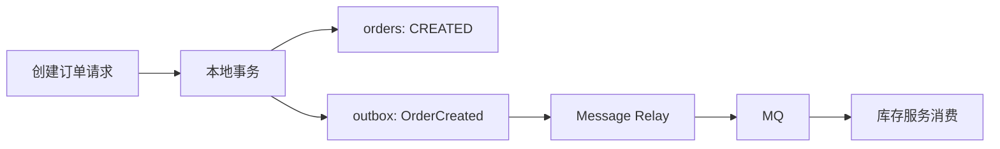

# 后端分布式系统面试 - 专题 4：长链系统设计

## 学习目标（本节结束后你能做到什么）

- 理解长链系统的核心不是“把流程画出来”，而是让跨服务流程在失败、超时、重复、乱序后仍能收敛到正确状态。
- 能把订单、入驻、履约、数据 pipeline 这类长流程建模成状态机。
- 掌握状态机、MQ、Outbox、幂等、重试、补偿、超时、可观测性在长链系统里的组合方式。
- 能区分编排式 Saga 和事件式 Saga 的适用边界。
- 面试里能用一套清晰框架回答“如何设计一个长链系统”。

## 内容讲解（核心概念，用类比、例子、图示说清楚）

### 1. 长链系统到底在解决什么

长链系统的难点不是步骤多，而是这些步骤跨很多服务、很多状态、很多时间边界。

一个流程可能涉及：

- 订单服务
- 库存服务
- 支付服务
- 履约服务
- 物流服务
- 消息队列
- 定时任务
- 人工审核或人工处理台

任何一步都可能失败、超时、重复、乱序。  
所以长链系统真正要回答的是：

**一个跨服务、长时间、容易失败的业务流程，如何被持续推进、恢复、追踪和补偿。**

这类问题在面试里常见于：

- 订单下单、支付、履约、退款
- 商户入驻、资质审核、仓库绑定
- 支付回调、补单、对账
- 数据同步、数据清洗、结果发布
- 工单流转、审批流、任务编排

如果只画正常流程：

```text
下单 -> 支付 -> 扣库存 -> 发货
```

这还不够。成熟设计必须继续回答：

- 用户重复提交怎么办？
- 支付成功但订单状态没更新怎么办？
- 库存锁了但支付失败怎么办？
- MQ 重复投递怎么办？
- 事件乱序到达怎么办？
- 某一步一直没结果怎么办？
- 补偿失败怎么办？
- 线上出问题时怎么查卡在哪一步？

### 2. 先把长链流程抽象成状态机

订单系统不能只被看成一条调用链，它更像一个业务对象的状态机。

例如订单状态可以是：

```text
CREATED        已创建，待支付
PAID           已支付
STOCK_LOCKED   已锁库存
FULFILLING     履约中
SHIPPED        已发货
COMPLETED      已完成
CANCELLED      已取消
REFUNDING      退款中
REFUNDED       已退款
FAILED         异常失败
```

状态机的意义是：系统永远知道流程走到哪一步，并且知道哪些状态迁移是合法的。

比如：

- `CREATED -> PAID` 合法
- `PAID -> FULFILLING` 合法
- `CREATED -> SHIPPED` 不合法
- `CANCELLED -> PAID` 通常不合法，或者需要进入异常处理

长链系统最怕的是状态不可解释：

- 用户付款了，但订单还显示待支付
- 库存扣了，但订单创建失败
- 物流发货了，但系统里订单还没进入履约

所以你需要一个中心事实来源：

- 业务主表
- 状态字段
- 状态版本
- 状态流转日志

订单主表可以有：

```text
order_id
user_id
status
amount
version
created_at
updated_at
```

状态流转表可以有：

```text
order_id
from_status
to_status
event
operator
trace_id
created_at
```

主表回答“现在是什么状态”。  
流转表回答“为什么变成这个状态”。

面试里这句话很关键：

**长链系统里，状态不是流程的副产品，而是流程推进和故障恢复的依据。**

### 3. 同步请求链路要短，业务流程链路可以长

短链系统常见写法是：

```text
用户请求
-> 服务 A
-> 服务 B
-> 服务 C
-> 服务 D
-> 返回
```

但长链业务如果也这样写，会非常脆弱。

比如下单接口里同步做完所有事情：

```text
创建订单
-> 锁库存
-> 创建支付单
-> 发优惠券
-> 通知仓库
-> 发短信
-> 返回用户
```

这个链路太长。任何一个服务慢了，用户请求就会卡住；任何一个弱依赖挂了，核心请求也会失败。

更合理的拆法是：

```text
用户请求只完成关键本地动作
-> 返回受理成功
-> 后续流程异步推进
```

例如：

```text
用户提交订单
-> 订单服务创建订单，状态 CREATED
-> 写入 OrderCreated 待发送事件
-> 返回用户：订单创建成功
```

后面由 MQ 或工作流引擎推进：

```text
OrderCreated
-> 库存服务锁库存
-> StockLocked
-> 支付服务创建支付单或等待支付
-> PaymentSucceeded
-> 履约服务创建履约单
-> FulfillmentCreated
```

这里的关键不是“上 MQ”，而是分清两条链路：

- 用户同步链路：短、快、只做必要动作
- 后台业务链路：长、可重试、可恢复、可观测

### 4. MQ 和事件驱动负责推进流程，但不是银弹

长链系统常用 Kafka、RocketMQ、RabbitMQ、SQS 这类 MQ。  
不是因为 MQ 显得高级，而是因为它能解决几个工程问题：

- 服务解耦
- 削峰填谷
- 异步重试
- 失败隔离
- 事件留痕

订单服务不需要同步调用库存服务：

```text
订单服务：
创建订单
发送 OrderCreated 事件

库存服务：
消费 OrderCreated
锁库存
发送 StockLocked 或 StockLockFailed
```

但用了 MQ 之后，新问题也会出现：

- 消息可能重复
- 消息可能延迟
- 消息可能乱序
- 消费者可能失败
- 数据库写成功但消息发送失败
- 消息发送成功但数据库写失败

所以 MQ 只是长链系统的传输层，不是正确性的全部。真正的正确性还要靠状态机、幂等、Outbox、重试、补偿和可观测性一起兜住。

### 5. 幂等是长链系统的生命线

长链系统不能假设请求只来一次，也不能假设消息只消费一次。

用户可能重复点提交：

```text
POST /orders
POST /orders
POST /orders
```

支付渠道也可能重复回调：

```text
PaymentSucceeded
PaymentSucceeded
PaymentSucceeded
```

所以每个关键动作都要幂等。

创建订单可以用业务幂等键：

```text
idempotency_key = user_id + cart_id + request_id
```

如果同一个幂等键已经处理过，就返回之前的订单结果，而不是创建新订单。

状态推进可以用条件更新：

```sql
UPDATE orders
SET status = 'PAID'
WHERE order_id = ?
  AND status = 'CREATED';
```

如果订单已经是 `PAID`，这次更新影响 0 行，就说明之前处理过了，可以直接返回成功。

长链系统里常见幂等点包括：

- 创建订单幂等
- 支付回调幂等
- 锁库存幂等
- 发货幂等
- 退款幂等
- 消息消费幂等
- 调度任务幂等
- 补偿动作幂等

面试里可以这样说：

**长链系统里不能假设请求只来一次、消息只消费一次，所以每个关键动作都要用业务唯一键或状态条件更新保证幂等。**

### 6. Outbox 解决本地事务和消息发送的一致性

长链系统经常会遇到这个经典问题：

```text
数据库写成功了，但消息发送失败怎么办？
```

如果直接写成：

```text
createOrder();
sendMessage();
```

就会有风险：

```text
订单创建成功
服务在 sendMessage 之前挂了
库存服务永远不知道这个订单
```

Transactional Outbox 的做法是：在同一个本地事务里同时写业务数据和待发送消息。

```text
订单服务本地事务：
1. 插入订单，状态 CREATED
2. 插入 outbox 消息 OrderCreated
3. 提交事务
```

然后由后台 relay 把 outbox 表里的消息投递到 MQ。



这样即使服务在提交事务后挂掉，数据库里也还有一条待发送消息。服务恢复后，relay 可以继续投递。

Outbox 解决的是：

**业务数据落库和事件产生之间的一致性。**

但它不保证消费者一定处理成功。消费者侧仍然需要幂等、重试、死信队列和补偿。

### 7. 重试不能简单 while true

长链系统里失败很常见，但重试必须分类型。

可重试错误包括：

- 网络超时
- 下游 503
- 数据库连接失败
- 临时限流
- MQ 短暂不可用

这类错误适合：

- 最大重试次数
- 指数退避
- 延迟队列
- 死信队列
- 告警

例如：

```text
第 1 次失败：10 秒后重试
第 2 次失败：1 分钟后重试
第 3 次失败：5 分钟后重试
第 4 次失败：进入死信队列
```

不可重试错误包括：

- 库存不足
- 订单状态非法
- 用户不存在
- 参数校验失败
- 业务规则明确拒绝

这类错误不应该一直重试，而应该进入明确状态：

```text
STOCK_LOCK_FAILED
CANCELLED
FAILED
WAITING_MANUAL_REVIEW
```

一个成熟的设计会先区分：

- 技术性瞬时失败：重试
- 业务性确定失败：落状态、补偿或人工处理

### 8. 补偿不是 rollback，而是 compensate

短链本地事务失败，可以回滚数据库事务。  
但长链系统不一定能 rollback。

因为你面对的是：

- 钱已经扣了
- 库存已经锁了
- 优惠券已经用了
- 物流单已经创建了
- 外部渠道已经接受请求

这些动作跨系统、跨数据库、跨第三方，不可能靠一个数据库事务回滚。

所以长链系统更常用补偿动作：

| 正向动作 | 补偿动作 |
| --- | --- |
| 锁库存 | 释放库存 |
| 扣款 | 退款 |
| 使用优惠券 | 退回优惠券 |
| 创建物流单 | 取消物流单 |
| 创建任务 | 取消任务 |
| 写入结果表 | 删除或标记无效结果 |

例如：

```text
创建订单成功
锁库存成功
支付失败

补偿动作：
释放库存
关闭订单
释放优惠券
发送通知
```

再比如：

```text
支付成功
履约失败

补偿动作可能是：
发起退款
关闭履约单
标记异常订单
通知人工处理
```

补偿的关键是：每个正向动作在设计时，就要思考是否有可执行、可幂等、可观测的反向动作。

### 9. Saga 是长链系统的经典模式

Saga 的思路是：

**把一个大事务拆成多个本地事务，每个本地事务都有对应的补偿动作。**

例如：

```text
T1 创建订单
T2 锁库存
T3 支付
T4 创建履约单
```

对应补偿：

```text
C1 取消订单
C2 释放库存
C3 退款
C4 取消履约单
```

如果 T3 支付失败，就执行：

```text
C2 释放库存
C1 取消订单
```

Saga 常见两种实现方式。

#### 9.1 编排式 Saga

编排式 Saga 有一个中心协调器，负责推进流程。

```text
OrderWorkflow
-> 调库存服务锁库存
-> 调支付服务
-> 调履约服务
-> 出错时调用补偿接口
```

优点：

- 流程清晰
- 状态集中
- 容易排查
- 适合复杂业务
- 适合人工介入

缺点：

- 中心协调器较重
- 容易变成上帝服务
- 编排层和领域服务边界要设计清楚

编排式适合商户入驻、审批流、订单履约、数据任务编排这类强流程业务。

#### 9.2 事件式 Saga

事件式 Saga 没有中心协调器，每个服务监听事件，自己决定下一步。

```text
订单服务发送 OrderCreated
库存服务消费后发送 StockLocked
支付服务消费后发送 PaymentSucceeded
履约服务消费后发送 FulfillmentCreated
```

优点：

- 服务解耦
- 扩展性好
- 适合事件驱动架构

缺点：

- 链路分散
- 排查困难
- 状态不集中
- 容易出现事件风暴

面试里可以这样表达：

**如果流程复杂、强业务编排、需要可视化和人工介入，我倾向编排式 Saga；如果流程相对标准、服务解耦要求高、事件扩展多，可以考虑事件式 Saga。实际业务里也可以混合使用。**

### 10. 超时处理：每一步都要有 deadline

长链系统一定要处理超时。

例如订单创建后，用户 30 分钟没有支付：

```text
CREATED -> CANCELLED
```

这个不能依赖用户主动触发，而要靠系统推进。

常见方式包括：

- 延迟队列
- 定时扫描
- 时间轮
- workflow timeout
- 数据库状态扫描

例如订单创建时发送一条 30 分钟后的延迟消息。  
30 分钟后消费：

```text
如果订单仍然是 CREATED：
    关闭订单
    释放库存

如果订单已经 PAID：
    什么都不做
```

这里又要依赖状态机和幂等：

```sql
UPDATE orders
SET status = 'CANCELLED'
WHERE order_id = ?
  AND status = 'CREATED';
```

这就是状态机、幂等、超时的组合。

### 11. 乱序处理：不要相信事件按顺序到达

长链系统里，事件可能乱序。

理论上应该是：

```text
OrderCreated
PaymentSucceeded
FulfillmentCreated
```

但实际可能先收到：

```text
PaymentSucceeded
```

或者同一个订单的多个状态事件乱序到达。

常见处理方式有三类。

第一，状态机约束。

```sql
UPDATE orders
SET status = 'PAID'
WHERE order_id = ?
  AND status = 'CREATED';
```

只有当前状态合法，才允许推进。

第二，事件版本号。

```text
order_id = 123
event_type = PaymentSucceeded
version = 3
```

系统只接受比当前版本更新的事件。旧版本事件直接丢弃或记录。

第三，事件时间加状态判断。

事件时间有参考价值，但不能完全依赖，因为不同服务的机器时间可能不一致。更稳的是业务版本号和状态机约束。

### 12. 可观测性：必须能查“卡在哪了”

短链接口出问题，通常看接口日志就够了。  
长链系统不行。

一个流程可能跨：

- 订单服务
- 库存服务
- 支付服务
- 履约服务
- 物流服务
- MQ
- 定时任务
- 补偿任务

所以长链系统要设计这些信息：

- 全链路 `trace_id`
- 业务维度 `order_id` / `task_id`
- 状态流转日志
- 事件发送日志
- 事件消费日志
- 重试记录
- 补偿记录
- 死信队列
- 告警
- Dashboard

每条关键日志至少带：

```text
trace_id
business_id
event_id
step_name
status
retry_count
error_code
```

排查时要能回答：

- 这个订单现在在哪一步？
- 上一条事件是什么？
- 哪个服务消费失败？
- 重试了几次？
- 有没有进入死信队列？
- 补偿有没有执行？
- 是否需要人工处理？

一个常见的工作流实例表可以是：

```text
workflow_instance
- workflow_id
- business_id
- workflow_type
- current_step
- status
- started_at
- updated_at
- finished_at
- error_message
```

任务表可以是：

```text
workflow_task
- task_id
- workflow_id
- step_name
- status
- input
- output
- retry_count
- next_retry_at
- error_message
- started_at
- finished_at
```

对长链系统来说，可观测性不是锦上添花，而是系统能不能运营的核心能力。

### 13. 人工兜底必须被当成一等能力

长链系统一定会遇到自动恢复不了的问题。

例如：

- 支付成功，但支付渠道回调缺失
- 库存系统和订单系统数据不一致
- 物流接口返回未知状态
- 退款失败
- 重复履约
- 风控或人工审核无法自动判断

这时需要：

- 异常状态
- 人工处理台
- 重放事件
- 手动补偿
- 手动推进状态
- 审计日志
- 权限控制

很多面试答案只讲 MQ、重试、幂等，但忽略人工兜底。  
真实生产里，人工兜底很重要，因为有些异常不是纯技术问题，而是业务问题。

例如：

- 用户投诉
- 支付渠道异常
- 商家缺货
- 仓库无法发货
- 风控拦截

成熟系统不是假设所有异常都能自动解决，而是让异常能被发现、解释、接管和审计。

### 14. 一个标准长链系统架构

可以抽象成：

```text
用户请求
   ↓
API 层
   ↓
业务服务：创建主业务单据
   ↓
状态机：记录当前状态
   ↓
Outbox：保存待发送事件
   ↓
MQ：异步传递事件
   ↓
下游服务消费事件
   ↓
每个服务执行本地事务
   ↓
成功：发送下一步事件
失败：重试 / 补偿 / 进入异常状态
   ↓
Workflow / 状态表持续记录进度
   ↓
监控告警 + 人工处理台兜底
```

核心组件是：

- 状态机
- MQ
- Outbox
- 幂等表
- 重试机制
- 补偿机制
- 超时任务
- 死信队列
- 可观测性
- 人工处理台

你也可以把订单链路表达成：

```text
CreateOrder API
-> orders.status = CREATED
-> outbox.event = OrderCreated
-> Message Relay
-> MQ: OrderCreated
-> Inventory Service
-> lock stock idempotently
-> MQ: StockLocked / StockLockFailed
-> Order Workflow updates status
-> Payment / Fulfillment / Shipping
```

### 15. 数据 pipeline 也是长链系统

长链系统不只存在于交易业务。数据 pipeline 也是典型长链系统。

例如：

```text
创建任务
-> 拉取源数据
-> 写入原始层
-> Spark 清洗
-> 写入中间表
-> 数据质量校验
-> 发布结果表
-> 通知下游
```

每一步都可能失败：

- 源 API 超时
- 数据格式变化
- Spark 任务失败
- 表写入失败
- 数据质量不达标
- 下游通知失败

所以数据 pipeline 也需要：

- 任务状态机
- step 状态
- 重试
- 幂等写入
- checkpoint
- 补偿或回滚
- 失败告警
- 人工重跑

任务状态可以是：

```text
PENDING
RUNNING
EXTRACTING
TRANSFORMING
VALIDATING
PUBLISHING
SUCCESS
FAILED
CANCELLED
```

每个 step 单独记录：

```text
step_name
status
input_path
output_path
retry_count
error_message
```

幂等写入可以用 `run_id` 隔离输出路径：

```text
/bronze/job_name/run_id=xxx/
/silver/job_name/run_id=xxx/
```

只有质量校验通过后，才把结果发布到正式表。  
这样即使任务重跑，也不会污染正式数据。

这和订单系统里的最终状态提交是同一个思想：中间过程可以反复尝试，正式结果必须可控发布。

### 16. 面试里可以怎么讲

如果面试官问：“你怎么设计一个长链系统？”

可以这样答：

> 我会先把业务流程建模成状态机，明确每个阶段的合法状态流转。然后把用户同步请求链路和后台业务推进链路拆开，用户请求只完成关键本地事务并返回，后续通过 MQ 或 workflow engine 异步推进。对于跨服务一致性，我不会优先使用强分布式事务，而是采用本地事务 + Outbox + MQ + 最终一致性。每个关键动作都要设计幂等，消息消费也要幂等。对失败场景，区分可重试和不可重试错误，可重试错误走退避重试和死信队列，不可重试错误进入明确失败状态并触发补偿。对超时场景，通过延迟队列或定时任务推进状态。最后要有完整的 trace、状态流转日志、重试记录、补偿记录和人工处理台，保证链路可观测、可恢复、可运营。

这段回答的结构是：

```text
状态机
-> 同步短链路 + 异步长链路
-> 本地事务 + Outbox + MQ
-> 幂等
-> 重试和死信
-> 补偿
-> 超时
-> 可观测和人工兜底
```

### 17. 记忆框架：八个词

长链系统设计可以记这八个词：

```text
状态
异步
幂等
重试
补偿
超时
一致性
可观测
```

展开就是：

- 状态：流程走到哪了？
- 异步：不要让用户请求等完整流程。
- 幂等：重复请求和重复消息怎么办？
- 重试：临时失败怎么恢复？
- 补偿：已经成功的步骤怎么反向处理？
- 超时：一直没结果怎么办？
- 一致性：跨服务数据怎么最终对齐？
- 可观测：出问题怎么查、怎么修？

## 小结（3-5 条关键点）

- 长链系统的重点不是服务调用顺序，而是状态、失败、恢复、补偿和可观测性。
- 状态机是长链流程的事实来源，状态流转日志是排障和审计的依据。
- 同步请求链路要短，后台业务流程可以通过 MQ 或 workflow engine 异步推进。
- Outbox 解决本地事务和消息发送的一致性，但消费者侧仍然要做幂等、重试和死信处理。
- 真实生产系统必须设计人工兜底，因为不是所有异常都能自动恢复。

---

## 检查站：请回答以下问题

1. 为什么长链系统不能只画正常流程图，而必须先设计状态机？
2. 如果订单创建成功，但 OrderCreated 消息发送失败，你会怎么处理？
3. 为什么支付回调、库存锁定、超时关单都必须做幂等？
4. 编排式 Saga 和事件式 Saga 各适合什么场景？
5. 如果一个订单卡在履约失败状态，你希望系统里有哪些日志、表和人工操作能力来排查和恢复？

请把你的答案直接告诉我，我会根据你的回答判断是进入下一课，还是回到某个概念补强。
