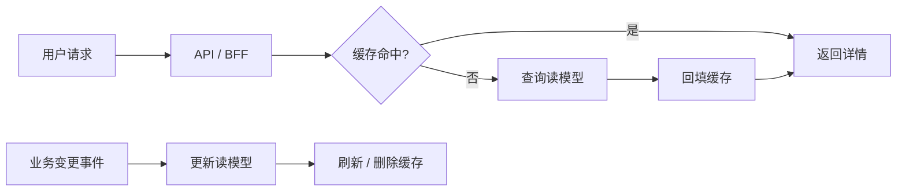

# 后端分布式系统面试 - 专题 5：短链系统设计

## 学习目标（本节结束后你能做到什么）

- 理解短链系统的核心不是“业务简单”，而是一次请求必须在有限时间内给出确定响应。
- 能区分短链系统和长链系统在目标、状态、失败处理、可观测性上的差异。
- 掌握同步请求链路里的延迟预算、依赖治理、缓存、超时、重试、熔断、降级和隔离。
- 能设计商品详情页、登录校验、库存查询、价格查询这类低延迟接口。
- 面试里能用一套清晰框架回答“如何设计一个高并发、低延迟的短链系统”。

## 内容讲解（核心概念，用类比、例子、图示说清楚）

### 1. 短链系统到底在解决什么

短链系统不是指业务一定很简单，而是指：

**用户请求进来后，系统必须在一次同步链路里快速完成关键判断，并返回明确结果。**

典型例子包括：

- 商品详情页
- 首页 Feed
- 搜索联想词
- 登录鉴权
- 下单前库存查询
- 价格计算
- 优惠资格判断
- 风控实时校验
- API 网关鉴权与路由

这类系统的核心矛盾通常是：

- 请求量大
- 延迟敏感
- 用户等待时间短
- 下游依赖多
- 某个依赖抖动会拖慢整体接口
- 峰值流量下容易线程池打满、连接池打满、缓存打穿

所以短链系统真正要回答的是：

**如何让一次同步请求在高并发和依赖不稳定的情况下，仍然快速、稳定、可降级地返回。**

### 2. 短链和长链的核心差异

长链系统强调流程推进，短链系统强调请求响应。

| 对比项 | 短链系统 | 长链系统 |
| --- | --- | --- |
| 核心目标 | 快速返回、低延迟、高可用 | 持续推进、可恢复、可补偿 |
| 典型形态 | 一次 HTTP/RPC 同步请求 | 多步骤、跨服务、异步推进 |
| 状态重点 | 请求状态、缓存状态、读模型 | 业务状态机、流程状态、任务状态 |
| 失败处理 | 超时、熔断、降级、失败快速返回 | 重试、补偿、死信、人工兜底 |
| 一致性重点 | 读到的数据是否足够新、写入是否原子 | 多服务最终一致、乱序、重复、半成功 |
| 可观测性重点 | RT、QPS、错误率、依赖耗时 | 流程卡点、状态流转、补偿记录 |

短链系统不是不需要状态，而是状态不能散落在长流程里。  
它更关心：

- 当前请求用了哪些数据？
- 哪个依赖最慢？
- 哪个缓存没命中？
- 是否触发了降级？
- 是否超过了接口 SLO？

### 3. 先定义 SLO 和延迟预算

短链系统设计的第一步不是选组件，而是定义目标。

比如商品详情接口：

```text
P99 < 300ms
P95 < 120ms
错误率 < 0.1%
核心信息必须返回
推荐、评论、广告可以降级
```

有了 SLO，才能拆延迟预算。

例如总预算 300ms：

```text
网关与鉴权：20ms
商品基础信息：40ms
价格库存：60ms
促销优惠：50ms
推荐评论：80ms
组装与序列化：30ms
预留抖动：20ms
```

如果某个下游平时 P99 就 500ms，它就不应该直接放在同步主链路里。  
要么异步加载，要么缓存，要么降级，要么换成提前构建好的读模型。

面试里可以这样说：

**短链系统先看 SLO，再按 SLO 倒推同步链路里能放什么依赖，不能一上来就把所有服务串起来。**

### 4. 主链路只放必须实时决定的动作

短链系统最怕同步链路过长。

错误写法是：

```text
请求商品详情
-> 查商品
-> 查库存
-> 查价格
-> 查促销
-> 查评论
-> 查推荐
-> 查广告
-> 查店铺
-> 查物流
-> 返回
```

只要其中一个服务慢，整个接口就慢。  
只要其中一个依赖挂，整个页面就挂。

更合理的方式是先拆核心和非核心：

核心信息：

- 商品标题
- 商品图片
- 当前价格
- 是否可售
- 基础库存状态

非核心信息：

- 推荐商品
- 评论摘要
- 广告
- 店铺扩展信息
- 物流预计时间

同步主链路只保留核心信息。非核心信息可以：

- 并行调用
- 设置更短超时
- 缓存读取
- 异步加载
- 降级为空
- 使用旧值

这就是短链系统里的一个重要原则：

**不是所有信息都配进入主链路。**

### 5. 缓存和读模型是短链系统的基本武器

短链系统通常读多写少，缓存非常重要。

常见层次包括：

- CDN：静态资源、图片、部分页面片段
- 本地缓存：配置、字典、小规模热点数据
- Redis：商品、价格、库存摘要、用户会话
- 预聚合读模型：把多个服务的数据提前拼成查询视图
- 数据库：最终真相源

例如商品详情页可以提前构建一个读模型：

```text
product_detail_view
- product_id
- title
- images
- category
- brand
- base_price
- promotion_summary
- stock_status
- shop_summary
- updated_at
```

请求进来时优先查缓存或读模型，而不是临时调用十几个服务拼装。



但缓存不是随便加。你要继续回答：

- 缓存 key 怎么设计？
- TTL 多长？
- 如何防止缓存穿透？
- 如何防止热点 key 击穿？
- 更新时是删除缓存还是写缓存？
- 允许读到多旧的数据？

短链系统里，缓存的目标不是“绝对最新”，而是在业务允许范围内换取低延迟和高可用。

### 6. 每个依赖都要有超时预算

短链系统不能让请求无限等下游。

如果接口总预算是 300ms，下游 A 不能设置 3 秒超时。  
否则一个依赖慢就会拖垮整个请求。

更合理的做法是给每个依赖设定明确 timeout：

```text
商品基础信息：50ms
价格服务：80ms
库存服务：80ms
促销服务：60ms
推荐服务：30ms
评论服务：30ms
```

超时后要有策略：

- 核心依赖超时：快速失败或返回明确错误
- 非核心依赖超时：降级为空、默认值或旧值
- 可异步补齐的信息：先返回主内容，再前端异步加载

短链系统里有一句很重要的话：

**超时不是异常处理的最后一步，而是系统设计的一部分。**

### 7. 重试要克制，避免放大故障

长链系统可以通过延迟重试慢慢恢复。  
短链系统里的同步重试要非常克制。

如果一个请求调用库存服务超时，立刻重试 3 次，看起来提高成功率，实际可能把库存服务打得更慢。

尤其在高并发下：

```text
原始请求 1 万 QPS
每次失败重试 2 次
下游瞬间变成 3 万 QPS
```

这就是重试风暴。

短链系统里的重试原则：

- 只对明确的瞬时错误重试
- 重试次数少，通常 0 到 1 次
- 重试必须有整体 deadline
- 不能对不可重试业务错误重试
- 客户端、网关、服务端不能层层都重试

面试里可以这样说：

**短链系统更强调 fail fast，重试要受 deadline 控制，不能为了提高单次成功率而放大整体故障。**

### 8. 熔断、限流和降级是短链稳定性的核心

短链系统需要防止故障扩散。

如果推荐服务异常，不能拖垮商品详情页。  
如果评论服务慢，不能把 BFF 线程池打满。  
如果某个用户或商家突发异常流量，不能影响全站。

常见手段包括：

- 限流：控制入口流量
- 熔断：下游连续失败时短时间不再调用
- 降级：返回默认值、旧值、空结果或简化结果
- 隔离：不同依赖使用不同线程池、连接池、资源池
- 背压：下游处理不过来时上游减少发送

例如商品详情页：

```text
商品基础信息失败：返回错误页或兜底页
价格服务失败：提示价格暂不可用
库存服务失败：按钮置灰或提示稍后重试
推荐服务失败：推荐区为空
评论服务失败：评论摘要隐藏
广告服务失败：不展示广告
```

降级的关键是先定义依赖等级：

- P0：没有它不能返回
- P1：没有它功能受损，但可以返回
- P2：没有它体验变差，但主流程不受影响

短链系统的成熟度，很大程度体现在：

**你能不能让非核心依赖失败时，只损失局部体验，而不是拖垮整个请求。**

### 9. 隔离：不要让一个依赖耗尽所有资源

短链系统常见事故是资源被慢依赖耗尽。

比如：

- 调用评论服务很慢
- 大量请求阻塞在评论服务调用上
- Web 线程池被占满
- 商品详情主接口全部变慢

所以要做资源隔离：

- 不同下游使用独立连接池
- 不同业务使用独立线程池
- 核心接口和非核心接口隔离
- 读请求和写请求隔离
- 大客户、热点商家、批量任务和普通流量隔离

隔离的目标是：

**让局部故障停留在局部，不要传播成全站故障。**

### 10. 短链系统也需要幂等和防重

短链系统虽然不像长链系统那样强调流程补偿，但只要有写操作，就仍然要考虑幂等。

例如：

- 登录短信发送不能无限重复
- 优惠资格领取不能重复领取
- 下单前锁定库存不能重复锁
- 支付创建不能重复创建支付单
- 网关转发超时后客户端可能重试

常见做法包括：

- 请求幂等键
- 业务唯一索引
- 状态条件更新
- 去重表
- Token 防重复提交
- 限频和滑动窗口

比如领取优惠券：

```sql
INSERT INTO user_coupon(user_id, coupon_id, created_at)
VALUES (?, ?, now());
```

并给 `(user_id, coupon_id)` 建唯一索引。  
重复领取时插入失败，直接返回“已领取”。

短链系统里的幂等通常更靠近接口边界和数据库唯一约束，而长链系统里的幂等会贯穿消息消费、状态推进、补偿和任务调度。

### 11. 写链路要收敛事务边界

短链系统里如果有写操作，要尽量把强一致范围收敛在一个本地事务内。

例如登录记录：

```text
校验账号密码
-> 更新 last_login_time
-> 写登录日志
-> 返回 token
```

如果写登录日志不是关键路径，可以异步化。  
同步路径只保留登录是否成功、token 是否生成这类核心动作。

再比如优惠资格判断：

```text
查询用户资格
-> 校验活动状态
-> 占用名额
-> 返回领取结果
```

真正要强一致的是“名额不能超发”。  
推荐、通知、埋点都不应该和它放在一个同步事务里。

短链写链路的原则是：

- 核心写入放在本地事务内
- 弱副作用异步化
- 不要把多个服务强行包进同步分布式事务
- 写成功后需要通知下游时，可以用 Outbox 或事务消息

### 12. 可观测性：看清每一段耗时

短链系统的可观测性重点是：

- QPS
- RT
- P50 / P95 / P99
- 错误率
- 超时率
- 降级率
- 熔断次数
- 缓存命中率
- 下游依赖耗时
- 线程池和连接池水位

每个请求 trace 里最好能看到：

```text
gateway: 8ms
auth: 12ms
product_cache: 3ms
price_service: 35ms
stock_service: 41ms
promotion_service: timeout, degraded
render: 10ms
total: 122ms
```

排查短链系统时，常见问题是：

- 是入口流量突增，还是某个依赖变慢？
- 是缓存命中率下降，还是数据库变慢？
- 是线程池满了，还是连接池满了？
- 是个别用户慢，还是全局慢？
- 是 P50 慢，还是只有 P99 长尾慢？

短链系统排障最怕只有一条总耗时日志。  
你必须能拆出每个依赖、每个缓存、每个资源池的耗时和状态。

### 13. 一个标准短链系统架构

可以抽象成：

```text
用户请求
   ↓
网关：鉴权、限流、路由
   ↓
BFF / API 服务：聚合核心数据
   ↓
本地缓存 / Redis / 读模型
   ↓
必要下游服务：并行调用 + 短超时
   ↓
结果聚合
   ↓
非核心依赖降级
   ↓
返回用户
```

配套能力包括：

- SLO 和延迟预算
- 缓存层次
- 读模型
- 并行调用
- 超时控制
- 熔断降级
- 资源隔离
- 限流
- 幂等和防重
- 依赖耗时监控

### 14. 案例：商品详情页怎么设计

商品详情页是典型短链系统。

核心目标：

```text
高 QPS
低延迟
核心信息必须稳定返回
非核心模块可以降级
```

主链路可以设计成：

```text
请求 product_id
-> 网关鉴权和限流
-> BFF 查询商品详情缓存
-> 缓存命中直接返回
-> 缓存未命中查 product_detail_view
-> 并行查询价格和库存摘要
-> 促销、推荐、评论设置短超时
-> 聚合结果返回
```

核心数据：

- 商品基础信息
- 价格
- 可售状态

可降级数据：

- 推荐
- 评论
- 广告
- 店铺扩展

高并发保护：

- 热点商品缓存预热
- 热点 key 本地缓存
- 缓存空值防穿透
- 互斥锁或 singleflight 防击穿
- TTL 加随机抖动防雪崩
- 下游限流和熔断

可观测性：

- 商品维度 QPS
- 缓存命中率
- 热点 key
- 下游价格、库存、促销耗时
- 降级率
- P99 长尾

这类题的关键不是“用了 Redis”，而是说清楚：

**哪些数据必须实时，哪些数据可以缓存，哪些依赖可以降级，哪个环节会成为瓶颈。**

### 15. 面试里可以怎么讲

如果面试官问：“你怎么设计一个短链系统？”

可以这样答：

> 我会先明确接口 SLO，比如 P99 要控制在多少毫秒内，然后按总延迟预算拆分同步链路。短链系统里主链路必须足够短，只放真正影响本次响应的核心依赖，非核心依赖要么缓存、要么并行短超时、要么异步加载或降级。读多写少场景会优先设计缓存和读模型，避免每次请求临时跨多个服务拼装。对每个下游依赖都要设置 timeout、熔断、限流和降级策略，避免一个慢依赖拖垮整体接口。写链路则尽量把强一致范围收敛到本地事务，弱副作用异步化。最后要用 trace 和指标看清每段耗时、缓存命中率、错误率、降级率和线程池连接池水位，保证线上能定位长尾延迟和故障扩散。

这段回答的结构是：

```text
SLO
-> 主链路收敛
-> 缓存和读模型
-> 超时和重试
-> 熔断降级
-> 资源隔离
-> 写链路事务边界
-> 可观测性
```

### 16. 记忆框架：八个词

短链系统设计可以记这八个词：

```text
目标
主链
缓存
超时
重试
降级
隔离
观测
```

展开就是：

- 目标：接口 SLO 是多少？
- 主链：同步主链路里必须放哪些动作？
- 缓存：哪些数据可以提前构建或缓存？
- 超时：每个下游最多等多久？
- 重试：哪些错误能重试，怎么避免重试风暴？
- 降级：哪些模块失败后可以返回默认值、旧值或空结果？
- 隔离：如何防止一个慢依赖耗尽全部资源？
- 观测：怎么定位 RT、错误率、缓存命中率和依赖耗时？

## 小结（3-5 条关键点）

- 短链系统的重点是一次同步请求如何在 SLO 内稳定返回，而不是流程如何长期推进。
- 主链路要短，只保留核心依赖；非核心依赖要缓存、异步、短超时或降级。
- 缓存和读模型是短链低延迟的基本手段，但必须说明一致性、TTL、穿透、击穿和热点治理。
- 短链系统里的重试要克制，超时、熔断、限流、降级和隔离更关键。
- 可观测性要能拆出每段耗时、依赖状态、缓存命中率和资源池水位。

---

## 检查站：请回答以下问题

1. 为什么短链系统设计要先定义 SLO 和延迟预算？
2. 商品详情页里哪些信息应该放在同步主链路，哪些信息可以降级？
3. 为什么短链系统里的同步重试可能放大故障？
4. 缓存击穿、穿透、雪崩分别会怎样影响短链接口？
5. 如果一个接口 P99 突然变高，你会从哪些指标和 trace 信息开始排查？

请把你的答案直接告诉我，我会根据你的回答判断是进入下一课，还是回到某个概念补强。
