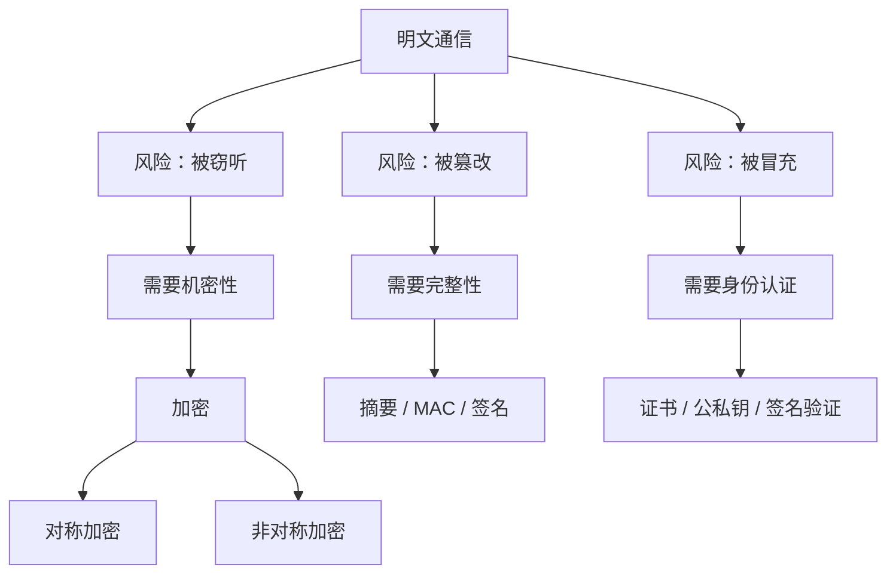

# 对称加密和非对称加密 - 第 1 课：为什么需要加密：从明文风险到安全目标

## 学习目标（本节结束后你能做到什么）

- 理解“为什么要加密”不是一句抽象口号，而是因为明文通信天然有风险。
- 分清机密性、完整性、身份认证、不可否认性这几个安全目标。
- 能说清为什么“别人看不见”不等于“系统就安全了”。
- 为后面对称加密、非对称加密、数字签名和 HTTPS 建立共同背景。

## 内容讲解（核心概念，用类比、例子、图示说清楚）

### 1. 先别急着记算法，先看明文通信到底哪里危险

假设你给朋友寄一张明信片，上面直接写着银行卡号、密码、家庭住址。  
只要这张明信片在传递途中被任何人看到，你的信息就泄露了。

网络里的“明文传输”本质上就是这件事：

- 请求内容是原样发送的
- 中间链路上的设备、代理、网关、抓包者、恶意节点都有可能看到
- 只要有人拿到了流量，就能直接读懂内容

这时候风险不只是“被看见”，还包括：

- 被窃听：别人看到了你的用户名、密码、Token、订单内容
- 被篡改：别人把你转账的金额改了，把收款账号改了
- 被伪造：别人冒充服务端回复你一条假的“支付成功”
- 被重放：别人把你之前的一次合法请求复制一遍重新发送

所以你会发现，安全问题从来不只是“保密”。

### 2. 安全目标到底有哪些

在后端工程里，最常见的几个目标是：

#### 2.1 机密性

机密性就是：

**只有被授权的人能看懂内容。**

这正是“加密”最直观解决的问题。  
比如登录密码、身份证号、手机号、合同内容、数据库备份文件，都不希望在传输或存储时被人直接读懂。

#### 2.2 完整性

完整性就是：

**消息在传输过程中没有被偷偷改过。**

例如客户端发出“支付 100 元”，服务端收到时仍然应该是“支付 100 元”，而不是“支付 10000 元”。

注意，这个目标靠“看不懂”并不一定能完全解决。  
有些情况下，攻击者虽然看不懂明文，但仍可能对密文做某种篡改，因此完整性往往还需要摘要、MAC 或数字签名配合。

#### 2.3 身份认证

身份认证就是：

**我怎么确认跟我通信的真的是你，而不是冒充者？**

例如：

- 浏览器怎么知道自己连到的真是银行官网吗？
- 服务 B 怎么知道请求真的是服务 A 发来的，而不是别人伪造的？

这就会引出后面的公钥、私钥、证书、签名这些概念。

#### 2.4 不可否认性

不可否认性是更进一步的要求：

**消息发出后，发送者事后不能轻易否认“这不是我发的”。**

比如支付回调、电子合同、审计日志、法务凭证等，都会关心这一点。  
这往往和数字签名强相关。

### 3. 为什么“只加密”还不够

很多初学者容易把安全理解成：

- 只要加密了，问题就全解决了

其实不是。

举个例子：

你把内容锁进了保险箱，别人确实看不懂了。  
但如果别人能把这个保险箱整个换掉，或者发一个假的保险箱给你，那问题还是存在。

所以真实系统里的安全设计通常至少要同时考虑：

- 内容别人看不懂
- 内容别人改不了
- 通信对象身份可信
- 某些场景下还能留下“谁发的”证据

这也是为什么后面会同时出现：

- 加密
- 摘要
- 签名
- 证书
- 会话密钥

它们不是重复建设，而是在解决不同层面的安全问题。

### 4. 从工程视角看一个最常见场景：登录接口

假设客户端把用户名和密码发给服务端。

如果完全明文：

- 中间人抓包后能直接看到用户名和密码
- 用户在公共 Wi-Fi 下风险尤其大
- 即使服务端自己很安全，链路中任何一个不可信环节都可能泄露

如果只做简单编码，比如 Base64：

- 风险几乎没变
- 因为编码不是加密，别人一解码就能看懂

如果使用 HTTPS：

- 客户端和服务端先建立安全连接
- 再用会话密钥保护后续业务数据
- 同时通过证书校验服务端身份

这时才是一个相对完整的安全方案。

### 5. 为什么会分成“对称加密”和“非对称加密”

到这里就自然会产生一个问题：

既然要加密，那为什么不只有一种加密方式？

答案是：

**因为工程里要同时解决“加密效率”和“密钥管理”这两个问题。**

这两个问题通常很难靠一种机制同时做到最好：

- 对称加密速度快，适合大量数据，但密钥怎么安全分发是难题
- 非对称加密更适合解决密钥交换和身份问题，但速度慢，不适合直接加密大量业务数据

所以后面才会发展出两条路线：

- 对称加密
- 非对称加密

再进一步，真实系统里通常会把它们组合起来，这就是混合加密。

### 6. 一张总图先建立脑图

这张图的重点是：

- 安全不是一个点，而是一组目标
- 加密只是其中一部分
- 对称加密和非对称加密也不是互相替代，而是各有分工

### 7. 这一课你最该避免的误区

#### 7.1 误区一：加密 = 安全

不对。  
加密更偏向解决“看不懂”，但系统安全还包括完整性、认证、防重放、授权、密钥管理等。

#### 7.2 误区二：只要别人看不懂，就说明消息没被改

也不对。  
“看不懂”和“改不了”不是同一个问题。

#### 7.3 误区三：后端只要会用 HTTPS 就行，不用理解原理

短期看似够用，但一旦碰到以下场景就容易发虚：

- 服务间签名验签
- 支付回调验签
- JWT 公私钥签发
- 私有协议安全传输
- 密钥轮换和证书失效问题

理解原理之后，你才能知道自己在用什么、风险在哪里。

## 小结（3-5 条关键点）

- 明文通信的风险不只是泄露，还包括篡改、伪造、重放和冒充。
- 安全目标至少包括机密性、完整性、身份认证，有些场景还需要不可否认性。
- 加密只解决“别人看不懂”的问题，不等于整个系统就安全了。
- 对称加密和非对称加密之所以同时存在，是因为它们各自擅长解决不同问题。
- 后续学习时要始终带着“这个机制到底在解决什么风险”这个问题往下看。

## 问题 （检测用户对当前章节内容是否了解）

1. 为什么说“明文传输不安全”不仅仅是因为别人可能看见内容？
2. 机密性、完整性、身份认证分别在解决什么问题？
3. 为什么“内容加密了”不等于“内容一定没有被篡改”？
4. 如果一个系统已经用了 HTTPS，为什么它有时仍然还会在业务层做签名验签？
