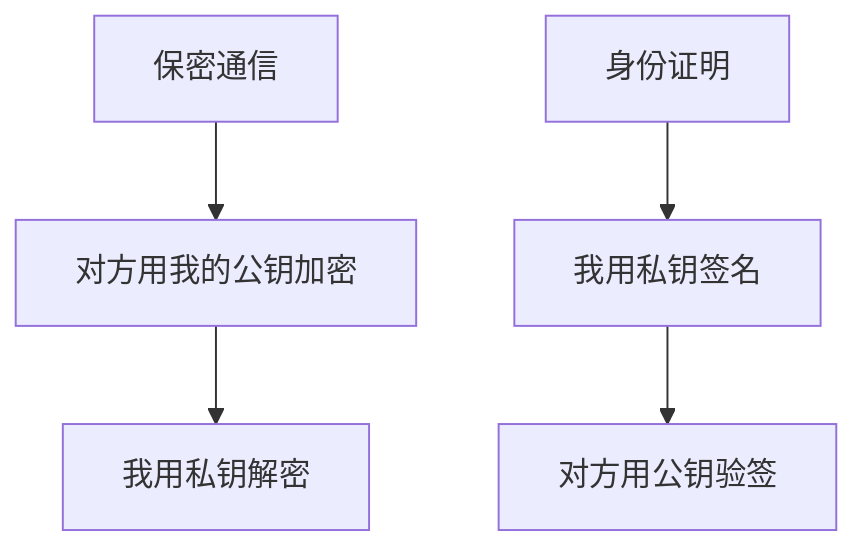

# 对称加密和非对称加密 - 第 3 课：非对称加密：公钥私钥、RSA、ECC、签名与验签

## 学习目标（本节结束后你能做到什么）

- 理解非对称加密为什么叫“非对称”。
- 能说清公钥和私钥分别干什么，为什么不能混着讲。
- 分清“公钥加密 / 私钥解密”和“私钥签名 / 公钥验签”是两条不同链路。
- 理解 RSA、ECC 是什么级别的概念。
- 理解非对称加密为什么更适合做密钥交换、身份认证和数字签名，而不是直接加密大流量业务数据。

## 内容讲解（核心概念，用类比、例子、图示说清楚）

### 1. 什么叫非对称加密

非对称加密的核心是：

**它不是一把共享钥匙，而是一对有关系但职责不同的钥匙：公钥和私钥。**

这就是“非对称”的本质：

- 公钥可以公开给别人
- 私钥只能自己保管
- 两者成对出现，但职责不对等

你可以这样类比：

- 公钥像一个“任何人都能投递”的邮箱口
- 私钥像打开邮箱取信的唯一钥匙

这样一来，别人可以用你的公钥给你发送加密内容，但只有你能用私钥打开。

### 2. 公钥和私钥分别做什么

初学者最容易混的就是这里，所以一定要拆开看。

#### 2.1 用于保密通信时

如果目的是“别人给我发秘密消息”：

- 别人用我的公钥加密
- 我用自己的私钥解密

因为公钥是公开的，所以任何人都能给我加密；  
但因为只有我有私钥，所以只有我能解开。

#### 2.2 用于证明身份时

如果目的是“证明这条消息确实是我发的”：

- 我用私钥签名
- 别人用公钥验签

因为只有我有私钥，所以别人看到签名验证通过，就能相信这条消息大概率出自我手。

注意，这已经不是“保密”问题，而是“认证 + 完整性”问题。

### 3. 为什么非对称加密能解决对称加密的密钥分发难题

回忆一下上一课，对称加密的难点在于：

- 共享密钥要先安全地给到双方

而非对称加密提供了一个新思路：

- 我先把公钥公开出去
- 你拿这个公钥保护一个临时密钥
- 只有我能用私钥把这个临时密钥取出来

这样，真正用于传输大流量数据的会话密钥，就可以更安全地交换了。

所以非对称加密在工程里的一个重要定位是：

**帮助解决密钥交换问题。**

### 4. RSA 和 ECC 是什么

RSA 和 ECC 都属于非对称密码算法体系里的代表。

你可以先这样理解：

- RSA：经典、知名度高、历史悠久、工程里非常常见
- ECC：椭圆曲线密码体系，在很多场景下能用更短的密钥达到类似安全等级

对初学者来说，现阶段最重要的不是去推数学原理，而是知道：

- 它们都属于非对称加密/签名体系
- 它们都不是“拿来直接加密一大段视频文件”的主力
- 它们更常用于建链、密钥交换、签名验签、证书体系

### 5. 非对称加密为什么不适合直接加密大流量数据

因为它通常：

- 计算更慢
- 成本更高
- 适合处理较小的数据或关键材料

例如在真实系统里，非对称加密很适合处理：

- 会话密钥
- 签名材料
- 证书身份确认

但如果你拿它来直接加密：

- 一个 10MB 文件
- 高频接口的大量请求体
- 持续不断的服务间长连接流量

工程成本通常不划算。

这就是为什么后面 HTTPS 最终会回到对称加密处理业务数据。

### 6. 数字签名到底是什么

数字签名不是“再加密一次”，而是：

**用私钥对消息摘要做处理，让别人能验证消息来源和完整性。**

这里面有两个关键动作：

#### 6.1 先做摘要

原始消息可能很长，所以通常不会直接对整个大消息做昂贵的签名运算，而是先算一个摘要。

摘要可以理解成：

**这段消息的固定长度指纹。**

只要消息改一点点，摘要通常就会变很多。

#### 6.2 再签名

发送方用私钥对摘要做签名。  
接收方拿到消息后：

- 自己再算一遍摘要
- 再用发送方公钥去验签

如果验证通过，说明两件事：

- 消息大概率确实来自持有私钥的人
- 消息内容没有被改动

### 7. 一个支付回调的真实场景

比如支付平台给商户系统发回调：

- 回调体里有订单号、金额、支付状态、时间戳
- 同时带一个签名字段

这时商户系统要做的不是“解密这个回调”，而是：

- 使用支付平台的公钥验签

验签通过才说明：

- 这条回调确实来自支付平台
- 回调内容没有在途中被改

这就是非对称体系在真实业务中的典型应用。

### 8. 一张图区分两条链路

这张图特别重要，因为很多人会把两条链路混成一句模糊的话：

- “公钥私钥就是一个加密一个解密”

这句话太粗了，会让你把“加密”和“签名”混掉。

### 9. 工程里几个特别常见的误区

#### 9.1 误区一：非对称加密比对称加密“更高级”，所以应该全用它

不对。  
它更适合解决的是：

- 密钥交换
- 身份认证
- 签名验签

而不是替代对称加密去扛所有大流量数据传输。

#### 9.2 误区二：签名 = 加密

不对。  
加密重点是保密，签名重点是身份与完整性。

#### 9.3 误区三：有公钥就一定安全

也不对。  
你还要确认这个公钥到底是谁的，这就会引出证书和 CA 信任链问题。

#### 9.4 误区四：私钥泄露只是“这个算法不安全”

不是算法不安全，而是你的信任根没了。  
私钥一旦泄露，别人就能伪造你的签名，后果往往非常严重。

## 小结（3-5 条关键点）

- 非对称加密的核心是一对职责不同的密钥：公钥和私钥。
- 保密通信时通常是“公钥加密、私钥解密”；身份证明时通常是“私钥签名、公钥验签”。
- 非对称加密更适合密钥交换、身份认证和签名，不适合直接处理大量业务数据。
- RSA、ECC 都属于非对称密码体系中的代表算法。
- 理解非对称加密时，一定要把“加密链路”和“签名链路”分开看。

## 问题 （检测用户对当前章节内容是否了解）

1. 为什么非对称加密能缓解对称加密的密钥分发问题？
2. “公钥加密、私钥解密”和“私钥签名、公钥验签”分别在解决什么问题？
3. 为什么说数字签名不是“把消息再加密一遍”？
4. 为什么工程里通常不直接用 RSA 去加密大量请求体或大文件？
5. 如果私钥泄露了，最严重的风险是什么？
