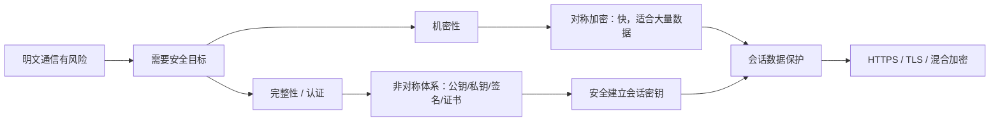

# 对称加密和非对称加密 - 第 4 课：混合加密：HTTPS里对称加密和非对称加密如何配合

## 学习目标（本节结束后你能做到什么）

- 理解为什么真实系统里通常不是“二选一”，而是对称加密和非对称加密配合使用。
- 能讲清 HTTPS/TLS 里两类加密各自承担的职责。
- 理解会话密钥、证书、签名校验在链路中的位置。
- 知道“建链阶段”和“传数阶段”为什么要区别看待。
- 能把这几节内容串起来，形成一个完整工程视角。

## 内容讲解（核心概念，用类比、例子、图示说清楚）

### 1. 先把一个核心结论讲透

真实工程里，尤其是 HTTPS/TLS 这种成熟协议里，通常不是：

- 只用对称加密
- 或只用非对称加密

而是：

**用非对称机制解决身份认证和密钥交换，用对称加密保护后续的大量业务数据。**

这就是混合加密最核心的思想。

你可以把它理解成：

- 非对称加密负责“开场、验身份、发钥匙”
- 对称加密负责“正式干活、传大量数据”

### 2. 为什么一定要混合

如果只用对称加密：

- 数据传得很快
- 但第一次共享密钥很难安全完成

如果只用非对称加密：

- 身份认证和密钥交换更自然
- 但直接保护大量业务流量会比较慢，成本高

所以最合理的做法就是两者结合：

- 让非对称体系把“共享密钥”安全地建立起来
- 再让对称加密用这个密钥高效地保护后续数据

这不是折中意义上的“凑合”，而是现代安全协议的主流设计。

### 3. HTTPS 里到底发生了什么

当浏览器访问一个 HTTPS 网站时，大致发生两件大事：

#### 3.1 先建一条可信、安全的会话

这个阶段重点解决：

- 我连到的是不是正确的网站
- 双方能不能安全协商出一个只有这次会话知道的密钥

这里就会出现：

- 服务器证书
- 服务器公钥
- 证书校验
- 密钥交换

#### 3.2 再用会话密钥传真正的业务数据

一旦会话密钥建立好，后面的：

- HTTP 请求头
- 请求体
- 响应体
- Cookie
- Token

这些真正的大量数据，就主要交给对称加密去保护。

### 4. 证书在这里扮演什么角色

如果服务端直接把“这是我的公钥”发给客户端，客户端凭什么相信？

中间人也完全可以发一个假的公钥给你。  
所以关键不只是“有公钥”，而是：

**这个公钥的身份要被可信地证明。**

证书就是在做这件事。

它大致可以理解成：

- 某个受信任机构对“这个域名对应这个公钥”做了背书

浏览器会去验证：

- 证书是不是可信机构签的
- 域名对不对
- 是否过期
- 是否被撤销或存在明显异常

如果这些都通过，浏览器才更有理由相信自己拿到的服务端公钥是可信的。

### 5. 一个简化版的 HTTPS 心智模型

你不用一开始就死磕 TLS 每个握手字段，先抓住这个简化版流程就够了：

1. 客户端发起 HTTPS 连接
2. 服务端返回证书，里面包含公钥等信息
3. 客户端验证证书是否合法
4. 双方基于公钥体系安全协商出一个会话密钥
5. 后续绝大多数业务数据都用这个会话密钥做对称加密

这就是为什么我们经常说：

**HTTPS 不是“RSA 协议”，也不是“AES 协议”，而是一整套把多种机制组合起来的安全协议。**

### 6. 为什么后续还是主要靠对称加密

因为一旦会话密钥已经安全建立，后续数据传输就进入“高频、大量、持续”的阶段。

这时候最重要的是：

- 性能
- 吞吐
- 延迟

对称加密在这些方面更适合长期承担主力。

所以你在工程里应该形成一个稳定认知：

- 非对称解决“如何安全开始”
- 对称解决“如何高效持续传输”

### 7. 数字签名在这条链路里又在哪里

签名的核心用途是：

- 证明身份
- 防止内容被篡改

在 HTTPS 体系里，证书本身就依赖签名体系。  
在很多业务系统里，签名还会出现在更高层，例如：

- 支付回调签名
- 开放平台请求签名
- JWT 私钥签发、公钥验签
- 客户端请求防伪造签名

所以你会看到：

- 链路安全层面有 TLS
- 业务安全层面有自己的签名规则

这两者不是冲突，而是分层。

### 8. 一个后端工程师最常见的误解

#### 8.1 “既然上了 HTTPS，就不需要业务签名了”

不一定。

HTTPS 主要保护的是传输链路。  
但业务签名还可能在解决：

- 调用方身份认证
- 防篡改
- 防止第三方伪造请求
- 离线验证消息真实性

尤其是开放平台、支付回调、Webhook，这些场景非常常见。

#### 8.2 “有公钥私钥就说明一定是非对称加密”

也不准确。  
很多时候它们出现的目的未必是“加密数据”，而是：

- 做密钥交换
- 做签名验签
- 做证书身份校验

### 9. 一张图把几节课串起来

### 10. 最后给你一个工程判断模板

以后你在项目里遇到“要不要加密”时，可以先按这个顺序问：

1. 我要保护的是传输链路，还是存储数据？
2. 我要解决的是保密，还是认证，还是两者都要？
3. 数据量大不大？是否高频？
4. 双方之间是否已经共享密钥？
5. 这是不是应该交给成熟协议或成熟库解决，而不是自己设计？

只要这么问，大部分场景就不会乱。

## 小结（3-5 条关键点）

- 真实系统里通常使用混合加密，而不是只选对称或只选非对称。
- 非对称体系更擅长解决身份认证和密钥交换问题。
- 对称加密更适合承担后续大量业务数据的传输保护。
- HTTPS/TLS 本质上是多种安全机制组合起来的一套协议，而不是单一算法。
- 业务层签名和传输层 HTTPS 往往是互补关系，而不是二选一。

## 问题 （检测用户对当前章节内容是否了解）

1. 为什么 HTTPS 最终传输大量业务数据时还是主要使用对称加密？
2. 证书解决的核心问题是什么？
3. 为什么说“有公钥”还不够，关键还要确认“这个公钥是谁的”？
4. 为什么有些系统已经使用 HTTPS，业务层仍然还要做签名？
5. 请你用一句话概括混合加密在工程中的核心思想。
