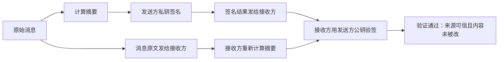

# 对称加密和非对称加密 - 第 5 课：数字签名：摘要、私钥签名、公钥验签与真实业务

## 学习目标（本节结束后你能做到什么）

- 理解数字签名到底在解决什么问题，而不是把它和“加密”混在一起。
- 能说清摘要、签名、验签三者分别在做什么。
- 分清“保密通信”和“身份证明”是两条完全不同的链路。
- 理解为什么签名通常不是直接对整段原文做，而是对摘要做。
- 能把数字签名放回到支付回调、JWT、Webhook、开放平台调用这些真实业务场景里。

## 内容讲解（核心概念，用类比、例子、图示说清楚）

### 1. 为什么我们还需要“数字签名”

在前面的内容里，我们已经知道：

- 对称加密和非对称加密都可以帮助我们解决“保密”问题
- 也就是让别人看不懂消息内容

但你再想一步，真实系统里还有另一个同样重要的问题：

**我怎么确认这条消息真的是你发的，而且中途没有被人偷偷改过？**

这不是“保密”问题，而是：

- 身份认证问题
- 完整性问题

举几个真实场景：

- 支付平台回调你“这笔订单支付成功了”，你怎么确认这条回调不是别人伪造的？
- 开放平台说“这是某个商户发起的接口调用”，你怎么确认请求参数没被中途改掉？
- JWT 里带着用户身份，网关怎么知道这个 Token 真的是授权中心签发的，而不是客户端自己伪造的？

这些问题，核心都不是“把内容藏起来”，而是：

**证明来源可信，并证明内容没有被改。**

数字签名就是在解决这件事。

### 2. 先一句话讲透：数字签名不是加密

这句话特别重要：

**数字签名不是为了让别人看不懂，而是为了让别人确认“这条消息是谁发的、有没有被改过”。**

如果你把“签名”和“加密”混在一起，后面看 HTTPS、证书、JWT、支付验签时就会特别容易乱。

你可以这样记：

- 加密：重点是机密性，别人看不懂
- 签名：重点是身份和完整性，别人改不了、冒充不了

### 3. 数字签名到底是怎么工作的

先给你一个简化版流程：

1. 发送方先对原始消息做摘要
2. 再用自己的私钥对摘要做签名
3. 接收方收到消息和签名后
4. 先自己再算一遍消息摘要
5. 再用发送方的公钥去验签
6. 如果验证通过，说明消息大概率来自持有私钥的人，而且消息本身没被改

这里一定要注意：

- 真正被“签”的通常不是整段原文，而是原文的摘要

为什么？

因为真实消息可能很大，直接对整段数据做复杂的非对称运算成本更高，而摘要能把一大段消息压缩成一个固定长度的“指纹”。

### 4. 什么叫摘要

摘要你可以理解成：

**一段消息的固定长度指纹。**

比如你有一篇很长的文章、一个 JSON 请求体、一个支付回调参数串。  
摘要算法会把它们变成一段长度固定的结果，比如：

- 256 bit
- 512 bit

它的关键特征是：

- 原文只要改一点点，摘要通常会变化很大
- 你很难从摘要反推出原文
- 不同原文撞出同样摘要的概率应该足够低

所以摘要非常适合做“内容有没有变化”的快速检测。

### 5. 为什么签名通常是“对摘要签名”

这背后有两个现实原因：

#### 5.1 效率原因

非对称运算通常比对称运算重得多。  
如果每次都直接拿私钥去处理一大段几 KB、几 MB 的消息，成本很高。

所以更合理的做法是：

- 先把消息算成一个固定长度摘要
- 再对这个摘要签名

#### 5.2 结构原因

数字签名的目标本来也不是“把消息再变一遍”，而是：

- 对消息的完整性和来源做数学意义上的绑定

摘要刚好能起到“消息指纹”的作用。

### 6. 一张图把签名流程画清楚

这张图里最关键的点有两个：

- 发送方用的是私钥
- 接收方用的是公钥

所以你可以看到，签名和保密通信那条“公钥加密、私钥解密”的路线不是同一条线。

### 7. 为什么签名可以证明身份

因为只有私钥持有者才能生成对应的合法签名。  
如果验签通过，说明：

- 至少从密码学角度看，这份签名确实是由对应私钥生成的

所以数字签名的安全前提其实是：

**私钥没有泄露。**

一旦私钥泄露，别人就能伪造你的签名。  
所以工程里会非常重视：

- 私钥的存放
- 私钥的访问权限
- 私钥的轮换
- 是否放在 HSM / KMS 中

### 8. 为什么签名还能证明“消息没被改”

因为接收方会自己对收到的消息再算一遍摘要。  
如果消息中间被改了，即使只改一个字符，新的摘要通常也会不同。

这时验签就会失败。

所以数字签名把两件事绑定在一起了：

- 这是谁发的
- 这份内容是不是原样到达的

### 9. 真实业务场景 1：支付回调

支付平台回调一般会带：

- 订单号
- 金额
- 支付状态
- 时间戳
- 签名

你在商户系统里最重要的不是“解密”这个回调，而是：

- 按平台规定的规则拼接参数
- 用平台公钥验签

如果验签通过，才能继续更新订单状态。  
否则，哪怕 HTTP 请求都已经打到你系统了，也不能信。

这说明一个很重要的事实：

**签名验签经常发生在“消息已经能看懂”的前提下。**

也就是说，签名不一定服务于保密，它主要服务于可信性。

### 10. 真实业务场景 2：JWT

JWT 分两类常见思路：

- 对称密钥签发
- 非对称私钥签发、公钥验签

当使用公私钥时，签发方用私钥签名，网关、业务服务或第三方资源服务器用公钥验签。

这样做的好处是：

- 验签方不需要持有私钥
- 私钥集中保管在签发中心
- 多个服务都可以共享公钥做验证

这就很适合分布式系统里“一个地方发令牌，多个地方验令牌”的模式。

### 11. 真实业务场景 3：开放平台请求签名

很多开放平台会要求：

- 商户端按规则对请求参数排序
- 拼接字符串
- 计算摘要
- 再生成签名

服务端收到后再重复同样流程进行验签。

它的意义不是为了把接口请求体藏起来，而是为了：

- 防止请求参数被篡改
- 防止第三方伪造调用方身份
- 配合时间戳和随机数防重放

### 12. 数字签名最容易混淆的几个点

#### 12.1 误区一：签名就是“私钥加密”

这是一个很常见但不够准确的口语化说法。  
为了初学方便可以这么类比，但一旦深入工程实践，最好还是说：

- 私钥用于签名
- 公钥用于验签

因为“签名”在语义上和“加密”不同，目的也不同。

#### 12.2 误区二：有签名就自动保密

不对。  
签名不解决“别人看不看得懂”的问题。

如果消息原文本身没加密，别人照样能看懂，只是他很难伪造一个同样能通过验签的版本。

#### 12.3 误区三：有 HTTPS 就不需要签名

不一定。  
HTTPS 主要是保护传输链路。  
而业务签名经常还在解决：

- 谁是调用方
- 参数有没有被业务代理层改过
- 这条消息能否离线验证真实性

所以很多系统同时使用：

- HTTPS
- 业务层签名

这两者不是重复，而是分层。

#### 12.4 误区四：摘要和签名是一回事

不是。

- 摘要：给消息生成指纹
- 签名：用私钥对摘要做可信绑定

它们是配合关系，不是同义词。

### 13. 你作为后端工程师真正要会的，不只是概念

你要有一个稳定的工程判断：

当系统需要证明“谁发的”和“有没有被改”时，优先想到签名；  
当系统需要防止“别人看懂内容”时，优先想到加密；  
当系统既要保密、又要认证，常常需要多种机制配合。

这时候你脑子里就不会再只有一句模糊的话：

- “安全嘛，上个 RSA 不就行了”

而是能清楚地问：

- 这里要保密吗？
- 要验身份吗？
- 要防篡改吗？
- 是链路问题还是业务消息问题？

## 小结（3-5 条关键点）

- 数字签名不是为了保密，而是为了证明身份和保证完整性。
- 数字签名通常不是直接对原文做，而是先对原文做摘要，再对摘要签名。
- 私钥用于签名，公钥用于验签，这是和“公钥加密、私钥解密”不同的一条链路。
- HTTPS 和业务签名经常会同时存在，因为它们解决的问题层次不同。
- 私钥安全是数字签名体系成立的根基，一旦私钥泄露，签名可信性就会崩掉。

## 问题 （检测用户对当前章节内容是否了解）

1. 数字签名到底在解决什么问题？为什么它不是“加密消息”？
2. 为什么签名时通常不是直接对原文做，而是先做摘要？
3. “私钥签名、公钥验签”和“公钥加密、私钥解密”分别解决什么问题？
4. 为什么业务系统已经用了 HTTPS，仍然有可能继续要求回调验签或请求签名？
