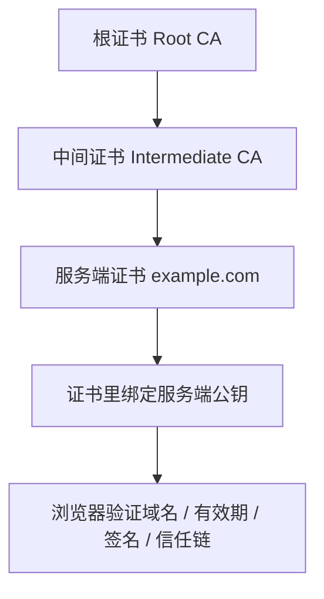

# 对称加密和非对称加密 - 第 6 课：数字证书：CA、证书链、域名校验与 HTTPS 信任基础

## 学习目标（本节结束后你能做到什么）

- 理解数字证书到底在解决什么问题，而不是只把它当成“一个 HTTPS 文件”。
- 能说清为什么“有公钥”还不够，关键还要证明“这个公钥是谁的”。
- 理解 CA、根证书、中间证书、服务端证书、证书链之间的关系。
- 理解浏览器为什么会信任某个网站的证书，以及它是怎么校验证书的。
- 能把数字证书放回到 HTTPS 连接建立过程里理解。

## 内容讲解（核心概念，用类比、例子、图示说清楚）

### 1. 为什么有了公钥还不够

很多人第一次学非对称加密时会觉得：

- 服务端把公钥发给客户端
- 客户端用这个公钥就行了

表面上看好像没问题，但这里有一个非常致命的漏洞：

**客户端怎么知道这把公钥真的是目标服务端的，而不是中间人伪造塞给它的？**

举个现实类比：

你在网上看到一个“银行客服”发来的二维码，说“请扫这个码转账”。  
问题不是二维码本身有没有加密，而是：

- 这到底是不是银行官方发的？

同理，在 HTTPS 里真正棘手的不是“服务端有没有公钥”，而是：

- 这个公钥的身份是否可信

数字证书就是在解决这件事。

### 2. 数字证书到底是什么

数字证书你可以先把它理解成：

**一份把“某个身份”和“某个公钥”绑定起来的、带有可信签名的电子身份证明。**

这份证明里通常会包含：

- 这个证书属于谁
- 对应的公钥是什么
- 适用于哪些域名
- 有效期到什么时候
- 是谁签发的
- 签名信息是什么

所以证书不是“另一个加密算法”，而是：

**一份经过可信体系背书的公钥身份证。**

### 3. CA 是什么

CA 是证书颁发机构，你可以把它类比成：

- 一个被大家普遍信任的“公证处”或“发证机关”

它做的事情是：

- 审核申请者身份
- 签发证书
- 用自己的私钥对证书内容签名

这样别人拿到证书后，只要信任这个 CA 的公钥，就能验证：

- 这份证书是不是 CA 真正签的
- 证书中绑定的公钥和身份信息是否未被篡改

### 4. 根证书、中间证书、服务端证书是什么关系

很多人一看到证书链就晕，其实先把角色拆开就行。

#### 4.1 根证书

根证书可以理解成最高层的信任起点。  
浏览器、操作系统、JDK 通常会内置一批默认信任的根证书。

也就是说，它们默认认为：

- 这些根证书对应的公钥是可信的

#### 4.2 中间证书

真实世界里，根证书一般不会频繁直接签大量业务网站证书，而是会通过中间 CA 来分层签发。

你可以理解成：

- 根证书像总行
- 中间证书像省级分行
- 服务端证书像最终发给企业或网站的具体证件

#### 4.3 服务端证书

这是网站真正给浏览器展示的证书。  
里面会包含：

- 网站域名
- 网站公钥
- 签发者信息
- 有效期等

### 5. 什么叫证书链

证书链就是一条“信任传递链”。

例如：

- 根 CA 签发中间 CA 证书
- 中间 CA 再签发网站证书

浏览器看到网站证书后，会沿着这条链往上验证：

- 这张网站证书是谁签的？
- 那个签发者自己又是谁签的？
- 最后能不能追溯到本地信任库里的某个根证书？

如果这条链打通了，而且每一环都验证通过，浏览器才更愿意相信：

- 这张网站证书是真的
- 这张证书里的公钥是真的属于这个网站

### 6. 浏览器到底会检查什么

浏览器验证 HTTPS 证书时，不是只做一件事，而是会综合检查好几件事：

#### 6.1 签名是否有效

也就是：

- 证书是不是由上级证书合法签出来的

#### 6.2 证书链是否完整

也就是：

- 能不能一路追溯到受信任的根证书

#### 6.3 域名是否匹配

这个特别关键。  
你访问的是 `api.example.com`，证书里就必须对得上这个域名，或者匹配其允许的域名规则。

如果证书是给 `www.example.com` 签的，却拿来给 `api.example.com` 用，浏览器就会报错。

#### 6.4 是否过期

证书有有效期。  
过期证书即使原来合法，也不应继续被信任。

#### 6.5 是否被撤销

某些场景下，证书虽然还没到期，但如果私钥泄露、主体失效、签发错误，就应该被撤销。

### 7. 一张图把证书链画清楚

这张图里最重要的不是层级本身，而是：

**信任并不是凭空来的，而是从本地信任根开始，一层一层传下来的。**

### 8. HTTPS 里证书具体怎么用

在 HTTPS/TLS 建链时，服务端会把自己的证书链发给客户端。  
客户端做完证书验证后，才会继续相信：

- 服务端身份可信
- 证书中的公钥可信

然后才能基于这个公钥或相关密钥交换机制继续往下走，建立安全会话。

所以你可以把证书放在 HTTPS 流程里的这个位置：

1. 服务端出示“身份证”
2. 客户端验证“身份证真伪”
3. 确认服务端公钥可信
4. 再开始安全协商会话密钥
5. 后续再用对称加密传业务数据

### 9. 为什么自签名证书会报警

自签名证书的意思通常是：

- 证书是自己给自己签的

它不一定数学上无效，但问题在于：

- 浏览器默认不认识你
- 本地信任库里也没有你的根

所以浏览器会提示风险。

这也是为什么开发环境里自签名证书可以用来测试，但生产环境通常需要接入被广泛信任的 CA 体系。

### 10. 真实工程里最容易踩的几个点

#### 10.1 误区一：证书就是“公钥文件”

不对。  
证书里确实包含公钥，但证书比公钥多出来的核心价值是：

- 身份绑定
- 有效期
- 签发者信息
- 签名背书

#### 10.2 误区二：HTTPS 报证书错误就是“算法不安全”

也不对。  
很多时候只是：

- 域名不匹配
- 证书过期
- 证书链没配全
- 使用了不被信任的签发链

#### 10.3 误区三：我有证书，就说明我一定安全

证书只是信任链的一部分。  
如果私钥泄露，攻击者依然可能冒充你。  
所以证书和私钥必须一起看。

#### 10.4 误区四：证书和数字签名是两个完全无关的概念

其实不是。  
证书本身就是靠签名建立信任的。  
你前一课学的数字签名，正好在这里变成“信任体系的基石”。

### 11. 作为后端工程师，你应该有的稳定认知

以后你在排查 HTTPS、网关 TLS、服务端证书问题时，脑子里要有这样一条固定链路：

- 网站给了我什么证书？
- 证书链完整吗？
- 域名对得上吗？
- 有没有过期？
- 这个证书里的公钥到底能不能被信任？

这样你就不会把所有问题都归结成一句很空的话：

- “是不是 SSL 有问题”

而是能更具体地拆：

- 是身份没证明清楚
- 还是证书链没接好
- 还是私钥/域名/有效期出了问题

## 小结（3-5 条关键点）

- 数字证书的核心作用是把“身份”和“公钥”可信地绑定起来。
- 仅有公钥还不够，关键是要确认这把公钥到底属于谁。
- 浏览器的信任来自根证书、中间证书到服务端证书组成的证书链。
- HTTPS 建链时，客户端会先验证证书，再决定是否信任服务端公钥。
- 证书问题通常不只是“加密算法问题”，更常见的是域名、有效期、签发链和私钥管理问题。

## 问题 （检测用户对当前章节内容是否了解）

1. 为什么说“服务端直接发一个公钥给客户端”仍然不够安全？
2. 数字证书相比单纯公钥，多出来的核心价值是什么？
3. 根证书、中间证书、服务端证书之间是什么关系？
4. 浏览器验证 HTTPS 证书时，通常会检查哪些关键点？
5. 为什么开发环境里自签名证书能用，但生产环境一般不能直接这么干？
