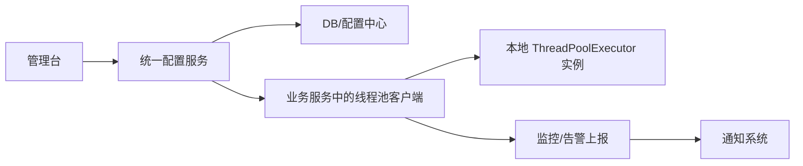

# 动态化线程池：从参数写死到运行时治理

## 先说结论

截图里这套“动态化线程池”方案，表面上看是在做线程池参数热修改，实际上它想解决的问题远不止“把 `corePoolSize` 改大一点”这么简单。

它真正想解决的是一整类生产问题：

- 线程池参数在代码里写死，发布后很难调整
- 不同业务高峰和低峰差异很大，静态参数很难一次配对
- 线程池负载、队列积压、拒绝执行这些问题，往往要等事故发生后才知道
- 线程池虽然是基础设施，但在很多团队里仍然处于“谁写谁管、没人治理、出了问题靠猜”的状态

所以这套方案的本质，不是“发明一个新的线程池”，而是：

**把线程池从代码里的一个本地对象，升级成一个可以统一配置、动态调整、实时观测、带权限和审计的运行时资源。**

如果再压缩成一句话，就是：

**它想把“线程池使用”这件事，从开发期的静态配置，升级成生产期的动态治理。**

---

## 一、他们到底想解决什么问题

先不要急着看方案，先看痛点。不然很容易把“动态化线程池”误解成一个花哨功能集合。

在线上系统里，线程池通常承担这些任务：

- 并行执行请求内的子任务
- 异步处理消息、回调、批任务
- 给某类任务做资源隔离，避免互相拖垮

这时线程池已经不是一个普通工具类了，而是业务吞吐、延迟、稳定性的重要组成部分。

问题在于，很多系统一开始使用线程池的方式很原始：

```java
new ThreadPoolExecutor(
    8,
    16,
    60L,
    TimeUnit.SECONDS,
    new LinkedBlockingQueue<>(1000)
)
```

参数写进去之后，事情似乎就结束了。但线上真正的问题才刚刚开始。

### 1. 参数是静态的，业务却是动态的

线程池配置本质上是在回答两个问题：

- 当前业务需要多少并发能力
- 系统最多能承受多少并发压力

但业务流量不是静态的：

- 活动日和平峰完全不同
- 白天和夜间完全不同
- 正常流量和异常补偿流量完全不同
- I/O 密集型任务和 CPU 密集型任务对线程数的诉求也完全不同

如果参数写死在代码里，就意味着：

- 配小了，吞吐上不去，队列积压
- 配大了，线程太多，CPU 抖动，上下游也可能被打挂
- 想调整只能改代码、发版、重启，成本很高

所以第一个核心问题是：

**线程池参数需要跟着运行状态变化，而不是在发布时一次性定终身。**

### 2. 问题常常不是“有没有线程池”，而是“我们根本不知道它现在怎么样”

很多线上故障最后查下来，不是业务逻辑写错了，而是线程池已经在出问题，但没人及时知道。

例如：

- 活跃线程数接近 `maximumPoolSize`
- 队列里已经堆了很多任务
- 开始出现 `RejectedExecutionException`
- 某类任务平均耗时突然变长
- 少数慢任务把整个池子拖住了

如果没有监控，这时候团队看到的只是表层现象：

- 接口慢了
- 回调延迟了
- 消息积压了
- 某些异步任务不执行了

但真正原因可能是线程池已经满载。

所以第二个核心问题是：

**线程池不能只是“能用”，还必须“可观测”。**

### 3. 真正难的不是改参数，而是安全地改参数

假设平台支持在线把线程池从 `8/16/1000` 改成 `16/32/2000`，这件事看起来很好，但工程上马上会冒出新问题：

- 谁能改？
- 改了之后谁知道？
- 改错了怎么办？
- 有没有操作记录？
- 改完后真的生效了吗？
- 改完后线程池状态有没有变好？

这说明动态化线程池最终一定会从“几个 setter 方法”演进成“治理系统”。

所以第三个核心问题是：

**线程池动态化不是单纯的技术能力，而是配置、监控、告警、权限、审计一起组成的治理能力。**

---

## 二、他们在做什么

从截图里的整体设计和功能架构看，这套方案大致在做五件事。

### 1. 把线程池配置从代码里搬到平台上

原来线程池参数散落在代码和配置文件中，现在把它们统一抽成平台配置项，例如：

- 线程池名称
- 核心线程数 `corePoolSize`
- 最大线程数 `maximumPoolSize`
- 队列长度
- 告警阈值
- 活跃度阈值
- 拒绝策略

这样做的含义是：

- 线程池不再只是开发自己 new 出来的对象
- 它变成了一个有名字、有元数据、可查可改的资源

### 2. 让业务侧通过“客户端”接入统一能力

从图里可以看出，业务服务侧会有一个线程池客户端，负责：

- 获取配置
- 创建线程池
- 接收配置变更
- 上报监控和告警

这一步非常关键，因为平台不能直接伸手去改业务进程里的对象，所以必须在应用进程内部放一个轻量客户端，把“平台治理能力”和“本地线程池实例”连起来。

### 3. 让参数支持运行时修改

这是“动态化”最直观的一层能力。它不是等下一次重启生效，而是运行中生效。

例如：

- 修改核心线程数
- 修改最大线程数
- 修改 `keepAliveTime`
- 修改告警阈值

从截图来看，他们显然也希望支持队列长度调整。这一点在工程上比改核心数更难，后面会单独讲。

### 4. 给线程池加上细粒度监控

从功能架构图里可以看到，监控不是只看一个线程池是否“活着”，而是拆得很细：

- 线程池粒度监控
- 线程粒度监控
- 任务粒度监控
- 活跃度监控
- 事务级耗时监控

这说明他们不是把线程池当黑盒，而是把它当成一个完整的运行时对象来观测。

### 5. 把通知、日志、权限也纳入体系

截图里有几个很重要但很容易被忽略的模块：

- 过载告警
- 变更通知
- 参数修改日志查询
- 修改权限控制

这说明方案的目标不是“给高级开发一个隐藏开关”，而是“把线程池运维流程产品化”。

---

## 三、为什么要这样做

讲完“做什么”，再看“为什么这样做”。

### 1. 因为线程池本质上是运行时容量控制器

很多人把线程池理解成“多线程执行器”，这是对的，但不够完整。

在线上系统里，线程池同时还是：

- 任务排队器
- 并发闸门
- 资源舱壁
- 限流缓冲层

也就是说，线程池参数本质上在定义：

- 最多允许多少任务并发执行
- 多出来的任务是排队、扩容、还是拒绝

这其实已经是在做容量治理了。

既然它承担的是容量治理角色，那么配置、监控、告警、权限自然不能缺席。

### 2. 因为发版调参太慢，跟不上线上变化

如果线程池参数只能靠发版修改，线上会出现一个很典型的问题：

1. 先发现接口变慢
2. 再怀疑线程池不够
3. 再修改配置
4. 再走测试、发布流程
5. 最后才看到效果

这条链路太长了。很多时候故障窗口根本等不了。

动态化的价值就在于：

- 不用重新发版
- 不用立刻重启
- 可以小步调整，边看指标边修正

这让线程池从“发布时决策”变成“运行时决策”。

### 3. 因为没有监控就没有调优

如果你不知道：

- 当前活跃线程占比多少
- 队列等待多久
- 有没有拒绝执行
- 慢任务是普遍现象还是个别现象

那所谓“调线程池”就只能拍脑袋。

所以平台一定要把“改参数”和“看效果”连成闭环：

- 先看到问题
- 再改参数
- 再观察指标变化

没有这条闭环，动态调整就只是更快地瞎调。

### 4. 因为真正危险的不是线程池不会用，而是乱用

线程池一旦支持在线修改，就意味着风险也被同时放大了。

例如：

- 把最大线程数改得过大，直接把机器打爆
- 把队列长度改得太大，延迟雪崩但短期内看不出
- 把拒绝阈值调得太晚，告警失去价值

所以他们才会引入：

- 权限校验
- 变更通知
- 日志审计

这说明设计者已经意识到：

**动态化不是“更自由”，而是“必须在更强约束下自由”。**

---

## 四、他们是怎么做的

这是最关键的一部分。我们把它拆成“平台侧”和“业务侧”两条线来看。

## 4.1 平台侧：统一管理配置和治理流程

从图里看，平台侧至少有这些职责：

- 创建线程池配置
- 删除线程池配置
- 修改线程池配置
- 查看线程池状态
- 做权限控制
- 记录操作日志
- 触发告警和通知

它大致像下面这样工作：



你可以把它理解成：

- 平台负责定义“应该怎么配”
- 业务进程里的客户端负责把“应该怎么配”落实到“本地线程池实例”

这也是为什么截图里会出现“启动拉取”“告警上报”“办公软件服务”“统一配置服务”这些模块。

## 4.2 业务侧：用包装层接管线程池创建和变更

业务服务里通常不会再直接手写 `new ThreadPoolExecutor(...)`，而是改成：

- 先按线程池名称从客户端拿配置
- 再通过客户端或工厂创建线程池
- 再订阅后续配置变更
- 再持续上报运行指标

这一步的本质是：

**把原生线程池包一层，让它从“普通对象”变成“可管理对象”。**

## 4.3 动态修改为什么可行

截图里特别提到了 JDK 原生 `ThreadPoolExecutor` 暴露的若干 setter，例如：

- `setCorePoolSize`
- `setMaximumPoolSize`
- `setKeepAliveTime`
- `setRejectedExecutionHandler`
- `setThreadFactory`

这说明方案的一个关键出发点是：

**优先复用 JDK 原生线程池已经提供的运行时可变能力，而不是从零自己重写一个执行器。**

这是一个很务实的思路。因为 `ThreadPoolExecutor` 本身就允许在运行时调整部分策略。

例如 `setCorePoolSize` 的影响就不是简单地改一个字段，而是会进一步触发不同动作：

- 如果新的核心线程数比当前工作线程数小，线程池会尝试中断空闲线程，逐步回收多余 worker
- 如果新的核心线程数变大，而且队列里有等待任务，线程池可以创建新的 worker 来加快消费

也就是说，动态化并不是“先改值，等以后再说”，而是“改值后立刻影响调度行为”。

## 4.4 队列长度动态化为什么更难

这里有一个非常值得补充的工程点。

JDK 原生 `ThreadPoolExecutor` 支持动态改核心数、最大数、保活时间，但它**并没有**提供一个通用的“在线修改阻塞队列容量”的标准接口。

所以如果截图里的系统支持“修改队列长度”，实现上通常只有几种可能：

### 方案一：自定义可变容量队列

例如在线程池里不用标准的 `LinkedBlockingQueue/ArrayBlockingQueue`，而是包装一个支持容量热更新的队列实现。

### 方案二：自己做一层队列容量判断

队列底层未必真的改了物理容量，但在入队逻辑上增加一层“逻辑容量阈值”判断，从而达到近似效果。

### 方案三：重建线程池并迁移

对于部分系统，也可能不是原地改队列，而是新建一个新参数线程池，再逐步切换流量。

由于截图没有给出实现源码，所以这里只能做合理推断。但无论哪种方案，都说明一件事：

**动态化线程池里最容易做的是改线程参数，最难做的是改排队语义。**

## 4.5 监控是怎么做的

从截图内容看，这套方案的监控至少覆盖了三个层次。

### 第一层：线程池级指标

例如：

- 当前线程数
- 活跃线程数
- 最大线程数
- 队列长度
- 拒绝次数
- 池活跃度

其中截图里提到了一个很典型的指标：

`activeCount / maximumPoolSize`

这个指标的含义不是绝对精确描述系统负载，而是给出一个“线程池离打满还有多远”的近似信号。

### 第二层：任务级指标

例如：

- 任务执行耗时
- 平均耗时
- P95 / P99
- 最大执行时长
- 是否出现大量慢任务

这一步非常重要，因为仅仅知道“线程很忙”还不够，你还得知道是：

- 任务太多
- 还是任务太慢
- 还是少数异常任务把 worker 长时间占住了

### 第三层：异常和告警级指标

例如：

- `RejectedExecutionException`
- 队列积压超过阈值
- 活跃度超过阈值
- 某类任务持续超时

这些信号会进一步进入通知系统，例如截图里展示的大象通知。

## 4.6 告警、审计、权限为什么是必需的

这是很多技术方案容易讲薄的一点。

如果平台支持在线改线程池，就必须同时支持：

- 谁有权限改
- 改过什么
- 什么时候改的
- 改之前是什么
- 改之后是什么
- 是否通知相关负责人

因为在线改线程池，本质上已经是一种线上运维动作了。

一旦没有审计，后果会很糟：

- 出现问题时不知道是谁改的
- 不知道问题是改前存在还是改后引入
- 团队里所有人都能改，容易把线程池变成“共享事故开关”

所以从功能图里看到“参数修改日志查询”和“修改权限控制”，其实说明这套系统已经不是一个库，而是一个平台产品。

---

## 五、最终做出来的结果是什么

如果把整套方案收束一下，它最终产出的不是一个类库，而是五种能力。

### 1. 从“静态配置”变成“运行时调优”

线程池不再只能靠发版修改，而是可以：

- 启动时拉配置
- 运行中热更新
- 修改后即时生效

这直接缩短了调优链路和故障恢复链路。

### 2. 从“黑盒”变成“可观测”

团队不再只知道“线程池可能有问题”，而是能看到：

- 当前活跃度
- 队列积压情况
- 任务执行耗时分布
- 是否发生拒绝

于是问题从“靠猜”变成“靠指标定位”。

### 3. 从“开发自行维护”变成“平台统一治理”

线程池不再散落在各个服务里野蛮生长，而是被纳入统一的：

- 配置管理
- 监控管理
- 告警管理
- 权限管理
- 日志审计

这意味着线程池已经从编码细节升级成了基础设施。

### 4. 从“出了问题才发现”变成“事前感知”

通过活跃度、积压长度、拒绝次数、任务耗时等指标，可以在真正故障前给出信号。

这比等接口彻底超时、消息彻底堆死之后再排查，要主动得多。

### 5. 从“一次配置”变成“持续运营”

这可能是最重要的结果。

线程池参数从来都不是“配完就结束”的事情，而是要随着：

- 流量变化
- 任务类型变化
- 机器规格变化
- 上下游依赖变化

持续调整。

动态化线程池的真正价值，就是把这种持续运营能力系统化、产品化。

---

## 六、但这套方案也有边界

讲到这里，也要避免把动态化线程池神化。

它很有价值，但它不是万能药。

### 1. 它不能替代线程池选型本身

如果一个任务天然更适合：

- Reactor
- 协程
- 消息队列削峰
- 批处理拆分

那你再怎么动态调线程池，也只是把一个不合适的执行模型调得“没那么差”。

### 2. 它不能解决慢任务本身

如果线程池里的任务之所以堆积，是因为：

- 数据库慢
- 下游 RPC 慢
- 锁竞争严重
- 单个任务逻辑太重

那动态扩容线程池可能只是把更多请求更快地打到故障点上。

### 3. 动态修改不等于可以随便修改

例如：

- `maximumPoolSize` 不是越大越好
- 队列不是越长越安全
- 活跃度告警阈值也不是越晚越准确

如果缺少任务模型认知，动态化只会让错误调参更快发生。

---

## 七、怎么理解这套设计的本质

如果你想把这套方案真正记住，不要只记“它支持动态改 `corePoolSize`”。

你应该把它理解成下面这句话：

**动态化线程池的本质，是把线程池从一个开发期的本地并发工具，提升为一个生产期可治理的运行时资源。**

再展开一点，就是五步：

1. 先承认线程池参数不是一次性决策，而是运行时决策
2. 再把配置从代码里抽出来，纳入平台
3. 再把线程池实例接入客户端，允许热更新
4. 再把监控、告警、日志、权限补齐
5. 最终形成一套线程池治理闭环

所以这套方案真正交付的，不是“改参数能力”，而是：

- 发现问题的能力
- 安全改动的能力
- 持续优化的能力
- 组织级治理的能力

这也是为什么截图里会同时出现：

- 配置平台
- 客户端
- 监控
- 告警
- 通知
- 日志
- 权限

因为少了任何一块，它都很难称得上“动态化线程池平台”。

---

## 八、小结

最后把全文压缩成几句最好记的话：

- 这套方案想解决的，不是“线程池怎么创建”，而是“线程池上线后怎么持续治理”。
- 它在做的，不是单个 API 热更新，而是把线程池纳入统一的配置、监控、告警、权限、审计体系。
- 它之所以这样做，是因为线程池本质上承担的是并发控制和容量治理角色，静态配置很难适应真实生产环境。
- 它的实现核心，是业务侧接入客户端、平台侧托管配置，并尽量复用 `ThreadPoolExecutor` 已有的运行时可变能力。
- 它最终做出来的结果，是让线程池从“写死在代码里的局部实现细节”，变成“可观测、可调整、可审计、可运营的基础设施能力”。

如果下一步还想继续深挖，这个主题最值得继续展开的两个方向是：

- `ThreadPoolExecutor` 到底哪些参数真的能安全动态修改，哪些不能
- 队列容量动态调整在工程上通常怎么实现，为什么它比改线程数难得多
