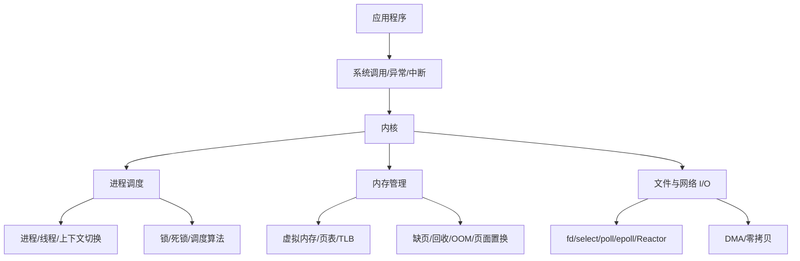

# 操作系统专题学习路径

## 专题定位

操作系统面试题很容易被背成概念清单，但真正拉开差距的是能把几个层次串起来：

- 用户态和内核态：为什么应用不能直接碰硬件，系统调用、异常和中断如何进入内核。
- 进程和线程：资源隔离、执行流、上下文切换、同步互斥。
- 调度和死锁：CPU 如何分配，锁为什么会卡死，系统如何避免或恢复。
- 虚拟内存：地址空间、页表、TLB、缺页、回收、OOM。
- I/O 模型：文件描述符、select/poll/epoll、Reactor、零拷贝。

这组笔记按“先建立运行模型，再看内存，再看 I/O”的顺序组织，适合面试前系统复盘，也适合把 Redis、Nginx、Kafka 等中间件底层问题串起来。

## 建议阅读顺序

| 顺序 | 文件 | 重点 |
| --- | --- | --- |
| 1 | [01_用户态_内核态与中断：系统调用_异常_硬中断与软中断.md](/Users/xinqi/Documents/learning_stuff/操作系统/01_用户态_内核态与中断：系统调用_异常_硬中断与软中断.md) | 权限隔离、系统调用、异常和中断 |
| 2 | [02_进程与线程：资源隔离_共享_状态与上下文切换.md](/Users/xinqi/Documents/learning_stuff/操作系统/02_进程与线程：资源隔离_共享_状态与上下文切换.md) | 进程、线程、协程、进程状态、上下文切换 |
| 3 | [03_CPU调度与死锁：FCFS_SJF_HRRN_RR_多级反馈队列与死锁处理.md](/Users/xinqi/Documents/learning_stuff/操作系统/03_CPU调度与死锁：FCFS_SJF_HRRN_RR_多级反馈队列与死锁处理.md) | 调度算法、锁、死锁条件、银行家算法 |
| 4 | [04_进程间通信：管道_消息队列_共享内存_信号量_信号与Socket.md](/Users/xinqi/Documents/learning_stuff/操作系统/04_进程间通信：管道_消息队列_共享内存_信号量_信号与Socket.md) | IPC 对比和选型 |
| 5 | [05_虚拟内存：地址空间_分页_分段_页表_MMU与TLB.md](/Users/xinqi/Documents/learning_stuff/操作系统/05_虚拟内存：地址空间_分页_分段_页表_MMU与TLB.md) | 虚拟地址到物理地址、页表和 TLB |
| 6 | [06_内存分配与回收：fork写时复制_brk_mmap_缺页异常与OOM.md](/Users/xinqi/Documents/learning_stuff/操作系统/06_内存分配与回收：fork写时复制_brk_mmap_缺页异常与OOM.md) | COW、malloc、内存回收路径 |
| 7 | [07_页面置换算法：OPT_FIFO_LRU_Clock与工作集.md](/Users/xinqi/Documents/learning_stuff/操作系统/07_页面置换算法：OPT_FIFO_LRU_Clock与工作集.md) | 页面置换算法和抖动 |
| 8 | [08_IO多路复用：select_poll_epoll与Reactor模型.md](/Users/xinqi/Documents/learning_stuff/操作系统/08_IO多路复用：select_poll_epoll与Reactor模型.md) | epoll 内核结构、LT/ET、Reactor |
| 9 | [09_零拷贝：read_write_mmap_sendfile与DMA.md](/Users/xinqi/Documents/learning_stuff/操作系统/09_零拷贝：read_write_mmap_sendfile与DMA.md) | 普通 I/O 拷贝链路、sendfile、DMA |

## 一张总览

## 面试回答的主线

回答 OS 问题时可以默认用这条链路展开：

1. 先说“资源归谁管”：进程管资源，线程是执行流，内核管硬件和全局资源。
2. 再说“切换代价在哪里”：用户态/内核态切换、CPU 上下文、地址空间、TLB、缓存局部性。
3. 再说“性能瓶颈在哪里”：锁竞争、上下文切换、内存缺页、全量扫描、数据拷贝。
4. 最后说“工程取舍”：隔离性和性能、吞吐和延迟、公平和优先级、简单性和可扩展性。

