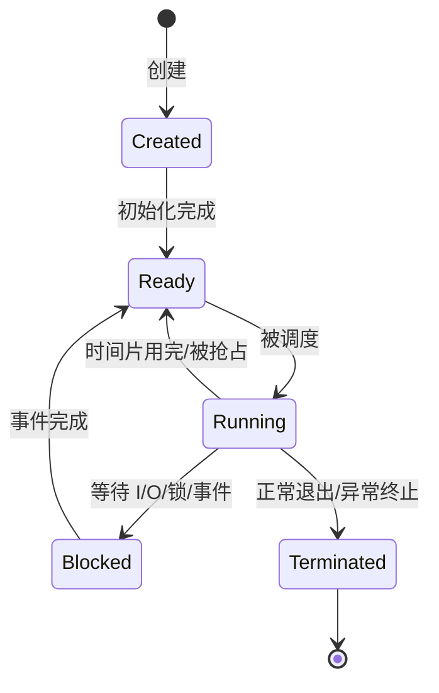

# 进程与线程：资源隔离、共享、状态与上下文切换

## 先给一句话定义

进程是资源分配和隔离的基本单位，线程是 CPU 调度和执行的基本单位。

进程更像“一个运行中的程序容器”，拥有独立的虚拟地址空间、文件描述符表、信号处理配置等资源。线程更像“容器里的执行流”，同一进程内的线程共享大部分进程资源，但各自拥有寄存器上下文、栈和线程局部状态。

## 进程、线程、协程对比

| 维度 | 进程 | 线程 | 协程 |
| --- | --- | --- | --- |
| 调度者 | 内核 | 内核，用户级线程另说 | 用户态运行时 |
| 地址空间 | 独立 | 同进程内共享 | 同线程/进程内共享 |
| 切换成本 | 高，要切地址空间和更多内核结构 | 中等，通常不切地址空间 | 低，通常不进内核 |
| 崩溃影响 | 通常影响本进程 | 可能拖垮整个进程 | 取决于运行时和语言模型 |
| 通信方式 | IPC | 共享内存加同步 | 共享内存、通道、事件循环 |
| 适合场景 | 隔离强、故障边界清晰 | 需要并行执行和共享数据 | 高并发 I/O、轻量任务编排 |

协程不是内核可见的调度实体。它的优势是切换轻、数量可以很多；代价是需要运行时配合，一旦在协程里调用阻塞系统调用，可能把承载它的线程也阻塞住。

## 线程为什么被设计出来

假设一个视频播放器要做三件事：

1. 从文件或网络读取数据。
2. 解码或解压缩数据。
3. 播放音频和画面。

单进程单执行流会把这三步串起来，一旦读取等待 I/O，后面的解码和播放也被卡住。多进程能并发，但进程间传递数据成本高，创建、销毁、切换都重。

线程解决的是两个诉求：

- 多个执行流可以并发运行，充分利用 CPU 和 I/O 等待时间。
- 执行流共享同一个地址空间，传递数据不用像进程 IPC 那样绕一圈。

这也是线程危险的来源：共享内存让通信变快，也让数据竞争、死锁和可见性问题更容易发生。

## 同一进程内线程共享什么、独占什么

| 类型 | 内容 |
| --- | --- |
| 共享 | 代码段、数据段、堆、打开的文件描述符、当前工作目录、进程级信号处理方式、地址空间 |
| 独占 | 线程 ID、寄存器、程序计数器、栈、线程局部存储、调度状态 |

所以一个线程修改全局变量，其他线程能看到；一个线程关闭某个文件描述符，其他线程也会受影响；但每个线程的函数调用栈互不相同。

## 多线程不是越多越好

线程太多会带来几个问题：

- 每个线程都有栈，会消耗内存。
- 上下文切换变多，CPU 花在保存/恢复现场上的时间增加。
- 竞争共享资源的概率变高，锁等待和缓存失效变严重。
- 调试复杂度上升，偶现问题更难复现。

线程数通常要按任务类型估算：

- CPU 密集型：接近 CPU 核心数，过多只会抢 CPU。
- I/O 密集型：可以比核心数多，但要看外部 I/O 延迟、连接数和内存预算。
- 事件驱动型：少量 I/O 线程加工作线程池，避免一个连接一个线程。

## 进程的五种状态

几个容易混的点：

- 就绪态不是“正在执行”，而是“万事俱备，只差 CPU”。
- 阻塞态不是“优先级低”，而是“等待的条件还没满足，给它 CPU 也跑不了”。
- 从阻塞态通常回到就绪态，而不是直接运行态，因为还要经过调度器选择。

## 上下文切换到底切什么

CPU 运行一个任务需要知道两类信息：

- 当前执行到哪里：程序计数器、指令指针。
- 当前计算状态是什么：通用寄存器、栈指针、标志寄存器等。

进程上下文还包括更多资源：

- 用户空间地址映射：页表、虚拟内存区域。
- 内核栈和内核态执行状态。
- 文件描述符、信号、调度统计等 PCB 中的信息。

线程上下文通常更轻：

- 同进程内线程切换时，地址空间不变。
- 主要切换线程栈、寄存器、程序计数器和调度状态。

但线程切换也不是免费午餐。即使不切页表，也可能破坏 CPU cache 的局部性；如果线程在不同核心迁移，还可能带来更多缓存同步成本。

## 进程切换为什么比线程切换重

进程切换通常需要切换地址空间。地址空间一变，CPU 的 TLB 缓存可能需要刷新或按地址空间标识隔离，页表基址也要变化。新进程的代码和数据大概率不在当前 CPU cache 里，因此缓存命中率下降。

线程切换如果发生在同一进程内，不需要换整套地址空间，TLB 和进程级资源复用更多，所以一般更轻。

简化理解：

- 线程切换：换“执行流现场”。
- 进程切换：换“执行流现场”加“资源视图”。

## 面试常见追问

**进程崩溃为什么一般不影响其他进程？**

因为进程拥有独立虚拟地址空间和资源边界。非法访问通常只会触发当前进程异常，内核回收它的资源。除非它通过共享内存、文件、数据库、外部服务等方式影响了外部状态。

**一个线程崩溃为什么可能导致整个进程崩溃？**

同进程线程共享地址空间。线程越界写可能破坏堆、全局变量、锁结构或其他线程的业务数据，很多语言/运行时会直接终止整个进程。

**线程切换上下文保存在哪里？**

保存在内核维护的线程控制块和内核栈等结构中。再次调度该线程时，内核恢复这些寄存器和栈状态，让线程从上次停下的位置继续。

