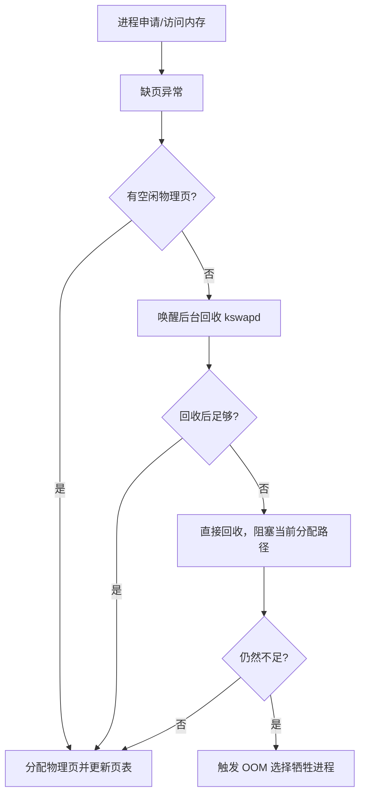

# 内存分配与回收：fork 写时复制、brk、mmap、缺页异常与 OOM

## malloc 不是系统调用

`malloc` 是 C 库函数。它向应用提供堆内存，但不一定每次都立刻向内核申请物理内存。

典型路径：

- 小块内存：运行时分配器从已有 arena 或堆空间切一块给应用。
- 堆空间不够：通过 `brk` 扩展堆顶。
- 大块内存：可能通过 `mmap` 在文件映射区申请匿名映射。

很多实现会根据大小阈值决定走 `brk` 还是 `mmap`，阈值和策略会随 glibc 版本、运行时参数变化。

## brk 和 mmap 的区别

| 方式 | 分配位置 | 特点 | 常见用途 |
| --- | --- | --- | --- |
| `brk` | 堆区 | 移动堆顶，适合连续扩展 | 较小、频繁的堆分配 |
| `mmap` | 文件映射区 | 建立独立虚拟内存区域，可匿名也可映射文件 | 大块分配、动态库、共享内存、文件映射 |

`brk` 的优势是管理简单，适合小对象复用。缺点是堆顶只能整体向上/向下调整，中间释放的空间更依赖分配器复用。

`mmap` 的优势是大块内存可单独映射和释放，归还给系统更直接。缺点是系统调用和 VMA 管理成本更高。

## 申请虚拟内存不等于立刻拿到物理内存

应用调用 `malloc` 后，通常先获得一段虚拟地址。真正分配物理页可能发生在第一次读写时：

1. CPU 访问虚拟地址。
2. MMU 查页表发现没有有效物理页。
3. 触发缺页异常，进入内核。
4. 内核分配物理页并更新页表。
5. 返回用户态，重新执行触发缺页的指令。

这叫按需分配。它避免程序一申请大块内存就立刻占满物理内存。

## fork 会复制什么

`fork` 创建子进程时，内核不会立刻复制所有物理内存。它通常做：

- 复制父进程的进程控制信息。
- 复制或共享文件描述符引用。
- 复制父进程的页表结构。
- 将父子进程共享的物理页标记为只读或写时复制。

父子进程的虚拟地址空间看起来各自独立，但很多页最初映射到同一批物理页。

## 写时复制的过程

写时复制的关键是“读共享，写复制”。

1. 父进程 `fork` 子进程。
2. 父子页表指向相同物理页，页表项标记为只读/COW。
3. 任一方写入该页。
4. CPU 发现写权限不满足，触发写保护异常。
5. 内核分配新物理页，复制旧页内容。
6. 更新写入方页表，让它指向新页并恢复可写。
7. 写操作继续执行。

它节省的是 fork 当下的物理内存复制和时间成本。对于 `fork` 后马上 `exec` 的场景尤其有效，因为子进程很快加载新程序，根本不需要复制父进程大部分内存。

## 缺页异常的几种类型

| 类型 | 说明 | 成本 |
| --- | --- | --- |
| 匿名页首次访问 | 虚拟页尚未分配物理页 | 较低，分配并清零物理页 |
| 文件映射页缺页 | 页面需要从文件读入 | 可能触发磁盘 I/O |
| 写时复制缺页 | 共享只读页被写入 | 分配新页并复制 |
| 换入缺页 | 页面之前被换出到 swap | 成本高，依赖磁盘 |
| 非法访问 | 地址无效或权限不允许 | 通常导致进程异常终止 |

理解缺页时要区分 minor fault 和 major fault。前者不一定需要磁盘 I/O，后者通常需要从磁盘读取，延迟差异非常大。

## 内存不足时系统怎么做

当缺页处理需要物理页但空闲页不足时，内核会尝试回收：

回收对象主要有两类：

- 文件页：页缓存、文件映射。干净页可直接丢弃，脏页要先写回。
- 匿名页：堆、栈等没有文件后备的页。若开启 swap，可换出到磁盘。

## kswapd、直接回收和 OOM 的差别

| 阶段 | 是否阻塞当前进程 | 触发条件 | 影响 |
| --- | --- | --- | --- |
| 后台回收 | 通常不直接阻塞 | 内存水位下降 | 提前回收，平滑压力 |
| 直接回收 | 会阻塞 | 当前分配无法满足 | 应用延迟明显上升 |
| OOM | 会杀进程 | 回收后仍不足 | 释放内存但破坏业务可用性 |

线上排查内存问题时，如果看到延迟毛刺，不一定是 CPU 忙，也可能是直接回收或 major fault 增多。

## 工程实践里的几个坑

- `malloc` 成功不代表物理内存已经准备好，首次访问可能才触发缺页。
- 大量 `fork` 大内存进程，即使有 COW，也会复制页表并产生开销。
- fork 后父子进程大量写共享页，会让 COW 优势迅速消失。
- 关闭 swap 可以避免换入换出延迟，但内存紧张时更容易 OOM。
- 文件页占内存不一定是泄漏，Linux 会用空闲内存做页缓存。

