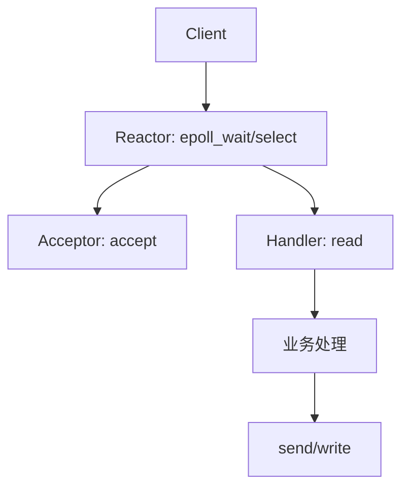

# I/O 多路复用：select、poll、epoll 与 Reactor 模型

## 这一篇和 Linux 专题的关系

[Linux 的 select/epoll 笔记](/Users/xinqi/Documents/learning_stuff/Linux/01_select、epoll、LT_ET与IO多路复用.md) 已经覆盖了入门概念。这里从操作系统面试角度补一遍更底层的主线：文件描述符、就绪事件、内核数据结构、触发模式和 Reactor。

## I/O 多路复用解决什么问题

一个连接一个线程的问题是：

- 连接多时线程数爆炸。
- 大量线程阻塞等待 I/O，内存和调度开销高。
- 活跃连接可能很少，但系统要维护很多执行流。

I/O 多路复用的思路是：

> 用一个或少量线程同时等待多个文件描述符，谁就绪了就处理谁。

这里的“就绪”不是 I/O 已完成，而是这次读写操作大概率不会阻塞。

## 文件描述符是核心抽象

Linux 把 socket、管道、文件等都抽象为文件描述符。多路复用接口监听的是 fd 上的事件：

- 可读：接收缓冲区有数据、连接关闭、监听 socket 有新连接。
- 可写：发送缓冲区有空间。
- 异常：错误、带外数据等。

业务层最终仍要自己调用 `accept`、`read`、`write`、`close` 等系统调用。

## select 的工作方式

`select` 大致流程：

1. 用户态准备读/写/异常 fd 集合。
2. 调用 `select`，把集合拷贝到内核。
3. 内核遍历 fd 集合，检查是否就绪。
4. 没有就绪则睡眠，有就绪则返回。
5. 内核把结果拷回用户态。
6. 用户态再次遍历集合，找出就绪 fd。

核心问题：

- fd 集合大小通常受 `FD_SETSIZE` 限制。
- 每次调用都要复制整个集合。
- 内核和用户态都要线性扫描。

当监听 fd 很多、活跃 fd 很少时，浪费明显。

## poll 的改进和局限

`poll` 用动态数组描述关注的 fd，突破了 `select` 的固定 bitmap 限制。

但它没有改变核心模型：

- 每次仍要把关注列表传给内核。
- 内核仍要线性扫描。
- 返回后用户态通常也要扫描结果。

所以 `poll` 解决了部分数量限制，但没有从根上解决海量连接下的扫描成本。

## epoll 的关键结构

`epoll` 把“注册兴趣”和“等待就绪”拆开：

- `epoll_create`：创建内核中的 epoll 实例。
- `epoll_ctl`：增加、修改、删除关注的 fd。
- `epoll_wait`：等待并返回就绪事件。

内核通常维护两类结构：

- interest list：记录当前关注哪些 fd 以及关注什么事件。
- ready list：记录已经就绪的 fd。

常见解释里会说 interest list 用红黑树管理，ready list 用链表管理。重点不是死背结构名，而是理解：

- fd 集合变化时才注册或修改，不用每次等待都全量传入。
- 事件发生时内核把 fd 放到就绪列表，`epoll_wait` 返回就绪项，不要求用户全量扫描。

## epoll 为什么适合 C10K

高并发连接常常是“连接多，活跃少”。`epoll` 适合这种场景：

- 监听集合常驻内核，减少重复拷贝。
- 返回就绪事件，减少全量扫描。
- fd 上限主要受进程可打开文件数、内存等系统限制。

但它不是魔法：

- 如果所有连接都很活跃，应用层处理仍然可能成为瓶颈。
- 业务处理耗时过长，会拖慢事件循环。
- 使用 ET 模式时，代码写错会丢处理机会。

## LT 和 ET

水平触发 LT：

- 只要 fd 仍处于就绪状态，`epoll_wait` 会持续返回它。
- 编程更稳妥，没读完下次还能收到通知。
- 可能有更多重复唤醒。

边缘触发 ET：

- 状态从不就绪变为就绪时通知一次。
- 通知少，性能潜力更高。
- 必须配合非阻塞 I/O，并循环读写直到返回 `EAGAIN` 或 `EWOULDBLOCK`。

ET 常见错误是只读一次。如果内核缓冲区还有数据，但边缘已经过去，应用可能再也收不到通知。

## Reactor 模型

Reactor 是对 I/O 多路复用的架构封装：

- Reactor：监听事件并分发。
- Acceptor：处理新连接。
- Handler：处理读、业务逻辑、写。

常见模式：

- 单 Reactor 单线程：实现简单，适合业务极快的场景。
- 单 Reactor 多线程：I/O 线程接事件，工作线程做业务。
- 多 Reactor 多线程/多进程：主 Reactor 接连接，子 Reactor 处理读写。

Redis、Nginx、Netty 都可以从 Reactor 视角理解，但实现各有差异。Nginx 多 worker 还要处理 accept 惊群问题，常通过锁或内核机制避免多个 worker 同时争抢同一新连接。

## 面试回答模板

回答 select/poll/epoll 区别时，不要只说 `select O(n)、epoll O(1)`，可以按四层说：

1. 用户态是否每轮传全量 fd。
2. 内核是否每轮扫描全量 fd。
3. 返回后用户态是否还要扫描全量 fd。
4. 就绪通知是 LT 还是 ET，代码如何保证读写完整。

