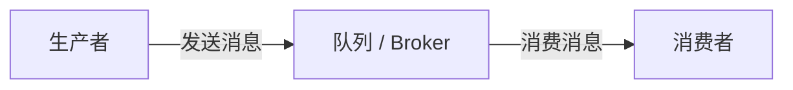
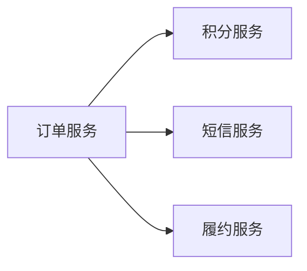
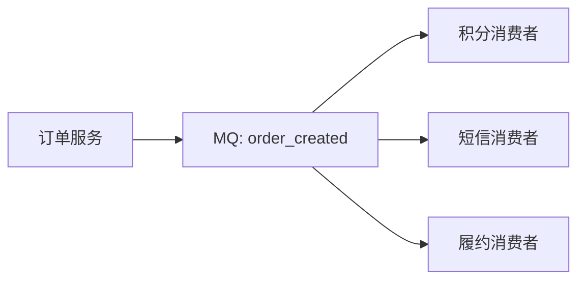
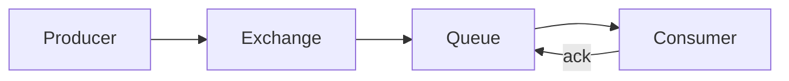
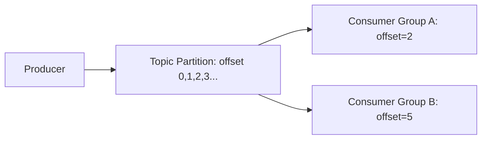
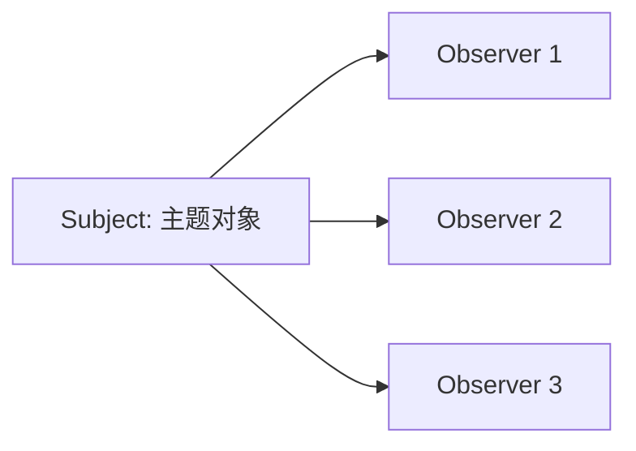
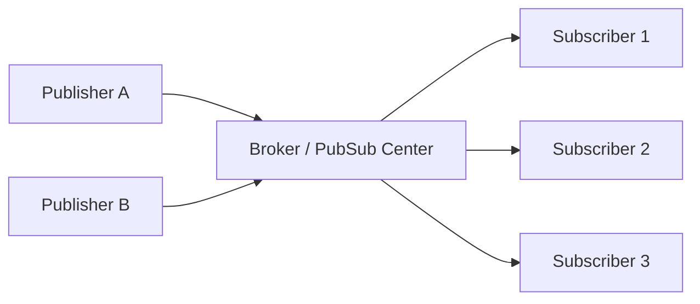

# MQ 核心心智模型：队列、日志、事件与发布订阅

## 这一篇要回答什么

消息队列最简单的图是：

但面试和工程里真正容易混乱的地方，不在这张图，而在三个问题：

1. 这里的“队列”到底是传统 FIFO 队列，还是 Kafka 那种可重放日志？
2. 消息是“命令别人做事”，还是“宣布事实已经发生”？
3. 观察者模式、发布订阅模式、点对点消费、广播消费之间到底是什么关系？

如果这三个问题没分清，后面讲可靠性、顺序、事务、积压都会越讲越糊。

## MQ 的本质：把同步调用变成异步事实传递

没有 MQ 时，上游通常直接调用下游：

这会带来三个问题：

- 上游知道太多下游，代码耦合越来越重。
- 下游慢或挂，会拖累上游主链路。
- 流量洪峰直接打到下游，缺少缓冲层。

引入 MQ 后，上游不再逐个调用下游，而是发布一条消息：

这时订单服务真正说的是：“订单已经创建了，关心这件事的人自己处理后续逻辑。”  
它不是在同步请求别人帮它完成主链路，而是在对外发布一个已经提交的事实。

这也是消息队列最成熟的用法：**把系统从同步编排改成事件驱动协作**。

## 命令消息和事实事件不要混用

工程里常见两类消息。

第一类是命令消息：`send_sms`、`generate_report`、`cancel_order_if_timeout`。它的语义是“请你执行一个动作”。这种消息更像任务队列，重点是任务有没有被执行、失败后怎么重试、重试几次进死信。

第二类是事实事件：`order_created`、`payment_succeeded`、`inventory_reserved`。它的语义是“某个事实已经发生”。这种消息更像事件总线，重点是下游各自订阅、各自维护进度、各自补偿。

两者不是绝对不能混用，但要在设计里讲清楚。一个很常见的坏味道是：上游发一个 `order_created` 事件，却期待某个消费者必须立刻执行成功，否则上游业务就算失败。那它本质上仍是同步依赖，只是把 RPC 换成了 MQ，系统复杂度上去了，边界反而更模糊。

## 队列模型：消费完即移除

RabbitMQ 更接近传统队列模型。消息进入 Queue，消费者处理成功后 ACK，Broker 删除消息；处理失败则重新入队、重试或进入死信队列。

队列模型适合业务任务：

- 每条任务通常只需要被某个消费者处理一次。
- Broker 关心消息的投递状态。
- 失败重试、拒绝、死信、TTL、优先级这类能力更自然。

代价是：Broker 状态更重，可重放历史不天然。消息确认后就删除了，如果下游后来想重新处理一周前的数据，需要额外留档。

## 日志模型：消费进度由消费者保存

Kafka 的心智模型不是“队列”，而是“分布式日志”。消息追加到 Partition，按 offset 排列，消费者自己维护读到哪里。

日志模型适合事件流：

- 同一份数据可以给多个 Consumer Group 独立消费。
- 消费后消息不会立即删除，而是按保留时间或大小清理。
- 下游可以重置 offset 回放历史。
- Broker 不需要维护每条消息的投递状态，吞吐更容易做高。

代价是：单条消息失败重试、死信、精细 ACK 都不如 RabbitMQ / RocketMQ 自然。Kafka 的消费者确认是提交进度条，不是给每张单据盖章。

## 观察者模式和发布订阅模式

观察者模式是一个对象直接维护观察者列表：

Subject 知道观察者列表，发布通知时直接遍历调用。它适合进程内、模块内的对象协作，比如 GUI 事件、缓存刷新监听。

发布订阅模式多了一个中介：

发布者不知道订阅者是谁，订阅者也不直接依赖发布者。MQ、事件总线、Redis Pub/Sub 都是这个方向。它牺牲了一部分直接性，换来跨进程、跨服务、跨团队的解耦。

一句话区分：**观察者模式是对象直接通知对象，发布订阅模式是双方通过 Broker 间接通信**。

## Push 和 Pull

RabbitMQ 常见体验更像 push：Broker 有消息后投递给消费者，消费者 ACK。这样实时性好，任务队列语义强，但 Broker 需要关心消费者的承载能力，否则可能把慢消费者压垮，所以要配 `prefetch` 做流控。

Kafka 采用 pull：消费者按自己的节奏从 broker 拉数据。好处是慢消费者不会拖垮 broker，只是自己的 offset 落后；还可以暂停、seek、回放。缺点是如果没有数据，消费者要轮询等待，所以 Kafka fetch 请求里会有 `fetch.min.bytes`、`fetch.max.wait.ms` 这类参数来平衡空轮询和延迟。

这也是 Kafka 和传统业务 MQ 的一个根本差异：Kafka 更像“消费者自己翻日志”，RabbitMQ 更像“Broker 给消费者派单”。

## 这一篇要带走的结论

- MQ 不是单纯的“排队工具”，它改变的是服务之间的协作方式和一致性语义。
- 命令消息关注任务执行，事实事件关注事实传播，设计时要先分清语义。
- RabbitMQ 更偏队列模型，Kafka 更偏日志模型，RocketMQ 介于两者之间并强化业务消息能力。
- 观察者模式是直接通知，发布订阅模式通过 Broker 解耦。
- Push 适合任务投递，Pull 适合按消费者进度消费日志；没有绝对优劣，只有场景匹配。

