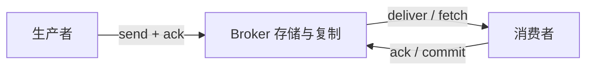
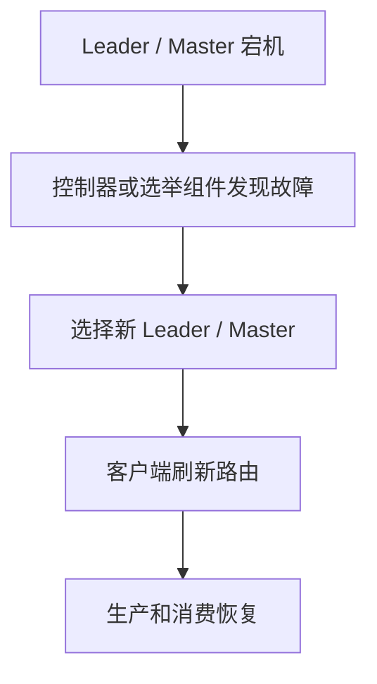

# 可靠性：生产者、Broker、消费者三段如何不丢消息

## 这一篇要回答什么

“消息丢了怎么办”不能只回答“开启 ACK 和持久化”。一条消息从业务代码发出到真正被消费，至少经过三段：

任何一段都可能丢：

- 生产者以为发出去了，其实还在本地缓冲。
- Broker 收到了，但还没持久化或没复制到副本。
- 消费者拿到了，但业务还没处理完就提交了确认。

所以可靠性要按链路拆，而不是按组件背配置。

## 第一段：生产者不能“盲发”

生产者侧最怕的是：业务代码调用了发送方法，就把这件事当成成功。

不同 MQ 的 API 不一样，但可靠发送的原则一样：

1. 发送后必须拿到 Broker 的确认。
2. 发送失败或超时时要有重试。
3. 重试要能接受重复投递。
4. 进程退出前要 flush / close，避免本地缓冲丢失。

Kafka Producer 的 `send()` 是异步的，消息先进入 Accumulator，本地批量聚合后由 Sender 线程发送。`send()` 返回不代表消息已经落到 Broker，真正成功要看 callback 或 `Future.get()`。

RabbitMQ 生产者通常使用 Publisher Confirm。消息被 Broker 接收后返回 confirm；如果 exchange 不存在、路由失败或连接异常，生产者要能感知并补偿。

RocketMQ 生产者有同步发送、异步发送、单向发送。可靠业务一般不用单向发送，因为单向发送没有服务端确认，只适合日志、监控这类允许少量丢失的场景。

这里还有一个常见误区：**生产者重试会带来重复消息**。例如 Broker 已经写入成功，但 ACK 在网络上丢了，生产者以为失败又发一次。可靠性和去重天然是一对矛盾，不能只要“不丢”却不处理“重复”。

## 第二段：Broker 不能只靠内存

Broker 收到消息后，可靠性来自三类能力：持久化、复制、故障转移。

### 持久化

RabbitMQ 里队列要 durable，消息要 persistent，二者缺一不可。只把队列声明为持久化，消息本身不持久化，Broker 重启后消息仍可能丢。

Kafka 写入的是 PageCache，默认不每条消息 fsync，而是依赖多副本和 ISR。这个点在 `Kafka/04_存储引擎深挖：顺序写、Segment、Index、PageCache与零拷贝.md` 里已经展开过，这里只记结论：Kafka 的高吞吐不是靠每条消息强刷盘，而是靠“顺序写 + PageCache + 副本复制”。

RocketMQ 可以配置同步刷盘或异步刷盘。同步刷盘可靠性更强，延迟更高；异步刷盘吞吐更高，机器掉电时可能丢 PageCache 中尚未落盘的数据。

### 复制

单机持久化解决不了机器损坏。企业级 MQ 都要复制：

- Kafka：Partition 副本，Leader / Follower，ISR，`acks=all`。
- RocketMQ：主从复制，或 DLedger 这类基于 Raft 的复制。
- RabbitMQ：Quorum Queue / 镜像队列，通过多节点复制避免单点。

复制要区分同步复制和异步复制。异步复制吞吐好，但主节点 ACK 后还没复制给从节点就宕机，可能丢已确认消息。同步复制更稳，但延迟上升，可用性也会受副本健康度影响。

### 故障转移

Broker 高可用不是“有副本”就完事，还要能选主、切路由：

Kafka 依赖 Controller（ZooKeeper 时代或 KRaft 时代）做 Partition Leader 选举；RocketMQ 通过 NameServer 让客户端感知 Broker 路由变化；RabbitMQ 集群中 Queue Leader 迁移后，客户端连接和消费也要恢复。

可靠系统里，客户端必须能处理“正在切主”的错误：重试、刷新元数据、退避，而不是把第一次失败直接当业务失败。

## 第三段：消费者必须“处理成功后再确认”

消费者侧最常见的丢消息原因是确认时机错了。

错误姿势：

1. 消费者拉到消息。
2. 立刻 ACK / commit offset。
3. 开始执行业务。
4. 业务执行到一半进程崩溃。

这时 Broker 以为消息已经处理完成，不再投递；业务实际上没做完，消息就丢了。

正确姿势：

1. 消费者拉到消息。
2. 执行业务逻辑。
3. 业务状态落库成功。
4. 再 ACK / commit offset。

RabbitMQ 和 RocketMQ 的消费者确认更像“签收单据”：处理成功返回 ACK / `CONSUME_SUCCESS`；失败则拒绝、重试或进入死信。

Kafka 的消费者确认是“提交进度条”：提交的是某个 Partition 上的 offset。它没有天然的单条失败重试语义，因此批量消费时要格外小心：如果 offset 100~199 中 offset 150 失败了，你直接提交 200，就等于跳过了 150；如果不提交，重启后 100~199 都会重放。

## 三种投递语义

### At-most-once：最多一次

先提交确认，再处理业务。优点是不重复，缺点是可能丢。适合少量丢失能接受的日志、指标。

### At-least-once：至少一次

先处理业务，再提交确认。优点是不丢，缺点是可能重复。绝大多数业务 MQ 默认都落在这个语义，所以消费端幂等是必修课。

### Exactly-once：精确一次

这四个字最容易误导。Kafka 的 EOS 主要覆盖 Kafka 内部的生产、事务、消费-生产闭环；一旦写 MySQL、Redis、HTTP 外部系统，就需要外部系统配合幂等键、事务表、唯一约束。不要把 MQ 的 exactly-once 理解成“整个分布式业务只执行一次”。

## 可靠性配置的底线

Kafka 常见可靠组合：

- `replication.factor=3`
- `min.insync.replicas=2`
- Producer `acks=all`
- `enable.idempotence=true`
- 禁止 unclean leader election
- 消费端手动提交 offset，处理成功后再提交

RabbitMQ 常见可靠组合：

- durable exchange / queue
- persistent message
- Publisher Confirm
- Consumer manual ack
- Quorum Queue 或合理的高可用队列
- 死信队列兜底失败消息

RocketMQ 常见可靠组合：

- 同步发送或可靠异步发送
- 根据业务选择同步刷盘 / 同步复制
- 消费失败返回重试状态
- 超过重试次数进入 DLQ
- 关键链路用事务消息或 Outbox

## 这一篇要带走的结论

- 消息可靠性要按生产者、Broker、消费者三段逐段分析。
- 生产者确认解决“有没有送到 Broker”，但重试会带来重复。
- Broker 可靠性来自持久化、复制、故障转移三件事。
- 消费者必须处理成功后再确认，否则最容易在消费端丢消息。
- 工程上默认追求 at-least-once，再通过幂等把重复的副作用压住。

