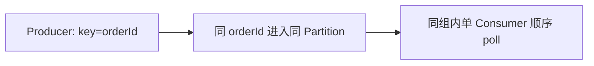

# 重复消费、幂等、顺序与积压治理

## 这一篇要回答什么

MQ 生产环境里最常见的四类问题是：消息丢失、重复消费、消息乱序、消息积压。上一章已经拆了丢失，这一章集中处理另外三件。

它们不是孤立的：

- 为了不丢消息，系统会重试，于是重复消费变多。
- 为了提高吞吐，系统会多分区、多消费者，于是顺序变难。
- 为了保证顺序，系统会减少并发，于是更容易积压。

所以 MQ 的难点不是“知道每个问题的答案”，而是能看出这些答案之间的 trade-off。

## 为什么重复消费不可避免

一个典型场景：

1. 消费者拿到消息。
2. 业务写库成功。
3. 消费者准备 ACK / commit offset。
4. 进程宕机或网络断开。
5. Broker 没收到确认，稍后重新投递。

这条消息会被再次消费。站在 Broker 视角，它不知道消费者第 2 步已经写库成功；为了不丢，只能重投。

生产端也类似：Broker 写入成功，但 ACK 丢了，生产者重试，Broker 可能收到两份语义相同的消息。

所以很多 MQ 的现实语义是：**基础设施尽力保证至少一次，业务系统负责幂等**。

## 幂等的核心：同一业务动作只能产生一次有效副作用

幂等不是“不执行第二次代码”，而是“执行多次后最终状态和执行一次一样”。

常见方案有五类。

### 1. 唯一约束

适合创建类操作。例如订单支付成功事件里带 `payment_id`，消费者往 `payment_record` 表插入时对 `payment_id` 建唯一索引。重复消息再次插入会冲突，业务捕获后直接认为已处理。

这种方案简单、可靠，最适合“有天然业务唯一键”的场景。

### 2. 去重表

专门建一张 `mq_consume_log`：

| 字段 | 说明 |
|---|---|
| message_id | 消息 ID 或业务幂等键 |
| consumer_group | 消费组 |
| status | processing / success / failed |
| created_at / updated_at | 排查与清理 |

消费者在同一个本地事务里完成“插入去重记录 + 执行业务更新”。如果插入发现唯一键冲突，就说明已经处理过。

这比 Redis set 更可靠，因为去重记录和业务数据在同一个数据库事务里，崩溃恢复时不会出现“Redis 标记成功，但数据库没写成功”的缝隙。

### 3. 状态机流转

适合订单、工单、支付这类有明确状态的业务。比如订单状态只能：

```text
CREATED -> PAID -> SHIPPED -> FINISHED
```

消费者处理 `payment_succeeded` 时执行：

```sql
update orders
set status = 'PAID'
where order_id = ?
  and status = 'CREATED';
```

如果重复消息再次执行，`status` 已经不是 `CREATED`，更新行数为 0，可以安全忽略。

### 4. 乐观锁版本号

适合余额、库存这类并发更新。消息中带版本号或期望状态，更新时校验 `version`：

```sql
update inventory
set stock = stock - 1,
    version = version + 1
where sku_id = ?
  and version = ?;
```

重复或乱序消息无法通过版本校验。

### 5. 业务流水

支付、转账、积分这类业务，不建议只更新余额字段，而应该写流水表。流水号唯一，余额由流水驱动变化。重复消息最多重复尝试写同一笔流水，不会重复扣钱。

## 顺序消息：先承认只能局部有序

全局有序和高吞吐天然冲突。如果一个 Topic 只用一个队列 / Partition，当然全局有序，但并发能力也被压成 1。

工程里更常见的是局部有序：

- 同一个订单的状态消息有序。
- 同一个用户的积分变更有序。
- 同一个商品的库存事件有序。

Kafka 的做法是：同 key 消息路由到同一个 Partition；同一个 Consumer Group 内，一个 Partition 同时只分配给一个 Consumer。



RocketMQ 的做法类似：把需要顺序消费的一组消息发到同一个 MessageQueue，消费端对队列加锁，保证同一队列不会被多个消费者同时消费。

RabbitMQ 如果要强顺序，通常要控制单队列、单消费者、合理 prefetch；一旦多消费者并发处理，同一队列里的处理完成顺序也可能变化。

## 顺序被打乱的常见位置

1. 生产者没按业务 key 路由，同一订单消息进了不同分区。
2. Producer 开启重试但没有幂等，后发请求先成功，先发请求重试后才成功。
3. 消费者对同一分区消息做多线程并发处理。
4. 失败消息单独重试，后续消息已经处理完成，旧消息稍后才回来。
5. 下游数据库更新没有状态机约束，乱序消息覆盖了新状态。

所以顺序不是 MQ 单方面保证的，而是“生产路由 + Broker 分区 / 队列 + 消费模型 + 业务状态机”共同保证的。

## 消息积压：先定位是流量突增还是消费变慢

消息积压的直接原因永远是：生产速度 > 消费速度。  
但排查时要先分两类：

### 1. 生产流量真的暴涨

比如大促、秒杀、日志采集洪峰。这时 MQ 起到缓冲作用，积压本身不一定是故障。关键看：

- 积压是否在可接受时间内被消费完。
- 下游是否有明确的消费能力上限。
- 用户是否能接受排队窗口。

### 2. 消费端变慢或失败

更常见的问题是消费者自身慢了：

- 下游 RPC 超时。
- MySQL 慢查询、锁等待、死锁。
- 单条消息业务逻辑太重。
- 线程池满、连接池满。
- 消费者 GC 或频繁重启。
- 反序列化异常导致反复重试同一批消息。

这种情况下盲目加消费者不一定有效，因为瓶颈可能在数据库或第三方服务。

## 积压治理的层级

第一层：修 bug。  
如果消费代码抛异常、一直重试，先修复异常，不要用扩容掩盖逻辑错误。

第二层：提升单机消费效率。  
批量拉取、批量写库、减少同步 RPC、异步并发调用、优化 SQL、扩大连接池，但要避免把下游打崩。

第三层：水平扩容。  
Kafka 里消费者数量不要超过 Partition 数；RocketMQ 里消费者数量不要超过 MessageQueue 数。超过以后，多出来的消费者拿不到队列，只是在空转。

第四层：扩分区 / 扩队列。  
Kafka 增加 Partition 后可以提升后续并发，但历史积压数据仍在原 Partition 里，不能神奇平摊。RocketMQ 可以增加队列，但也要考虑已有消息是否能迁移。

第五层：临时旁路加速。  
海量积压时可以建一个临时 Topic，分区 / 队列数设置为原来的数倍。写一个轻量搬运消费者，从老 Topic 全速拉消息，不做重业务，只重新分发到临时 Topic；再用更多消费者处理临时 Topic。清完积压后恢复原架构。

第六层：业务止血。  
如果积压的是非关键日志、埋点、通知，业务允许丢弃，可以重置 offset 到最新位置或丢弃过期消息。这个动作必须有业务确认和审计记录。

## 这一篇要带走的结论

- 至少一次投递必然带来重复消费，幂等是消费端基本功。
- 幂等优先用业务唯一键、唯一约束、状态机和本地事务，不要只靠易失缓存。
- 顺序只能在局部范围内保证，通常是同 key、同 Partition / Queue。
- 积压不是只靠“加机器”解决，队列 / 分区数量才决定同组消费并发上限。
- 顺序、吞吐、可靠性三者经常互相牵制，真正成熟的回答要讲 trade-off。

