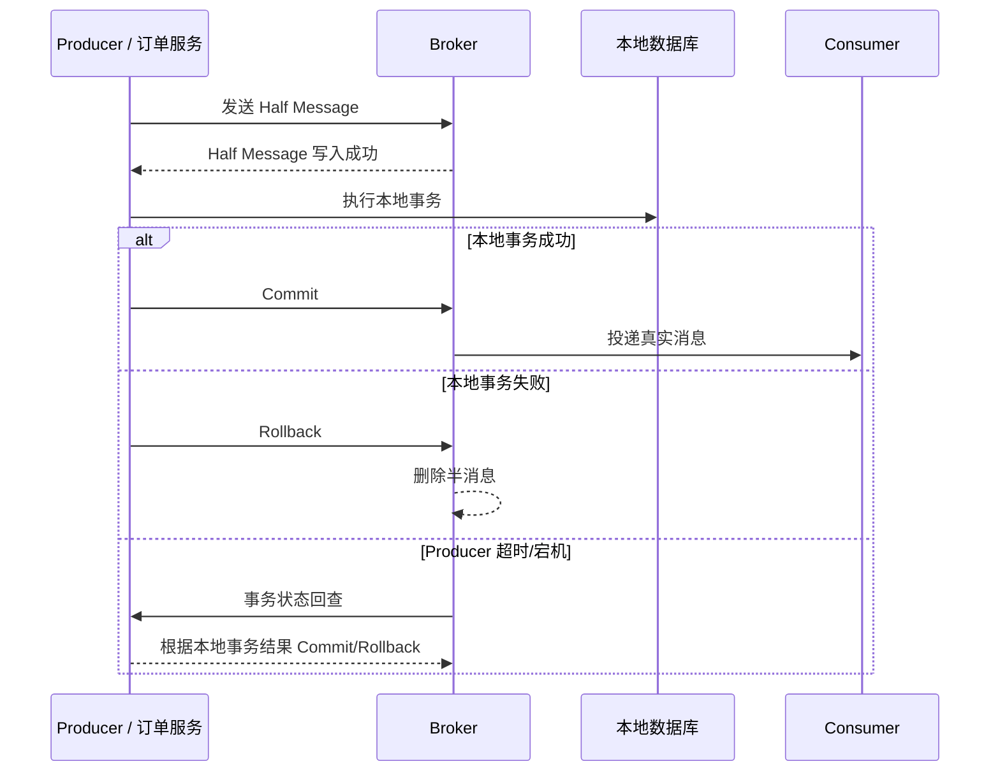
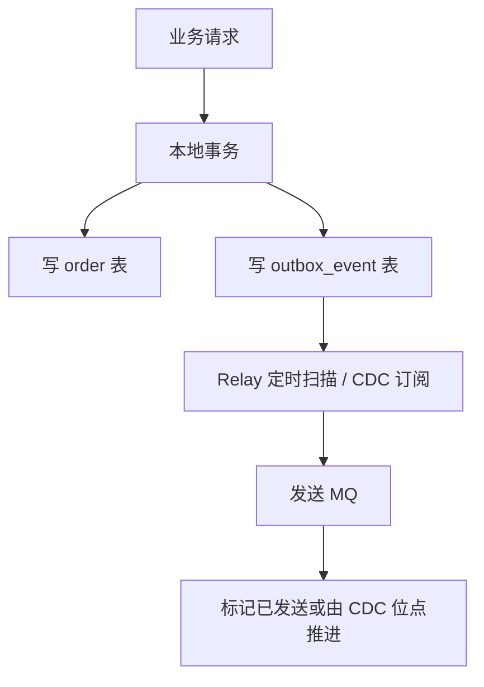
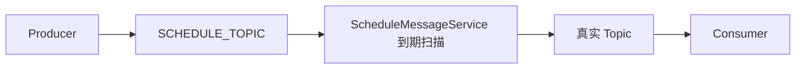
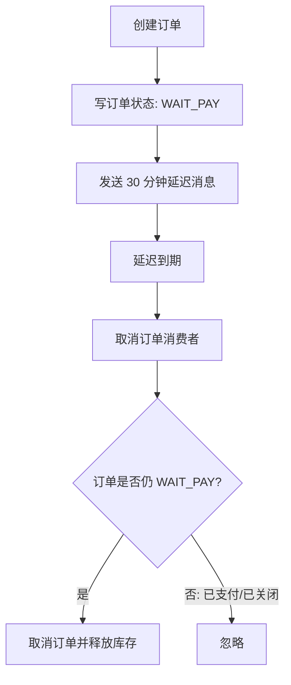

# 事务消息、Outbox、延迟消息与死信队列

## 这一篇要回答什么

MQ 的高级能力通常围绕两个问题展开：

1. **一致性**：本地事务成功了，消息一定能发出去吗？消息发出去了，本地事务会不会回滚？
2. **时间与失败治理**：消息不是现在消费，而是 30 分钟后消费；消息多次失败后，不能一直堵在主队列里。

事务消息、Outbox、延迟队列、死信队列都是在解决这些问题。

## 普通消息的双写缝隙

最典型的代码是：

```text
1. 写订单数据库成功
2. 发送 order_created 消息
```

中间有两个缝：

- 数据库提交成功，但发送 MQ 失败：下游永远不知道订单创建了。
- MQ 发送成功，但数据库事务回滚：下游收到了一个不存在的订单事件。

这个问题不是 MQ 本身坏，而是你在做两个资源的双写：数据库和 MQ。只要不是一个原子事务，就一定有缝。

## RocketMQ 事务消息：半消息 + 本地事务 + 回查

RocketMQ 的事务消息是面试里最高频的方案之一。它的流程可以画成：



半消息的关键是：Broker 已经收到消息，但先不投递给消费者。只有 Producer 告诉 Broker 本地事务成功，消息才变成可投递。

它解决的是“本地事务和消息发送之间的原子性近似问题”。如果 Producer 执行本地事务后没来得及告诉 Broker，Broker 会回查 Producer，Producer 根据本地事务表判断最终提交还是回滚。

但要注意：事务消息不保证消费者业务一定成功。消费者处理失败后仍然要靠重试、死信、人工补偿、对账来兜底。它保证的是上游本地事务和消息可见性的最终一致，不是整个跨服务业务的强一致。

## Outbox Pattern：更通用、更朴素

Outbox 的思路是：把“业务数据”和“待发送消息”写进同一个本地数据库事务。



它的优点：

- 不依赖特定 MQ 的事务消息能力。
- 数据库事务能保证业务记录和事件记录同时存在。
- Relay 失败可以重试，消息不会凭空消失。
- 配合 CDC 可以减少定时扫描压力。

代价：

- 多一张 outbox 表或 CDC 链路。
- 会出现重复发送，因此消费者仍然要幂等。
- Relay 要处理发送中、已发送、失败重试、告警等状态。

如果团队要做跨 MQ、跨语言、强业务审计的可靠事件发布，Outbox 往往比绑定某个 MQ 的事务消息更稳。

## 延迟消息：让消息在未来某个时间点可见

典型场景：

- 订单 30 分钟未支付自动取消。
- 优惠券到期前 1 天提醒。
- 失败任务 5 分钟后重试。
- 定时解锁资源。

延迟消息的本质是：**消息已经被系统接收，但暂时不进入真实消费队列，到点后再投递**。

### RocketMQ 延迟消息

RocketMQ 的经典实现是延迟等级。Broker 收到延迟消息后，不直接写入真实 Topic 的 ConsumeQueue，而是写到内部延迟 Topic。`ScheduleMessageService` 按延迟等级扫描，到期后再把消息投递回原 Topic。



早期 RocketMQ 延迟等级固定，比如 1s、5s、10s、30s、1m、2m 等；新版能力有所增强，但核心思想仍是“先存到延迟区域，到期再转发”。

### Kafka 延迟消息

Kafka 原生不是延迟队列。常见做法是额外加调度层：

- 延迟消息写入 `delay_topic`，消息里带 `deliver_at`。
- 调度服务按时间扫描或使用时间轮。
- 到期后再写入真实业务 Topic。

这样做的关键难点在调度服务，而不在 Kafka：怎么避免扫描全量、怎么分片、怎么保证调度服务高可用、怎么处理重复转发。

### RabbitMQ 延迟消息

RabbitMQ 常见两种方案：

1. TTL + 死信交换机：消息先进入带 TTL 的队列，过期后变成死信，被 DLX 路由到真实业务队列。
2. `x-delayed-message` 插件：消息先到延迟交换机，到点后再路由。

TTL + DLX 的方案很经典，但要注意队头阻塞问题：如果同一个队列里第一条消息 TTL 很长，后面的短 TTL 消息可能无法按预期提前死信。因此复杂延迟场景更适合插件、分级队列或独立调度服务。

## 死信队列：失败消息的隔离区

死信不是“垃圾消息”，而是“主流程无法继续处理，需要隔离治理的消息”。

RabbitMQ 中消息成为死信的常见原因：

- 消费者 reject / nack，并且不重新入队。
- 消息 TTL 过期。
- 队列达到最大长度，旧消息被挤出。

RocketMQ 中消费失败超过最大重试次数后，会进入 DLQ。Kafka 没有统一内置 DLQ 语义，通常由消费者捕获失败后主动写入 `xxx.DLQ` Topic。

死信队列的价值在于：

- 不让毒丸消息一直阻塞主队列。
- 给排查保留现场：原始 payload、异常原因、重试次数、消费组、时间。
- 支持人工修复后重新投递。

## 订单超时取消：延迟 + 幂等 + 状态机

订单 30 分钟未支付自动取消可以这样做：



这里最重要的是状态机。延迟消息可能重复、可能晚到、可能在用户刚支付后到达。消费者不能无条件取消订单，必须用条件更新：

```sql
update orders
set status = 'CANCELLED'
where order_id = ?
  and status = 'WAIT_PAY';
```

更新成功才释放库存；更新失败说明订单状态已经变化，直接忽略。  
这就是 MQ 场景下最常见的正确性手法：**消息驱动动作，数据库状态决定动作是否生效**。

## 这一篇要带走的结论

- 事务消息解决的是“本地事务结果和消息是否可见”的最终一致，不是全链路强一致。
- RocketMQ 半消息通过 Commit / Rollback / 回查补上 Producer 宕机的缝。
- Outbox 用本地事务写业务数据和事件记录，通用性更强，但消费者仍需幂等。
- 延迟消息的本质是“到点再投递”，Kafka 通常要外部调度，RabbitMQ 常用 TTL + DLX 或插件，RocketMQ 原生支持更强。
- 死信队列不是失败终点，而是失败治理入口。

