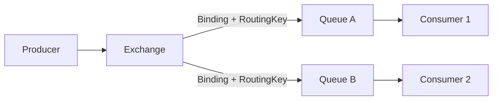

# Kafka / RocketMQ / RabbitMQ 选型与架构对比

## 这一篇要回答什么

MQ 选型不能用“哪个性能最好”这种问题来做。更稳的方式是先问主矛盾：

- 是海量日志流、可重放、多下游消费？
- 是电商业务消息、事务消息、延迟消息、顺序消费？
- 是复杂路由、任务投递、死信、TTL、协议兼容？

Kafka、RocketMQ、RabbitMQ 都能收发消息，但它们的内核完全不一样。

## 一句话定位

| MQ | 更像什么 | 最擅长 |
|---|---|---|
| Kafka | 分布式提交日志 | 高吞吐事件流、日志总线、可重放、多 Consumer Group |
| RocketMQ | 业务消息中间件 | 电商业务消息、事务消息、延迟消息、顺序消息、海量 Topic |
| RabbitMQ | AMQP 消息路由器 | Exchange 路由、任务队列、TTL、死信、灵活投递确认 |

## Kafka：少量大流量 Topic 的分布式日志

Kafka 的核心模型是 Topic -> Partition -> Segment。每个 Partition 是一个 append-only 日志，消费者按 offset 拉取。

它的优势：

- 吞吐高，适合日志、埋点、CDC、流计算入口。
- 消息可按保留时间留存，天然支持回放。
- 多个 Consumer Group 可以独立消费同一份数据。
- PageCache、顺序写、Batch、Compression、sendfile 组合带来高性能。
- 分区副本、ISR、KRaft Controller 支撑高可用。

它的短板：

- 不擅长几万级小 Topic / 小 Partition 滥用。
- 单条消息级别的失败重试、死信、延迟消息不如业务 MQ 自然。
- 消费端是 offset commit，批量失败处理需要业务自己设计。
- Exactly-once 主要覆盖 Kafka 内部边界，写外部系统仍需幂等。

适合场景：

- 用户行为日志。
- 订单、支付、库存事件流。
- CDC 数据同步。
- Flink / Spark Streaming / Kafka Streams。
- 多个下游需要各自从同一份历史数据重放。

## RocketMQ：电商业务消息的综合体

RocketMQ 借鉴了 Kafka 的日志思想，但为了业务消息补了很多能力：事务消息、延迟消息、Tag 过滤、顺序消息、重试和 DLQ。

它的优势：

- Java 技术栈友好。
- 原生事务消息，半消息 + 回查是高频业务刚需。
- 延迟消息能力比 Kafka 原生强。
- 消费失败重试和死信机制更贴近业务开发。
- CommitLog + ConsumeQueue 对海量 Topic 更友好。

它的短板：

- 国际生态和数据流生态不如 Kafka。
- 极致日志吞吐和流处理生态通常不是它的主战场。
- 运维和排障要理解 CommitLog、ConsumeQueue、NameServer、Broker 主从 / DLedger 等体系。

适合场景：

- 订单、交易、支付、库存等业务消息。
- 需要事务消息和延迟消息。
- 大量业务 Topic。
- Java 后端团队为主，业务可靠性优先。

## RabbitMQ：Exchange 驱动的灵活路由系统

RabbitMQ 是 AMQP 的经典实现。AMQP 定义了 Exchange、Queue、Binding、Routing Key 这些抽象，RabbitMQ 把它落地成一个灵活的消息路由器。

核心组件：

- Producer：发送消息。
- Exchange：接收消息并按规则路由。
- Queue：真正存储消息。
- Binding：把 Exchange 和 Queue 绑定起来。
- Routing Key：路由匹配依据。
- Connection：TCP 连接。
- Channel：连接上的轻量逻辑通道，避免大量 TCP 连接开销。
- vHost：逻辑隔离空间，适合多业务隔离。

常见 Exchange：

- Direct：routing key 精确匹配。
- Fanout：广播到所有绑定队列。
- Topic：通配符匹配，`*` 匹配一个词，`#` 匹配多个词。
- Headers：按消息头匹配，较少使用。

优势：

- 路由模型极其灵活。
- ACK、reject、nack、prefetch、TTL、DLX 等业务队列能力成熟。
- 适合任务队列和复杂投递。
- 协议生态丰富，管理界面好用。

短板：

- 不适合 Kafka 那种超高吞吐日志流。
- 历史回放不是天然能力。
- 大规模队列、镜像、跨节点复制需要谨慎设计。

适合场景：

- 微服务之间任务投递。
- 复杂 routing key 分发。
- 延迟 / 死信 / TTL 组合。
- 业务量中等但可靠投递语义要求清晰。

## Broker 存储模型对比

### Kafka：每个 Partition 独立日志

Kafka 每个 Partition 一组独立 Segment 文件。少量大流量 Topic 时，这个模型非常干净，读写路径短，PageCache 和 sendfile 能发挥极致。

代价是：Topic / Partition 数量过多时，活跃文件太多，元数据、文件句柄、副本同步、Controller 负担都会上升。

### RocketMQ：CommitLog + ConsumeQueue

RocketMQ 把所有消息顺序写入统一 CommitLog，再为不同 Topic / Queue 构建轻量 ConsumeQueue 索引。消费者先读 ConsumeQueue，再回 CommitLog 取真实消息。

这个模型的好处是：即便 Topic 很多，写入仍然集中在 CommitLog 顺序追加上。代价是读路径多了一层索引，存储结构也更复杂。

### RabbitMQ：Queue 为中心

RabbitMQ 的中心是 Queue，消息路由到 Queue 后，由消费者 ACK 驱动删除或重入队。它更关注消息投递状态，而不是长时间保存可回放日志。

## 消息确认机制对比

生产者侧：

- Kafka：`acks=0/1/all`，配合 ISR 和 `min.insync.replicas`。
- RocketMQ：发送结果 + 刷盘 / 复制策略，业务上可选同步发送。
- RabbitMQ：Publisher Confirm，确认消息到达 Broker。

消费者侧：

- Kafka：提交 offset，是“进度条模式”。
- RocketMQ：返回消费状态，失败自动重试，超过次数进 DLQ。
- RabbitMQ：manual ack / reject / nack，是“单据签收模式”。

这个差异非常关键：Kafka 强调批量和吞吐，消费者失败语义由业务补；RocketMQ / RabbitMQ 更关注单条或小批消息的投递处理闭环。

## 选型建议

| 场景 | 推荐倾向 | 原因 |
|---|---|---|
| 用户行为日志、埋点、CDC、流计算 | Kafka | 高吞吐、可重放、生态强 |
| 订单、支付、库存等业务事件 | RocketMQ / Kafka | Java 业务可靠性优先可选 RocketMQ；数据流生态优先可选 Kafka |
| 强依赖事务消息、延迟消息 | RocketMQ | 原生能力更贴近业务 |
| 复杂路由、任务队列、TTL、死信 | RabbitMQ | Exchange / Queue / Binding 模型自然 |
| 多个下游各自重放历史 | Kafka | Consumer Group + offset 天然支持 |
| 海量小 Topic、多租户消息平台 | RocketMQ / Pulsar | Kafka 对超多 Partition 要谨慎 |

## 这一篇要带走的结论

- Kafka、RocketMQ、RabbitMQ 不是简单性能排名，而是三套不同消息哲学。
- Kafka 是日志系统，核心价值是高吞吐、可重放、多下游。
- RocketMQ 是业务消息系统，核心价值是事务、延迟、重试、海量 Topic。
- RabbitMQ 是消息路由系统，核心价值是 AMQP 路由、ACK、TTL、DLX。
- 选型时先找主矛盾，再看团队语言栈、生态、运维能力和失败治理要求。

