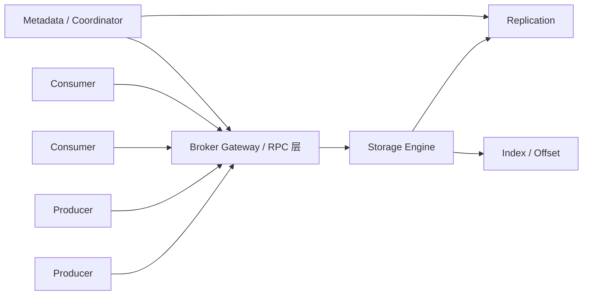
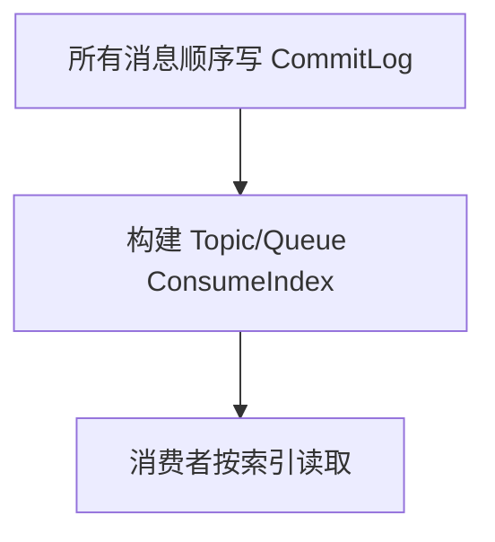

# 设计一个消息队列：从 RPC、存储、消费关系到高可用扩展

## 这一篇要回答什么

面试问“如果让你设计一个 MQ，你会怎么设计”，不是要求你现场写 Kafka，而是看你能不能把一个中间件拆成几个核心子问题：

1. 消息怎么发进来、怎么拉出去：RPC / 协议层。
2. 消息怎么存：内存、文件、数据库、日志。
3. 消费关系怎么维护：点对点、发布订阅、广播、消费组。
4. 怎么保证不丢、不重复、尽量有序。
5. Broker 挂了怎么办。
6. 积压和扩容怎么办。

下面给一套比较完整的回答框架。

## 总体架构



最小可用版本可以只有一个 Broker、一份磁盘日志、一个 Producer API、一个 Consumer API。生产级版本必须继续补：副本、选主、元数据、消费位点、限流、监控、DLQ、扩容。

## 第一层：RPC 和协议

Producer 到 Broker 至少需要：

- `SendMessage(topic, key, payload, headers)`
- `SendBatch(topic, records)`
- 返回消息 ID、offset 或错误码
- 支持超时、重试、幂等发送

Consumer 到 Broker 至少需要：

- `Fetch(topic, partition/queue, offset, maxBytes)`
- `Ack(messageId)` 或 `CommitOffset(group, partition, offset)`
- `Subscribe(topic, group)`
- `Heartbeat(group, consumerId)`

协议层要考虑：

- 序列化：JSON 易调试，Protobuf / 自定义二进制更高效。
- 长连接：避免每条消息建连接。
- 批量：生产和消费都必须支持 batch，否则吞吐起不来。
- 压缩：减少网络和磁盘体积。
- 背压：Broker 繁忙时要拒绝或限速，而不是无限吃内存。

## 第二层：存储引擎

不要把消息直接存在数据库里作为高吞吐 MQ 的主路径。数据库适合事务和查询，不适合每秒几十万 append + 顺序拉取。

更合理的是日志文件：

```text
topicA-0/
  00000000000000000000.log
  00000000000000000000.index
  00000000000000100000.log
  00000000000000100000.index
```

写入只做 append，读取按 offset 顺序读。Segment 切分解决文件过大、清理、索引加载问题。索引用稀疏索引即可，不需要每条消息都索引。

如果要支持 RocketMQ 风格的海量 Topic，可以用统一 CommitLog + 轻量消费索引：



两种路线各有取舍：

- 独立 Partition 日志：模型简单，适合少量大流量 Topic。
- 统一 CommitLog：写路径更集中，适合大量 Topic，但索引和清理更复杂。

## 第三层：消费模型

至少要支持两种语义。

点对点：同一个消费组内，一条消息只被一个消费者处理。适合任务分发。

发布订阅：不同消费组彼此独立，同一条消息可以被多个下游各自消费。适合事件分发。

Kafka 用 Consumer Group 统一了这两种：

- 同组内竞争消费。
- 不同组独立消费。

如果走 RabbitMQ 路线，则可以用 Exchange + Queue + Binding：

- Direct 做精确路由。
- Fanout 做广播。
- Topic 做通配符路由。

这两套模型本质不同。日志型 MQ 把“多个订阅者”做成多个 offset；路由型 MQ 把“多个订阅者”做成多个 Queue。

## 第四层：可靠性

可靠性不能只说“持久化”，要覆盖端到端。

生产者：

- 同步 / 异步发送都要有确认。
- 超时重试。
- 幂等发送，避免重试写出重复消息。
- 本地事务和消息一致性用 Outbox 或事务消息。

Broker：

- 消息持久化到日志。
- 副本复制。
- 写入成功的标准可配置：只写主、写主并复制到多数、强刷盘。
- 宕机恢复时根据日志和索引重建状态。

消费者：

- 处理成功后再 ack / commit。
- 失败重试。
- 超过次数进入 DLQ。
- 业务幂等，防止至少一次投递带来重复副作用。

## 第五层：顺序性

全局有序最简单：单队列、单消费者。  
但这几乎没有扩展性。

生产级系统通常只保证局部有序：

- 按业务 key 路由到同一个分区 / 队列。
- 同一分区 / 队列同一时刻只给一个消费者处理。
- 消费者内部不要对同一 key 并发乱跑。
- 下游数据库用状态机防止乱序覆盖。

这就是为什么 Kafka 说 Partition 是顺序单元，RocketMQ 说 MessageQueue 是顺序单元。

## 第六层：高可用

单 Broker 一定不够。高可用要回答三件事：

1. 数据有没有副本？
2. 主挂了谁接管？
3. 客户端怎么知道新主是谁？

可选方案：

- Leader / Follower 副本，类似 Kafka。
- Master / Slave，类似传统 RocketMQ。
- Raft 多数派复制，类似 DLedger / KRaft 的思路。

生产者写 Leader，Follower 拉取或接收复制。Leader 挂后，元数据组件选出新 Leader，客户端刷新路由继续写。

如果允许异步复制，吞吐高但可能丢已 ACK 消息。  
如果要求多数派确认，可靠性强但延迟更高、少数副本故障时可能拒写。  
这就是 MQ 高可用设计的核心权衡。

## 第七层：扩展性和积压治理

扩展性来自分片：

- Topic 拆成多个 Partition / Queue。
- 不同分片分布到不同 Broker。
- 同组消费者按分片并行消费。

扩容要考虑：

- 新增分区后，老数据是否迁移。
- 分区迁移期间如何限速，避免打爆磁盘和网络。
- Consumer Rebalance 期间是否停止消费。
- 分区数量过多带来的元数据和文件句柄压力。

积压时要能观测：

- 每个 Topic / Partition / Consumer Group 的 lag。
- 消费速率、生产速率。
- 消费失败率、重试次数、DLQ 数量。
- Broker 磁盘、网络、请求队列、复制延迟。

没有这些指标，所谓“处理积压”就是盲人摸象。

## 第八层：运维和治理能力

一个真正可用的 MQ 还需要：

- 控制台：查看 Topic、队列、消费组、lag、DLQ。
- 权限：哪些应用能发哪些 Topic，能消费哪些 Topic。
- 配额：防止单业务打爆集群。
- 消息查询：按 messageId、key、时间定位消息。
- 消息轨迹：生产、存储、投递、消费各阶段耗时。
- Schema 管理：避免上下游消息格式不兼容。
- 多租户隔离：不同业务不要互相影响。

这些不是锦上添花。大规模 MQ 平台里，治理能力往往比收发消息本身更难。

## 面试回答模板

可以这样组织：

1. 先给出整体链路：Producer -> Broker -> Consumer。
2. 协议层支持长连接、批量、压缩、确认、重试。
3. 存储层用 append-only log + segment + index，或 CommitLog + ConsumeQueue。
4. 消费层支持消费组，维护 offset 或 ack 状态。
5. 可靠性按生产者、Broker、消费者三段保证。
6. 顺序只承诺局部有序，用 key 路由到同一分片。
7. 高可用用副本、选主、路由刷新。
8. 扩展性靠分区 / 队列水平扩展，积压靠监控、扩容、临时 Topic、DLQ 兜底。

## 这一篇要带走的结论

- 设计 MQ 本质是在设计一套“高吞吐日志存储 + 消费状态管理 + 可靠投递协议”。
- 存储模型决定吞吐和 Topic 扩展边界。
- 消费模型决定点对点、发布订阅、广播、回放能力。
- 可靠性必须端到端拆，不是 Broker 单点配置。
- 高可用不只是副本，还包括选主和客户端路由感知。
- 一个工程可用的 MQ，治理、观测、限流、DLQ、消息轨迹同样重要。

