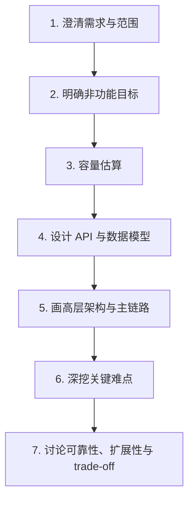
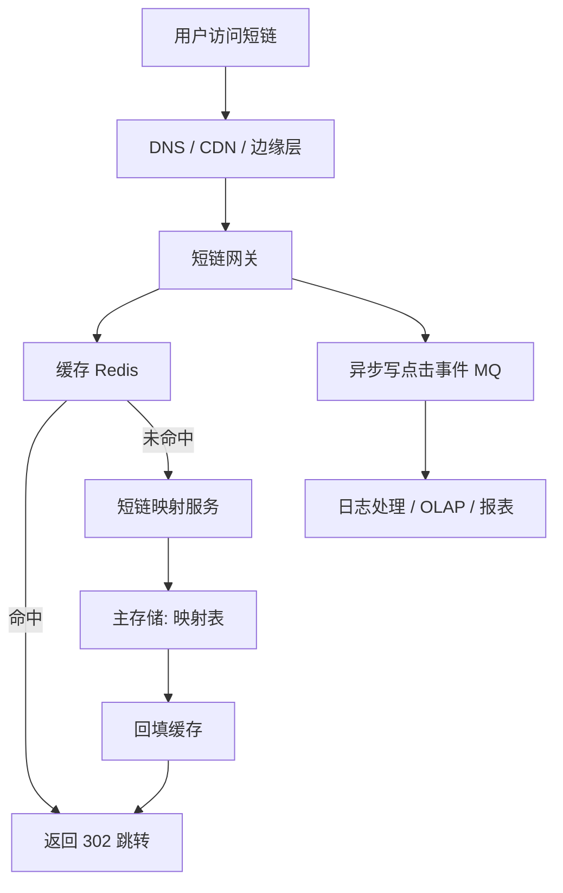

# 系统设计 - 第 1 课：系统设计面试全景与答题框架

## 学习目标（本节结束后你能做到什么）

1. 理解系统设计面试真正考察的能力，不再把它误解成“背几个大厂架构模板”。
2. 掌握一套可重复使用的答题骨架，知道每一步为什么存在、它在面试里起什么作用。
3. 能用一个真实案例把“需求澄清 -> 估算 -> 架构 -> 深挖 -> trade-off”完整串起来。
4. 知道 3-5 年工程师和更高年限候选人在系统设计表达上的差别，避免回答停留在组件罗列。

## 内容讲解（核心概念，用类比、例子、图示说清楚）

很多人第一次准备系统设计时，会下意识去搜“高频题模板”。这样做有一个短期收益，就是你会很快见到很多熟悉名词：Redis、Kafka、MySQL 分库分表、CDN、对象存储、搜索引擎、限流、熔断、多活。问题是，如果你只记住了这些名字，面试时很容易一开口就变成“前面一个网关，后面一层服务，再接缓存和数据库”。这类回答听起来不算错，但也很难拿高分，因为面试官看不到你在做工程判断。

系统设计面试本质上不是考你“知道多少组件”，而是考你在信息不完整、约束不充分、目标彼此冲突的情况下，能不能把一个模糊问题拆清楚、排序、取舍，再输出一版合理方案。换句话说，面试官在看的是你是否具备架构思维的雏形。

这类思维通常包含五个部分。

第一，抽象能力。  
题目表面上在问“设计一个 Twitter”或“设计一个聊天系统”，但底层在问的是读写比例、在线连接、数据新鲜度、顺序要求、扩展路径。你能不能把具体产品翻译成系统矛盾，这是第一关。

第二，边界能力。  
真实系统没有边界，设计就会无限膨胀。面试只有几十分钟，你必须主动收敛范围。比如“这次先只做单聊，不做群聊和端到端加密”“先只做首页 Feed，不做推荐广告排序”“先支持图片上传，不做视频转码”。边界收不住，回答就会越来越散。

第三，优先级能力。  
不是所有问题都值得同时解决。一个成熟工程师会先抓主矛盾。比如聊天系统先保消息送达和局部顺序，已读回执、消息撤回、表情动画可以放后面。短链系统先保重定向稳定性，统计分析和风控画像可以放异步。优先级感，是系统设计里非常核心的“工程味”。

第四，trade-off 能力。  
任何设计都不是白赚。缓存会带来一致性成本，异步会带来最终一致性和重试复杂度，分片会带来跨分片查询和运维成本，多区域会带来复制延迟和写入协调。面试官不要求你做出唯一正确答案，但非常在意你是否知道“这个选择是用什么换来的”。

第五，故障意识。  
真实线上系统不会永远正常。数据库会抖动，缓存会失效，消息会重复，网络会超时，第三方接口会限流。系统设计里如果你只讲 happy path，不讲失败路径，面试官会觉得你停留在“画大图”的层面，没有进入真实工程世界。

所以，一个更准确的理解是：系统设计面试像一场带约束的工程讨论，而不是一次背答案比赛。

### 一、系统设计面试到底在考什么

如果你把面试官的评分视角拆开，常见会落在下面几个维度：

1. 你有没有先定义问题，而不是直接给方案。
2. 你能不能做量级正确的估算。
3. 你能不能把核心数据流和关键链路讲清楚。
4. 你是否知道系统最大的风险在哪里。
5. 你是否能自然地讨论扩展、可靠性和代价。

这几点里，最容易被忽略的是第一点。很多候选人一听题就开始画图，其实这一步很危险。因为很多题目的答案高度依赖前置约束。例如“设计文件存储系统”，内部企业网盘和全球公开图床完全不是一回事；“设计搜索系统”，是做电商搜索、站内文档检索还是聊天消息搜索，索引和新鲜度要求都不同。你如果不先定义范围，后面的设计很可能从第一分钟就偏了。

### 二、一个稳定的答题骨架为什么重要

系统设计面试最怕什么？不是不会，而是慌。慌以后最典型的表现就是想到哪说到哪，组件越说越多，主线越来越模糊。稳定骨架的价值，不是让你机械套模板，而是让你在压力下依然有推进顺序。

一个非常稳的骨架可以记成七步：

这七步不是形式主义，而是工程思考的自然顺序。

第一步，澄清需求与范围。  
你要问“谁在用、最核心动作是什么、什么先不做”。注意，这一步不是列需求大全，而是收敛问题空间。比如“设计短链系统”，可以先确认：是否需要自定义别名、是否需要过期时间、是否需要统计分析、是否需要防恶意链接、是否全球部署。你问这些问题，不是在拖时间，而是在定义问题。

第二步，明确非功能目标。  
系统不是只有功能，还有性能、可用性、一致性、成本、合规、地域分布。比如内部管理后台和全球社交产品都能叫“系统”，但复杂度完全不同。没有非功能目标，缓存、分片、CDN、多区域这些设计选择就没有标尺。

第三步，容量估算。  
你不需要算得像容量规划文档一样精确，但必须有量级意识。平均流量、峰值流量、在线连接、存储量、带宽、热点比例，这些数字会直接决定你的设计重点。没有估算，你就很难解释“为什么这里需要缓存而不是直接查库”“为什么这里需要异步削峰”。

第四步，API 与数据模型。  
这一层非常容易被忽略，但其实它是后续存储设计的前提。因为系统瓶颈往往来自访问模式，不来自数据库名字。先想清楚接口、实体、主键、查询维度，再谈 MySQL 还是 NoSQL，才是顺序正确。

第五步，高层架构与主链路。  
这一层的关键不是把组件堆满，而是把关键动作串成一条路径。比如“用户发请求 -> 网关 -> 核心服务 -> 缓存/数据库 -> 异步事件 -> 下游系统”。只要主链路清楚，组件才有位置感。

第六步，深挖关键难点。  
真正拉开差距的通常是这里。一个题目不需要什么都讲透，但至少要挑 1 到 2 个最核心矛盾深入。例如 Feed 的 fanout 策略、聊天系统的顺序与多端同步、订单系统的幂等与库存一致性、搜索系统的索引新鲜度与相关性排序。

第七步，讨论扩展与 trade-off。  
如果流量涨十倍，先扩哪里；如果缓存挂了怎么办；如果从库有延迟，哪些读还能接受；如果消息重复消费怎么办；如果跨区域复制有延迟，产品能接受多长的新鲜度损失。面试官通常会在这一步确认你是不是只会讲“正常时怎么跑”，还是也知道“出问题时怎么活”。

### 三、什么叫“像工程师一样答”，什么叫“像背题一样答”

我们对比一下。

背题式回答通常像这样：

- 前面放 Nginx 和负载均衡。
- 中间是业务服务。
- 再加 Redis、MySQL、Kafka。
- 流量大了以后分库分表。

这类回答的问题不在于组件错，而在于它没有回答三个关键问题：

1. 为什么先用这些组件，而不是别的。
2. 它们各自承接哪一段业务行为。
3. 什么时候这些组件会成为瓶颈，后面怎么演进。

更工程化的回答会这样说：

- 这个系统的主矛盾是读多写少，所以我优先优化读路径。
- 这里缓存的是热点结果，而不是把缓存当真相源。
- 这部分异步化是因为它不阻塞用户拿到核心结果。
- 这里选择关系型数据库，是因为需要事务和唯一约束。
- 这里不急着分片，因为当前瓶颈先出现在读取和热点，而不是单表容量上限。

你会发现，后者的重点不是“说出更多名词”，而是每句话都带着因果关系。

### 四、用一个真实案例演示整套骨架

下面我们用一道非常经典、又不容易一上来就失控的题来演示：`设计一个短链系统（Short URL）`。

#### 1. 先澄清问题

你可以先问：

1. 短链是否允许用户自定义别名。
2. 是否需要设置过期时间。
3. 是否需要统计点击次数、地域、来源设备。
4. 是否需要防刷和恶意链接拦截。
5. 是否需要全球用户低延迟访问。

问完之后，你可以主动收敛一个版本：

- 先做核心功能：长链转短链、短链跳转、点击统计。
- 支持过期时间。
- 暂不做复杂运营后台和高级风控，只预留异步链路。

#### 2. 明确目标

功能目标：

- 创建短链。
- 通过短码跳转原始长链。
- 记录点击事件。

非功能目标：

- 读多写少，跳转链路延迟要低。
- 短链映射不能丢。
- 点击统计允许秒级到分钟级延迟。
- 热门短链要能抗热点访问。

#### 3. 做一轮估算

假设：

- 日新增短链 1000 万。
- 日跳转量 10 亿。
- 读写比约 100:1。
- 热点前 1% 的短链贡献 50% 以上流量。

这组数字一出来，设计重点就很明确了：写入创建不是主要矛盾，读取跳转和热点抗压才是。

#### 4. 想数据模型

核心对象其实很少：

- `short_url_mapping(short_code, long_url, creator_id, expire_at, created_at, status)`
- `click_event(short_code, ts, ip, ua, referer, region)`

这里立刻会带来两个设计判断：

1. `short_code` 是天然主键，适合做 key-value 查找。
2. 点击事件是高吞吐日志，更适合走异步链路，而不是和主映射表绑在一个同步事务里。

#### 5. 画主链路

这里有两个值得主动说出来的点。

第一，跳转链路和统计链路分离。  
用户最关心的是快速跳转，不关心点击统计是不是这一毫秒就写完。所以统计应该异步化。

第二，缓存是主角。  
因为这是典型的读多写少场景，而且热点明显，缓存命中率会直接决定延迟和后端压力。

#### 6. 深挖关键难点

深挖点一，短码生成。  
可以用自增 ID + Base62 编码，也可以用随机串再做碰撞检查。前者简单、空间效率高，但有可预测性；后者更灵活，但冲突和写放大更高。面试里不需要追求唯一正确答案，但要说明代价。

深挖点二，热点短链。  
热点短链可能导致单 key 极热。这里可以通过本地缓存 + Redis + 过期时间随机抖动 + 热点预热来抗压。如果还担心缓存失效打穿底库，可以对热点 key 做 singleflight 或请求合并。

深挖点三，恶意链接。  
短链系统天然容易被钓鱼和垃圾信息滥用。所以创建短链时通常需要异步风控扫描；读取时可以根据风险等级决定直接跳转、告警、或展示中间确认页。

#### 7. 讲 trade-off

- 点击统计为什么异步：因为用户不需要等待统计完成。
- 为什么缓存比数据库优化更优先：因为读远高于写，主矛盾在跳转路径。
- 为什么不急着上复杂分片：映射查询是点查，先用缓存和合适的主键设计就能撑很久。
- 为什么需要边缘层/CDN：全球用户访问时，网络延迟和源站出口会成为成本与体验问题。

你会发现，同一套七步骨架并不是抽象口号，而是真的能带着你把题目讲清楚。

### 五、3-5 年工程师在系统设计里最容易丢分的地方

第一，忘记先问需求。  
一上来直接开设计，后面越讲越偏。

第二，只有高层图，没有核心链路。  
组件很多，但面试官听不出一个请求到底怎么流过系统。

第三，只讲“怎么做”，不讲“为什么这样做”。  
这会让回答听起来很像背题。

第四，只讲正常路径，不讲异常路径。  
比如缓存失效怎么办，重试会不会重复写，消息丢了怎么办。

第五，过早上复杂方案。  
还没算规模就上多活、分片、事件驱动和几十个微服务，通常会显得不务实。

### 六、一个你可以直接练的开场模板

如果你拿到一道题，脑子一时空白，可以先用这样的开场稳住节奏：

1. 我先澄清一下范围，确认这道题这次重点做哪些能力、先不做哪些扩展功能。
2. 然后我会先补一轮非功能目标和容量假设，因为后面很多架构选择依赖规模。
3. 接着我会定义核心 API 和数据模型，再给出高层架构和主链路。
4. 最后我会挑这道题最关键的 1 到 2 个难点深入展开，再讲可靠性和 trade-off。

这段开场的价值非常高，因为它既帮你自己建立节奏，也让面试官知道你是有结构感的。

## 小结（3-5 条关键点）

1. 系统设计面试考察的是抽象、边界、优先级、trade-off 和故障意识，而不是背组件清单。
2. 稳定答题骨架通常是：需求澄清、非功能目标、容量估算、API/数据模型、高层架构、关键难点、扩展与取舍。
3. 工程化表达的核心是“每个设计选择都能说清原因、收益和代价”，而不是罗列更多技术名词。
4. 用真实案例练习整套骨架，比单独背某个题目的标准答案更有效。
5. 对 3-5 年候选人来说，最容易丢分的点是：不先定义问题、不做估算、不讲主链路、不谈异常路径。

---

## 检查站：请回答以下问题

1. 你怎么用自己的话解释“系统设计面试不是背模板，而是工程推理过程”？
2. 如果面试官让你设计一个短链系统，你会先问哪 4 个澄清问题？为什么？
3. 请你复述这节课的七步答题骨架，并说说哪一步最容易在压力下漏掉。
4. 为什么说“只会画高层图”在系统设计面试里通常不够？你觉得面试官还想听到什么？

请把你的答案直接告诉我，我会根据你的回答决定下一步。
