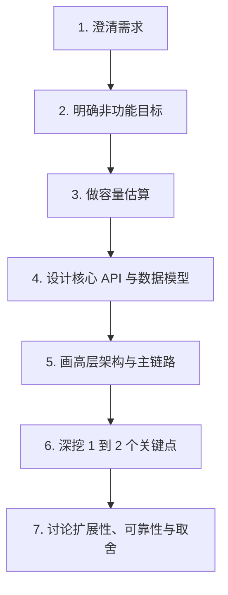

# 系统设计 - 第 1 课：系统设计面试全景与答题框架

## 学习目标（本节结束后你能做到什么）

1. 说清楚社招 3-5 年、外企大厂系统设计面试到底在考什么，而不是把它理解成“背模板”。
2. 掌握一套稳定的答题骨架，遇到常见题目时知道自己该先讲什么、后讲什么。
3. 理解为什么外企大厂特别关注需求澄清、容量估算、trade-off 和深入追问。
4. 识别系统设计面试中的常见失分点，避免一开口就把题答散。

## 内容讲解（核心概念，用类比、例子、图示说清楚）

很多人一提到系统设计面试，脑子里先冒出来的是一堆名词：Redis、Kafka、MySQL 分库分表、CDN、对象存储、负载均衡、微服务、降级、熔断。这样学很容易出问题，因为面试官并不是在考你“能不能背出组件清单”，而是在看你能不能像一个 3-5 年的工程师那样，在信息不完整的情况下，把一个模糊问题迅速组织成一个清晰、可扩展、可解释的方案。

对社招 3-5 年来说，外企大厂通常不要求你像首席架构师那样把所有边角都设计到极致，但会很看重三件事。第一，你是不是能先把问题定义清楚。第二，你是不是能把方案讲得结构化、有优先级。第三，你是不是知道每个设计选择背后的代价。换句话说，面试官不是在找“最炫的方案”，而是在找“思路清楚、边界清楚、取舍清楚的人”。

你可以把系统设计面试听成一次“带约束的工程讨论”。题目看起来像“设计一个短链系统”“设计一个聊天系统”“设计一个新闻 Feed”，但真正的考察点往往藏在后面：流量有多大，读多写少还是写多读少，用户是否全球分布，延迟和一致性哪个更重要，故障时能不能降级，数据是否需要长期保存，是否支持搜索，是否需要多租户隔离，等等。如果你不先澄清这些条件，后面的方案很容易从一开始就偏题。

这也是为什么系统设计面试不能一上来就画图。很多候选人一听题就开始说：“前面放一个 Nginx，后面是应用层，再加 Redis，再加 MySQL，再加 Kafka。”这类回答的问题不在于组件错了，而在于它没有回答“为什么是这些组件、它们解决了什么问题、先出现的瓶颈是什么、为什么不是另一种方案”。在外企大厂的面试里，这种“组件罗列式”回答通常得分不高，因为面试官看不到你的判断过程。

更好的做法，是按照一个固定骨架去推进。这个骨架可以记成七步：

第一步是澄清需求。你要先问：这是给谁用的？核心场景是什么？必须支持哪些功能？哪些功能现在不做？例如“设计聊天系统”，你可以问是否需要单聊和群聊，是否需要已读回执，是否要支持离线消息，消息是否支持多端同步，是否需要全文搜索。你并不是为了拖时间提问，而是在主动缩小问题空间。外企大厂通常很欣赏这种做法，因为真实工作里也是先定义问题，再动手设计。

第二步是明确非功能目标。这里要确认的是系统的规模和质量目标，例如日活、峰值 QPS、延迟要求、可用性目标、数据保留时长、地域分布、安全合规要求。很多候选人把这一步省掉，结果后面一切设计都没有标尺。比如一个内部工具和一个全球用户使用的 consumer product，架构复杂度完全不同。如果没有非功能目标，你就没法说明为什么要引入缓存、为什么要分片、为什么要多区域部署。

第三步是容量估算。注意，面试官通常不是要你算得和线上监控一样精准，而是看你有没有“量级意识”。例如你要能粗略算出：假设 1000 万日活，10% 的用户在高峰小时活跃，每人每分钟发 2 条消息，那么写入 QPS 大概是多少；如果每条消息平均 1 KB，一天会产生多少存储；如果新闻 Feed 每次返回 20 条，每秒读请求多少，缓存命中率大概能带来多少收益。只要量级合理，就能支撑你的设计决策。

第四步是 API 和数据模型。很多人觉得这一步不重要，实际上它非常能体现你的工程思维。因为系统的瓶颈，往往来自访问模式而不是数据库名称。你要先想清楚读写接口长什么样，核心实体有哪些，主键如何设计，查询维度是什么。比如短链系统的核心不是“存到 MySQL 还是 NoSQL”，而是“短码到长链的映射如何查、如何防止热点、如何处理自定义别名、如何做过期和统计”。数据模型想清楚以后，存储选择才有依据。

第五步才是高层设计。这里要把主链路讲清楚，而不是把所有可能存在的组件都堆上去。比如在短链系统里，你可以先讲“写入路径：生成短码，检查冲突，写入映射表，异步记录统计；读取路径：先查缓存，未命中查数据库，返回 302 重定向，同时异步上报点击事件”。这样的表达比“前面有网关，后面有服务，旁边有缓存和消息队列”更有信息量，因为它把组件和业务动作对应起来了。

第六步是深挖 1 到 2 个关键点。外企大厂特别喜欢追问这一步，因为这能区分“会讲大图的人”和“真正理解系统行为的人”。深挖点通常来自这个系统最难的地方，例如 Feed 的 fanout 策略、聊天系统的消息顺序和多端同步、库存系统的超卖控制、搜索系统的索引更新延迟、视频系统的分片上传和转码流水线。你不需要把十个点都讲满，只要选最关键的两点讲透，效果比面面俱到但都很浅要好得多。

第七步是讲扩展性、可靠性和 trade-off。这里不是补充题，而是决定你层次的一步。你要能说明：如果流量涨十倍，先扩哪里；如果数据库挂了，系统如何退化；如果缓存失效，会不会把底库打穿；如果消息重复投递，如何保证幂等；如果要求全球低延迟，是选择多活、主从、还是按区域隔离；如果一致性和延迟冲突，这个场景下优先哪个。面试官非常看重你是否能自然地说出“这样做的好处是什么，代价是什么，什么时候不适用”。

对于社招 3-5 年来说，另一个常见误区是把系统设计答成“项目汇报”。真实项目经验当然有帮助，但面试不是让你复述你们公司现在的系统长什么样，而是让你展示迁移能力和抽象能力。比如你做过支付，不代表只会答支付；你做过推荐，不代表不会答聊天。你要把经验提炼成通用模式：热点读用缓存，长链路用异步解耦，核心状态写入要考虑幂等和顺序，跨区域访问要考虑数据放置和复制延迟。这些模式才是可迁移的能力。

最后说一个外企大厂很常见的评分视角：他们往往并不期待你一开始就给出完美答案，而是看你能不能在互动中不断修正方案。也就是说，系统设计面试不是“答对题”，而是“展示成熟的工程推理过程”。如果你先做了合理假设，再根据面试官补充的信息调整设计，这通常是加分项。相反，如果你从头到尾死守一个一开始就不成立的方案，即使图画得很完整，也会显得判断力不足。

所以，这一课你最需要建立的不是某个组件的细节，而是一种稳定节奏：先定义问题，再估规模，再搭主链路，再选重点深挖，最后讲取舍。后面所有高频题，几乎都会反复用到这个节奏。框架一旦稳定，系统设计就不再是“每题都从零开始”，而是“在同一套骨架上替换场景和关键矛盾”。

## 小结（3-5 条关键点）

1. 系统设计面试考的不是你记住了多少组件，而是你能否结构化地拆问题、做判断、讲取舍。
2. 对社招 3-5 年、外企大厂目标来说，需求澄清、容量估算、核心链路和 trade-off 是最重要的得分区。
3. 稳定答题骨架是：澄清需求、明确非功能目标、容量估算、API/数据模型、高层设计、关键点深挖、扩展性与可靠性讨论。
4. 常见失分点包括：一上来堆组件、不做估算、只说方案不说代价、图很大但主链路不清楚。
5. 面试更像一次工程推理演示，面试官会看你如何在信息逐步增加时修正设计。

---

## 检查站：请回答以下问题

1. 为什么系统设计面试里，不能一上来就开始画架构图？请你用自己的话解释。
2. 如果面试官让你“设计一个聊天系统”，你会先澄清哪 3 到 5 个问题？为什么是这些问题？
3. 请你复述这节课的七步答题骨架，并说明你觉得自己最容易漏掉哪一步。
4. 站在外企大厂面试官的角度，他们为什么会特别关注 trade-off，而不只关心你的最终方案？

请把你的答案直接告诉我，我会根据你的回答决定下一步。
