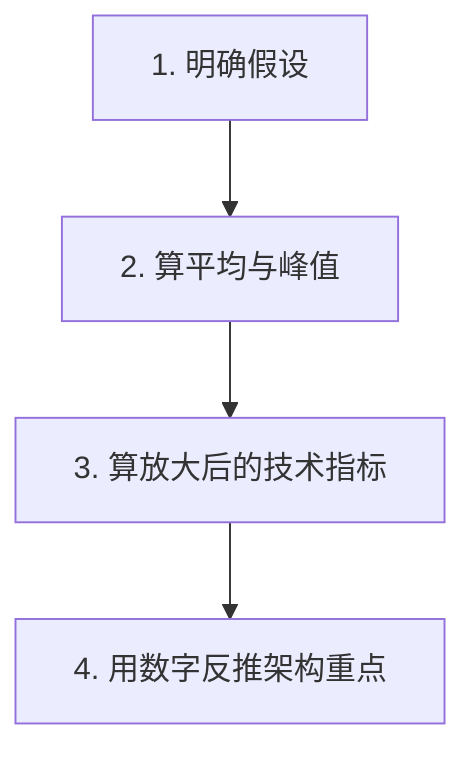

# 系统设计 - 第 2 课：容量估算与性能指标

## 学习目标（本节结束后你能做到什么）

1. 理解容量估算为什么是系统设计的“度量尺”，而不是面试里的算术表演。
2. 掌握 QPS、TPS、吞吐量、并发连接、P95/P99、带宽、存储量、放大系数等核心指标。
3. 能快速从一组业务假设推导出架构上真正重要的瓶颈位置。
4. 能结合 Feed、聊天、秒杀等典型题型做有工程感的估算，而不是只报一个笼统的大数字。

## 内容讲解（核心概念，用类比、例子、图示说清楚）

很多人对容量估算有两个误解。第一个误解是：“面试官是不是在考我心算速度？”第二个误解是：“反正算不准，不如少算一点，赶紧画图。”这两种想法都会让你错失系统设计里最重要的抓手。

容量估算真正的作用，是帮助你识别主矛盾。系统为什么需要缓存？为什么要读写分离？为什么消息队列适合这里而不适合那里？为什么某些场景要优先考虑在线连接数而不是数据库行数？这些问题如果没有量级支撑，最后都只能靠直觉。

你可以把容量估算理解成“给系统找刻度”。同样叫“高并发”，可能是三千 QPS，也可能是三十万 QPS；同样叫“数据量大”，可能是一年几十 GB，也可能是一天几十 TB。架构复杂度差别极大。

### 一、估算不是为了精确，而是为了抓决定架构的数字

在系统设计里，最重要的不是把每个数字都算到小数点后两位，而是抓住那些真正决定架构的量：

- 峰值读写 QPS
- 在线连接数
- 单请求大小与出口带宽
- 日新增数据量与保留周期
- 热点比例
- 放大系数

这里的“放大系数”是很多候选人会漏掉的点。比如一条用户动作进入系统后，不一定只对应一次数据库写入。发一条聊天消息，可能会触发消息持久化、多个终端推送、未读计数更新、离线收件箱写入、埋点日志写入。发一条 tweet，也可能会触发粉丝首页更新、缓存失效、搜索索引更新、推荐特征更新。这些都叫放大。你如果只算原始请求数，不算放大系数，就很容易低估系统压力。

### 二、系统设计里最常见的几类指标

#### 1. 请求吞吐类指标

QPS 通常表示每秒请求数，TPS 在交易系统里常被用来表示每秒事务数。面试里你不用纠结术语历史，只要说清楚自己统计的是哪类请求即可。比如：

- 首页读取 QPS
- 发消息写入 QPS
- 下单提交 TPS
- 支付回调 QPS

真正重要的是你能把业务行为映射成技术行为，而不是只说“流量很大”。

#### 2. 延迟类指标

平均延迟几乎总是太乐观，所以面试里更值得主动讲的是尾延迟，也就是 P95、P99。为什么？因为用户感知通常被慢请求支配，而不是被平均值支配。

例如聊天系统里，99% 的消息 100ms 到达，1% 的消息 5 秒才到，平均值看起来未必夸张，但用户体感会很差。所以低延迟系统常常会把尾延迟当成核心指标，而不只是平均延迟。

#### 3. 并发连接类指标

这一类在聊天、推送、直播、长轮询系统里尤其关键。很多系统的瓶颈不是数据库，而是前端连接层。例如 300 万在线用户每人一条 WebSocket，这个问题的重点已经不是“每秒多少 HTTP 请求”，而是：

- 每台机器能稳定维护多少连接
- 心跳频率带来的网络和 CPU 消耗
- 连接状态如何路由和恢复

#### 4. 存储与数据增长类指标

你至少要估三件事：

1. 一天写多少数据。
2. 在线要保留多久。
3. 是否需要冷热分层。

只算“总条数”通常不够，因为索引、副本、冗余字段、压缩率都会影响真实成本。

#### 5. 带宽类指标

很多人会算 QPS，却忘了算响应体大小。比如一个 Feed 接口每次返回 20 条内容，平均响应体 200KB，高峰 5 万 QPS，那么理论出口流量已经是 10GB/s 量级。这个数字一出来，你就知道光靠源站肯定不够，缓存、压缩、CDN、分页、图片懒加载都要进入讨论。

### 三、做估算时最稳的四步法

#### 第一步，明确假设

面试官很多时候不会给完整数字，这是正常的。你应该主动建立一组合理假设，并明确说出来。例如：

- 日活 5000 万
- 高峰小时占全天流量 10%
- 在线用户占日活 20%
- 每次读取平均返回 100KB
- 每条消息平均 1KB

只要你的假设合理、前后一致、后续计算自洽，通常就是加分项。最怕的是不敢假设，结果设计完全失去尺度。

#### 第二步，区分平均与峰值

平均值告诉你系统整体体量，峰值决定你会不会在关键时刻挂掉。秒杀和大促就是典型例子。假设某商品一天只卖 10 万件，看起来不大，但如果 80% 的流量集中在 10 秒内，系统承受的其实是瞬时洪峰，而不是“日均 1.16 单每秒”这种毫无意义的平均值。

#### 第三步，算放大后的技术指标

这一步特别能体现工程感。你要问：

- 一个业务请求会变成几次数据库写入？
- 一次用户动作会扇出给多少下游？
- 一次读取会附带多少缓存 miss、图片加载、下游聚合？

例如聊天系统里，用户 A 发给用户 B 一条消息，不只是“1 次写入”：

- 消息表写 1 次
- 发送端 ACK 1 次
- 接收端推送可能是多个设备
- 未读数更新 1 次
- 离线收件箱可能 1 次
- 埋点或审计日志再 1 次

如果你能主动说出“我要考虑写放大和扇出放大”，面试官通常会觉得你更接近真实线上经验。

#### 第四步，用数字反推架构重点

估算做完以后，一定要让数字影响设计，而不是算完就扔掉。比如：

- 读请求远高于写请求 -> 优先优化缓存和读路径
- 存储增长很快 -> 需要冷热分层和归档
- 在线连接极高 -> 连接网关成为主设计对象
- 写放大很大 -> 需要异步解耦、批处理、索引控制

### 四、一个完整案例：设计 News Feed 时怎么估算

我们假设这是一个类似 Twitter/朋友圈首页的系统。

#### 先给假设

- 日活 1 亿
- 高峰小时活跃用户占日活 10%
- 每个高峰活跃用户每分钟刷新首页 2 次
- 每次返回 20 条内容
- 每次响应体平均 150KB
- 平均每个用户每天发 2 条内容，其中只有 5% 用户是高活跃创作者

#### 第一步，算读取 QPS

高峰小时活跃用户约 1000 万。  
每人每分钟刷新 2 次，相当于每秒约 33.3 万次首页读取请求。

你不需要纠结是不是 333333 还是 340000，数量级到几十万 QPS 就足够支撑设计。

#### 第二步，算带宽

如果每次响应体 150KB，那么：

- 33 万 QPS x 150KB
- 理论出口已经达到数十 GB/s 量级

这说明什么？说明首页响应绝不能每次都现场拼装全量对象，更不能所有媒体资源都走源站。于是缓存、对象拆分、CDN、图片缩略图、候选列表预计算就变成自然结论，而不是“显得高级所以加上去”。

#### 第三步，算写入与 fanout 压力

如果平均每天有 2000 万条新内容产生，看起来写 QPS 远小于读 QPS。但这里有个隐藏问题：`一条内容写入，可能会触发对粉丝首页的写扩散`。这就是 fanout 放大。

如果普通用户平均有几十到几百粉丝，写扩散还可接受；但如果是超级大 V，一条内容可能对应百万级粉丝，写时 fanout 就会非常贵。所以这组估算会直接引出一个关键 trade-off：

- 普通用户走 fanout on write
- 超级大 V 走 fanout on read
- 最终采用混合策略

这就叫“用数字推架构”。

### 五、再看一个完全不同的案例：聊天系统为什么要先估连接

很多人做聊天系统估算时，第一反应是算消息条数。其实这只对了一半。聊天系统常见的第一瓶颈是连接层。

假设：

- 日活 3000 万
- 高峰在线 300 万
- 每个用户平均 2 个终端在线
- 平均每个终端每 30 秒一个心跳

那意味着：

- 长连接总数约 600 万
- 光心跳流量就已经非常可观
- 网关层要维护大规模连接状态

再假设消息发送峰值是 10 万条每秒，你会发现系统有两个完全不同的瓶颈：

1. 连接管理
2. 消息路由与持久化

这也是为什么聊天系统的设计重点和 Feed、订单、搜索都不同。它不是单纯数据库问题，而是“连接 + 路由 + 顺序 + 离线同步”的组合问题。

### 六、秒杀系统的估算重点为什么完全不一样

秒杀场景最容易让人犯的错误，是还在按“全天平均值”思考。比如：

- 库存 10 万
- 活动开始 5 秒内进来 100 万请求

真正关键的数字不是日订单量，而是：

- 入口峰值 QPS
- 能被资格校验过滤掉的比例
- 真正落到库存扣减服务的有效请求数
- 单热点资源上的竞争强度

这种场景下，系统重点会从“容量”转向“保护”：

- 限流
- 令牌
- 预扣库存
- 异步排队
- 热点隔离
- 快速失败

你看，同样是估算，但对不同题型，最重要的数字完全不同。

### 七、面试里容易忽略的几个高级指标

除了常见的 QPS 和存储量，还有几个指标很值得你主动提：

#### 1. 热点比例

很多系统不是整体大，而是局部特别热。比如爆款商品、热点短链、超级大 V、新上线热门视频。热点比例会决定是否需要热点 key 保护、分层缓存、请求合并、甚至专门的热点隔离机制。

#### 2. 新鲜度要求

有些系统要求强实时，例如支付结果、库存状态；有些系统允许秒级甚至分钟级延迟，例如报表、推荐特征、搜索索引。新鲜度要求会直接决定同步还是异步、主库读还是副本读、在线链路还是离线链路。

#### 3. 可接受的错误率与降级策略

不是所有请求都必须百分之百成功。有些场景宁可快速失败，也比把系统拖死更好。例如秒杀资格校验、推荐接口、热门榜单。面试里如果能把 SLO 和降级目标挂上钩，会显得很成熟。

### 八、一个实用的估算表达模板

你在面试里可以这么说：

1. 我先设定一组合理假设，后面都基于这组数据来推演。
2. 我会先算平均量，再重点看峰值，因为峰值决定系统是否稳定。
3. 我会把业务请求换算成技术指标，包括读写 QPS、连接数、带宽、存储量和放大系数。
4. 最后我会根据这些数字判断瓶颈更偏读、写、连接、带宽还是存储，再决定缓存、分片、异步还是限流谁更优先。

这段话很重要，因为它体现你不是为了算而算，而是在用估算驱动设计。

## 小结（3-5 条关键点）

1. 容量估算的核心价值，是定位系统主矛盾并为架构选择提供量级依据。
2. 系统设计里最常见的关键指标包括：读写 QPS、尾延迟、并发连接、带宽、存储量、热点比例和放大系数。
3. 估算的稳妥流程通常是：建立假设、区分平均和峰值、计算放大后的技术指标、再用数字反推架构重点。
4. 不同题型关注点不同：Feed 更看读路径和带宽，聊天更看连接和路由，秒杀更看洪峰和保护策略。
5. 面试里量级正确、逻辑自洽、能反推设计，比极致精确更重要。

---

## 检查站：请回答以下问题

1. 为什么说容量估算是系统设计的“度量尺”，而不是数学题？
2. 如果设计一个 News Feed，你会优先估哪些数字？这些数字会如何影响你的缓存和 fanout 设计？
3. 聊天系统为什么通常要先估在线连接，而不是只盯着消息写入 QPS？
4. 请你用自己的话复述“四步估算法”，并说说你最容易漏掉哪一步。

请把你的答案直接告诉我，我会根据你的回答决定下一步。
