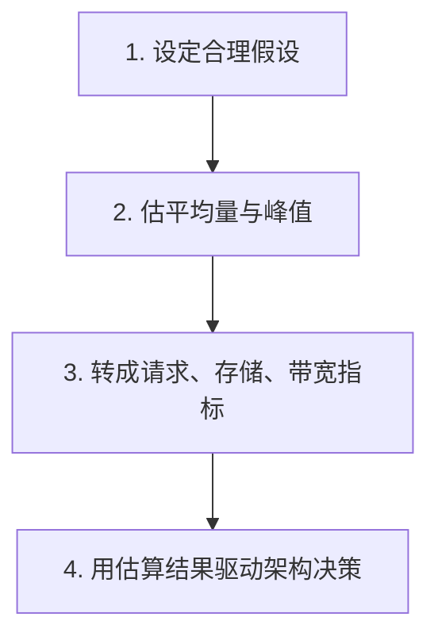

# 系统设计 - 第 2 课：容量估算与性能指标

## 学习目标（本节结束后你能做到什么）

1. 理解为什么系统设计面试里，容量估算不是形式主义，而是后续架构决策的标尺。
2. 掌握常见指标的含义，包括 QPS、TPS、吞吐量、延迟、带宽、存储量、峰值与平均值。
3. 能在面试中快速做出量级正确的估算，而不是陷入复杂算术。
4. 知道不同场景下最关键的指标差异，例如聊天、Twitter Feed、秒杀系统分别更关心什么。

## 内容讲解（核心概念，用类比、例子、图示说清楚）

很多候选人一听到“容量估算”就紧张，担心自己数学不够快，或者怕算错被扣分。其实在系统设计面试里，估算的作用不是考你算术速度，而是看你有没有工程上的量级感。你可以把它理解成盖房子前先看地基承重。如果你连大概有多少用户、每秒多少请求、一天多少数据都不知道，后面说要不要加缓存、要不要分库分表、要不要用消息队列，其实都只是凭感觉在猜。

所以，容量估算的本质，是给后续设计建立一个“尺度”。比如说“设计一个 Twitter”，如果只是抽象地说“用户很多、流量很大”，这句话没有意义；但如果你进一步说“假设 1 亿日活，10% 用户在高峰小时活跃，每人每分钟刷新 2 次首页，那么首页读取请求大约是几十万到上百万 QPS 量级”，后面讨论缓存、预计算、Fanout、冷热数据分层时，你的判断就有了依据。

在面试里，常见的估算指标主要有下面几类。

第一类是请求类指标，也就是系统每秒要处理多少操作。最常见的是 QPS，意思是每秒查询数，广义上常被拿来表示每秒请求数。还有 TPS，有时表示每秒事务数，通常在交易系统或数据库语境下更常见。你不用死抠缩写在不同公司里的细微差别，关键是你要先说清楚自己这里统计的是什么请求。例如“消息发送接口写入 QPS 是 5 万”“Feed 拉取接口读取 QPS 是 20 万”，这样比单说“QPS 很高”有用得多。

第二类是延迟类指标，也就是请求要花多久才返回。常见说法有平均延迟、P95、P99。平均值容易掩盖问题，因为大多数请求很快，不代表慢请求不影响用户体验。举个例子，聊天系统里 90% 的消息 50 毫秒送达，10% 的消息 5 秒才送达，平均值看起来可能还行，但用户体感会非常差。所以很多外企大厂会更关心尾延迟，也就是 P95、P99。它们表示 95% 或 99% 的请求在这个时间内完成。你在面试里如果能主动提到“这个场景更关注尾延迟”，通常会显得更成熟。

第三类是数据量指标，也就是一天写多少数据，总共存多少数据，是否需要冷热分层。比如聊天系统中，如果每条消息平均 500 字节，日发送 20 亿条消息，那么一天原始消息体就是约 1 TB 量级；如果还要加索引、冗余副本、元数据，真实占用会更高。再比如图片或视频系统，数据量不是按条数，而是按文件大小和保留周期估算，数量级会迅速上升到 PB。你只要能把原始数据、索引开销、副本开销分开说，面试官就知道你不是只盯着一张表。

第四类是带宽类指标，也就是单位时间需要传多少数据。很多人会估存储，却忘了估带宽，这在文件下载、视频流、首页大列表返回等场景中很关键。比如一个 Feed 接口每次返回 20 条内容，平均响应体大小 200 KB，如果高峰时每秒 5 万次请求，那么出口带宽需求大约是 10 GB/s 量级。这个数字一出来，你就知道仅靠单个服务实例和单地域部署肯定不现实，必须依赖缓存、CDN、压缩、分页和就近访问。

你可以把容量估算分成四步，这样在面试里最稳。

第一步是设定合理假设。注意，面试不是闭卷填空题，很多数据本来就不会给你。你要做的是快速给出一组合理假设，并明确说出来。例如“如果面试官没有特别说明，我先假设这是一个全球 consumer product，日活 5000 万，高峰小时流量约占日请求量的 10%”。只要假设合理、一致、后续计算自洽，就完全可以。比起不敢假设、一直停在那里，主动设定前提反而是加分项。

第二步是区分平均量和峰值。平均值只能告诉你系统总体有多大，峰值决定了你的架构会不会在高峰时垮掉。现实系统里，峰值通常不是平均值的一点点，而可能是 5 倍、10 倍甚至更高。秒杀系统就是最典型的例子。假设一个活动商品库存只有 10 万，但在 10 秒内同时涌入 100 万下单请求，那么你要处理的是瞬时写入洪峰，而不是全天平均订单量。这个时候队列、令牌、预扣库存、限流等设计就不是“优化项”，而是系统能否活下来的前提。

第三步是把用户规模转成技术指标。比如给你一个聊天系统，你不能停留在“用户很多，消息很多”，而要继续往下换算。假设 2000 万日活，20% 用户在高峰小时在线，平均每个在线用户每分钟发送 1 条消息，那么写入请求大约是 6.7 万条每秒。如果每条消息最终要同步到发送者和接收者的多个设备，实际推送次数会更高。这样一来，系统的瓶颈可能就不只是数据库写入，而是连接管理、长连接网关和消息分发链路。

第四步是让估算结果真的影响设计。很多候选人会做一堆计算，但后面的方案完全没有用上这些结果，这样等于白算。正确做法是把数字和决策绑起来。例如：“读取 QPS 明显高于写入，所以我会优先考虑缓存和读扩展。”“存储量非常大且需要长期保留，所以会考虑对象存储和冷热分层。”“峰值写入过高而一致性要求没那么强，所以可以通过消息队列削峰。”一旦你这样讲，估算就不再是形式，而是论证链的一部分。

下面用三个真实面试里非常高频的场景，帮助你建立感觉。

场景一，聊天系统。聊天系统最重要的不是总数据量，而是在线连接数、消息发送峰值、尾延迟、多端同步量。比如 500 万在线用户，每个用户都保持长连接，那么最前面的连接层就要扛住数百万连接，而不是只有几十万 QPS 的普通 HTTP 请求。这意味着你会更早关注连接网关水平扩展、连接状态分布、消息路由和离线消息缓存，而不是一上来先谈数据库。

场景二，Twitter 或 News Feed。这个场景通常是读多写少，而且读路径非常敏感。假设 1 亿日活，高峰时首页刷新请求几十万 QPS，但发帖写入也许只有几千到几万 QPS。那你自然会意识到，系统设计的重点不是“怎么把写入做得极致”，而是“怎么把首页读取做快”，这会引出缓存、预计算、Fanout on write 和 Fanout on read 等策略。这里容量估算直接帮你判断主要矛盾在哪。

场景三，秒杀系统。秒杀的典型特征是持续时间短、瞬时并发极高、正确性要求高。比如活动开始后的前 5 秒，100 万用户同时点“立即购买”，但库存只有 5 万。这里你最先估算的不是总订单数，而是入口峰值 QPS、库存扣减吞吐、数据库热点行竞争、失败请求比例和排队长度。你会发现问题核心变成了“如何在极短时间内拦住大部分无效流量”，于是限流、令牌桶、库存预热、异步下单、去重和防刷都变成核心设计点。

还有一个很重要的面试技巧：估算时不要求精确，但要求方向正确、逻辑清楚、单位统一。比如你先按“每秒”算请求，再按“每天”算存储，不要中间突然切成“每分钟”又忘了换算。再比如你说一条消息平均 1 KB，一天 10 亿条，那原始数据大概 1 TB，这种量级就够了，不需要抠到小数点。面试官通常更关心你能否快速判断是 GB、TB 还是 PB 量级，因为这直接决定你后面用什么级别的方案。

最后补一个经常被忽略的点：容量估算是为了筛选重点，不是为了把所有细节都算完。你在面试里通常只有 35 到 45 分钟，不可能像做容量规划文档那样列满所有公式。更有效的方式是抓住决定架构的几个核心数字，比如峰值读写 QPS、在线连接数、日新增数据量、热点比例、目标延迟。只要这几个数字出来，很多设计方向就已经很清楚了。

这一课你需要形成的能力，是看到题目后能自然问自己几个问题：这个系统最贵的是读还是写？是 CPU、内存、带宽、连接还是存储？峰值和平均值差多远？真正压垮系统的点在哪？一旦这几个问题开始自动出现，你的系统设计回答就会从“凭直觉堆组件”，变成“先用数字定位问题，再用架构解决问题”。

## 小结（3-5 条关键点）

1. 容量估算的价值在于给架构设计建立尺度，让后续方案有依据，而不是凭感觉堆技术。
2. 面试里最常用的指标包括读写 QPS、延迟尤其是 P95/P99、存储量、带宽、在线连接数和峰值流量。
3. 估算步骤通常是：设定假设、区分平均和峰值、转成技术指标、再用这些指标驱动设计决策。
4. 不同场景关注点不同：聊天系统更看连接和低延迟，Twitter/Feed 更看读路径，秒杀系统更看瞬时峰值和正确性。
5. 量级正确、逻辑自洽、能反推架构决策，比算得特别精确更重要。

---

## 检查站：请回答以下问题

1. 为什么说容量估算不是面试里的“数学题”，而是后续架构决策的标尺？
2. 如果让你设计一个 Twitter 或 News Feed，你觉得最该先估算哪些指标？为什么？
3. 秒杀系统和聊天系统在容量估算时，最核心的指标分别有什么不同？
4. 请你用自己的话说一遍容量估算的四步法，并说明你觉得自己最容易在哪一步出错。

请把你的答案直接告诉我，我会根据你的回答决定下一步。
