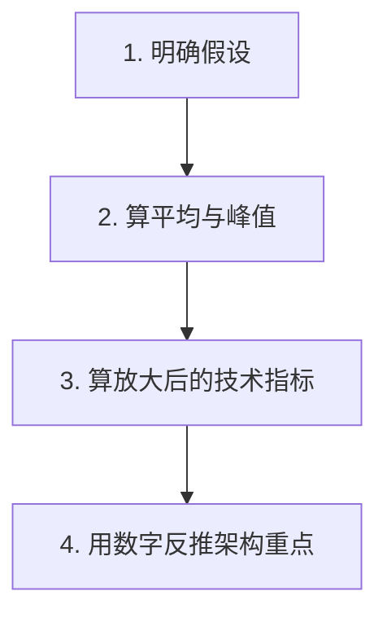

# 系统设计 - 第 2 课：容量估算与性能指标

## 学习目标（本节结束后你能做到什么）

1. 理解容量估算为什么是系统设计的“度量尺”，而不是面试里的算术表演。
2. 掌握 QPS、TPS、吞吐量、并发连接、P95/P99、带宽、存储量、放大系数等核心指标。
3. 能快速从一组业务假设推导出架构上真正重要的瓶颈位置。
4. 能把估算结果进一步映射到缓存、异步、分片、读模型、限流、降级、热点治理、一致性控制等技术选择。
5. 能结合不同压力类型做有工程感的估算，而不是只报一个笼统的大数字。

## 第 2 课系列阅读地图

第 2 课围绕“容量估算”扩成了一个系列。建议按下面顺序读：前两篇打底（指标本身 + 数字背后的物理），中间五篇按你遇到的瓶颈类型选读，最后一篇当字典查。

| 顺序 | 文档 | 解决什么问题 |
| --- | --- | --- |
| 1 | 本篇 02 | 有哪些指标、怎么估、怎么用判断表把数字反推成瓶颈 |
| 2 | [02b 数字背后的物理与数据库原理](./02b_容量估算数字背后的物理与数据库原理.md) | 判断表里的数字（2000 万行 / 单行 100/s / 1GB/s）为什么是这个数 |
| 3 | [02c 读多系统的缓存与读路径优化](./02c_读多系统的缓存与读路径优化方法论.md) | 读 QPS 高 → 缓存 / 读副本 / CDN 怎么选 |
| 4 | [02d 读模型、预计算与异步派生](./02d_读模型、预计算与异步派生方法论.md) | 下游聚合太重 → 读模型 / 预计算 / 异步派生 |
| 5 | [02e 写放大高系统的异步解耦、批处理与索引控制](./02e_写放大高系统的异步解耦批处理与索引控制方法论.md) | 写放大高 → 异步解耦 / 批处理 / 索引控制 |
| 6 | [02f 连接数高系统的连接网关与接入层](./02f_连接数高系统的连接网关与接入层方法论.md) | 连接数高 → 连接网关 / 接入层 |
| 7 | [02g 存储增长快系统的冷热分层与归档](./02g_存储增长快系统的冷热分层与归档方法论.md) | 存储增长快 → 冷热分层 / 归档 |
| 附录 | [02h 容量估算指标到技术选型逐项拆解](./02h_容量估算指标到技术选型逐项拆解.md) | 12 个指标逐项的三档选型，当字典查 |

## 内容讲解（核心概念，用类比、例子、图示说清楚）

很多人对容量估算有两个误解。第一个误解是：“面试官是不是在考我心算速度？”第二个误解是：“反正算不准，不如少算一点，赶紧画图。”这两种想法都会让你错失系统设计里最重要的抓手。

容量估算真正的作用，是帮助你识别主矛盾。系统为什么需要缓存？为什么要读写分离？为什么消息队列适合这里而不适合那里？为什么某些场景要优先考虑在线连接数而不是数据库行数？这些问题如果没有量级支撑，最后都只能靠直觉。

你可以把容量估算理解成“给系统找刻度”。同样叫“高并发”，可能是三千 QPS，也可能是三十万 QPS；同样叫“数据量大”，可能是一年几十 GB，也可能是一天几十 TB。架构复杂度差别极大。

### 一、估算不是为了精确，而是为了抓决定架构的数字

在系统设计里，最重要的不是把每个数字都算到小数点后两位，而是抓住那些真正决定架构的量：

- 峰值读写 QPS
- 在线连接数
- 单请求大小与出口带宽
- 日新增数据量与保留周期
- 热点比例
- 放大系数

这里的“放大系数”是很多候选人会漏掉的点。比如一个业务动作进入系统后，不一定只对应一次数据库写入。它可能触发主记录写入、状态更新、多个终端通知、缓存失效、索引更新、统计日志写入、下游事件发送等副作用。这些都叫放大。你如果只算原始请求数，不算放大系数，就很容易低估系统压力。

### 二、系统设计里最常见的几类指标

#### 1. 请求吞吐类指标

QPS 通常表示每秒请求数，TPS 在交易系统里常被用来表示每秒事务数。面试里你不用纠结术语历史，只要说清楚自己统计的是哪类请求即可。比如：

- 首页读取 QPS
- 发消息写入 QPS
- 下单提交 TPS
- 外部回调 QPS

真正重要的是你能把业务行为映射成技术行为，而不是只说“流量很大”。

#### 2. 延迟类指标

平均延迟几乎总是太乐观，所以面试里更值得主动讲的是尾延迟，也就是 P95、P99。为什么？因为用户感知通常被慢请求支配，而不是被平均值支配。

例如一个低延迟接口里，99% 的请求 100ms 返回，1% 的请求 5 秒才返回，平均值看起来未必夸张，但用户体感会很差。所以低延迟系统常常会把尾延迟当成核心指标，而不只是平均延迟。

#### 3. 并发连接类指标

这一类在长连接、推送、实时协作、长轮询系统里尤其关键。很多系统的瓶颈不是数据库，而是前端连接层。例如 300 万在线用户每人一条长连接，这个问题的重点已经不是“每秒多少 HTTP 请求”，而是：

- 每台机器能稳定维护多少连接
- 心跳频率带来的网络和 CPU 消耗
- 连接状态如何路由和恢复

#### 4. 存储与数据增长类指标

你至少要估三件事：

1. 一天写多少数据。
2. 在线要保留多久。
3. 是否需要冷热分层。

只算“总条数”通常不够，因为索引、副本、冗余字段、压缩率都会影响真实成本。

#### 5. 带宽类指标

很多人会算 QPS，却忘了算响应体大小。比如一个读接口每次返回 200KB，高峰 5 万 QPS，那么理论出口流量已经是 10GB/s 量级。这个数字一出来，你就知道光靠源站硬扛通常不够，缓存、压缩、CDN、分页、字段裁剪都要进入讨论。

### 三、怎么估单个请求、响应和数据库 row 大小

估算存储和带宽时，经常会卡在一个问题：一个请求、一个响应、一行数据库记录到底按多大算？  
这里不要直接拍 `1KB` 或 `400KB`，而要先分清你估的是哪一层：

```text
请求大小
响应大小
数据库 row 大小
缓存对象大小
消息大小
日志大小
```

这些对象大小不一样，不能混用。

#### 1. 请求大小怎么估

一个普通 API 请求通常由这些部分组成：

```text
HTTP headers
URL / query params
JSON body
cookie / token
```

常见经验值：

| 请求类型 | 常见大小 |
| --- | --- |
| 简单 GET 请求 | 几百 B - 2KB |
| 带 JWT / cookie 的请求 | 1KB - 5KB |
| 普通 JSON POST | 1KB - 20KB |
| 批量提交 JSON | 20KB - 200KB+ |
| 图片、文件上传 | 单独按文件大小估，不按普通 API 估 |

所以，登录、查询、状态更新这类请求通常可以先按 `1KB - 5KB` 粗估。  
如果 body 里有数组、批量对象、长文本，就要按字段展开估，可能到 `几十 KB` 甚至更高。

#### 2. 响应大小怎么估

响应大小通常由返回对象数量和单个对象大小决定：

```text
response_size ≈ fixed_overhead + item_count * item_size
```

比如一个列表接口，一页返回 `20` 条，每条 item 包含：

```text
id
title
image_url
status
timestamp
少量 count 字段
JSON 字段名和结构开销
```

单个 item 很可能是：

```text
300B - 1KB
```

那么一页就是：

```text
20 * 0.5KB ≈ 10KB
20 * 1KB ≈ 20KB
```

常见经验值：

| 响应类型 | 常见大小 |
| --- | --- |
| 简单状态响应 | 1KB 以下 - 5KB |
| 普通详情响应 | 5KB - 50KB |
| 列表响应 | 10KB - 100KB |
| 复杂聚合详情响应 | 50KB - 300KB |
| 图片、视频、文件 | 单独走对象存储 / CDN 估算 |

如果响应里包含图片本体、文件内容、长 HTML、长文档，就不能把它当普通 JSON 响应估。  
系统设计里通常会把大二进制内容放到对象存储或 CDN，API 只返回 URL、元数据和权限信息。

#### 3. 数据库 row 大小怎么估

数据库 row 要按字段估。

常见字段大小：

| 字段类型 | 估算大小 |
| --- | --- |
| `BIGINT` | 8B |
| `INT` | 4B |
| `TINYINT` / `BOOLEAN` | 1B |
| `DATETIME` / `TIMESTAMP` | 4B - 8B |
| `DECIMAL` | 4B - 16B，取决于精度 |
| `VARCHAR(n)` | 实际字符字节数 + 1/2B 长度开销 |
| `TEXT` / `JSON` | 看实际内容，可能从几百 B 到几十 KB |

一个普通业务主表，如果主要是：

```text
id
user_id
status
amount
created_at
updated_at
几个短 VARCHAR
```

原始字段可能只有 `几十 B 到几百 B`。  
但考虑行头、NULL bitmap、MVCC 隐藏字段、页内碎片、变长字段开销，面试里通常可以粗估成：

```text
窄 row：100B - 500B
普通业务 row：0.5KB - 2KB
带 JSON / TEXT 的 row：2KB - 50KB+
```

`400KB` 这种一般不是普通业务 row。它通常意味着：

- 存了很大的 JSON
- 存了长文本或文档内容
- 存了大量嵌套字段
- 错把图片、文件、base64 这类大对象塞进了数据库 row

这类设计通常要拆：主表存元数据，大对象放对象存储，长文档放专门存储或拆表。

#### 4. 索引、副本和存储开销也要算

数据库真实存储不是只存 row 数据。还要考虑：

- 主键索引
- 二级索引
- 页开销
- MVCC / undo / WAL
- 碎片
- 副本

面试估算时可以用一个简单放大系数：

```text
真实存储 ≈ 原始 row 数据 * 2 - 4
```

如果二级索引很多、字段很长、写入更新频繁，放大系数还会更高。

所以你可以这样表达：

```text
单条主记录按 1KB 估。
考虑索引、页开销和副本，存储成本按 2KB - 4KB 估。
如果有 10 亿条，主存储大概是 2TB - 4TB 量级。
```

#### 5. 一张快速经验表

| 对象 | 常见估算 |
| --- | --- |
| 简单请求 | 1KB - 5KB |
| 普通 POST JSON | 5KB - 20KB |
| 简单响应 | 1KB - 10KB |
| 列表响应 | 10KB - 100KB |
| 复杂详情响应 | 50KB - 300KB |
| 很窄的关系 row | 100B - 500B |
| 普通业务 row | 0.5KB - 2KB |
| 带 JSON / TEXT 的 row | 2KB - 50KB+ |
| 图片 / 视频 / 文件 | 单独估，不混进普通 API 或 row |

#### 6. 面试里的表达模板

你可以这样说：

```text
我不会直接拍一个固定值。
如果是普通业务主表，一行包含十几个标量字段和少量短字符串，
我会按 0.5KB - 1KB 估；
考虑索引、页开销和副本后，按 2 - 4 倍放大。

如果是列表 API，
我会按每条 item 0.5KB - 1KB，再乘以每页条数。

图片、视频、长文档不放在普通 JSON 或主表 row 里，
要单独按对象存储 / CDN / 文档存储估算。
```

核心记法：

```text
普通请求：1KB - 10KB
普通响应：10KB - 100KB
普通 row：0.5KB - 2KB
真实存储：row 原始大小 * 2 - 4
大文件：单独算
```

### 四、做估算时最稳的四步法



#### 第一步，明确假设

面试官很多时候不会给完整数字，这是正常的。你应该主动建立一组合理假设，并明确说出来。例如：

- 日活 5000 万
- 高峰小时占全天流量 10%
- 在线用户占日活 20%
- 每次读取平均返回 100KB
- 每条消息平均 1KB

只要你的假设合理、前后一致、后续计算自洽，通常就是加分项。最怕的是不敢假设，结果设计完全失去尺度。

#### 第二步，区分平均与峰值

平均值告诉你系统整体体量，峰值决定你会不会在关键时刻挂掉。假设某类业务一天只有 10 万次有效操作，看起来不大，但如果 80% 的流量集中在 10 秒内，系统承受的其实是瞬时洪峰，而不是“日均 1.16 次每秒”这种毫无意义的平均值。

瞬时洪峰不能只按平均 QPS 设计，要单独看峰均比、持续时间、系统可处理能力、队列积压和恢复时间。具体展开见 [02i_瞬时洪峰压力模型与突发流量治理方法论](./02i_瞬时洪峰压力模型与突发流量治理方法论.md)。

#### 第三步，算放大后的技术指标

这一步特别能体现工程感。你要问：

- 一个业务请求会变成几次数据库写入？
- 一次用户动作会扇出给多少下游？
- 一次读取会附带多少缓存 miss、图片加载、下游聚合？

例如一个用户动作，不只是“1 次写入”：

- 主记录写 1 次
- 状态表更新 1 次
- 通知或投递可能多次
- 缓存失效 1 次
- 索引更新 1 次
- 埋点或审计日志再 1 次

如果你能主动说出“我要考虑写放大和扇出放大”，面试官通常会觉得你更接近真实线上经验。

#### 第四步，用数字反推架构重点

估算做完以后，一定要让数字影响设计，而不是算完就扔掉。比如：

- 读请求远高于写请求 -> 优先优化缓存和读路径，具体展开见 [02c_读多系统的缓存与读路径优化方法论](./02c_读多系统的缓存与读路径优化方法论.md)
- 峰值远高于平均值 -> 瞬时洪峰成为主压力，需要限流、准入、削峰、隔离和降级，具体展开见 [02i_瞬时洪峰压力模型与突发流量治理方法论](./02i_瞬时洪峰压力模型与突发流量治理方法论.md)
- 存储增长很快 -> 需要冷热分层和归档，具体展开见 [02g_存储增长快系统的冷热分层与归档方法论](./02g_存储增长快系统的冷热分层与归档方法论.md)
- 在线连接极高 -> 连接网关成为主设计对象，具体展开见 [02f_连接数高系统的连接网关与接入层方法论](./02f_连接数高系统的连接网关与接入层方法论.md)
- 写放大很大 -> 需要异步解耦、批处理、索引控制，具体展开见 [02e_写放大高系统的异步解耦批处理与索引控制方法论](./02e_写放大高系统的异步解耦批处理与索引控制方法论.md)

这四个方向可以当成第 2 课的专项目录索引：

| 数字信号 | 架构重点 | 展开文档 |
| --- | --- | --- |
| 读请求远高于写请求 | 缓存、CDN、读副本、读模型、热点治理 | [02c_读多系统的缓存与读路径优化方法论](./02c_读多系统的缓存与读路径优化方法论.md) |
| 峰值远高于平均值 | 入口限流、准入控制、排队削峰、热点隔离、降级 | [02i_瞬时洪峰压力模型与突发流量治理方法论](./02i_瞬时洪峰压力模型与突发流量治理方法论.md) |
| 存储增长很快 | 时间分区、冷热分层、归档、对象存储、离线查询 | [02g_存储增长快系统的冷热分层与归档方法论](./02g_存储增长快系统的冷热分层与归档方法论.md) |
| 在线连接极高 | 连接网关、路由状态、心跳、背压、重连风暴治理 | [02f_连接数高系统的连接网关与接入层方法论](./02f_连接数高系统的连接网关与接入层方法论.md) |
| 写放大很大 | 同步链路瘦身、Outbox/MQ、批处理、索引控制 | [02e_写放大高系统的异步解耦批处理与索引控制方法论](./02e_写放大高系统的异步解耦批处理与索引控制方法论.md) |

但这里还可以再往前走一步：不要把估算结果直接翻译成组件名，而要先翻译成瓶颈类型。

```text
估算结果
-> 发现主瓶颈
-> 选择架构手段
-> 再落到具体组件
```

比如：

```text
读 QPS 很高
-> 主瓶颈是读路径和尾延迟
-> 选择缓存、读模型、CDN、并行查询、降级
-> 再决定 Redis / 本地缓存 / ES / CDN / 物化表
```

而不是：

```text
QPS 很高
-> Redis
```

中间的“主瓶颈”这一层，才是面试官真正想听到的工程判断。

### 五、从估算结果推导技术选型：通用决策方法

> 本节是选型方法的**总览**：建立“瓶颈分类 → 架构策略 → 候选技术”的判断链路，并在末尾给一张速查表。每个指标落在不同档位的**逐项三档拆解**（含代价和面试追问边界）不在这里重复，去 [02h 字典](./02h_容量估算指标到技术选型逐项拆解.md) 按需查；某一类瓶颈的**深入方法论**见 02c–02g 对应专题。所以这一节读“怎么形成判断”，细节查字典即可，不必两边都细抠。

做完估算以后，不要问“我该用哪个组件”，而要先问：

```text
这个数字说明哪一类资源或语义会先成为瓶颈？
```

通用推导链路是：

```text
计算结果
-> 瓶颈分类
-> 架构策略
-> 候选技术
-> 代价与边界
```

也就是：

```text
不是：QPS 高 -> Redis
而是：读请求多 + 延迟敏感 + 可接受短暂不一致
     -> 读路径是瓶颈
     -> 需要减少源站访问和重复计算
     -> 可选缓存 / 读模型 / CDN / 本地缓存
     -> 同时要处理失效、一致性、热点和降级
```

下面是一套通用判断法。这里的数字不是生产环境硬规则，而是面试里用来判断量级的经验线。真实系统还要结合机器配置、存储引擎、索引数量、SLO、云厂商能力和团队运维水平。
每个指标落到不同档位时的技术选型拆解，见 [02h_容量估算指标到技术选型逐项拆解](./02h_容量估算指标到技术选型逐项拆解.md)。
而这些阈值数字本身是从哪来的（为什么是 2000 万行、为什么单行 100/s 就锁竞争、为什么 1GB/s 是硬墙），即每条经验线背后的硬件与数据库原理推导，见 [02b_容量估算数字背后的物理与数据库原理](./02b_容量估算数字背后的物理与数据库原理.md)。

| 指标              | 通常压力不大       | 开始影响架构            | 通常决定架构     |
| --------------- | ------------ | ----------------- | ---------- |
| 读 QPS           | `< 1k/s`     | `1k/s - 50k/s`    | `50k/s+`   |
| 写 QPS           | `< 100/s`    | `100/s - 10k/s`   | `10k/s+`   |
| 峰值 / 平均值        | `< 3x`       | `3x - 10x`        | `10x+`     |
| 单请求下游调用数        | `1 - 3`      | `4 - 10`          | `10+`      |
| 读/写放大系数         | `< 3x`       | `3x - 20x`        | `20x+`     |
| 并发连接数           | `< 10 万`     | `10 万 - 100 万`    | `100 万+`   |
| 单响应大小           | `< 10KB`     | `10KB - 200KB`    | `200KB+`   |
| 出口带宽            | `< 100MB/s`  | `100MB/s - 1GB/s` | `1GB/s+`   |
| 日新增数据           | `< 10GB/day` | `10GB - 1TB/day`  | `1TB/day+` |
| 在线热数据           | `< 100GB`    | `100GB - 10TB`    | `10TB+`    |
| 单 key / 单对象 QPS | `< 1k/s`     | `1k/s - 10k/s`    | `10k/s+`   |
| P99 延迟目标        | `> 1s`       | `300ms - 1s`      | `< 300ms`  |

#### 1. 先判断压力类型：读、写、连接、带宽、存储、计算

同样是“量大”，含义完全不同。

| 计算结果 | 数字参考 | 说明的问题 | 优先考虑 |
| --- | --- | --- | --- |
| 读 QPS 高 | `1k/s+` 开始认真设计，`50k/s+` 通常要专门优化 | 读路径压力大，重复查询多 | 缓存、读模型、只读副本、预计算、降级 |
| 写 QPS 高 | `100/s+` 注意事务和索引成本，`10k/s+` 通常要削峰或分区 | 写入吞吐压力大，落库容易成为瓶颈 | 分区写、批量写、异步队列、append-only、削峰 |
| 并发连接高 | `10 万+` 要专门接入层，`100 万+` 连接管理要平台化 | 连接状态和接入层是瓶颈 | 网关集群、连接路由、心跳、连接迁移 |
| 响应体大 | `100KB+` 要关注带宽，`200KB+` 应控制返回体 | 出口带宽和序列化成本高 | CDN、压缩、分页、字段裁剪、对象存储直传 |
| 数据增长快 | `10GB/day+` 规划分区，`1TB/day+` 规划冷热和归档 | 存储成本和历史查询成本高 | 分区、冷热分层、归档、TTL、异步历史查询 |
| 单请求计算重 | `100ms+` CPU 时间或 `10+` 下游调用要警觉 | CPU/GPU 或排序/聚合成本高 | 预计算、分层计算、候选集缩小、异步计算、缓存结果 |

这一步的关键是：不要只说“QPS 高”。你要说明高在哪里：

```text
是读高，还是写高？
是入口高，还是内部放大后高？
是请求数高，还是响应体太大？
是连接多，还是每个请求计算重？
```

#### 2. 再判断读写比例，而不是只看绝对 QPS

读写比例可以帮助你判断主链路该优化哪边。

```text
read_write_ratio = read_qps / write_qps
```

一般可以这样理解：

| 读写比例 | 常见判断 | 设计倾向 |
| --- | --- | --- |
| `read_write_ratio >= 10` | 明显读多写少 | 缓存、读模型、读写分离、预计算、只读副本 |
| `3 <= read_write_ratio < 10` | 读偏多，但写仍会影响新鲜度 | 缓存可以上，但要重点说明失效和一致性 |
| `0.3 <= read_write_ratio < 3` | 读写都重要 | 明确事务边界，避免缓存复杂化，先保证数据模型和索引 |
| `read_write_ratio < 0.3` | 明显写多读少 | append-only、批量写、分区、异步消费、归档 |

但读写比例不能单独决定技术。还要叠加：

- 数据是否允许短暂不一致
- 是否存在热点 key
- 读是否需要复杂聚合
- 写是否必须同步返回
- 写入是否有顺序要求

所以更准确的表达是：

```text
读写比例决定优化方向；
一致性和访问模式决定具体方案。
```

#### 3. 判断内部放大：入口 QPS 不等于系统压力

面试里最容易漏的是放大系数。

你需要算：

```text
internal_read_ops = external_qps * read_amplification
internal_write_ops = external_qps * write_amplification
downstream_calls = external_qps * downstream_call_count
```

如果：

```text
external_qps = 1 万
read_amplification = 50
```

那内部读压力可能是：

```text
50 万 read ops/s
```

这时你优先考虑的不是入口扩容，而是降低放大：

- 缓存中间结果
- 减少下游调用数
- 聚合读模型
- 批量查询
- 请求合并
- 限制深分页或大范围扫描
- 分层计算，先粗后细

如果：

```text
write_amplification = 100
```

那你要考虑：

- 异步 fanout
- 批处理
- 队列削峰
- 分区写入
- 写入幂等
- 部分写入失败后的补偿

放大系数可以这样分档：

| 放大系数 | 判断 | 设计倾向 |
| --- | --- | --- |
| `< 3x` | 通常还可接受 | 先用清晰数据模型和索引解决 |
| `3x - 20x` | 已经会明显改变内部压力 | 批量、缓存、并行、聚合读模型 |
| `20x - 100x` | 不能只按入口 QPS 设计 | 分层、异步、削峰、预计算、限制触发范围 |
| `100x+` | 通常不适合全放在同步链路里 | 拆异步任务、分批处理、补偿和回放 |

通用判断是：放大系数高，就先想办法减少、延迟、合并或分层处理放大。

#### 4. 判断延迟目标：同步、异步、近线、离线

延迟目标决定一件事：这个动作能不能放在用户同步链路里。

| 延迟要求 | 设计含义 | 常见策略 |
| --- | --- | --- |
| `P99 < 50-100ms` | 同步链路必须极短 | 缓存、本地缓存、预计算、短 timeout、降级 |
| `P99 < 300-500ms` | 可以有限聚合，但要控制下游 | 并行调用、批量查询、读模型、熔断 |
| 秒级可见 | 不必阻塞用户请求 | MQ、CDC、stream processing、异步投影 |
| 分钟级可见 | 可以批量处理 | batch job、定时任务、离线计算 |
| 小时级或天级 | 更像分析/归档 | 数据仓库、数据湖、离线报表 |

所以你可以这样推导：

```text
如果动作影响本次响应，且延迟目标很低 -> 同步链路内必须极轻。
如果动作不影响本次响应，但需要较快可见 -> 异步事件流。
如果动作只影响分析或长期优化 -> 批处理或离线。
```

这比简单说“用 MQ 异步”更准确。因为不是所有东西都能异步，也不是所有东西都应该同步。

#### 5. 判断数据规模：单机、分区、冷热、归档

存储选型不要只看总量，还要看增长速度和查询窗口。

你可以按三个数字判断：

```text
daily_growth = 每天新增数据量
retention = 保留周期
hot_window = 在线高频查询窗口
```

推导逻辑：

| 计算结果 | 数字参考 | 判断 | 常见策略 |
| --- | --- | --- | --- |
| 总量不大，访问模式简单 | 在线热数据 `< 100GB`，日增 `< 10GB/day` | 单库/单集群可先承载 | 合理索引、缓存、备份 |
| 总量中等，但只查最近窗口 | 在线热数据 `100GB - 10TB` | 热冷分离 | 热数据在线，冷数据归档 |
| 总量很大且常按 key 查询 | 在线热数据 `10TB+` 或单表 `10 亿+` 行 | 需要水平分区 | 按业务 key 分片 |
| 总量很大且常按时间查询 | 日增 `10GB/day+` 开始规划，`1TB/day+` 必须重视 | 需要时间分区 | 按天/月分区、TTL、归档 |
| 历史查询少但必须支持 | 冷数据 `TB - PB` 级，在线查询频率低 | 不应拖累在线链路 | 异步查询、离线索引、数据湖 |

这里的核心不是“数据大就分库分表”，而是：

```text
先看查询模式，再决定分区键。
```

如果查询天然按某个业务 key 走，就优先按这个 key 分区。  
如果查询天然按时间范围走，就优先按时间分区。  
如果两种查询都强，就要考虑二级索引、冗余视图或专门的查询系统。

#### 6. 判断热点分布：平均值不能决定架构

平均 QPS 只能说明总体压力，热点分布决定系统会不会被局部打穿。

你要问：

```text
Top 1% 对象贡献多少流量？
单个最大对象的 QPS 是多少？
热点持续多久？
热点是否可预测？
热点是否集中在同一个 key、同一行、同一分区？
```

推导逻辑：

| 热点特征 | 数字参考 | 风险 | 常见策略 |
| --- | --- | --- | --- |
| 热点可预测 | Top `1%` 对象贡献 `20%+` 流量 | 冷启动瞬间打穿缓存 | 预热、提前加载、本地缓存 |
| 热点不可预测 | Top `1%` 对象贡献 `50%+` 流量 | 突发打穿某个 key | 热点探测、动态本地缓存、请求合并 |
| 单 key 过热 | 单 key `1k/s+` 要警觉，`10k/s+` 通常要拆 | 缓存节点或单分区压力大 | key 拆分、多副本读、只读快照 |
| 单行写热点 | 单行 `100/s+` 更新就可能有锁竞争 | 锁竞争、更新冲突 | 分段计数、异步聚合、队列串行化 |
| 热点影响非热点 | 热点占用共享池 `30%+` 容量 | 故障扩散 | 隔离、限流、独立资源池 |

所以热点选型不是一句“加缓存”，而是要回答：

```text
缓存在哪里？
是否会单 key 过热？
缓存失效时怎么办？
是否要请求合并？
是否要限流或隔离？
```

#### 7. 判断一致性要求：正确性会覆盖流量判断

有些场景 QPS 不高，也不能随便缓存或异步。  
因为正确性比吞吐更重要。

你可以把一致性要求分成四档：

| 要求 | 含义 | 常见策略 |
| --- | --- | --- |
| 强正确性 | 错一次就不可接受 | 本地事务、唯一约束、条件更新、状态机、审计 |
| 读己之写 | 用户写完马上要看到 | 主库读、session consistency、短期缓存绕过 |
| 最终一致 | 可短暂不一致，但要收敛 | Outbox、MQ、消费幂等、重试、补偿、对账 |
| 弱一致/提示性 | 只是体验优化 | 缓存、异步刷新、过期淘汰、降级 |

通用判断：

```text
如果错误会造成资金类、资源类、权限类或状态类不可解释问题，
就先设计事务边界、幂等和状态机；
性能优化只能在这个边界之后做。
```

这也是为什么容量估算不能单独决定选型。  
QPS 告诉你压力在哪里，一致性告诉你哪里不能妥协。

#### 8. 判断下游依赖数量：串行会放大尾延迟

如果一次请求需要调用很多下游，哪怕每个下游平均都不慢，整体 P99 也会变差。

你可以估：

```text
total_latency_serial = sum(each_dependency_latency)
total_latency_parallel ≈ max(each_dependency_latency) + aggregation_cost
failure_probability ≈ 1 - product(each_dependency_success_rate)
```

如果下游数量多，通常推导出：

- 并行调用
- 聚合服务
- 读模型
- 批量接口
- timeout budget
- 熔断
- 降级
- 非核心依赖移出主链路

下游依赖也可以用数字先分档：

| 同步下游数量 | 判断 | 设计倾向 |
| --- | --- | --- |
| `1 - 3` | 通常可以接受，但要有 timeout | 明确超时预算和错误处理 |
| `4 - 10` | 尾延迟会明显变差 | 并行调用、批量接口、聚合服务、降级 |
| `10+` | 同步聚合风险很高 | 优先读模型、预计算、异步派生 |
| 单个下游 P99 超过总预算 `50%` | 容易拖垮主链路 | 熔断、降级、缓存或移出同步链路 |
| 强依赖成功率 `< 99.9%` | 会明显拉低整体可用性 | 降级方案、备用路径、补偿机制 |

关键问题是：

```text
哪些依赖是强依赖？
哪些依赖可以超时降级？
哪些依赖可以提前算好？
哪些依赖应该变成异步事件？
```

#### 9. 最后把所有瓶颈排序，不要同时优化一切

真实面试里，算完可能发现很多问题：

- 读 QPS 高
- 写也不低
- 数据增长快
- 还有热点
- 延迟也敏感

这时不要把所有技术都堆上去。你要排序。

可以按这个优先级：

```text
1. 正确性底线：事务、幂等、权限、状态机
2. 同步主链路：延迟、可用性、强依赖
3. 最大压力面：读、写、连接、带宽、存储中最突出的那个
4. 热点和极端值：防止局部打穿整体
5. 异步派生能力：索引、统计、通知、报表、衍生视图等
6. 运维恢复能力：监控、重试、补偿、回放、扩容
```

这能避免你的回答变成“我什么都上”。

#### 10. 估算结果到选型的通用速查表

| 计算结果 | 数字参考 | 先判断什么 | 架构策略 | 常见技术候选 |
| --- | --- | --- | --- | --- |
| 读 QPS 高 | `1k/s+` 认真设计，`50k/s+` 专门优化 | 读路径是否重复、是否允许旧数据 | 减少源站读、减少重复计算 | 本地缓存、Redis、CDN、读副本、物化视图 |
| 写 QPS 高 | `100/s+` 注意索引，`10k/s+` 削峰/分区 | 是否必须同步落库、是否有顺序要求 | 削峰、分区、批量、日志化 | MQ、append-only log、批量写、分库分表 |
| 读写比极高 | `read_write_ratio >= 10` | 写少读多，读延迟更关键 | 以读优化为主 | 缓存、预计算、读模型、异步刷新 |
| 写放大高 | `20x+` 需要专门设计，`100x+` 不宜同步 | 单个写触发大量副作用 | 延迟、合并、分层处理副作用 | fanout job、队列、批处理、补偿 |
| 读放大高 | `20x+` 需要减少内部查询 | 单个读触发多次查询/调用 | 减少查询次数和下游数 | 聚合读模型、批量查询、并行、缓存 |
| 数据增长快 | `10GB/day+` 分区，`1TB/day+` 冷热归档 | 在线是否需要查全量历史 | 热冷分离，控制在线窗口 | 时间分区、归档、数据湖、TTL |
| P99 要求低 | `< 300ms` 需要控制同步链路 | 同步链路是否过长 | 主链路瘦身 | 本地缓存、短超时、并行、降级 |
| 新鲜度要求低 | 秒级/分钟级可见即可 | 不必同步可见 | 改成异步或批处理 | CDC、MQ、stream、batch |
| 单 key / 单分区热点 | 单 key `1k/s+` 警觉，`10k/s+` 拆分 | 局部是否打穿整体 | 热点隔离和拆分 | 热点缓存、key 拆分、请求合并、限流 |
| 强正确性 | 错一次就有资金/权限/状态风险 | 错误是否不可接受 | 先保证数据约束 | 事务、唯一索引、条件更新、幂等键 |
| 连接数高 | `10 万+` 专门接入层，`100 万+` 平台化 | 接入层是否是瓶颈 | 连接管理独立化 | Gateway、连接路由、心跳、状态存储 |
| 响应体大 | `100KB+` 关注带宽，`200KB+` 控制返回体 | 带宽和序列化是否超预算 | 减少传输和源站出口 | 压缩、分页、字段裁剪、对象存储、CDN |
| 下游多 | `4+` 要优化，`10+` 不宜串行同步 | 尾延迟和可用性乘法变差 | 依赖分级 | timeout、熔断、降级、聚合服务 |

#### 11. 面试里的通用表达模板

你可以这样说：

```text
我做估算不是为了精确机器数，而是为了定位主瓶颈。

这组数字里最关键的是 ______。
它说明系统首先会卡在 ______，而不是 ______。
所以我会优先采用 ______ 这类策略。

具体组件可以有多个选择，比如 ______；
但选型前提是它要解决 ______，同时接受 ______ 这个代价。
```

再具体一点：

```text
如果读 QPS 高：
这说明读路径是主要压力，所以优先减少源站读和重复计算。
候选策略是缓存、读模型、预计算、读副本。
但我要同时说明缓存失效、一致性和热点处理。
```

```text
如果写 QPS 高：
这说明写入吞吐和落库压力是主要问题。
候选策略是分区写、批量写、日志化和队列削峰。
但我要同时说明幂等、顺序、失败重试和回放。
```

```text
如果数据增长快：
这说明长期存储和历史查询会变贵。
候选策略是分区、冷热分层、归档和在线查询窗口控制。
但我要同时说明哪些数据必须在线，哪些可以离线查。
```

```text
如果一致性强：
这说明不能只靠缓存或异步优化。
候选策略是事务、唯一约束、条件更新、状态机和对账。
性能优化必须在正确性边界之后做。
```

### 六、三类通用压力模型

如果你不想记具体题型，可以把大多数系统先归到三种压力模型里。下面只给每类的识别特征和结论；展开方法论分别见 [02c 读路径](./02c_读多系统的缓存与读路径优化方法论.md)、[02e 写路径](./02e_写放大高系统的异步解耦批处理与索引控制方法论.md)、[02i 洪峰模型](./02i_瞬时洪峰压力模型与突发流量治理方法论.md)，洪峰模型后续还会与 [06 限流、降级、熔断](./06_限流、降级、熔断、幂等与重试.md) 衔接。

#### 1. 读路径压力模型

这类系统的计算特征通常是：

```text
read_qps >= 1k/s 开始认真设计，50k/s+ 通常要专门优化
read_write_ratio >= 10
response_size >= 100KB 或出口带宽 >= 100MB/s
P99 < 300-500ms
同步下游依赖 4+ 或读放大 20x+
```

推导重点：

- 如果读结果可重复利用，优先考虑缓存。
- 如果读结果需要聚合多个表或多个服务，优先考虑读模型。
- 如果响应体大，优先考虑分页、字段裁剪、压缩和 CDN。
- 如果读链路依赖多，优先考虑并行、timeout、降级。
- 如果读结果必须很新，要谨慎使用长 TTL 缓存。

通用结论：

```text
读压力模型的核心，是减少重复读取、重复聚合和重复传输。
```

#### 2. 写路径压力模型

这类系统的计算特征通常是：

```text
write_qps >= 100/s 开始关注索引和事务成本，10k/s+ 通常要削峰或分区
write_amplification >= 20x
每条写入可能有多个副作用
写入需要保留历史或审计
```

推导重点：

- 如果写入可以稍后处理，优先考虑队列削峰。
- 如果写入是事件历史，优先考虑 append-only。
- 如果写入按某个 key 自然分布，优先按 key 分区。
- 如果写入有强顺序要求，要控制分区和串行化范围。
- 如果写入有重复可能，要先设计幂等键和去重。

通用结论：

```text
写压力模型的核心，是把同步写入边界收窄，把副作用延迟、合并或异步化。
```

#### 3. 瞬时洪峰压力模型

这类系统的计算特征通常是：

```text
平均 QPS 不一定高
峰值 QPS / 平均 QPS >= 10x
80% 以上流量集中在秒级或分钟级窗口
Top 1% 对象贡献 20%+ 流量，甚至 50%+
失败时更适合快速拒绝
```

推导重点：

- 如果请求远大于系统可处理能力，优先在入口限流。
- 如果只有少量请求能成功，优先做资格校验和快速失败。
- 如果热点集中，优先做热点隔离。
- 如果后端不能承受瞬时写入，优先排队和削峰。
- 如果用户体验允许排队，返回受理状态比同步等待更稳。

通用结论：

```text
洪峰压力模型的核心，不是让所有请求都进系统，而是尽早过滤、限流、排队和隔离。
```

### 七、面试里容易忽略的几个高级指标

除了常见的 QPS 和存储量，还有几个指标很值得你主动提：

#### 1. 热点比例

很多系统不是整体大，而是局部特别热。比如少量对象、少量 key、少量用户或少量资源承接了大部分流量。热点比例会决定是否需要热点 key 保护、分层缓存、请求合并，甚至专门的热点隔离机制。

#### 2. 新鲜度要求

有些状态要求强实时，有些状态允许秒级甚至分钟级延迟。新鲜度要求会直接决定同步还是异步、主库读还是副本读、在线链路还是离线链路。

#### 3. 可接受的错误率与降级策略

不是所有请求都必须百分之百成功。有些场景宁可快速失败，也比把系统拖死更好。面试里如果能把 SLO 和降级目标挂上钩，会显得很成熟。

### 八、一个实用的估算表达模板

你在面试里可以这么说：

1. 我先设定一组合理假设，后面都基于这组数据来推演。
2. 我会先算平均量，再重点看峰值，因为峰值决定系统是否稳定。
3. 我会把业务请求换算成技术指标，包括读写 QPS、连接数、带宽、存储量和放大系数。
4. 最后我会根据这些数字判断瓶颈更偏读、写、连接、带宽还是存储，再决定缓存、分片、异步还是限流谁更优先。

这段话很重要，因为它体现你不是为了算而算，而是在用估算驱动设计。

## 小结（3-5 条关键点）

1. 容量估算的核心价值，是定位系统主矛盾并为架构选择提供量级依据。
2. 系统设计里最常见的关键指标包括：读写 QPS、尾延迟、并发连接、带宽、存储量、热点比例和放大系数。
3. 请求、响应、数据库 row 要分层估算：普通请求常按 KB 级，普通响应常按 10KB - 100KB，普通业务 row 常按 0.5KB - 2KB。
4. 估算真实存储时不能只算 row 原始大小，还要考虑索引、页开销、副本和碎片，常用 2 - 4 倍放大系数。
5. 估算的稳妥流程通常是：建立假设、区分平均和峰值、计算放大后的技术指标、再用数字反推架构重点。
6. 从估算到技术选型，中间必须先判断主瓶颈：读、写、连接、带宽、存储、热点、放大系数、延迟或一致性。
7. 不同压力模型关注点不同：读路径模型看缓存、带宽和聚合成本；写路径模型看分区、削峰和幂等；洪峰模型看限流、隔离和快速失败。
8. 面试里量级正确、逻辑自洽、能反推设计，比极致精确更重要；常见判断线包括读 `1k/s`、写 `100/s`、日增 `10GB/day`、热点单 key `1k/s`、同步下游 `4+` 这些“开始认真设计”的边界。

---

## 检查站：请回答以下问题

1. 为什么说容量估算是系统设计的“度量尺”，而不是数学题？
2. 如果一个系统读 QPS 远高于写 QPS，你还需要继续确认哪些条件，才能决定是否使用缓存或读模型？
3. 为什么连接数、响应体大小、内部放大系数这些指标，有时比入口 QPS 更能决定架构？
4. 请你用自己的话复述“四步估算法”，并说说你最容易漏掉哪一步。
5. 如果你算出一个系统读 QPS 很高、写 QPS 不高，但有极端热点用户，你会如何把这组数字转成技术选型？
6. 如果面试里要估一张业务主表的存储量，你会如何估单行 row 大小、索引开销和副本开销？

请把你的答案直接告诉我，我会根据你的回答决定下一步。
