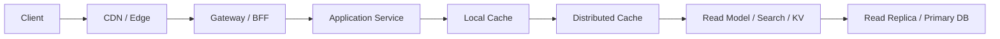

# 系统设计 - 第 2 课补充：读多系统的缓存与读路径优化方法论

## 学习目标（本节结束后你能做到什么）

1. 理解“读 QPS 高”为什么不能直接等价于“加 Redis”。
2. 能把读压力拆成数据库读、聚合计算、下游调用、带宽、热点和尾延迟几类问题。
3. 能根据不同数字区间选择索引、缓存、读副本、CDN、读模型、专用查询系统等方案。
4. 能在面试里说清“缓存什么、加在哪里、命中率是多少、失效后怎么办”。

## 内容讲解（核心概念，用类比、例子、图示说清楚）

在容量估算里，如果你算出：

```text
read_qps >> write_qps
```

很多人的第一反应是：

```text
读多 -> 加 Redis
```

这个回答方向不一定错，但它太短了。面试官真正想听的是：

```text
读多
-> 读压力具体落在哪里
-> 哪段路径重复、昂贵、可复用
-> 用什么手段减少源站读、重复计算和重复传输
-> 代价是一致性、失效、热点和回源保护
```

所以这篇的核心句是：

```text
读多系统的本质，不是缓存题，而是读路径优化题。
```

缓存只是读路径优化的一种手段。

### 一、先用数字判断读 QPS 到了什么阶段

可以沿用第 2 课里的经验线：

| 读 QPS | 判断 | 设计重点 |
| --- | --- | --- |
| `< 1k/s` | 通常压力不大 | 先做索引、分页、字段裁剪、避免 N+1 |
| `1k/s - 50k/s` | 开始影响架构 | 缓存、读副本、批量查询、聚合读模型 |
| `50k/s+` | 通常决定架构 | 多级缓存、CDN、热点隔离、预计算、专用读存储 |

但只看入口读 QPS 还不够。你至少还要算四个衍生数字：

```text
db_read_qps = external_read_qps * cache_miss_rate * read_amplification
bandwidth = external_read_qps * response_size
downstream_calls = external_read_qps * downstream_call_count
hot_key_qps = max_single_key_qps
```

这四个数字会把你带到完全不同的选型。

例如：

```text
external_read_qps = 20k/s
cache_hit_rate = 90%
read_amplification = 5
```

那么数据库或底层存储承受的读压力不是 `20k/s`，而是：

```text
20k/s * 10% * 5 = 10k read ops/s
```

如果响应体平均 `100KB`，出口带宽又是：

```text
20k/s * 100KB = 2GB/s
```

这时你会发现，读多不只是在打数据库，也可能是在打带宽、序列化、下游服务和热点 key。

### 二、读路径要拆开看，不要只盯数据库

一个典型读路径可以拆成这样：



读优化的目标不是让每一层都出现，而是判断哪一层值得出现。

你可以按下面的问题往下推：

```text
这个结果是否能被很多请求复用？
这个结果是否允许短暂不一致？
这个结果是否由多个下游聚合而来？
这个结果是否很大，导致带宽昂贵？
这个结果是否有极端热点？
这个结果是否需要复杂过滤、搜索或排序？
```

答案不同，技术选型不同。

### 三、不同瓶颈对应不同选型

#### 1. 如果瓶颈是数据库读压力

典型信号：

```text
DB CPU 高
慢查询多
连接池打满
buffer pool 命中率下降
读请求重复查同一批对象
```

优先顺序通常是：

```text
索引和 SQL 优化
-> 分页和字段裁剪
-> Cache Aside 缓存热点对象
-> 只读副本
-> 读模型或物化视图
-> 分片或专用 KV 存储
```

这里不要一上来就说分库分表。很多读压力先通过索引、缓存和只读副本就能解决。

面试表达：

```text
如果主要压力是重复读取同一批业务对象，
我会先用 Cache Aside 缓存对象或查询结果，
再用只读副本承接可接受轻微延迟的查询。
如果查询本身是复杂聚合，再考虑物化读模型。
```

#### 2. 如果瓶颈是复杂聚合

典型信号：

```text
一次读请求要查多张表
一次读请求要调用多个服务
需要排序、聚合、过滤、权限拼装
P99 被少数慢下游拖长
```

这时缓存单个对象未必够。你要考虑：

```text
批量查询
并行查询
聚合服务
预计算结果
读模型
物化视图
```

核心判断是：

```text
如果每次请求都现场组装同一个结果，
就应该考虑把组装结果提前算好。
```

这类优化不是为了“少查一次数据库”，而是为了把在线链路从“现场计算”改成“读取已经准备好的视图”。

#### 3. 如果瓶颈是下游调用数

典型信号：

```text
downstream_call_count >= 4
串行调用导致 P99 拉长
某个非核心下游抖动会拖慢整个接口
```

优先考虑：

```text
并行调用
批量接口
聚合层
短 timeout
熔断和降级
把非核心依赖移出同步链路
```

如果下游数量达到 `10+`，就要警惕同步聚合已经太重。更好的方向往往是读模型、预计算或异步派生。这三者分别是什么、怎么做、代价在哪，完整展开见 [02d_读模型、预计算与异步派生方法论](./02d_读模型、预计算与异步派生方法论.md)。

#### 4. 如果瓶颈是响应体和带宽

典型信号：

```text
response_size >= 100KB
bandwidth >= 100MB/s
序列化 CPU 高
移动端加载慢
```

这时 Redis 不一定是第一解。更重要的是减少传输：

```text
分页
字段裁剪
压缩
图片和文件走对象存储 / CDN
按需加载
增量同步
```

如果是公共静态或半静态内容，CDN 往往比源站缓存更关键。因为它同时减少源站带宽和跨地域延迟。

#### 5. 如果瓶颈是热点 key 或热点对象

典型信号：

```text
Top 1% 对象贡献 20%+ 流量
单 key QPS >= 1k/s
单 key QPS >= 10k/s 时通常要专门拆
```

优先考虑：

```text
热点探测
本地缓存
请求合并 singleflight
热点 key 多副本
key 拆分
限流和隔离
缓存预热
```

注意：热点问题不是普通缓存命中率问题。  
即使命中率很高，单个 key 也可能把一个缓存节点、一个分区或一个服务实例打穿。

### 四、缓存对象怎么选

读多系统里，缓存不是一个东西，而是一组选择。

| 缓存对象 | 适合场景 | 主要风险 |
| --- | --- | --- |
| 单对象缓存 | 按 id 查询详情 | 失效和热点 key |
| 列表缓存 | 首页列表、分类列表、查询结果页 | 分页一致性和更新复杂 |
| 聚合结果缓存 | 多表、多服务拼装结果 | 新鲜度和局部失效困难 |
| 静态资源缓存 | 图片、JS、CSS、文件 | 版本管理 |
| 空值缓存 | 防止不存在数据反复穿透 | TTL 不能过长 |
| 权限/配置缓存 | 低频变更、高频读取 | 变更传播和越权风险 |

面试里你最好主动说：

```text
我不会把整个大对象一把缓存。
我会先拆数据的新鲜度和访问模式：
静态部分走 CDN，热点对象走 Redis 或本地缓存，
强一致字段保守处理，聚合结果用读模型或短 TTL。
```

这句话比“加 Redis”成熟很多。下面把它拆开讲清楚。

#### 1. 为什么不能“整个大对象一把缓存”

把一个商品详情、用户主页这样的大对象整体塞进一个缓存 key，会同时踩四个坑：

- **失效粒度太粗**：对象里任何一个字段变，整个缓存就要失效重建。一个高频变化的小字段（比如库存），会把一堆本来很稳定的字段（标题、图片、参数）一起拖下水——命中率被它一个人拉低，回源被放大。
- **新鲜度被最严格的字段绑架**：整对象只能取所有字段里**最短**的 TTL。详情页里库存要秒级，你就不敢给整个详情设长 TTL，于是“一年都不变”的图片和描述也跟着每隔几秒回源一次。
- **体积挤占热点空间**：大对象占内存、占网络带宽，把缓存里宝贵的热点空间挤掉（大对象的带宽和序列化物理代价见 [02b](./02b_容量估算数字背后的物理与数据库原理.md)）。
- **一致性风险**：把价格、库存这种强一致字段缓进去，很容易让某个请求拿着旧值去做下单、扣减这类**不能错**的决策。

所以正确的动作不是“缓 or 不缓”，而是**先把对象拆成几块，每块按自己的特性各缓各的**。

#### 2. 按两个维度拆：新鲜度 × 访问模式

拆的依据就是那句话里的两个词：

- **新鲜度**：这块数据能容忍多旧？几乎不变 / 分钟级可旧 / 秒级 / 必须最新。
- **访问模式**：公共还是个性化？热点还是长尾？只读还是读写？大还是小？

同一个“商品详情”，用这两个维度一拆，就散成处理方式完全不同的几块：

| 字段 | 新鲜度 | 访问模式 | 归宿 |
| --- | --- | --- | --- |
| 图片 / JS / CSS / 富文本描述 | 几乎不变 | 公共、大体积 | **CDN**：扛带宽、离用户近 |
| 标题 / 参数 / 类目等基础信息 | 分钟级可旧 | 公共、热点 | **Redis**；极热点再叠一层**本地缓存**（短 TTL） |
| 价格 | 敏感、会变 | 高频读 | 短 TTL + 写时失效；展示可缓，**下单时读主校验** |
| 库存 | 强一致、高频变 | 高频读写 | **不缓存精确值**（可缓“有货/无货”近似），扣减走主链路 |
| 评论摘要 / 推荐位 | 可分钟级异步 | 聚合 | **读模型**（见 [02d](./02d_读模型、预计算与异步派生方法论.md)）或短 TTL 异步刷新 |
| “你买过 / 猜你喜欢” | 个性化 | 长尾 | 按用户短 TTL，或干脆不缓 |

> 这个案例完整的缓存分层画法见 [03 第七节](./03_缓存、CDN%20与读写链路.md)，这里只演示“按新鲜度拆粒度”这一个动作。

#### 3. 一句话原则 + 反模式

- **原则：缓存粒度跟着“新鲜度边界”走，不跟着“对象边界”走。** 把新鲜度要求一致的字段归成一组，每组各有各的 TTL、各有各的失效策略、各走各的介质。
- **典型反模式**：对一个含强一致字段的页面做整页缓存（full-page cache）。结果要么价格/库存不准，要么 TTL 短到缓存形同虚设。

#### 4. 升级版面试话术

在原话基础上，能再多说一层“为什么”，就明显更成熟：

```text
我不会按对象边界缓存，而是按新鲜度边界拆。
详情页里图片和描述几乎不变又是公共的，走 CDN；
基础信息分钟级可旧、又是热点，走 Redis 加一层本地缓存；
价格、库存这种强一致字段我不缓精确值，展示可以缓，但下单读主校验；
评论、推荐这类聚合结果走读模型或短 TTL 异步刷新。
这样每一块各有各的 TTL 和失效策略，
不会因为一个库存字段，把整个详情页的缓存价值都拖垮。
```

### 五、缓存加在哪里

缓存分层（客户端 / CDN / 本地缓存 / 分布式缓存各承接什么、各自优劣）是缓存课的核心，完整展开见 [03 第二节](./03_缓存、CDN%20与读写链路.md)。这里只强调读多系统选型时的两点：

第一，按“离用户越近，越适合缓存公共、静态、可复用内容；离数据越近，越适合缓存业务对象和聚合结果”来分配职责：

```text
CDN 解决距离和带宽
本地缓存解决极热点和超低延迟
Redis 解决共享热点和减少回源
```

第二，读多系统往往要在 Redis 之上再加一层 **读模型**（物化表 / ES / 宽表 / KV），承接复杂聚合和查询形态——这一层不是“缓存某个对象”，而是“为读专门维护一份数据”，怎么建见 [02d 读模型、预计算与异步派生](./02d_读模型、预计算与异步派生方法论.md)。

### 六、读 QPS 不同阶段的选型路径

#### 1. 读 QPS 小于 1k/s

不要过度设计。优先做：

```text
正确索引
避免全表扫描
分页
字段裁剪
连接池配置
少量本地缓存或 Redis
```

面试里可以说：

```text
这个量级我不会先引入复杂多级缓存。
先保证 SQL、索引、分页和对象大小合理。
因为这时复杂缓存带来的失效成本可能大于收益。
```

#### 2. 读 QPS 在 1k/s 到 50k/s

开始做读路径分层：

```text
Cache Aside
热点对象缓存
只读副本
批量查询
并行聚合
短 TTL 聚合结果缓存
缓存 miss 限流
```

这里必须同步说清：

```text
命中率目标是多少？
缓存失效怎么做？
miss 时会不会集中回源？
数据允许多久不一致？
```

否则“加缓存”就不完整。

#### 3. 读 QPS 大于 50k/s

这时读路径通常成为主设计对象。

常见组合是：

```text
CDN / Edge
应用本地热点缓存
分布式缓存集群
读副本或专用读存储
预计算读模型
热点隔离
回源保护
降级策略
```

如果响应体很大，还要把带宽一起设计：

```text
字段裁剪
分页
压缩
对象存储直传
静态资源 CDN
```

如果热点极端，还要把热点当成单独系统问题：

```text
热点探测
本地缓存
多副本读
请求合并
局部限流
```

### 七、缓存失效和回源保护必须一起讲

读多系统最危险的瞬间，往往不是平时，而是缓存失效、缓存重启或热点突发时。所以在读多系统里选型时，必须把“失效和回源保护”和“加缓存”绑在一起讲，至少覆盖：穿透、击穿、雪崩三类异常，以及 TTL 抖动、singleflight、热点预热、空值/布隆、回源限流、缓存不可用降级。

> 穿透 / 击穿 / 雪崩怎么区分、各自怎么治，以及一致性更新策略，是缓存课的核心，完整展开见 [03_缓存、CDN 与读写链路](./03_缓存、CDN%20与读写链路.md) 第五节。这里只强调读多系统特有的一点：**回源保护和缓存本身同等重要**——缓存就是为了挡住数据库，一旦大面积失效瞬间全部回源，数据库会比“从没有缓存”时被打垮得更快（即所谓“缓存雪崩压垮源站”）。

因此读多系统里最该默认配齐的，是这组“保命”手段：

| 场景          | 读多系统里的保命手段                        |
| ----------- | --------------------------------- |
| 热点 key 突发失效 | 热点不过期 + 后台刷新 + singleflight（合并回源） |
| 大批 key 同时过期 | TTL 加随机抖动 + 多级缓存兜底                |
| 缓存集群整体不可用   | 源站限流 + 降级返回（旧数据/兜底值），保住数据库        |

这三行不是随机排的，它们按**失效范围递增**：单个热 key → 大批 key → 整个集群。范围越大，越要从“维持命中率”转向“保住数据库”。下面逐行拆开。

> 穿透/击穿/雪崩的概念区分见 [03 第五节](./03_缓存、CDN%20与读写链路.md)；这里讲的是读多系统里每个手段**具体怎么工作、为什么需要它**。一个贯穿始终的物理前提：数据库（尤其机械盘）的随机读 IOPS 只有一两百到几万（见 [02b](./02b_容量估算数字背后的物理与数据库原理.md)），所以缓存一旦失守，回源洪峰瞬间就能把它打死——失效处理的第一目标永远是保 DB，不是保命中率。

#### 1. 热点 key 突发失效（击穿）：别让热 key 出现“空窗”

**问题**：一个 QPS 极高的 key 恰好过期那一瞬，本来命中缓存的成千上万请求同时 miss，全部涌向数据库去重建**同一个值**。DB 本来只需算 1 次，现在被打几千次——一个 key 的过期就能瞬间打穿一个分片或拖垮 DB。

三个手段是三道防线，叠着用：

- **热点不过期（逻辑过期）**：物理上不设 TTL，改成在 value 里存一个“逻辑过期时间”。读到发现逻辑过期了，**不删 key**，而是返回旧值 + 异步触发刷新。这样缓存里永远有值，根本不出现“key 不存在”的空窗。代价：可能读到几秒内的旧值。
- **后台刷新（refresh-ahead）**：定时任务或“临近过期主动续”，在热点 key 过期前就把它刷新好，让空窗压根不发生。
- **singleflight（合并回源）**：万一真的 miss 了，用一把锁让**只有一个请求**去回源，其余请求等它的结果共享。把“几千个并发回源”压成“1 次回源”。

逻辑过期负责“不出现空窗”，后台刷新负责“主动续命”，singleflight 是“万一漏了也只打一次”的兜底。

#### 2. 大批 key 同时过期（雪崩·过期型）：别让失效时间“聚集”

**问题**：和击穿的区别在于——击穿是**一个**热 key，雪崩是**一大批** key 在同一时刻集中失效。常见成因是启动时批量预热、或一批 key 都用了相同的固定 TTL，到点一起过期，回源请求瞬间形成尖峰把 DB 压垮。

- **TTL 加随机抖动**：`TTL = base + random(0, jitter)`。这是最根本的预防——把“同一秒一起过期”打散成“在一个时间窗内陆续过期”，直接削平回源尖峰。一行代码，收益最大。
- **多级缓存兜底**：本地缓存 + Redis 两级。即使 Redis 那层一批失效，本地缓存还能挡住一部分流量，给 Redis 重建争取时间。

根因是“失效时间聚集”，抖动正面打散聚集，多级提供第二道防线。

#### 3. 缓存集群整体不可用（雪崩·宕机型）：别让 DB 陪葬

**问题**：Redis 集群挂了、网络分区、或大面积抖动——这是最危险的，因为它不是“一部分 miss”，而是**100% 的读瞬间全部直接砸到 DB**。DB 必然扛不住。此时再谈命中率已经没意义，唯一目标是**别让“缓存的事故”升级成“数据库的事故”**。

- **源站限流**：在 DB 入口放一个限流闸，只放 DB 能稳定承受的 QPS 进去，多余的直接拒绝。宁可拒一部分请求，也要保住 DB 活着。
- **降级返回**：缓存不可用时，返回旧的本地缓存值、默认值、兜底页或“稍后再试”，而不是把所有请求怼到 DB。

核心逻辑很简单：**DB 活着，缓存恢复后系统能自愈；DB 一旦被打死，全盘皆输、恢复更慢。** 所以这一档的取舍是明确的——牺牲部分请求体验，换数据库存活。

### 八、什么时候不该优先缓存

> 哪些数据不该缓存（强一致真相源、低命中率数据、超大对象、高度个性化且变化快），03 第六节已系统讲过，见 [03](./03_缓存、CDN%20与读写链路.md)。

在读多系统里要补一个视角：判断“不该缓存”时，别停在“那就不缓存”，而要回到第三节的瓶颈判断，换用读路径的其他手段——

```text
索引 / 查询改写 / 数据模型调整   （瓶颈在数据库本身）
读写分离 / 只读副本             （读压力大但可接受复制延迟）
异步读模型 / 物化视图           （瓶颈在复杂聚合，见 02d）
专用查询系统（ES / OLAP）       （瓶颈在多条件检索或分析）
限流 / 降级                    （保护底层）
```

成熟的回答不是“到处缓存”，而是知道哪些地方不值得缓存、不缓存时还能用什么。

### 九、面试里的表达模板

可以这样说：

```text
我不会把读 QPS 高直接翻译成 Redis。
我会先看读压力落在哪里：
如果是数据库重复读，先做索引、缓存和读副本；
如果是复杂聚合，考虑读模型或物化视图；
如果是响应体大，优先分页、字段裁剪、压缩和 CDN；
如果是热点 key，做本地缓存、请求合并、多副本和限流隔离。

缓存方案里我会说明缓存对象、TTL、命中率、失效策略和 miss 回源保护。
```

再短一点：

```text
读多系统的核心，是缩短读路径、减少重复计算、减少回源和控制热点。
Redis 只是其中一层，不是完整答案。
```

## 小结（3-5 条关键点）

1. 读 QPS 高时，先判断压力落在数据库、聚合、下游、带宽还是热点上。
2. `db_read_qps = external_read_qps * cache_miss_rate * read_amplification`，这个数字比入口 QPS 更能说明底层压力。
3. 缓存要说清缓存对象、位置、命中率、TTL、失效策略和回源保护。
4. `1k/s - 50k/s` 通常开始做缓存和读副本，`50k/s+` 通常要把读路径作为主架构设计。
5. 成熟选型不是“加 Redis”，而是索引、缓存、CDN、读副本、读模型、专用查询系统的组合取舍。

---

## 检查站：请回答以下问题

1. 为什么读 QPS 高不能直接等价于加 Redis？
2. 如果入口读 QPS 是 `20k/s`，缓存命中率 `90%`，读放大 `5x`，底层 read ops 是多少？
3. 单对象缓存、列表缓存、聚合结果缓存分别适合什么场景？
4. 什么时候应该优先 CDN，而不是 Redis？
5. 如果单 key QPS 达到 `10k/s`，你会如何保护缓存和底层存储？
