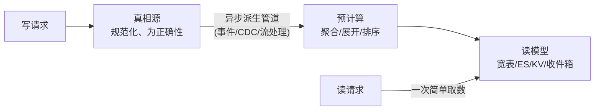

# 系统设计 - 第 2 课补充：读模型、预计算与异步派生方法论

## 学习目标（本节结束后你能做到什么）

1. 理解 [02c](./02c_读多系统的缓存与读路径优化方法论.md) 里那句“下游 10+ 就别同步聚合，改读模型、预计算或异步派生”到底在说什么。
2. 能说清读模型、预计算、异步派生三者的区别与联系，而不是把它们当三个并列名词背。
3. 能落地：给定一个“一次读要聚合很多下游”的场景，能设计出读模型的形态、预计算的时机、异步派生的管道。
4. 能讲清这套做法绕不开的代价：最终一致、读己之写、回填（backfill）、纠错重建、双写一致性、存储放大——这部分才是面试深度所在。

## 这篇文档怎么用

[02c](./02c_读多系统的缓存与读路径优化方法论.md) 在讲“读瓶颈落在下游调用数”时给了一句结论：

> 如果下游数量达到 `10+`，就要警惕同步聚合已经太重。更好的方向往往是读模型、预计算或异步派生。

这篇就专门把这句话展开。先讲为什么同步聚合到 10+ 就是死路，再讲三个替代方案各自是什么、怎么做，最后讲它们共同的代价和选型边界。

---

## 一、先说清楚：为什么“同步聚合 10+ 下游”是死路

“同步聚合”指的是：用户一个读请求进来，你在请求线程里现场去调 A、B、C…十几个下游/查十几张表，拼成结果再返回。

为什么下游一多就崩，[02b](./02b_容量估算数字背后的物理与数据库原理.md) 第二节第 12 条已经从物理层导出过，这里复述结论：

```text
延迟：串行 total = Σ各下游；并行也至少是 max(各下游) + 聚合开销
可用性：每个 99.9%，串行 10 个 = 0.999^10 ≈ 99%，直接掉一个 9
尾延迟：调的下游越多，越大概率至少命中一个慢的，整体 P99 被放大
```

但还有一个更根本的问题，是“并行调用”也救不了的：

> **同步聚合意味着每一次读，都要把全部聚合成本重新付一遍。**

如果这个聚合结果一天被读 100 万次，但底层数据一天只变 1000 次，那你就重复做了约 1000 倍的无用计算。**读多写少的系统，本质上是在为“没变化的数据”反复付聚合费。** 这才是要换思路的根因——不是“调用慢”，而是“算重了，还重复算”。

所以解法的方向只有一个：

> **把计算从“读时”搬到“写时”或“后台”，让读变成一次简单的取数。**

读模型、预计算、异步派生，全都是这个思想的不同侧面。

---

## 二、一个统一心智模型：真相源 vs 派生数据

这三个词容易混，是因为它们在描述同一件事的不同维度。先建立一个统一框架（来自《DDIA》的核心区分）：

- **真相源（system of record / 记录系统）**：权威数据，写在这里才算数。通常是规范化的（normalized）、为正确性和写入设计，比如 MySQL 里的订单表、用户表。
- **派生数据（derived data）**：从真相源算出来的、为读优化的数据。它可以丢、可以重建，因为真相还在记录系统里。**缓存、二级索引、物化视图、搜索索引、Feed 收件箱，全都是派生数据。**

有了这个框架，三个词就各归其位了：

```text
读模型   = 派生数据的「形态」    —— 数据长什么样、放在哪、怎么组织（名词）
预计算   = 派生数据的「时机」    —— 计算在写时/后台提前做掉（强调“算”被提前）
异步派生 = 派生数据的「管道」    —— 用什么机制把真相源的变化同步到派生数据（动词）
```

一句话串起来：

> **异步派生**这条管道，在写发生后，通过**预计算**把真相源的变化算成一个**读模型**，供读取。

举个具体的：CDC 订阅订单表 binlog（异步派生管道）→ 流处理实时聚合出“用户维度的订单汇总”（预计算）→ 写进一张宽表/ES 供主页查询（读模型）。三者是一条流水线，不是三选一。



下面分别讲透每一个。

---

## 三、读模型（Read Model）：为读专门维护一份数据

### 1. 是什么

读模型就是**和写模型解耦、专门按查询形态组织的那份派生数据**。它对应架构里的 CQRS（Command Query Responsibility Segregation，命令与查询职责分离）的“查询端”。

核心动机：写和读想要的数据形态是矛盾的。

- 写想要**规范化**：一处事实存一份，避免更新多处、保证一致性。订单、商品、用户、库存各自一张表。
- 读想要**反规范化**：一次取数就拿到完整结果，别 JOIN、别多次调用。订单详情页想一把拿到订单 + 商品快照 + 用户昵称 + 物流状态。

强行用一份规范化数据同时服务读写，读端就被迫每次现场 JOIN/聚合——也就是上面那个“同步聚合 10+”。读模型的做法是：**让写继续用规范化模型保证正确性，另外维护一份反规范化的数据专门给读。**

### 2. 常见形态

| 形态       | 适合的查询         | 例子                                                      |
| -------- | ------------- | ------------------------------------------------------- |
| 宽表 / 冗余表 | 固定形态的详情、列表    | 把订单 + 商品名 + 用户名拍平成一张 `order_view` 表                     |
| 搜索索引（ES） | 全文检索、多条件过滤、排序 | 商品搜索、订单后台多维度筛选                                          |
| KV / 文档  | 按主键取整个聚合对象    | 用户主页 JSON、商品详情 JSON 直接存 Redis/文档库                       |
| 预聚合表     | 统计、汇总、计数      | 每个用户的订单数/总金额、每个帖子的点赞数                                   |
| 收件箱（写扩散） | 个人时间线         | 每个用户一个 Feed 收件箱（见 [07](./07_社交类题型：Feed、Timeline、聊天.md)） |

### 3. 怎么做（关键决策）

**第一步：按“读的形态”倒推读模型结构。** 不要从表结构出发，要从“前端这个接口想要什么”出发。详情页想要什么字段，读模型就长那样；列表页按什么排序过滤，读模型就建对应的索引/排序键。

**第二步：一个真相源可以派生多个读模型。** 这是读模型最强的地方——同一份订单数据，可以同时维护：一个按用户分片的“我的订单”读模型、一个 ES 里的“后台搜索”读模型、一个按商家聚合的“商家看板”读模型。每个读模型只为一种查询服务，互不拖累。

**第三步：决定读模型怎么被更新**——这就进入了“预计算的时机”和“异步派生的管道”，见下面第四、五节。

### 4. 例子：把“订单详情 10 个下游”干掉

原来同步聚合：读订单详情 → 调订单服务、商品服务、用户服务、物流服务、优惠券服务、评价服务…十来个。

改读模型后：维护一张 `order_detail_view`（或一个 Redis JSON），下单/状态变更时就把需要展示的字段冗余进去。读详情变成**一次主键取数**。物流这种会持续变的字段，要么也异步同步进来，要么单独留一个轻量实时调用，其余全部预先拍平。

---

## 四、预计算（Precompute）：把读时的计算提前做掉

### 1. 是什么

预计算强调的是**“计算”这个动作的时机**：本来在读时算的东西（聚合、展开、排序、计数），提前到写时或后台算好存起来。读模型里那些“需要算”的部分，就是预计算的产物。

判断要不要预计算的关键问题：

> 这个结果，是“每次读都要重算”，还是“底层一变才需要重算”？

如果是后者，而且读远多于写，那就该预计算——把重算的频率从“每次读”降到“每次写”。

### 2. 三种触发时机（核心选择）

| 时机 | 怎么做 | 适合 | 代价 |
| --- | --- | --- | --- |
| 写时同步预计算 | 写请求里顺手更新派生结果 | 派生逻辑简单、扇出小、要求强新鲜 | 增加写延迟；写和派生耦合；扇出大时写被拖垮 |
| 写时异步预计算 | 写完发事件，后台消费者去算 | 扇出大、可接受秒级延迟 | 最终一致；要处理丢失/重复/顺序 |
| 定时批量预计算 | 定时跑批，全量/增量重算 | 统计报表、不要求实时、聚合极重 | 新鲜度差（分钟/小时级）；批任务本身的资源峰值 |

**最常见的误区是无脑选“写时同步”**，结果一个写要同步更新十几个派生结果，写链路被拖垮、还容易因为某个派生失败导致整个写失败。扇出一大，就该转异步（第五节）。

### 3. 写扩散：预计算的典型代表

Feed 系统的“写扩散（fan-out on write）”就是预计算的经典案例：用户发一条帖子时，**就把这条帖子的引用预先写进所有粉丝的收件箱**。这样粉丝刷 Feed 时直接读自己的收件箱（一次取数），不用在读时去聚合“我关注的所有人最近发了什么”。

它的对立面“读扩散（fan-out on read）”就是同步聚合——读时现拉所有关注对象的帖子再合并排序。两者的取舍（大 V 粉丝多导致写扩散爆炸、于是混合方案）详见 [07](./07_社交类题型：Feed、Timeline、聊天.md) 和 [14](./14_Twitter_Feed系统真题模拟.md)。这里要记住的是：**写扩散 = 把读时聚合，预计算成写时扇出。**

### 4. 单点计数/排行也是预计算

“每个帖子点赞数”如果读时 `COUNT(*)`，就是读时聚合；预计算成一个计数器（写时 `INCR`），读时直接取，就是预计算。排行榜用 Redis ZSet 维护有序集合（写时更新分数），而不是读时 `ORDER BY` 全表，也是预计算。对应案例见 [40](./40_点赞系统真题模拟.md)、[44](./44_排行榜系统真题模拟.md)。

---

## 五、异步派生（Async Derivation）：把变化可靠地传到派生数据

### 1. 是什么

异步派生是**实现上面那些读模型/预计算的管道机制**：写只负责把真相写进记录系统，然后通过事件流或日志订阅，异步地把这次变化传播给所有派生数据（读模型、缓存、索引、收件箱），由它们各自更新。

为什么必须异步：扇出大的时候，一次写要更新 N 个派生结果，如果同步做，写延迟 = Σ所有派生更新，而且任意一个派生挂了写就失败。异步化把写链路收窄成“只写真相源 + 发一个事件”，派生更新在后台慢慢追。

### 2. 两条主流管道

**管道 A：应用层事件（Outbox + MQ）**

写业务时，在**同一个本地事务**里，既写业务表，也往 `outbox` 表插一条事件；再由一个投递器把 outbox 里的事件发到 MQ，下游消费者更新各自的读模型。

为什么要 Outbox 而不是“写完库直接发 MQ”：因为“写库”和“发 MQ”是两个系统，没有共同事务，直接双写会出现“库写成功但 MQ 发失败”（派生数据永远丢了这次变化）或反之。Outbox 用一个本地事务保证“业务变更”和“待发事件”原子地一起落库，事件一定不会丢。这套机制（Outbox、消费幂等、顺序、补偿、对账）是 [05](./05_消息队列、异步化与最终一致性.md) 的核心内容，这里只点到它是异步派生的标准底座。

**管道 B：CDC（Change Data Capture，订阅 binlog）**

不改业务代码，直接订阅数据库的变更日志（MySQL binlog / Postgres WAL），用 Debezium 之类的工具把每一行的增删改变成事件流，下游消费来更新派生数据。

Outbox vs CDC 的取舍：

| | Outbox + MQ | CDC（binlog） |
| --- | --- | --- |
| 侵入性 | 要改业务代码（插 outbox） | 几乎无侵入，订阅日志即可 |
| 事件语义 | 业务事件（“订单已支付”） | 数据变更（“order 行 status 从 1→2”） |
| 表达力 | 能带业务意图、聚合多表 | 只有行级变化，要自己拼语义 |
| 适合 | 需要业务语义的派生、跨服务 | 同库内建索引/宽表、数据同步、迁移 |

### 3. 加上流处理

如果派生不只是“原样搬运”，还要做聚合/join/窗口统计（比如“每个用户最近 7 天下单金额”），就在管道中间加流处理（Flink、Kafka Streams）：消费变更事件，做有状态的增量聚合，再写进读模型。这就是“流式物化视图”——和数据库的物化视图是一回事，只是自己用流处理增量维护，能做到秒级新鲜且支持复杂聚合。

### 4. 三个必须处理的工程问题（面试必问）

异步派生是最终一致的，所以这三件事躲不掉：

- **幂等**：同一个事件可能被投递多次（at-least-once）。消费者更新读模型必须幂等——用版本号/序列号做条件更新，或天然幂等的覆盖写（直接 set 整个对象，而不是 +1）。
- **顺序**：同一个实体的多次变更要按序应用，否则旧状态会覆盖新状态。常见做法是按实体 key 分区保证分区内有序，或在读模型上带版本号、只接受更高版本。
- **可重建**：派生数据能丢，因为能从真相源重放重建。这既是优点（修 bug、改 schema 就重放一遍）也是要求（必须保留重放能力——事件可回溯，或能从真相源全量回扫）。

---

## 六、串起来：一个完整例子

需求：用户主页要展示「基本信息 + 最近订单 + 订单总数/总额 + 优惠券 + 积分等级」，原来要同步调 6-8 个服务，P99 经常被某个慢服务拖到 1 秒+。

改造：

```text
真相源：user 表、order 表、coupon 表、point 表（各自规范化，保证写正确）

异步派生管道：
  各服务写完，通过 Outbox 发出业务事件（UserUpdated / OrderPaid / CouponGranted / PointChanged）
  或：CDC 订阅这几张表的 binlog

预计算：
  一个消费者订阅这些事件，增量维护：
    - 订单总数、总额（来一笔 OrderPaid 就累加 -> 预聚合）
    - 最近 5 笔订单的快照（覆盖写 -> 读模型片段）
    - 积分等级（PointChanged 时重算等级）

读模型：
  一个 user_home_view（KV/文档，按 user_id 主键），存上面所有拍平后的字段

读路径：
  主页请求 = 一次按 user_id 的取数，P99 降到个位数毫秒
```

效果：把“每次读付 8 次下游调用”变成“每次写付一点派生成本 + 每次读一次取数”。读写比越高，收益越大。

---

## 七、绕不开的代价（这才是深度）

把计算搬到写时/后台不是免费的，面试官一定会追这几点：

1. **最终一致**：读模型落后真相源几十毫秒到几秒。要明确哪些字段能接受、哪些不能（金额、库存、权限通常不能用滞后的派生值做决策）。
2. **读己之写（read-your-writes）**：用户刚改完资料，立刻刷新主页，可能读到旧的读模型。常见兜底：写成功后短时间内该用户读真相源/绕过读模型，或前端乐观更新先显示用户自己刚提交的值。
3. **回填（backfill）**：读模型是新加的或改了结构时，存量数据不在里面。必须有一次全量回填（从真相源扫一遍灌进读模型），且要能和实时增量流不打架（常用：先开实时双写，再回填历史，靠幂等去重）。
4. **纠错与重建**：派生逻辑有 bug，写出来一批错的读模型。靠“可重放”修复：修好逻辑，重放事件或全量重扫真相源，重建读模型。所以前面强调可重建是硬要求。
5. **双写/一致性收敛**：异步派生天然有“真相源已变、读模型还没追上甚至追错”的窗口。要有**对账**机制定期校验读模型和真相源是否一致，并能自动修复。
6. **存储放大**：一份真相源派生出多个读模型，存储成本翻几倍。一个写要触发多处派生更新，写放大变大（这正好接回 [02b](./02b_容量估算数字背后的物理与数据库原理.md) 里“写放大”这个乘数）。

一句话：**读模型/预计算/异步派生，是用空间、一致性窗口和系统复杂度，去换读延迟和读吞吐。** 读多写少时这笔买卖划算，读写均衡或强一致场景就要谨慎。

---

## 八、怎么选：从“同步聚合”往上走的阶梯

不要一上来就上异步派生读模型，它复杂度最高。按这个阶梯逐级升级：

```text
1. 同步串行调用       —— 下游 1-3 个，够用就别动
2. 同步并行 + 批量    —— 下游 4-10 个，先用并行/批量接口/聚合层压住（02c 的方案）
3. 缓存聚合结果       —— 结果可短暂复用、能接受短 TTL 滞后，先加缓存（03）
4. 预计算读模型       —— 下游 10+、聚合重、读远多于写、能接受最终一致，才上异步派生
```

升级的触发条件，本质是这两个问题：

```text
聚合结果的「读 / 写」比有多高？   越高，预计算越划算（重复计算被省得越多）
能接受多大的一致性窗口？          能接受秒级滞后，才用得了异步派生
```

如果读写比不高（结果几乎每次读都变），预计算省不下计算，反而徒增复杂度，老老实实同步并行 + 缓存就好。

---

## 九、面试表达模板

```text
这个接口要聚合 ___ 个下游，同步聚合的问题不只是慢，
而是每次读都把全部聚合成本重付一遍，而底层数据其实很少变。

所以我会把它做成派生数据：
  真相源保持规范化（___ 表），保证写入正确；
  通过 ___（Outbox 事件 / CDC binlog）异步派生；
  在写时/后台预计算出 ___（聚合值/拍平的快照），
  落到一个按 ___ 主键的读模型（宽表 / ES / KV）；
  读路径变成一次取数。

代价我也说清楚：它是最终一致的，落后真相源 ___ 级别；
所以 ___ 这类强一致字段我不放进读模型；
读己之写我用 ___ 兜底；
另外要有回填和对账，保证读模型能重建、能和真相源收敛。
```

---

## 小结（关键点）

1. 同步聚合 10+ 下游的根因不是“调用慢”，而是“每次读都重复付全部聚合成本”，读多写少时极度浪费。
2. 用一个统一框架理解三者：真相源 vs 派生数据。读模型是派生数据的**形态**，预计算是它的**时机**，异步派生是它的**管道**，三者是一条流水线而非三选一。
3. 读模型 = 为读专门维护的反规范化数据（CQRS 读端），一个真相源可派生多个读模型，按查询形态倒推结构。
4. 预计算 = 把读时计算提前到写时/后台，三种时机（写时同步、写时异步、定时批量），写扩散和计数器/排行榜都是典型。
5. 异步派生 = 可靠传播变化的管道，两条主流：Outbox+MQ（业务语义、需改代码）和 CDC binlog（无侵入、行级变更），复杂聚合再加流处理；必须处理幂等、顺序、可重建。
6. 代价是核心考点：最终一致、读己之写、回填、纠错重建、对账、存储与写放大。本质是用空间+一致性窗口+复杂度换读性能。
7. 选型走阶梯：同步串行 → 同步并行/批量 → 缓存 → 预计算读模型，由“读写比”和“可接受的一致性窗口”决定升到哪一级。

---

## 检查站：请回答以下问题

1. 用“真相源 vs 派生数据”这个框架，分别说明读模型、预计算、异步派生各自处在哪个位置，它们是怎么串成一条流水线的。
2. 为什么说“同步并行调用”能缓解延迟，却没有解决同步聚合的根本问题？根本问题是什么？
3. 预计算有三种触发时机，请各举一个例子，并说明扇出很大时为什么不该选“写时同步”。
4. Outbox+MQ 和 CDC binlog 两条异步派生管道，分别适合什么场景？为什么不能简单地“写完库直接发 MQ”？
5. 异步派生是最终一致的，请说出至少三个你必须处理的工程问题，以及对应的兜底手段。
6. 给你一个“用户主页聚合 8 个下游、P99 1 秒”的场景，请用第九节的模板完整讲一遍你的方案，包括代价。

请把你的答案直接告诉我，我会根据你的回答决定下一步。
