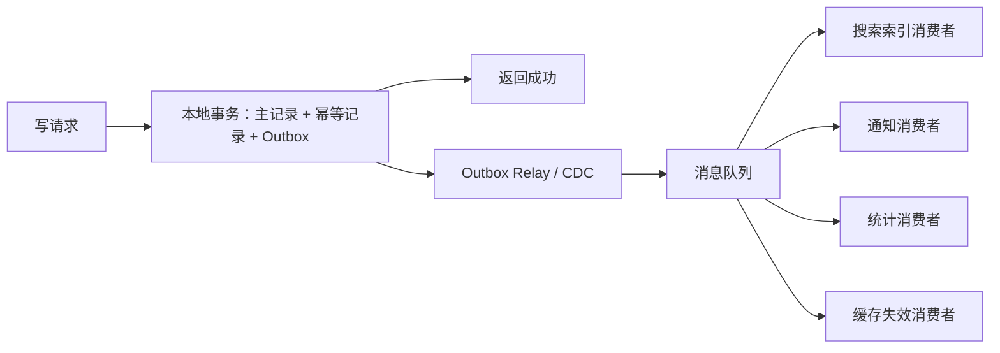

# 系统设计 - 第 2 课补充：写放大高系统的异步解耦、批处理与索引控制方法论

## 学习目标（本节结束后你能做到什么）

1. 理解“写 QPS 高”和“写放大高”是两类不同问题。
2. 能把一次业务写入拆成主写入、索引更新、缓存失效、事件投递、通知、统计、审计和下游副作用。
3. 能根据写放大倍数选择同步事务、Outbox、消息队列、批处理、CDC、物化视图和索引控制。
4. 能在面试里说清“哪些必须同步，哪些可以异步，异步后如何保证幂等、顺序、补偿和可观测”。

## 目录索引

1. [先区分：写 QPS 高 vs 写放大高](#一先区分写-qps-高-vs-写放大高)
2. [用数字判断写放大到了什么阶段](#二用数字判断写放大到了什么阶段)
3. [写放大要拆成哪几类](#三写放大要拆成哪几类)
4. [同步边界怎么划](#四同步边界怎么划)
5. [不同阶段怎么做技术选型](#五不同阶段怎么做技术选型)
6. [索引控制为什么是写放大治理的一部分](#六索引控制为什么是写放大治理的一部分)
7. [批处理和合并写什么时候值得用](#七批处理和合并写什么时候值得用)
8. [常见风险与面试追问](#八常见风险与面试追问)
9. [面试表达模板](#九面试表达模板)

## 内容讲解（核心概念，用类比、例子、图示说清楚）

容量估算里经常会出现这个现象：

```text
external_write_qps 看起来不高
internal_write_ops 却很高
```

例如用户只是点了一次“发布”：

```text
写主记录
更新计数
写审计日志
发送事件
刷新缓存
更新搜索索引
通知关注者
写推荐特征
写埋点日志
```

外部看是一次写，内部可能是十几次甚至上百次写。这就是写放大。

所以这篇的核心句是：

```text
写放大高系统的本质，不是单纯提高数据库写入能力，而是控制同步写路径，把副作用拆出去，并限制每一次写入带来的连锁成本。
```

### 一、先区分：写 QPS 高 vs 写放大高

写 QPS 高，关注的是：

```text
每秒有多少外部写请求
主表能不能写进去
事务冲突大不大
热点 key 是否严重
```

写放大高，关注的是：

```text
一次外部写会变成多少内部写
多少下游要被同步调用
多少索引要更新
多少事件要投递
多少缓存要失效
失败后怎么补偿
```

两者会叠加，但不是同一件事。

公式可以这样估：

```text
internal_write_ops = external_write_qps * write_amplification
downstream_ops = external_write_qps * downstream_fanout
index_update_ops = external_write_qps * index_count
storage_growth = external_write_qps * avg_event_size * amplification * 86400
```

例如：

```text
external_write_qps = 2k/s
write_amplification = 15
```

内部写操作就是：

```text
2k/s * 15 = 30k ops/s
```

如果其中有 5 个动作在同步链路里，每个动作 P99 50ms，还会把尾延迟和失败率一起放大。

### 二、用数字判断写放大到了什么阶段

可以沿用第 2 课里的经验线：

| 读/写放大系数 | 判断 | 设计重点 |
| --- | --- | --- |
| `< 3x` | 通常压力不大 | 同步事务、少量索引、简单事件、失败直接返回 |
| `3x - 20x` | 开始影响架构 | 同步链路瘦身、Outbox、MQ、消费者幂等、批量处理、索引异步 |
| `20x+` | 通常决定架构 | 事件驱动、分层写模型、fanout 控制、批处理管道、物化视图、热点隔离 |

这个表的关键不是背数字，而是看“放大后的内部压力”是否已经超过主链路承受能力。

你可以用两句话判断：

```text
如果放大后的内部写还能被一个同步事务稳定承载，就保持简单。
如果一次写开始牵动很多下游，主链路就必须变瘦。
如果写放大本身远大于用户请求量，异步管道和物化结果会成为主架构。
```

### 三、写放大要拆成哪几类

写放大通常不是一个原因，而是几类叠加。

| 类型         | 例子                | 常见治理手段                   |
| ---------- | ----------------- | ------------------------ |
| 多表写放大      | 主表、状态表、计数表、审计表    | 缩小事务边界、Outbox、状态聚合       |
| 索引写放大      | 多个二级索引、搜索索引、排序索引  | 减少在线索引、异步建索引、读模型         |
| fanout 写放大 | 通知关注者、投递多个终端      | 异步队列、fanout-on-read、批量投递 |
| 缓存失效放大     | 多个缓存 key 要删除或刷新   | 版本号、延迟双删、按对象失效           |
| 统计写放大      | 计数、报表、排行榜、特征      | 流处理、批处理、近实时聚合            |
| 日志写放大      | 审计、埋点、binlog、操作日志 | 追加写、压缩、分层存储              |
| 重试放大       | 下游失败后重复发送         | 幂等 key、退避重试、死信队列         |

面试里不要只说“用 MQ 解耦”。更好的说法是：

```text
我会先把一次写入拆成核心状态变更和副作用。
核心状态同步完成，副作用通过 Outbox/MQ/CDC 异步推进。
```

### 四、同步边界怎么划

这是写放大题最重要的判断。

可以用一个问题切开：

```text
这个动作不完成，用户看到的业务承诺是否成立？
```

如果不成立，就留在同步链路里。

如果成立，就尽量异步。

#### 通常应该同步的内容

- 创建主记录
- 更新核心状态
- 扣减库存、余额、额度这类强一致资源
- 写入幂等记录
- 写 Outbox 事件
- 返回给用户前必须可见的最小结果

#### 通常可以异步的内容

- 通知
- 搜索索引更新
- 推荐特征更新
- 统计报表
- 审计归档
- 缓存预热
- 多端弱一致同步
- 非核心下游回调

一个常见结构是：



这里最关键的是：主记录和 Outbox 必须在同一个本地事务里提交，避免“数据库写成功，但消息没发出去”的裂缝。

> Outbox / CDC 保证事件不丢的机制，以及消费端幂等、消息顺序、最终一致性收敛，是第 5 课的核心，完整展开见 [05 消息队列、异步化与最终一致性](./05_消息队列、异步化与最终一致性.md) 第五到九节。本篇不重复这些通用机制，只聚焦写放大视角：一次写到底该把哪些放进同步链路、哪些副作用拆出去、怎么按放大倍数选型。

### 五、不同阶段怎么做技术选型

#### 1. `< 3x`：通常压力不大

这个阶段，保持简单通常更好。

可以选：

- 单个本地事务完成主写入
- 少量必要索引
- 少量同步校验
- 简单异步任务处理非关键副作用
- 基础幂等 key 防重复提交

不要过早引入：

- 很多 topic
- 复杂事件编排
- 多套最终一致性补偿
- 所有东西都异步，导致读写状态难理解

面试里可以说：

```text
如果一次写入只放大到 2 到 3 次内部写，而且同步链路可控，
我会先用本地事务和少量索引解决，避免为了“解耦”引入过多异步复杂度。
```

#### 2. `3x - 20x`：开始影响架构

这个阶段，写放大会开始影响延迟、失败率和数据库压力。

常见选择：

- 同步链路只保留核心状态
- 本地事务写主记录 + Outbox
- Outbox Relay 或 CDC 把事件投到 MQ
- 下游消费者各自幂等
- 搜索、通知、统计、缓存刷新异步执行
- 对高频事件做批量消费
- 控制在线二级索引数量
- 用 lag、DLQ、重试次数监控异步健康

面试里要补一句：

```text
异步不是丢给 MQ 就完事，我会定义事件唯一键、消费者幂等、重试退避、死信队列和对账补偿。
```

这个阶段的关键图可以这样描述：

```text
同步路径：校验 -> 主写入 -> Outbox -> 返回
异步路径：投递 -> 消费 -> 幂等处理 -> 重试/死信 -> 对账
```

#### 3. `20x+`：通常决定架构

这个阶段，写放大已经是主矛盾。

典型场景：

- 一个写事件要扇出给大量用户或设备
- 一个订单状态变化触发很多履约、支付、通知、对账动作
- 一个内容发布要更新搜索、推荐、Feed、计数、审核、风控
- 一个设备事件要进入实时告警、画像、报表、归档多条链路

常见选择：

- 事件驱动架构成为核心
- 按业务域拆 topic 和消费者组
- 写入追加日志，多个读模型异步构建
- fanout 改为按需读、分层 fanout 或热点单独处理
- 计数、统计、排行榜改成流式聚合或批处理
- 搜索/推荐/分析系统从主库异步构建
- 对单 key 热点做聚合、分片或限流
- 明确最终一致性窗口，例如秒级、分钟级

面试表达可以是：

```text
当写放大超过 20x，我会把系统设计成“核心写入 + 事件管道 + 多个异步读模型”，
而不是让一个同步请求串行调用所有下游。
```

### 六、索引控制为什么是写放大治理的一部分

索引不是免费的读优化。每多一个在线索引，写入时都要多维护一份结构。

在写放大高的系统里，索引控制要主动讲：

```text
哪些查询真的走在线索引？
哪些查询可以走搜索系统？
哪些查询可以走离线报表？
哪些字段只是展示字段，不应该建索引？
```

常见原则：

- OLTP 表只保留主路径索引。
- 不为低频后台查询无限加二级索引。
- 频繁更新字段慎建索引，因为每次更新都要改索引。
- 搜索、多条件筛选、模糊查询交给搜索系统或专门读模型。
- 历史数据的索引可以降级或归档，不必和热数据一样完整。
- 对写多读少的表，索引越少越好。

可以这样回答：

```text
如果写放大已经很高，我会把索引也当成写成本来算。
在线库只服务核心查询，复杂检索通过异步构建的搜索索引或读模型承接。
```

### 七、批处理和合并写什么时候值得用

批处理不是为了显得高级，而是为了把很多小写变成少量大写，降低网络、锁、事务和索引更新开销。

适合批处理的情况：

- 单条写入不要求立即可见
- 事件量大但可以接受秒级或分钟级延迟
- 多个事件可以合并成一个最终状态
- 下游支持批量接口
- 统计、计数、报表、特征更新这类场景

不适合批处理的情况：

- 用户提交后必须立刻确认强一致结果
- 库存、余额、额度这类不能延迟的核心资源
- 单条失败需要立刻返回明确错误
- 顺序和隔离要求非常强，但批处理无法保证

常见手段：

| 手段 | 适用场景 | 代价 |
| --- | --- | --- |
| micro-batch | 秒级聚合写入 | 有可见性延迟 |
| debounce | 同一个对象短时间多次更新只写最后一次 | 中间状态不可见 |
| coalescing | 多个计数增量合并 | 需要处理丢失和重放 |
| bulk API | 下游支持批量写 | 单批失败要拆分重试 |
| buffer + flush | 内存或本地 buffer 后刷盘 | 进程崩溃要有恢复策略 |

比如点赞计数不一定每次都同步落库：

```text
Redis / 本地聚合记录增量
-> 每 N 秒 flush 到数据库
-> 定期对账修正
```

但订单创建、扣库存、扣余额一般不能这么处理。

### 八、常见风险与面试追问

#### 风险 1：MQ 只转移压力，不消灭压力

MQ 可以削峰和解耦，但最终下游还是要处理这些写入。

应对：

- 监控 consumer lag
- 消费端水平扩展
- 批量消费
- 限制生产速度或做背压
- 对低优先级任务降级

#### 风险 2：异步后用户看到不一致

例如订单成功了，但搜索不到；发布成功了，但通知还没到。

应对：

- 明确一致性窗口
- 前端展示处理中状态
- 查询主路径读主表，非关键结果等异步
- 对关键派生结果做补偿扫描

#### 风险 3：重复消息导致重复副作用

异步系统默认要按“至少一次”来设计。

应对：

- 事件带 event_id
- 消费者维护 processed_event 或业务幂等 key
- 写入使用 upsert / compare-and-set
- 外部调用带 idempotency key

#### 风险 4：顺序错乱

同一对象的多个事件可能乱序到达。

应对：

- 按 object_id 分区
- 事件带 version / sequence
- 消费端丢弃旧版本
- 必要时用补拉主状态修正

#### 风险 5：索引和派生模型追不上

应对：

- 监控 indexing lag
- 对高优先级事件单独队列
- 支持全量 rebuild
- 支持按时间范围补偿重放

### 九、面试表达模板

你可以这样说：

```text
写放大大时，我会先把一次业务写入拆成核心状态变更和副作用。
核心状态，比如主记录、幂等记录、关键状态，会放在同步事务里完成；
通知、搜索索引、统计、缓存刷新、审计归档这类副作用，尽量通过 Outbox/MQ/CDC 异步处理。

如果放大系数小于 3x，我会保持简单，用本地事务和少量索引。
如果到 3x 到 20x，同步链路就要瘦身，引入 Outbox、消息队列、消费者幂等、重试和死信。
如果超过 20x，写放大本身会决定架构，我会把系统拆成核心写入、事件管道和多个异步读模型，
同时用批处理、合并写、fanout 控制和索引控制降低总写成本。

这里的 trade-off 是：同步链路越短，用户请求越稳定，但派生结果会有延迟；
所以我要明确哪些结果必须立即一致，哪些允许秒级或分钟级最终一致。
```

## 检查站

看到“写放大很大”，你应该立刻问自己：

1. 外部写 QPS 是多少？
2. 一次写入会触发多少内部写？
3. 哪些动作必须同步完成？
4. 哪些动作可以异步或批处理？
5. 是否有 Outbox 或 CDC 保证事件不丢？
6. 消费者是否幂等？
7. 消息乱序和重复如何处理？
8. 索引数量是否已经成为写入成本？
9. 异步结果的 lag 是否可观测？
10. 失败后是重试、死信、补偿，还是人工处理？
