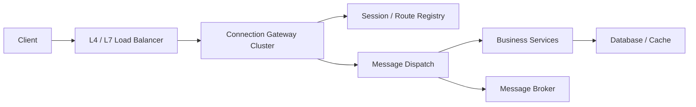

# 系统设计 - 第 2 课补充：连接数高系统的连接网关与接入层方法论

## 学习目标（本节结束后你能做到什么）

1. 理解“并发连接数高”和“请求 QPS 高”是两类不同问题。
2. 能说明为什么在线连接数到一定规模后，连接网关会成为主设计对象。
3. 能根据连接数、新建连接速率、心跳频率、消息吞吐、带宽和重连风暴做技术选型。
4. 能讲清连接网关、API Gateway、业务服务、消息队列和状态存储的边界。

## 内容讲解（核心概念，用类比、例子、图示说清楚）

容量估算里有一类数字很容易被低估：

```text
online_connections
```

很多人习惯只算 QPS，但长连接系统里，真正决定架构的可能不是每秒请求数，而是：

```text
同时有多少连接要维持
每个连接多久发一次心跳
连接断开后如何重连
消息如何找到用户所在的连接
慢连接如何背压
网关节点下线时如何迁移
```

所以这篇的核心句是：

```text
连接数高时，系统主矛盾会从业务处理转移到接入层和连接状态管理。
```

这就是“连接网关成为主设计对象”的意思。

### 一、先区分：请求 QPS 高 vs 连接数高

请求 QPS 高，通常关注：

```text
每秒多少请求
每个请求查多少数据
延迟和吞吐
数据库、缓存、下游服务压力
```

连接数高，关注的是：

```text
有多少长生命周期连接
每条连接占多少内存和 fd
心跳和保活成本
连接路由状态在哪里
如何处理重连风暴
如何对慢客户端做背压
```

这两类问题的技术武器不同。

如果你面对的是普通 HTTP API：

```text
请求来了 -> 处理 -> 返回 -> 连接可复用或释放
```

重点可能是 API Gateway、缓存、数据库和下游调用。

如果你面对的是 WebSocket、实时推送、长轮询、协作编辑、在线状态、实时通知：

```text
连接建立后长期存在
服务端需要主动找到这条连接
连接状态本身就是系统资源
```

这时连接网关就会成为核心。

### 二、先用数字判断连接压力到了什么阶段

沿用第 2 课里的经验线：

| 并发连接数 | 判断 | 设计重点 |
| --- | --- | --- |
| `< 10 万` | 通常压力不大 | 简单网关集群、基础心跳、连接监控 |
| `10 万 - 100 万` | 开始影响架构 | 专门连接层、路由状态、心跳调优、优雅下线 |
| `100 万+` | 通常决定架构 | 分片接入、多区域/多 cell、重连风暴治理、独立容量规划 |

但在线连接数只是第一个数字。你还要继续算：

```text
heartbeat_qps = online_connections / heartbeat_interval_seconds
memory = online_connections * memory_per_connection
fd_count = online_connections
new_conn_qps = reconnect_connections / reconnect_window_seconds
outbound_bandwidth = outbound_msg_qps * avg_msg_size
```

例如：

```text
online_connections = 300 万
heartbeat_interval = 30 秒
```

心跳流量就是：

```text
300 万 / 30 = 10 万 heartbeat/s
```

如果每条连接运行时状态粗估 `50KB`：

```text
300 万 * 50KB = 150GB
```

这还没有算消息缓冲、TLS、内核 socket buffer、日志和指标。  
所以连接系统里，“什么都不做，只是维持连接”本身就是很大的工程问题。

### 三、连接网关到底负责什么

连接网关不是普通业务服务，也不是万能网关。

它的主要职责是：

```text
协议接入
连接维持
认证后的会话绑定
心跳和超时
连接路由
消息下发
背压和限流
连接迁移和优雅下线
连接级监控
```

它通常不应该负责：

```text
复杂业务决策
重业务聚合
长事务
强状态业务规则
复杂数据库查询
```

一个常见架构可以这样看：



连接网关承接的是“连接和投递”问题，业务服务承接的是“业务语义”问题。

### 四、连接网关和 API Gateway 的区别

它们都叫 Gateway，但关注点不同。

| 对比项 | API Gateway | 连接网关 |
| --- | --- | --- |
| 主要流量 | 短请求 / 响应 | 长连接 / 双向消息 |
| 状态特点 | 尽量无状态 | 必须维护连接状态 |
| 核心指标 | RPS、P99、路由、认证、限流 | 在线连接数、心跳、重连、连接路由 |
| 故障恢复 | 请求重试即可 | 客户端要重连，路由状态要更新 |
| 典型协议 | HTTP、gRPC | WebSocket、TCP、自定义长连接、长轮询 |

面试里你可以这样说：

```text
API Gateway 主要治理请求入口；
连接网关主要治理长生命周期连接。
连接数很高时，连接本身就是资源和状态，
所以不能只按普通无状态 HTTP 服务设计。
```

### 五、不同瓶颈对应不同选型

#### 1. 如果瓶颈是连接规模

典型信号：

```text
online_connections >= 10 万
fd 数接近上限
内存随连接数线性上涨
GC 或事件循环延迟变高
```

优先考虑：

```text
事件驱动网络模型
连接网关独立部署
水平扩展
连接按用户、租户或区域分片
内核参数和 fd 上限调优
连接级限流
```

技术选择上，常见方向是：

```text
Netty / Go netpoll / Erlang VM / Nginx stream / Envoy 等事件驱动模型
```

关键不是具体语言，而是不能用“一连接一线程”的模型去扛百万连接。

#### 2. 如果瓶颈是心跳和保活

典型信号：

```text
连接很多，但业务消息不多
CPU 大量消耗在心跳解析和状态更新
心跳写数据库或强一致存储
```

优先考虑：

```text
心跳间隔调优
轻量心跳协议
网关本地更新时间
在线状态 TTL
批量上报
避免每次心跳写数据库
```

心跳的设计重点是：

```text
它应该证明连接还活着，
而不是每次都触发一条重业务写入。
```

例如 `300 万` 在线连接，如果 `30 秒` 心跳一次，就是 `10 万/s`。  
如果每次心跳都写数据库，数据库会被一件没有业务价值的事情打爆。

#### 3. 如果瓶颈是连接路由

连接系统里，服务端经常需要回答：

```text
某个 user_id 现在连在哪台 gateway 上？
某个 session_id 对应哪条连接？
某个租户或房间有哪些在线连接？
```

常见方案：

```text
gateway 本地维护连接表
中心 registry 存 user_id -> gateway_id
registry 用 TTL / lease 自动过期
消息投递先查路由，再发到对应 gateway
```

这里的关键是：

```text
路由状态是短生命周期状态，不应该当成永久业务数据。
```

所以它通常更适合：

```text
Redis / etcd / 专用 presence store / 内存注册表 + TTL
```

而不是每次上线下线都强依赖关系数据库事务。

#### 4. 如果瓶颈是服务端下发

典型信号：

```text
单条业务事件要推给很多在线连接
某些用户或房间非常热
出站带宽高
某些客户端消费很慢
```

优先考虑：

```text
gateway 本地 fanout
按 room / topic 分区
消息 broker 解耦业务生产和连接投递
每连接发送队列
慢客户端丢弃或降级
出站限流
```

注意，MQ 可以帮助“消息生产”和“投递执行”解耦，但 MQ 不能替代连接网关。  
最后把消息写进 socket 的，仍然是连接网关。

#### 5. 如果瓶颈是重连风暴

典型信号：

```text
网关节点重启
机房网络抖动
App 版本异常
大量客户端在几秒内同时重连
```

优先考虑：

```text
客户端指数退避
重连随机抖动
入口限流
连接 admission control
分批恢复
网关优雅下线 draining
过载时快速拒绝
```

重连风暴非常容易被低估。  
平时 `100 万` 连接不代表重连时只有 `100 万` 连接请求。网络抖动后，可能在几十秒内产生几倍于平时的新建连接压力。

### 六、连接数不同阶段的选型路径

#### 1. 并发连接数小于 10 万

通常可以先保持简单：

```text
少量网关节点
基础负载均衡
心跳和超时
连接数监控
简单在线状态
```

这个阶段最重要的是把边界建对：

```text
连接层不要混入太多业务逻辑。
```

#### 2. 并发连接数在 10 万到 100 万

开始需要专门连接层：

```text
连接网关独立集群
连接路由 registry
心跳轻量化
在线状态 TTL
优雅下线
慢连接背压
连接级指标
```

这时你要重点回答：

```text
用户连接在哪台机器？
业务服务如何找到这条连接？
网关挂了以后怎么恢复？
大量客户端重连如何保护入口？
```

#### 3. 并发连接数大于 100 万

连接网关通常成为主架构对象。

常见设计会进一步升级：

```text
按区域 / 租户 / 用户 hash 分 cell
多网关集群隔离
连接路由分片
消息投递分区
独立容量池
重连风暴治理
灰度和 draining 能力
端到端连接观测
```

此时系统设计的主线不是“业务服务怎么写”，而是：

```text
如何稳定维护海量连接，并把消息准确、低延迟、可控地送到连接上。
```

### 七、连接网关的核心数据结构

面试里可以简单讲几个关键状态：

```text
connection_id
user_id / device_id
gateway_id
session_id
last_heartbeat_at
auth_context
subscriptions
send_queue
```

本地连接表：

```text
connection_id -> socket / channel
user_id -> connection_ids
topic / room -> connection_ids
```

中心路由表：

```text
user_id -> gateway_id
session_id -> gateway_id
gateway_id -> health / load
```

这些状态的生命周期不同：

| 状态 | 生命周期 | 存储倾向 |
| --- | --- | --- |
| socket/channel | 跟连接一样长 | 网关内存 |
| user 到 gateway 路由 | 短生命周期 | TTL / lease store |
| 订阅关系 | 连接期或会话期 | 网关内存 + 必要时外部存储 |
| 权威业务数据 | 长生命周期 | 业务数据库 |
| 离线消息 | 可恢复数据 | 消息存储 / DB / MQ |

关键原则：

```text
连接状态放接入层和短期状态存储；
业务真相源放业务系统；
不要把高频心跳和连接瞬态变化写进强事务主库。
```

### 八、连接系统里的背压和降级

连接数高时，慢客户端是一个很真实的问题。

如果某个客户端网络很差，服务端一直给它堆消息，就会造成：

```text
连接发送队列变长
网关内存上涨
事件循环被慢连接拖累
最终影响正常连接
```

常见策略：

```text
每连接发送队列上限
超过上限丢弃非关键消息
关键消息转离线存储
慢连接断开重连
按用户 / 租户限速
按消息类型降级
```

你要区分消息类型：

| 消息类型 | 降级方式 |
| --- | --- |
| 强业务消息 | 持久化，客户端补拉 |
| 状态提示 | 可以合并、覆盖、丢弃旧值 |
| 高频刷新 | 降采样、限速 |
| 通知类消息 | 可转离线通知或稍后重试 |

这比笼统说“加 MQ”更准确。

### 九、面试里的常见误区

#### 误区 1：只算 QPS，不算在线连接

长连接系统里，即使业务消息很少，连接本身也消耗 fd、内存、心跳和路由状态。

#### 误区 2：每次心跳都写数据库

心跳是高频保活信号，通常应该轻量化，用 TTL 或批量上报，而不是进入强事务主库。

#### 误区 3：把连接网关做成业务巨石

连接网关越靠入口，越应该克制。它可以做认证、路由、投递、背压，但不适合塞复杂业务规则。

#### 误区 4：没有考虑重连风暴

百万连接系统真正危险的时刻，往往是网络抖动和节点重启后的集中重连。

#### 误区 5：没有慢客户端保护

一个慢连接不应该拖垮一个网关节点，更不应该拖垮整个集群。

### 十、面试里的表达模板

可以这样说：

```text
如果在线连接数很高，我不会只按普通 HTTP QPS 设计。
我会把连接层独立出来，设计连接网关集群。

连接网关负责协议接入、连接维持、心跳、路由、消息下发和背压；
业务服务负责业务语义；
短生命周期的连接路由用 TTL / lease 状态维护，
权威业务数据仍然放业务存储。

容量上我会继续估：
在线连接数、心跳 QPS、新建连接速率、每连接内存、出站带宽和重连风暴。
如果连接数到百万级，连接网关、路由状态、优雅下线和重连治理会成为主设计对象。
```

再短一点：

```text
连接数高的核心不是“处理请求”，而是“稳定维护连接，并能把消息找到正确连接投递出去”。
```

## 小结（3-5 条关键点）

1. 并发连接数高和请求 QPS 高是两类问题，前者核心是接入层、连接状态、心跳和路由。
2. `10 万 - 100 万` 连接开始需要专门连接层，`100 万+` 连接通常要把连接网关作为主架构对象。
3. 连接系统要估 `heartbeat_qps`、每连接内存、fd 数、新建连接速率、出站带宽和重连风暴。
4. 连接网关负责连接和投递，业务服务负责业务语义，MQ 只能辅助解耦消息投递，不能替代连接网关。
5. 成熟设计必须覆盖心跳轻量化、路由 TTL、慢连接背压、优雅下线和重连风暴治理。

---

## 检查站：请回答以下问题

1. 为什么在线连接数高时，不能只按普通 HTTP QPS 设计？
2. `300 万` 在线连接、`30 秒` 心跳一次，心跳 QPS 是多少？
3. 连接网关和 API Gateway 的核心区别是什么？
4. 为什么不应该每次心跳都写数据库？
5. 如果大量客户端在 30 秒内集中重连，你会如何保护入口层？
