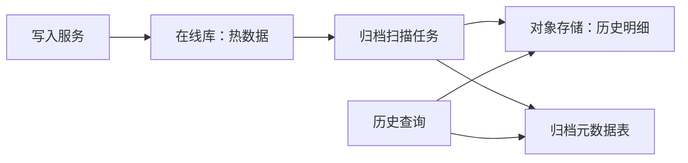

# 系统设计 - 第 2 课补充：存储增长快系统的冷热分层与归档方法论

## 学习目标（本节结束后你能做到什么）

1. 理解“存储增长很快”为什么不是直接等于“分库分表”。
2. 能把存储压力拆成日新增、在线热数据、索引、副本、备份、归档和查询延迟几类问题。
3. 能根据数据增长速度选择分区、冷热分层、对象存储、归档、压缩、离线查询和生命周期策略。
4. 能在面试里说清“哪些数据必须在线，哪些可以变冷，冷数据如何查，归档失败怎么办”。

## 目录索引

1. [先判断：数据增长快到底快在哪里](#一先判断数据增长快到底快在哪里)
2. [用数字判断存储压力到了什么阶段](#二用数字判断存储压力到了什么阶段)
3. [冷热分层解决的不是容量，而是生命周期](#三冷热分层解决的不是容量而是生命周期)
4. [时间分区、水平分表和归档的区别](#四时间分区水平分表和归档的区别)
5. [不同阶段怎么做技术选型](#五不同阶段怎么做技术选型)
6. [归档链路怎么设计才像线上系统](#六归档链路怎么设计才像线上系统)
7. [常见风险与面试追问](#七常见风险与面试追问)
8. [面试表达模板](#八面试表达模板)

## 内容讲解（核心概念，用类比、例子、图示说清楚）

在容量估算里，如果你算出：

```text
daily_new_data 很大
online_hot_data 很大
retention_period 很长
```

很多人的第一反应是：

```text
数据量大 -> 分库分表
```

这个方向不一定错，但太早了。存储增长快时，面试官更想听你先问：

```text
哪些数据要在线低延迟查询？
哪些数据只是合规留存？
哪些数据只会被运营、审计、离线任务偶尔查？
哪些字段需要索引，哪些字段只是原始 payload？
```

所以这篇的核心句是：

```text
存储增长快系统的本质，不是先扩数据库，而是先管理数据生命周期。
```

冷热分层、归档、压缩、分区、对象存储、离线查询，都是围绕这个生命周期展开的。

### 一、先判断：数据增长快到底快在哪里

存储压力不是一个数字，而是一组数字。

面试里至少要拆成这几个：

```text
daily_new_data = write_qps * avg_record_size * 86400 * write_amplification
online_hot_data = daily_new_data * hot_retention_days * replica_factor * index_factor
total_retention_data = daily_new_data * total_retention_days * replica_factor
```

这里有几个容易漏掉的放大项：

| 放大项 | 含义 | 为什么影响架构 |
| --- | --- | --- |
| 索引放大 | 二级索引、倒排索引、排序索引 | 索引越多，写入越慢，在线存储越贵 |
| 副本放大 | 主从、多副本、跨区域副本 | 容量和复制带宽都会变大 |
| 日志放大 | WAL、binlog、审计日志、操作日志 | 写入链路和保留成本上升 |
| 备份放大 | 全量备份、增量备份、快照 | 总存储成本可能远大于业务表 |
| 格式放大 | JSON、冗余字段、宽表 | 写入方便，但长期存储成本更高 |

比如：

```text
write_qps = 5k/s
avg_record_size = 2KB
write_amplification = 3
```

日新增大约是：

```text
5k * 2KB * 3 * 86400 = 2.59TB/day
```

如果热数据保留 30 天，3 副本，索引按 1 倍数据量估：

```text
hot_storage = 2.59TB/day * 30 * 3 * 2 = 466TB
```

这个数字一出来，你就知道它不是“建一张大表”能长期解决的问题。你需要讨论热数据窗口、索引控制、归档格式、查询路径和成本。

### 二、用数字判断存储压力到了什么阶段

可以沿用第 2 课里的经验线：

| 日新增数据 | 判断 | 设计重点 |
| --- | --- | --- |
| `< 10GB/day` | 通常压力不大 | 普通数据库、合理索引、定期清理、基础备份 |
| `10GB - 1TB/day` | 开始影响架构 | 时间分区、冷热表、归档任务、对象存储、索引控制 |
| `1TB/day+` | 通常决定架构 | 数据生命周期平台、日志/事件管道、湖仓/离线查询、分层存储、独立归档链路 |

这个表不是说 `10GB/day` 一定要上复杂架构，而是提示你：当日新增进入这个量级以后，在线数据库不能再无限保留所有历史数据。

还要一起看两个数：

| 指标 | 为什么重要 |
| --- | --- |
| 在线热数据 | 决定在线数据库、缓存、搜索索引的规模 |
| 总保留数据 | 决定对象存储、归档、备份、合规和成本 |

有些系统日新增不算夸张，但保留周期特别长，例如审计、支付流水、物流事件、医疗记录。它的主矛盾不是峰值写入，而是长期留存、可追溯和低成本查询。

### 三、冷热分层解决的不是容量，而是生命周期

冷热分层不是简单地把数据搬到便宜存储里。它本质是在回答：

```text
不同年龄、不同访问频率、不同价值的数据，应该放在不同系统里。
```

常见分层可以这样讲：

| 层级 | 数据特点 | 常见存储 | 查询目标 |
| --- | --- | --- | --- |
| 热数据 | 最近、高频、用户在线路径依赖 | OLTP 数据库、缓存、搜索索引 | 毫秒到百毫秒 |
| 温数据 | 不太常用，但还会被运营或用户查 | 分区表、便宜一些的数据库、对象存储 + 元数据 | 秒级到分钟级 |
| 冷数据 | 主要为合规、审计、历史回放 | 对象存储、压缩文件、数据湖、归档存储 | 分钟级到小时级 |

关键不是名字，而是边界。你要能说清：

```text
最近 30 天订单在线查询
30 天到 1 年进入温层，保留必要索引
1 年以上进入冷归档，只支持工单/审计/离线查询
```

这样面试官会听到你在控制成本和复杂度，而不是只会堆组件。

#### 热数据层

热数据层要优先保证：

- 低延迟查询
- 事务或状态更新
- 高频索引
- 可控的在线容量

典型选择：

- MySQL / PostgreSQL 分区表
- 读副本
- Redis 缓存
- Elasticsearch / OpenSearch 只索引必要字段
- 针对业务查询的读模型

#### 温数据层

温数据通常还需要被查，但不值得继续占用最贵的在线资源。

典型选择：

- 独立历史表
- 按月/按天分区的历史库
- 对象存储保存明细，数据库保存元数据
- 更少的二级索引
- 异步查询或后台导出

#### 冷数据层

冷数据重点是：

- 便宜
- 压缩
- 可校验
- 可恢复
- 符合保留和删除要求

典型选择：

- S3 / GCS / OSS 这类对象存储
- Parquet / ORC / Avro 这类适合分析和压缩的格式
- 数据湖或离线数仓
- 生命周期策略自动降级存储类型
- 元数据表记录归档位置、校验和、schema version

### 四、时间分区、水平分表和归档的区别

这几个词容易混在一起。面试里可以这样区分：

| 手段 | 解决什么 | 数据还在线吗 | 典型用途 |
| --- | --- | --- | --- |
| 时间分区 | 让同一张逻辑表按时间切开 | 通常还在线 | 最近数据查询、按时间删除、partition pruning |
| 水平分表 | 把同一类数据按 key 分散到多个表/库 | 在线 | 单表过大、单库写入或容量不够 |
| 归档 | 把低频历史数据从在线系统搬走 | 通常不在主在线路径 | 降低在线成本、长期留存、审计查询 |

时间分区可以理解成一种“按时间维度的水平切分”，但它不一定等于物理上的分库分表。

比如 PostgreSQL 或 MySQL 的分区表：

```text
orders
  orders_2026_01
  orders_2026_02
  orders_2026_03
```

它在逻辑上还是一张表，但底层按时间拆成多个 partition。好处是：

- 查询最近 7 天时只扫描最近几个分区
- 删除历史数据时可以直接 drop partition
- 备份、归档、维护可以按分区做

但如果单个分区仍然太大，或者单库写入已经扛不住，就要继续做真正的水平分片：

```text
order_shard_00
order_shard_01
...
order_shard_63
```

所以面试表达可以是：

```text
我会先按访问模式做时间分区和保留窗口控制；
如果单库容量或写入继续成为瓶颈，再按 tenant_id / user_id / order_id 做水平分片。
```

> 水平分片本身怎么做——分片键怎么选、跨分片查询/事务、全局唯一 ID、扩容重平衡，是数据库课的内容，见 [04 数据库、索引、分片与复制](./04_数据库、索引、分片与复制.md) 第五、六节。本篇聚焦“数据按生命周期分层和归档”，不重复分片机制。

### 五、不同阶段怎么做技术选型

#### 1. `< 10GB/day`：通常压力不大

这个阶段不要过度设计。重点是把在线表设计好。

可以选：

- 单库或主从数据库
- 必要二级索引
- 按月或按季度分区
- 基础 TTL / cleanup job
- 常规备份和恢复演练

不建议一上来就做：

- 复杂归档平台
- 多套存储系统
- 过多异步同步链路
- 为低频查询维护昂贵索引

面试里可以说：

```text
这个量级下，我会优先保持简单：在线数据库承载主路径，按时间做分区或定期清理，
先把索引、备份、保留策略和慢查询控制住，不急着引入复杂冷热分层。
```

#### 2. `10GB - 1TB/day`：开始影响架构

这个阶段，容量已经会改变架构边界。

常见选择：

- 热表和历史表拆开
- 按天/周/月做时间分区
- 最近 N 天保留完整在线索引
- 历史数据异步归档到对象存储
- 冷数据用压缩列式格式保存
- 查询历史数据时走异步导出或离线查询
- 删除历史数据用 drop partition，而不是逐行 delete

这时最重要的是定义热窗口：

```text
hot_window = 用户在线路径真正需要低延迟访问的时间范围
```

例如：

```text
最近 90 天交易记录在线可查
超过 90 天走历史查询
超过 1 年只支持账单下载或审计查询
```

架构上可以这样画：



#### 3. `1TB/day+`：通常决定架构

这个阶段，存储增长本身就是主设计对象。

常见选择：

- 写入先进入日志/事件管道
- 在线库只保留当前状态或最近窗口
- 明细进入对象存储或数据湖
- 离线计算生成聚合结果、报表和搜索索引
- 归档、压缩、schema 演进、校验成为独立链路
- 对不同查询路径提供不同系统，而不是所有查询都打在线库

这时可以把数据分成三类：

| 数据类型 | 放哪里 | 为什么 |
| --- | --- | --- |
| 当前状态 | OLTP / KV / 缓存 | 用户路径需要低延迟 |
| 最近明细 | 分区在线库 / 搜索索引 | 还会高频查询 |
| 历史明细 | 对象存储 / 数据湖 | 低成本长期留存 |

面试表达要强调：

```text
我不会让在线数据库承载无限历史明细。在线库只服务高频路径，
历史数据进入归档层和离线查询层，成本、延迟和一致性目标分别设计。
```

### 六、归档链路怎么设计才像线上系统

归档不是一个 cron job 把旧数据搬走就完事。一个可靠归档链路通常包含：

```text
选择归档范围
-> 导出数据
-> 写入冷存储
-> 校验完整性
-> 更新归档元数据
-> 从在线层删除或降级索引
-> 支持查询或恢复
```

可以拆成几张关键表或对象：

| 对象 | 作用 |
| --- | --- |
| archive_job | 记录每次归档任务、范围、状态、重试次数 |
| archive_manifest | 记录文件列表、行数、大小、checksum、schema version |
| archive_pointer | 在线查询时定位某个时间段或对象的归档位置 |
| restore_request | 用户、审计或运营发起历史恢复时跟踪状态 |

#### 归档任务的状态机

```text
PENDING
-> EXPORTING
-> UPLOADED
-> VERIFIED
-> COMMITTED
-> CLEANED
```

关键点是：

- 没有校验成功前，不删除在线数据。
- 删除在线数据要幂等，失败后可重试。
- 归档元数据要先于清理动作稳定落库。
- 冷数据格式要带 schema version，避免以后读不回来。
- 历史查询要明确是同步返回、异步导出，还是人工工单。

#### 为什么要有 manifest

manifest 是归档系统的账本。它至少记录：

```text
time_range
source_table
file_path
record_count
bytes
checksum
schema_version
created_at
```

有了 manifest，才能回答：

- 这批数据到底有没有归档完整？
- 文件丢了或损坏能不能发现？
- 重复归档会不会产生重复数据？
- 某个时间段的数据在冷层哪里？
- 以后 schema 变了怎么解析旧文件？

### 七、常见风险与面试追问

#### 风险 1：冷数据查不到

归档后如果只保存文件，没有元数据索引，历史查询会非常痛苦。

应对：

- 保留轻量元数据表
- 按时间、租户、业务主键组织路径
- 对必要字段建离线索引
- 明确历史查询 SLA

#### 风险 2：归档滞后导致在线库继续膨胀

应对：

- 监控 archive lag
- 归档任务分片并行
- 支持断点续跑
- 高峰期限速，低峰期追赶

#### 风险 3：删除和合规冲突

有些数据要保留，有些数据要删除，例如隐私合规里的删除请求。

应对：

- 区分业务保留、审计保留、隐私删除
- 对冷数据建立删除标记或重写策略
- 明确 legal hold，避免误删

#### 风险 4：所有字段都建索引

日新增很大时，索引本身就是昂贵写放大。

应对：

- 热层只保留用户路径需要的索引
- 低频查询走离线查询或后台导出
- 宽字段、大 payload 放对象存储
- OLTP 查询和分析查询分开

### 八、面试表达模板

你可以这样说：

```text
存储增长快时，我不会第一反应就分库分表。
我会先算 daily_new_data、hot_window 和 retention_period，
区分在线热数据和长期保留数据。

如果日新增还在 10GB/day 以下，通常先用单库/主从、合理索引、时间分区和清理任务。
如果进入 10GB 到 1TB/day，我会把最近 N 天作为热数据留在线上，
历史数据通过归档任务写入对象存储，并保留归档元数据和必要查询入口。
如果到 1TB/day 以上，存储生命周期本身会成为架构核心，
在线库只保留当前状态和热窗口，明细进入日志/对象存储/数据湖，
再通过离线计算或专门查询系统支持历史分析。

这里的 trade-off 是：热层查询快但贵，冷层便宜但查询慢；
所以要明确哪些查询必须低延迟，哪些可以异步或离线。
```

## 检查站

看到“存储增长很快”，你应该立刻问自己：

1. 日新增数据是多少？
2. 在线热数据要保留多久？
3. 总保留周期有多长？
4. 索引、副本、备份和日志放大是多少？
5. 查询主要按时间、用户、租户，还是业务对象？
6. 历史数据是用户同步查询、异步导出，还是审计工单？
7. 冷数据是否需要删除、恢复、校验和 schema 演进？
8. 在线库是不是只保留了真正需要低延迟的数据？
