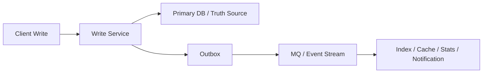
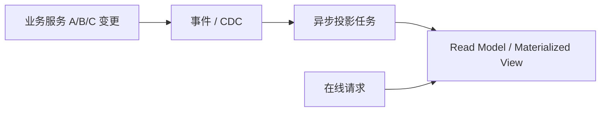
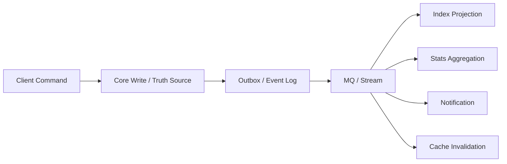
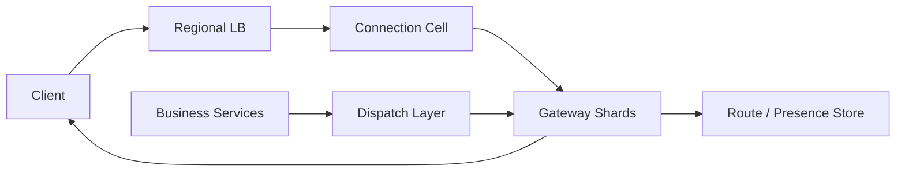
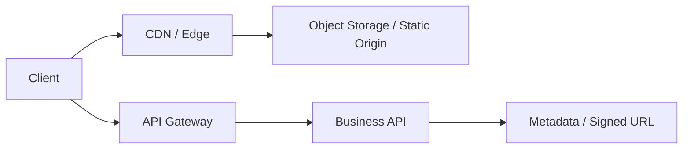
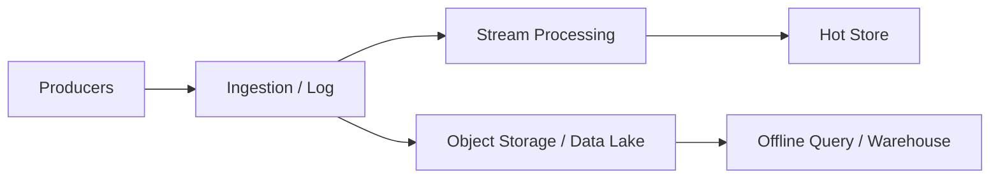
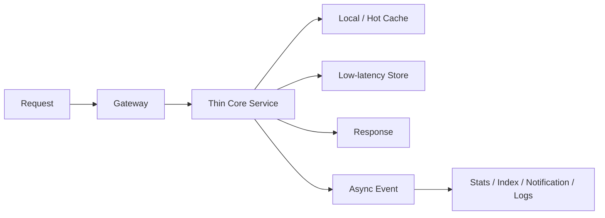

# 系统设计 - 第 2 课补充：容量估算指标到技术选型逐项拆解

## 学习目标（本节结束后你能做到什么）

1. 把容量估算表里的每个指标，从“数字阈值”进一步翻译成“架构选择”。
2. 能针对同一个指标的三种量级，分别说明为什么此时可以简单处理、为什么开始影响架构、为什么会决定架构。
3. 能在面试里避免“QPS 高就 Redis”“写多就 MQ”“数据大就分库分表”这种跳步回答。
4. 能按统一模板回答：指标含义、瓶颈位置、技术选型、代价和追问边界。

## 这篇文档怎么用

第 2 课里有一张容量估算判断表：

| 指标 | 通常压力不大 | 开始影响架构 | 通常决定架构 |
| --- | --- | --- | --- |
| 读 QPS | `< 1k/s` | `1k/s - 50k/s` | `50k/s+` |
| 写 QPS | `< 100/s` | `100/s - 10k/s` | `10k/s+` |
| 峰值 / 平均值 | `< 3x` | `3x - 10x` | `10x+` |
| 单请求下游调用数 | `1 - 3` | `4 - 10` | `10+` |
| 读/写放大系数 | `< 3x` | `3x - 20x` | `20x+` |
| 并发连接数 | `< 10 万` | `10 万 - 100 万` | `100 万+` |
| 单响应大小 | `< 10KB` | `10KB - 200KB` | `200KB+` |
| 出口带宽 | `< 100MB/s` | `100MB/s - 1GB/s` | `1GB/s+` |
| 日新增数据 | `< 10GB/day` | `10GB - 1TB/day` | `1TB/day+` |
| 在线热数据 | `< 100GB` | `100GB - 10TB` | `10TB+` |
| 单 key / 单对象 QPS | `< 1k/s` | `1k/s - 10k/s` | `10k/s+` |
| P99 延迟目标 | `> 1s` | `300ms - 1s` | `< 300ms` |

这张表的作用不是让你背数字，而是让你形成一个动作：

```text
数字落在哪一档
-> 说明哪类资源或语义开始紧张
-> 哪些简单方案还够用
-> 哪些架构手段开始值得引入
-> 哪些代价必须同时解释
```

统一回答模板：

```text
这个指标首先说明 ______ 压力。
如果在第一档，我会优先保持简单，做好 ______。
如果进入第二档，它开始影响架构，因为 ______，我会考虑 ______。
如果进入第三档，它会决定架构，因为 ______，我会把 ______ 作为主设计对象。
同时我要说明 ______ 的代价和边界。
```

本篇回答“数字落在哪一档该上什么”。如果你想进一步知道这些档位数字本身是怎么算出来的（比如 2000 万行来自三层 B+ 树、单行 100/s 来自行锁持有时间、1GB/s 来自 10G 网卡），即每条阈值背后的硬件与数据库原理推导，见 [02b_容量估算数字背后的物理与数据库原理](./02b_容量估算数字背后的物理与数据库原理.md)。

下面按指标逐项拆。

---

## 1. 读 QPS：什么时候从“优化查询”升级到“设计读路径”

读 QPS 高时，不要直接说“加 Redis”。你要先判断：

```text
读压力落在数据库？
落在复杂聚合？
落在下游调用？
落在响应体和带宽？
落在热点 key？
```

更完整的展开见 [02c_读多系统的缓存与读路径优化方法论](./02c_读多系统的缓存与读路径优化方法论.md)。这里先按三档给面试选型口径。

### 1.1 读 QPS `< 1k/s`：通常压力不大

这个阶段不要急着堆缓存体系。  
优先目标是把基本读路径做干净：

```text
合理索引
避免全表扫描
避免 N+1 查询
分页
字段裁剪
连接池配置
少量 Cache Aside
```

为什么？

因为千级以内的读 QPS，很多业务数据库和普通服务集群都能承接。真正风险往往不是吞吐不够，而是：

```text
SQL 写得差
索引缺失
一次请求查太多字段
分页无限深
把大对象塞进响应
```

技术选型：

| 场景 | 优先选择 |
| --- | --- |
| 按 id 或少量条件查询 | MySQL / PostgreSQL + 正确索引 |
| 少量热点配置或字典 | 应用本地缓存或短 TTL Redis |
| 列表页 | 分页、排序索引、字段裁剪 |
| 简单详情页 | 单对象查询，必要时 Cache Aside |

这个阶段通常不优先：

```text
复杂多级缓存
读写分离
分库分表
专用搜索系统
大规模预计算读模型
```

面试表达：

```text
如果读 QPS 还在 1k/s 以下，我不会一上来就引入复杂缓存体系。
我会先保证访问模式、索引、分页和返回字段合理。
只有明确存在重复读取或热点对象时，才加简单 Cache Aside。
```

### 1.2 读 QPS `1k/s - 50k/s`：开始影响架构

这个阶段读路径开始变成架构问题。  
你要继续算：

```text
db_read_qps = external_read_qps * cache_miss_rate * read_amplification
bandwidth = external_read_qps * response_size
downstream_calls = external_read_qps * downstream_call_count
```

例如：

```text
external_read_qps = 20k/s
cache_hit_rate = 90%
read_amplification = 5
```

底层读压力是：

```text
20k/s * 10% * 5 = 10k read ops/s
```

这时入口 QPS 只是表面数字，真正决定选型的是 miss 后的底层压力、读放大和响应体大小。

技术选型：

| 压力来源 | 选型倾向 |
| --- | --- |
| 重复读取同一批对象 | Redis / Memcached Cache Aside |
| 极热点小对象 | 应用本地缓存 + Redis |
| 可接受复制延迟的数据库读 | 只读副本、读写分离 |
| 多表或多服务聚合 | 聚合服务、批量查询、并行调用、读模型 |
| 响应体较大 | 字段裁剪、分页、压缩、CDN |
| 缓存 miss 集中回源 | singleflight、限流、热点预热 |

这个阶段最容易被追问：

```text
缓存什么？
缓存多久？
命中率目标是多少？
写入后怎么失效？
缓存 miss 时怎么保护数据库？
旧数据能接受多久？
```

面试表达：

```text
如果读 QPS 进入 1k/s 到 50k/s，我会开始把读路径分层。
重复读取的对象用缓存，可接受延迟的查询走只读副本，
复杂聚合考虑读模型或物化视图。
但我会同时说明缓存失效、命中率、回源保护和一致性窗口。
```

### 1.3 读 QPS `50k/s+`：通常决定架构

这个阶段读路径往往就是系统主设计对象。  
你不能只说“上 Redis”，而要做整体读路径设计：

```text
CDN / Edge
本地热点缓存
分布式缓存
只读副本
预计算读模型
专用 KV / 搜索 / 宽表
热点隔离
回源保护
降级策略
```

为什么？

因为 `50k/s+` 的读 QPS 往往会同时带来：

```text
数据库读压力
缓存集群压力
网络带宽压力
序列化 CPU 压力
热点 key 风险
缓存失效瞬间回源风险
```

技术选型要按瓶颈分层：

| 主瓶颈 | 选型 |
| --- | --- |
| 静态资源或公共内容 | CDN / Edge cache |
| 极热点对象 | 本地缓存、多副本缓存、热点隔离 |
| 业务对象重复读 | Redis Cluster / Memcached 集群 |
| 复杂聚合 | 预计算读模型、物化表、宽表 |
| 搜索过滤排序 | Elasticsearch / OpenSearch / 专用索引 |
| 按 key 超高吞吐读取 | KV / DynamoDB / Cassandra / HBase 类存储 |
| 源站保护 | singleflight、限流、降级、熔断 |

面试表达：

```text
如果读 QPS 到 50k/s 以上，我会把读路径作为主架构对象。
重点不是有没有缓存，而是如何减少源站读、减少重复计算、
控制带宽、隔离热点，并保证缓存失效时不会把底层打穿。
```

一句话总结：

```text
读 QPS 越高，选型越应该从“优化数据库查询”升级为“设计完整读路径”。
```

---

## 2. 写 QPS：什么时候从“正常落库”升级到“保护真相源和控制写放大”

写 QPS 和读 QPS 的选型逻辑完全不同。

读多时，你主要想：

```text
减少回源
减少重复计算
减少重复传输
```

写多时，你主要想：

```text
保护真相源
控制事务范围
控制索引成本
控制写放大
保证幂等和顺序
处理失败重试和补偿
```

所以写 QPS 高时，不要直接说“加 MQ”。你要先判断：

```text
写入是否必须同步成功？
写入是否改变核心状态？
是否需要事务？
是否有唯一约束？
是否按某个 key 有顺序要求？
单次写入会触发多少副作用？
失败后能不能补偿？
```

### 2.1 写 QPS `< 100/s`：通常压力不大

这个阶段一般不需要复杂写入架构。  
优先目标是把正确性边界做清楚：

```text
事务边界
唯一约束
幂等键
条件更新
状态机
必要索引
审计字段
```

为什么？

因为每秒百级以内的写入，普通关系数据库通常能承接。此时最容易出问题的不是吞吐，而是：

```text
重复提交
并发覆盖
状态乱跳
唯一性没兜住
失败重试造成重复副作用
事务边界不清
```

技术选型：

| 场景 | 优先选择 |
| --- | --- |
| 核心业务状态写入 | 关系数据库事务 |
| 防重复提交 | 幂等键、唯一索引 |
| 状态流转 | 状态机 + 条件更新 |
| 简单副作用 | 同步完成或事务后事件 |
| 少量审计日志 | 同库记录或轻量异步日志 |

这个阶段通常不优先：

```text
复杂 MQ 编排
分库分表
多写存储
事件溯源
大规模批处理
```

面试表达：

```text
如果写 QPS 小于 100/s，我会先保证数据正确性，
包括事务边界、幂等、唯一约束和状态机。
这个阶段不急着上 MQ 或分库分表，因为复杂架构可能比吞吐问题更危险。
```

### 2.2 写 QPS `100/s - 10k/s`：开始影响架构

这个阶段写入开始影响数据库、索引和下游副作用。

你要继续算：

```text
internal_write_ops = external_write_qps * write_amplification
index_write_cost = write_qps * index_count
side_effect_events = write_qps * side_effect_count
```

例如：

```text
external_write_qps = 2k/s
write_amplification = 8
```

内部写压力是：

```text
2k/s * 8 = 16k write ops/s
```

这时你要警惕：入口写 QPS 不高，但内部写放大已经很高。

技术选型：

| 压力来源 | 选型倾向 |
| --- | --- |
| 主表写入压力 | 控制事务范围、减少二级索引、分区表 |
| 副作用太多 | Outbox、MQ、异步消费者 |
| 可批量写入 | batch write、buffer、合并更新 |
| 写入按 key 分布明显 | 按业务 key 分区 |
| 写入有顺序要求 | 单 key 串行、按 key 分区消费 |
| 重复请求多 | 幂等键、去重表、唯一索引 |
| 下游处理慢 | 队列削峰、消费者扩容、积压监控 |

这个阶段要区分两类写：

```text
核心写：决定业务是否成功，通常要同步保证
派生写：通知、索引、统计、日志、缓存失效，可以异步
```

常见架构：



这个结构的含义是：

```text
核心状态同步落真相源；
派生副作用通过事件异步处理。
```

面试表达：

```text
如果写 QPS 到 100/s 到 10k/s，我会开始控制写放大。
核心状态仍然同步写入真相源，保证事务、幂等和状态机；
通知、索引、统计、缓存失效这类派生动作通过 Outbox 和 MQ 异步处理。
同时我会减少不必要索引，按访问模式考虑分区，并监控队列积压。
```

### 2.3 写 QPS `10k/s+`：通常决定架构

这个阶段写入吞吐通常会成为主架构对象。

你要从“写一条业务记录”升级到“设计写入管线”：

```text
入口限流 / admission control
幂等接入
分区写入
append-only log
批量提交
异步派生
冷热分层
回放和补偿
积压治理
```

为什么？

因为 `10k/s+` 的写入会同时放大：

```text
事务锁竞争
WAL / redo / binlog 压力
二级索引维护成本
主从复制延迟
缓存失效风暴
消息队列积压
下游消费者压力
```

技术选型要看写入语义。

| 写入语义 | 选型倾向 |
| --- | --- |
| 核心交易状态 | 分区关系库、强约束、幂等、状态机、限流 |
| 事件采集 / 日志 | Kafka / Pulsar / Kinesis 这类 append-only log |
| 高吞吐按 key 写 | DynamoDB / Cassandra / Scylla / HBase 类宽列或 KV |
| 计数和聚合 | 分桶计数、异步聚合、周期合并 |
| 搜索索引更新 | CDC / MQ 异步建索引 |
| 通知投递 | MQ + 消费者池 + 失败重试 |
| 历史审计 | append-only + 冷热分层 |

这个阶段经常需要把写路径分成两层：

```text
接受层：快速校验、幂等、限流、生成事件
处理层：分区消费、批量写入、派生视图、补偿回放
```

但要注意：不是所有写都能异步。  
如果用户当前请求必须知道成功失败，至少核心状态要有同步边界。

面试表达：

```text
如果写 QPS 超过 10k/s，我会把写入管线作为主设计对象。
首先区分核心状态写和派生写：
核心状态要保护真相源、幂等、顺序和事务边界；
派生写尽量通过 append-only log、MQ、批处理和异步投影来削峰。
如果写入天然按 key 分布，可以按 key 分区；如果是事件流，优先日志化存储。
```

一句话总结：

```text
写 QPS 越高，选型越应该从“正常落库”升级为“保护真相源、控制写放大、异步派生和可回放”。
```

---

## 3. 峰值 / 平均值：什么时候从“按平均容量运行”升级到“按洪峰设计”

峰值 / 平均值经常比平均 QPS 更重要。

```text
peak_ratio = peak_qps / avg_qps
```

如果一个系统平均只有 `1k/s`，但峰值能到 `30k/s`，它就不是一个普通 `1k/s` 系统。  
它的问题不是“日常吞吐”，而是：

```text
洪峰来时系统能不能撑住
扩容来不来得及
缓存有没有预热
后端能不能被保护
用户能不能接受排队或快速失败
```

所以峰均比的核心不是“总量大不大”，而是：

```text
流量是否集中到短时间窗口。
```

### 3.1 峰值 / 平均值 `< 3x`：通常压力不大

这个阶段流量相对平稳。  
架构上通常不需要为了洪峰做很复杂的特殊设计。

优先目标是：

```text
合理容量冗余
基础 autoscaling
连接池和线程池水位
普通限流保护
基础监控告警
缓存正常 TTL
```

为什么？

因为 `< 3x` 的峰均比说明高峰不是特别尖锐。只要系统按峰值而不是平均值做容量规划，通常就能覆盖。

技术选型：

| 场景 | 优先选择 |
| --- | --- |
| 日常 API 流量 | 按峰值容量规划，保留 `30% - 50%` headroom |
| 普通读流量 | 正常缓存 + 只读副本 |
| 普通写流量 | 正常数据库写入 + 基础限流 |
| 后台任务 | 避免集中整点运行，错峰调度 |
| 服务扩容 | 基础水平扩容和 autoscaling |

这个阶段通常不优先：

```text
复杂排队系统
大规模等待室
专门抢占式资源池
复杂预热流程
强削峰链路
```

面试表达：

```text
如果峰均比小于 3x，我会把它当成相对平稳流量处理。
容量规划按峰值而不是平均值做，并保留一定 headroom。
重点是监控、水位、基础限流和避免后台任务集中打峰。
```

### 3.2 峰值 / 平均值 `3x - 10x`：开始影响架构

这个阶段峰值开始明显影响架构。  
你需要先判断峰值是否可预测。

```text
可预测峰值：每天固定高峰、活动开始、整点任务、定时推送
不可预测峰值：热点事件、外部流量突增、第三方回调集中到达
```

两者选型不同。

#### 可预测峰值

如果峰值可预测，优先考虑：

```text
提前扩容
缓存预热
连接预建
热点数据预加载
队列消费者提前扩容
活动前压测和容量校验
```

这类问题的关键词是：

```text
提前准备。
```

#### 不可预测峰值

如果峰值不可预测，优先考虑：

```text
入口限流
自适应限流
熔断降级
隔离资源池
请求排队
快速失败
按租户 / 用户 / 接口限额
```

这类问题的关键词是：

```text
保护底层。
```

技术选型：

| 压力来源 | 选型倾向 |
| --- | --- |
| 读峰值 | 缓存预热、热点缓存、CDN、只读副本 |
| 写峰值且可异步 | MQ、buffer、批处理、消费者弹性扩容 |
| 写峰值且必须同步 | 限流、幂等、排队资格、核心路径保护 |
| 定时任务打峰 | 错峰、分片调度、rate limit |
| 第三方回调突增 | 接收层快速落库 / 落日志、异步处理、幂等 |
| 热点对象突增 | 热点探测、本地缓存、单 key 限流、隔离 |

这个阶段要特别注意：

```text
autoscaling 不是万能的。
```

因为扩容有延迟：

```text
发现高峰 -> 触发扩容 -> 拉起实例 -> 预热连接/缓存/JIT -> 真正承接流量
```

如果洪峰持续时间只有几十秒，自动扩容可能还没生效，流量已经把系统打穿。

面试表达：

```text
如果峰均比在 3x 到 10x，我会开始按峰值设计。
如果峰值可预测，重点是提前扩容、缓存预热和消费者预热；
如果不可预测，重点是入口限流、隔离、降级和快速失败。
我不会只依赖 autoscaling，因为扩容有冷启动和预热时间。
```

### 3.3 峰值 / 平均值 `10x+`：通常决定架构

这个阶段系统已经是洪峰型系统。  
平均值对架构参考意义会下降，峰值窗口才是主设计对象。

典型问题：

```text
平时流量很低，活动开始瞬间暴涨
大量客户端同时刷新
热门事件突然爆发
外部系统失败后集中重试
大量定时任务同时触发
```

这时架构目标不是“让所有请求都进后端”，而是：

```text
尽早筛掉无效请求
保护核心状态
把可等待的请求排队
把可异步的工作削峰
把非核心能力降级
把热点资源隔离
```

技术选型：

| 设计目标 | 选型倾向 |
| --- | --- |
| 入口保护 | 全局限流、分层限流、令牌桶、漏桶、admission control |
| 用户排队 | waiting room、排队号、受理状态、轮询查询 |
| 写入削峰 | MQ、append-only log、异步消费者、批处理 |
| 热点隔离 | 独立资源池、热点 key 拆分、本地缓存、单资源限流 |
| 读峰值保护 | CDN、边缘缓存、缓存预热、静态化 |
| 核心链路保护 | 非核心降级、快速失败、短 timeout、熔断 |
| 容量准备 | 预扩容、压测、演练、容量开关 |
| 恢复能力 | 幂等、重试退避、补偿、回放 |

这里最重要的产品语义判断是：

```text
请求必须同步拿最终结果，还是可以先返回“已受理 / 排队中”？
```

如果可以排队：

```text
入口接收 -> 资格校验 -> 入队 -> 返回排队状态 -> 异步处理 -> 查询结果
```

如果不能排队：

```text
入口限流 -> 快速失败 -> 保护核心链路
```

如果是读洪峰：

```text
CDN / 缓存 / 静态化 / 预热 / 热点隔离
```

如果是写洪峰：

```text
限流 / 排队 / MQ / 幂等 / 异步处理 / 补偿
```

如果是重试洪峰：

```text
指数退避 / jitter / retry budget / 熔断 / 幂等
```

面试表达：

```text
如果峰均比超过 10x，我会把它当成洪峰系统设计。
平均 QPS 参考意义不大，关键是峰值窗口内系统如何保护自己。
我会先判断峰值是否可预测、请求是否可排队、是否必须同步返回。
可预测就预扩容和预热；可排队就用等待室或 MQ 削峰；
不可排队就做入口限流、快速失败、核心链路保护和热点隔离。
```

一句话总结：

```text
峰均比越高，选型越应该从“扩容处理更多请求”升级为“控制哪些请求能进入系统”。
```

### 3.4 一个很实用的峰值判断表

| 峰值特征 | 优先选型 |
| --- | --- |
| 可预测，读多 | 缓存预热、CDN、预扩容 |
| 可预测，写多 | 预扩容、队列预热、批量处理、容量开关 |
| 不可预测，读多 | 热点探测、本地缓存、限流、降级 |
| 不可预测，写多 | admission control、幂等、MQ 削峰、快速失败 |
| 请求可等待 | waiting room、排队状态、异步处理 |
| 请求不可等待 | 限流、熔断、降级、快速失败 |
| 峰值由重试造成 | retry budget、指数退避、jitter、熔断 |
| 峰值由定时任务造成 | 错峰、分片调度、任务级 rate limit |

---

## 4. 单请求下游调用数：什么时候从“直接调用”升级到“聚合、并行、降级和读模型”

单请求下游调用数，指的是一个用户请求进入系统后，在同步链路里还要调用多少个服务、存储、第三方接口或内部组件。

这个指标影响两件事：

```text
尾延迟
整体可用性
```

常用估算公式：

```text
total_latency_serial = sum(each_dependency_latency)
total_latency_parallel ≈ max(each_dependency_latency) + aggregation_cost
success_rate ≈ product(each_dependency_success_rate)
```

例如每个下游成功率都是 `99.9%`：

```text
3 个强依赖：0.999^3 ≈ 99.7%
10 个强依赖：0.999^10 ≈ 99.0%
20 个强依赖：0.999^20 ≈ 98.0%
```

所以单请求下游多，不只是“代码复杂一点”，而是会直接放大尾延迟和失败概率。

### 4.1 单请求下游调用数 `1 - 3`：通常压力不大

这个阶段同步调用通常还能接受。  
优先目标是把基本调用治理做好：

```text
清晰的 timeout
有限重试
幂等保护
连接池
基础熔断
错误码和异常处理
必要的本地缓存
```

为什么？

因为 `1 - 3` 个下游时，依赖关系还比较容易理解，串行调用的延迟也相对可控。  
这个阶段不一定需要专门聚合层或复杂编排系统。

技术选型：

| 场景 | 优先选择 |
| --- | --- |
| 调用 1 个核心服务 | 直接同步调用，设置 timeout |
| 调用 2-3 个内部服务 | 串行或简单并行，看依赖关系 |
| 同服务多次查数据 | 批量接口，避免 N+1 |
| 低频配置 / 字典读取 | 本地缓存或短 TTL 缓存 |
| 可重试读请求 | 有限重试 + timeout |
| 写请求或副作用请求 | 谨慎重试，必须有幂等键 |

这个阶段通常不优先：

```text
复杂工作流编排
专门聚合服务
读模型
大规模异步化
过度熔断降级体系
```

但要注意一点：下游少不代表可以无限等。

面试表达：

```text
如果单请求只依赖 1 到 3 个下游，我会先保持同步链路简单。
重点是为每个下游设置 timeout、有限重试和错误处理。
如果同一个下游被多次调用，我会优先改成批量接口，避免 N+1。
```

### 4.2 单请求下游调用数 `4 - 10`：开始影响架构

这个阶段下游数量已经开始影响架构。  
主要问题是：

```text
串行调用延迟叠加
某个非核心依赖拖慢主链路
整体成功率被多个依赖相乘拉低
调用关系难以排障
```

例如 6 个下游，如果串行每个 P99 是 `100ms`：

```text
serial P99 可能接近 600ms+
```

如果并行：

```text
parallel P99 ≈ 最慢下游 P99 + 聚合开销
```

所以这个阶段通常要做三件事：

```text
并行化
批量化
依赖分级
```

技术选型：

| 问题 | 选型倾向 |
| --- | --- |
| 多个独立下游串行调用 | 并行调用、fanout with concurrency limit |
| 同类请求重复调用 | batch API、DataLoader、批量查询 |
| 多端页面需要聚合数据 | BFF / 聚合服务 |
| 某些数据可短暂不新 | 缓存、读模型、物化视图 |
| 非核心依赖不稳定 | timeout、熔断、降级、默认值 |
| 下游调用链路难排查 | trace、dependency dashboard、错误分级 |

这个阶段最重要的是区分强依赖和弱依赖。

```text
强依赖：失败就不能返回正确结果
弱依赖：失败可以降级、隐藏、用默认值或稍后补
```

例如：

```text
价格、权限、库存可能是强依赖
推荐、评论摘要、头像、活动标签可能是弱依赖
```

面试里要避免把所有依赖都说成“必须成功”。  
如果 8 个下游都必须成功，整体可用性会被拖得很低，系统也很难稳定。

这个阶段还要做 timeout budget。

如果接口 P99 目标是 `500ms`，不能给每个下游都设置 `500ms timeout`。  
你需要按重要性分配：

```text
核心依赖：100ms - 200ms
弱依赖：50ms - 100ms
聚合开销：几十 ms
留出网络和排队余量
```

面试表达：

```text
如果单请求有 4 到 10 个下游，我会认为同步链路已经开始变重。
这时我会先做依赖分级：哪些是强依赖，哪些可以降级。
独立依赖尽量并行，同类查询改成批量接口，
弱依赖设置短 timeout 和 fallback。
如果聚合结果重复出现，再考虑缓存或读模型。
```

### 4.3 单请求下游调用数 `10+`：通常决定架构

如果一个请求同步依赖 `10+` 个下游，它通常已经不是普通接口，而是一个复杂聚合系统。

这时最大风险是：

```text
尾延迟不可控
整体可用性被下游乘法拉低
单个下游抖动拖垮主接口
调用图复杂到难以排障
扩展新字段要继续加依赖
```

这个阶段不要只想着“并行调用更多服务”。  
并行能降低串行延迟，但不能消灭：

```text
最慢依赖的尾延迟
所有依赖的失败概率
聚合层的资源消耗
下游被同时打爆的风险
```

技术选型通常要升级：

| 设计目标     | 选型倾向                               |
| -------- | ---------------------------------- |
| 减少同步依赖数量 | 预计算读模型、物化视图、宽表                     |
| 控制尾延迟    | 短 timeout、hedged request、降级、部分结果返回 |
| 保护下游     | 并发上限、bulkhead、缓存、请求合并              |
| 降低可用性乘法  | 强弱依赖拆分、非核心异步化                      |
| 支持复杂页面聚合 | BFF / 聚合层，但要控制职责                   |
| 支持高频重复聚合 | 离线 / 近线生成读模型                       |
| 排障和治理    | 分布式 tracing、依赖拓扑、SLO 分解            |

这时最常见的架构转向是：

```text
从“请求时现场聚合”
转向“提前构建可读视图”
```

也就是：

```text
业务事件 / CDC / MQ
-> 异步生成读模型
-> 在线请求只读一个或少数几个存储
```

示意：



如果必须现场聚合，也要控制边界：

```text
只聚合强必要字段
弱字段允许缺失
每类依赖有 timeout
每类依赖有 fallback
整体响应允许 partial result
```

面试表达：

```text
如果单请求同步依赖超过 10 个下游，我不会继续简单堆并行调用。
这说明在线链路已经太重，尾延迟和可用性都会被依赖乘法拖垮。
我会优先减少同步依赖：把高频聚合提前生成读模型，
把弱依赖移出主链路，强依赖保留短 timeout 和明确降级策略。
```

一句话总结：

```text
下游调用越多，选型越应该从“直接同步调用”升级为“依赖分级、批量并行、降级保护，再到读模型消除同步依赖”。
```

### 4.4 一个很实用的下游调用判断表

| 下游特征 | 优先选型 |
| --- | --- |
| `1 - 3` 个下游 | 直接同步调用，配 timeout、有限重试、幂等 |
| `4 - 10` 个下游 | 并行、批量、依赖分级、熔断降级 |
| `10+` 个下游 | 读模型、预计算、弱依赖异步化、partial result |
| 多次调用同一个服务 | batch API、请求合并、DataLoader |
| 下游互相独立 | 并行调用 + 并发上限 |
| 下游有前后依赖 | 明确依赖 DAG，避免无意识串行 |
| 弱依赖很多 | 短 timeout、默认值、隐藏模块、异步补全 |
| 强依赖很多 | 重新审视产品语义和数据模型，减少同步强依赖 |

---

## 5. 读/写放大系数：什么时候从“顺手多查几次”升级到“减少、延迟、合并和分层处理”

放大系数是系统设计里特别容易漏的指标。

入口请求数只是外部压力，放大后的内部操作数才更接近真实压力。

```text
internal_read_ops = external_qps * read_amplification
internal_write_ops = external_qps * write_amplification
downstream_calls = external_qps * downstream_call_count
```

例如：

```text
external_qps = 5k/s
read_amplification = 20x
```

内部读压力就是：

```text
5k/s * 20 = 100k read ops/s
```

所以放大系数的核心问题是：

```text
一个外部请求进入系统后，被系统内部放大成了多少真实工作。
```

读放大和写放大的优化方向不同。

```text
读放大：减少现场查询、重复聚合、重复下游调用。
写放大：收窄同步写入边界，把副作用延迟、合并、异步或分层处理。
```

### 5.1 读/写放大系数 `< 3x`：通常压力不大

这个阶段放大还比较可控。  
通常不需要为了放大系数引入复杂架构。

优先目标是：

```text
代码路径清晰
数据模型合理
索引合理
避免明显重复查询
少量批量化
基础幂等和事务
```

为什么？

因为 `< 3x` 的放大通常还在直觉范围内。比如：

```text
一次请求查主表 + 查一两个关联表
一次写入更新主记录 + 写一条审计日志
一次状态变更同步刷新一个缓存
```

这些可以接受，重点是不要让它继续无意识增长。

技术选型：

| 场景 | 优先选择 |
| --- | --- |
| 少量关联查询 | 正确索引、必要 join、批量查询 |
| 少量写副作用 | 事务内完成或事务后轻量事件 |
| 轻量缓存失效 | 写库后删缓存 |
| 简单审计 | 同步写审计表或低频异步 |
| 少量下游调用 | 直接调用 + timeout |

这个阶段通常不优先：

```text
复杂事件总线
多级异步投影
大规模预计算
专门 fanout 系统
复杂补偿框架
```

面试表达：

```text
如果读写放大都小于 3x，我会先保持设计简单。
重点是保证索引、事务、幂等和查询路径清楚，
避免明显重复查询或无意义副作用。
这个阶段通常不需要为了放大系数引入复杂异步架构。
```

### 5.2 读/写放大系数 `3x - 20x`：开始影响架构

这个阶段放大已经开始改变系统内部压力。  
入口 QPS 不能再直接代表系统压力。

你要分开判断读放大和写放大。

#### 读放大在 `3x - 20x`

典型问题：

```text
一次请求查多张表
循环里查询，出现 N+1
一次页面聚合多个服务
同一批数据被重复读取
缓存 miss 后回源查询过重
```

优先考虑：

```text
批量查询
DataLoader
请求级缓存
聚合服务
短 TTL 缓存
读模型 / 物化视图
并行查询
```

技术选型：

| 读放大来源 | 选型倾向 |
| --- | --- |
| N+1 查询 | 批量查询、DataLoader、join 或 in 查询 |
| 多服务聚合 | 并行调用、BFF、聚合层 |
| 高频重复聚合 | 聚合结果缓存、读模型 |
| 复杂条件查询 | 搜索引擎、专用索引、物化视图 |
| 缓存 miss 回源重 | singleflight、热点预热、回源限流 |

#### 写放大在 `3x - 20x`

典型问题：

```text
一次写入触发多张表更新
更新多个索引
刷新多个缓存
发送通知
写审计日志
更新统计计数
```

优先考虑：

```text
核心写和派生写拆分
Outbox
MQ
批处理
缓存失效事件
幂等消费者
减少不必要二级索引
```

技术选型：

| 写放大来源 | 选型倾向 |
| --- | --- |
| 多个派生副作用 | Outbox + MQ |
| 统计计数更新 | 异步聚合、分桶计数 |
| 搜索索引更新 | CDC / MQ 异步建索引 |
| 多缓存失效 | 缓存失效事件、版本号、短 TTL |
| 二级索引过多 | 索引治理、冷热字段拆分 |
| 通知投递 | 异步通知任务、失败重试 |

这个阶段的关键是：

```text
核心动作同步完成；
派生动作异步完成。
```

面试表达：

```text
如果放大系数在 3x 到 20x，我会认为它已经开始影响架构。
读放大侧，我会优先做批量查询、请求合并、缓存和读模型；
写放大侧，我会把核心状态写和派生副作用拆开，
用 Outbox/MQ、批处理和幂等消费者来降低同步链路压力。
```

### 5.3 读/写放大系数 `20x+`：通常决定架构

这个阶段放大系数通常会成为主设计对象。  
你不能再只按入口请求设计系统。

如果：

```text
external_qps = 10k/s
amplification = 50x
```

内部操作就是：

```text
500k ops/s
```

这时系统真正的问题已经不是入口 `10k/s`，而是内部 `500k ops/s`。

#### 读放大 `20x+`

典型风险：

```text
一次请求现场聚合几十个对象
读路径依赖大量下游
缓存 miss 会打爆底层
尾延迟由最慢依赖决定
复杂查询每次在线计算
```

架构要从“优化查询”升级为“重塑读路径”：

```text
预计算读模型
物化视图
宽表 / KV
搜索索引
本地缓存 + 分布式缓存
请求合并
partial result
降级
```

选型判断：

| 读放大形态 | 优先选型 |
| --- | --- |
| 大量对象聚合 | 读模型、宽表、物化视图 |
| 大量下游实时调用 | 异步投影、BFF 瘦身、弱依赖降级 |
| 大量复杂过滤排序 | 搜索引擎、倒排索引、预排序 |
| 缓存 miss 放大严重 | 多级缓存、singleflight、回源限流 |
| 高峰时放大更严重 | 预热、静态化、限流、降级 |

#### 写放大 `20x+`

典型风险：

```text
一次写入触发几十个下游动作
同步链路过长
缓存失效风暴
索引和统计更新拖慢主写入
某个副作用失败导致核心请求失败
重试后产生重复副作用
```

架构要从“写完顺手做副作用”升级为“写入管线”：

```text
核心状态写入
Outbox / Event Log
MQ / Stream
分区消费者
批量处理
幂等消费
补偿 / 对账
回放
```

示意：



这个架构的重点是：

```text
核心写入只保证业务真相；
副作用通过事件流分层处理；
每个消费者自己保证幂等、重试、补偿和可观测。
```

技术选型：

| 写放大形态 | 优先选型 |
| --- | --- |
| fanout 很大 | MQ / fanout job / 分区消费者 |
| 副作用可延迟 | 异步事件、批处理 |
| 必须最终完成 | 重试、DLQ、补偿、对账 |
| 需要顺序 | 按 key 分区、单 key 串行消费 |
| 重试会重复 | 幂等键、Inbox、去重表 |
| 后续要重建视图 | append-only log、事件回放 |

面试表达：

```text
如果读写放大超过 20x，我会把放大系数当成主设计对象。
读放大高时，重点是减少在线聚合，用读模型、物化视图、缓存和降级来缩短读路径；
写放大高时，重点是收窄同步写入边界，
核心状态同步完成，副作用通过 Outbox、MQ、批处理、幂等消费和补偿回放来处理。
```

### 5.4 特别注意：放大系数不是越低越好，而是要放在正确位置

有些放大是业务必须的。比如：

```text
写审计日志
更新搜索索引
发送通知
刷新缓存
生成统计
```

问题不一定是“不能有放大”，而是：

```text
这些放大是否必须阻塞当前用户请求？
是否可以合并？
是否可以异步？
是否可以批量？
是否可以延迟？
失败后是否能补偿？
```

所以最成熟的回答不是“消灭所有放大”，而是：

```text
把不可避免的放大移到合适的位置。
```

### 5.5 一个很实用的放大系数判断表

| 放大特征 | 优先选型 |
| --- | --- |
| `< 3x` | 保持简单，优化索引、查询和事务边界 |
| `3x - 20x` 读放大 | 批量查询、请求合并、缓存、聚合层、读模型 |
| `3x - 20x` 写放大 | 核心写/派生写拆分，Outbox、MQ、批处理 |
| `20x+` 读放大 | 预计算读模型、物化视图、专用查询系统、降级 |
| `20x+` 写放大 | 写入管线、事件流、分区消费者、幂等补偿、回放 |
| 放大集中在单 key | 热点拆分、本地缓存、单 key 限流、串行化 |
| 放大来自重试 | retry budget、指数退避、幂等、熔断 |
| 放大来自缓存 miss | singleflight、预热、回源限流、多级缓存 |

---

## 6. 并发连接数：什么时候从“普通接入层”升级到“连接网关成为主设计对象”

并发连接数和请求 QPS 是两种完全不同的压力。

请求 QPS 关注的是：

```text
每秒处理多少次请求。
```

并发连接数关注的是：

```text
系统同时维持多少条长生命周期连接。
```

在 WebSocket、实时推送、协作编辑、在线状态、长轮询、实时语音、游戏房间这类系统里，即使业务消息 QPS 不高，连接本身也会消耗：

```text
fd
内存
心跳
TLS / socket buffer
连接路由状态
重连处理能力
出站发送队列
```

所以并发连接数高时，系统主矛盾会从“业务服务处理请求”转移到“接入层稳定维护连接”。

更完整的展开见 [02f_连接数高系统的连接网关与接入层方法论](./02f_连接数高系统的连接网关与接入层方法论.md)。这里按三档给技术选型口径。

你至少要继续估这些数字：

```text
heartbeat_qps = online_connections / heartbeat_interval_seconds
memory = online_connections * memory_per_connection
fd_count = online_connections
new_conn_qps = reconnect_connections / reconnect_window_seconds
outbound_bandwidth = outbound_msg_qps * avg_msg_size
```

例如：

```text
online_connections = 300 万
heartbeat_interval = 30 秒
```

那么心跳就是：

```text
300 万 / 30 = 10 万 heartbeat/s
```

这说明：哪怕用户什么都不做，系统也要持续处理一批连接维护流量。

### 6.1 并发连接数 `< 10 万`：通常压力不大

这个阶段连接数通常还没有成为主架构矛盾。  
但只要是长连接系统，就不能完全按普通无状态 HTTP API 来设计。

优先目标是：

```text
基础负载均衡
少量连接网关节点
事件驱动网络模型
基础心跳和超时
连接数监控
简单在线状态
优雅关闭
```

为什么？

因为 `< 10 万` 连接对一个小规模网关集群通常还能承接。  
真正需要先做对的是边界：

```text
连接层负责连接和投递；
业务服务负责业务语义；
不要把复杂业务逻辑塞进连接层。
```

技术选型：

| 场景 | 优先选择 |
| --- | --- |
| 普通 WebSocket / SSE | 独立接入服务或轻量连接网关 |
| 少量在线状态 | 网关内存 + 短 TTL 状态 |
| 心跳保活 | 轻量 ping/pong，不写强事务主库 |
| 消息下发 | 网关本地连接表 + 简单投递 |
| 节点发布 | draining、优雅关闭、客户端重连 |
| 基础观测 | 在线连接数、心跳失败、断连率、重连率 |

这个阶段通常不优先：

```text
复杂 cell 化架构
全局连接路由平台
多级消息投递网络
独立 presence 基础设施
复杂重连调度系统
```

面试表达：

```text
如果并发连接数小于 10 万，我会先保持接入层简单。
可以用少量事件驱动的连接网关承接长连接，
做好心跳、超时、连接数监控和优雅下线。
但我会明确连接层只做连接维护和消息投递，不承载复杂业务逻辑。
```

### 6.2 并发连接数 `10 万 - 100 万`：开始影响架构

这个阶段连接数开始明显影响架构。  
你要把连接层从普通业务服务里拆出来，形成专门的连接网关。

典型问题：

```text
单机 fd 和内存压力明显
心跳 QPS 已经不低
业务服务需要知道用户连在哪台网关
节点重启会造成大量重连
慢客户端会堆积发送队列
```

这时要重点设计：

```text
连接网关独立集群
连接路由 registry
轻量心跳
在线状态 TTL
按用户 / 租户 / 区域分片
慢连接背压
网关 draining
重连退避
```

技术选型：

| 问题 | 选型倾向 |
| --- | --- |
| 单机连接上限 | Netty / Go netpoll / epoll / kqueue 等事件驱动模型 |
| 用户连接在哪台机器 | `user_id -> gateway_id` 路由表，TTL / lease |
| 心跳压力 | 网关本地更新时间，批量上报，避免每次写 DB |
| 消息投递 | 业务服务先查路由，再投递到对应 gateway |
| 网关下线 | draining、停止接新连接、等待旧连接迁移 |
| 慢客户端 | 每连接发送队列上限、丢弃非关键消息、断开慢连接 |
| 重连变多 | 客户端指数退避 + jitter，入口限流 |

这个阶段尤其要避免两个坑。

第一个坑：每次心跳都写数据库。

```text
50 万连接 / 30 秒心跳 = 1.67 万 heartbeat/s
```

如果每次心跳都写强事务数据库，数据库会被保活流量拖垮。  
更常见的做法是：

```text
网关本地记录 last_seen
周期性批量上报
外部在线状态用 TTL 表示
超时自动过期
```

第二个坑：路由状态做成强一致永久数据。

连接路由是短生命周期状态。  
它更适合：

```text
Redis / etcd / 专用 presence store / 内存注册表 + TTL
```

而不是每次上线下线都强依赖关系数据库事务。

面试表达：

```text
如果并发连接数进入 10 万到 100 万，我会把连接层独立成连接网关集群。
核心是维护连接、心跳、路由和消息投递。
用户到网关的映射用 TTL/lease 维护，心跳尽量轻量化，
业务服务不直接持有 socket，而是通过路由找到对应 gateway。
同时要设计慢连接背压、优雅下线和重连退避。
```

### 6.3 并发连接数 `100 万+`：通常决定架构

这个阶段连接网关通常就是主架构对象。

百万级连接最危险的不是“平时在线”，而是：

```text
节点重启
网络抖动
App 大规模重新登录
DNS / LB 切换
机房故障后集中重连
热门事件导致出站消息暴涨
```

所以你不能只回答“多加几台 WebSocket 服务器”。  
你需要设计连接平台。

核心目标：

```text
连接分片
故障隔离
重连风暴治理
路由状态分区
消息投递分层
容量水位控制
多区域接入
端到端观测
```

技术选型：

| 设计目标 | 选型倾向 |
| --- | --- |
| 连接规模水平扩展 | 按区域 / 租户 / user hash 分 cell |
| 防止全局故障 | 多连接集群隔离，独立资源池 |
| 路由状态扩展 | 分片 presence store，`user_id -> gateway_id` 分区 |
| 消息投递扩展 | dispatch 层、topic / room 分区、gateway 本地 fanout |
| 重连风暴保护 | admission control、指数退避、jitter、分批恢复 |
| 网关发布 | draining、灰度、连接迁移、容量水位检查 |
| 出站带宽控制 | 每连接队列、租户限速、非关键消息降采样 |
| 故障恢复 | 离线消息、客户端补拉、连接状态重建 |
| 观测治理 | 在线数、重连率、心跳延迟、发送队列、cell 水位 |

典型架构会变成：



这里 `cell` 的意义是隔离。  
一个 cell 出问题，不应该拖垮所有连接。

百万级连接还必须特别关注重连风暴。

例如：

```text
100 万客户端在 60 秒内重连
new_conn_qps = 100 万 / 60 ≈ 1.67 万/s
```

这还没有算 TLS 握手、认证、路由注册、订阅恢复。  
如果客户端没有退避和 jitter，很容易把入口层、认证服务和路由存储一起打爆。

所以第三档的选型关键词是：

```text
分片
隔离
水位
退避
draining
补拉
观测
```

面试表达：

```text
如果并发连接数超过 100 万，我会把连接网关作为主设计对象。
这时问题不是多加几台机器，而是连接如何分片、路由状态如何扩展、
网关如何优雅发布、故障后如何避免重连风暴、慢客户端如何背压。
我会按区域或 user hash 做 cell 化连接集群，
用分片 presence store 维护连接路由，
消息通过 dispatch 层投递到对应 gateway，
并用 admission control、客户端退避、draining 和离线补拉保护系统。
```

一句话总结：

```text
并发连接数越高，选型越应该从“处理请求”升级为“稳定维护连接、路由连接和治理连接生命周期”。
```

### 6.4 一个很实用的并发连接判断表

| 连接特征 | 优先选型 |
| --- | --- |
| `< 10 万` | 简单连接网关、基础心跳、连接监控、优雅关闭 |
| `10 万 - 100 万` | 独立连接网关、路由 registry、轻量心跳、背压、draining |
| `100 万+` | cell 化连接平台、分片路由、重连风暴治理、多区域接入 |
| 心跳 QPS 高 | 本地更新时间、批量上报、TTL 在线状态 |
| 新建连接速率高 | admission control、连接限流、客户端退避 |
| 出站消息多 | dispatch 层、topic 分区、gateway 本地 fanout |
| 慢客户端多 | 每连接队列上限、降级、丢弃非关键消息、断开慢连接 |
| 网关频繁发布 | draining、灰度、连接迁移、容量水位检查 |

---

## 7. 单响应大小：什么时候从“正常 JSON 返回”升级到“字段裁剪、分页、压缩和大对象拆分”

单响应大小指的是一次 API 响应返回给客户端的数据体积。

它影响的不只是网络带宽，还会影响：

```text
服务端序列化 CPU
网关和负载均衡传输成本
客户端解析和渲染耗时
移动端流量和耗电
缓存对象大小
P99 延迟
```

常用估算公式：

```text
bandwidth = qps * response_size
serialization_cost ≈ qps * object_count * field_count
```

例如：

```text
read_qps = 20k/s
response_size = 100KB
```

出口带宽就是：

```text
20k/s * 100KB = 2GB/s
```

所以单响应大小的核心问题是：

```text
一次请求到底应该返回多少数据，以及哪些数据不应该通过这个 API 直接返回。
```

### 7.1 单响应大小 `< 10KB`：通常压力不大

这个阶段响应体通常比较轻。  
多数普通 API、状态查询、简单详情页都在这个范围内。

优先目标是：

```text
字段语义清楚
避免无用字段
保持响应结构稳定
基础 gzip / br 压缩
合理缓存头
避免把大文本和大数组混进来
```

为什么？

因为 `< 10KB` 的响应通常不会单独决定架构。  
这时更重要的是接口契约和数据模型清晰，而不是为了响应体引入复杂存储或传输方案。

技术选型：

| 场景 | 优先选择 |
| --- | --- |
| 简单状态响应 | 普通 JSON |
| 轻量详情页 | 返回必要字段 |
| 配置 / 字典数据 | 客户端缓存、ETag、短 TTL |
| 高频小响应 | HTTP keep-alive、连接池、基础压缩 |
| 内部服务调用 | Protobuf / gRPC 可选，但不是必须 |

这个阶段通常不优先：

```text
复杂分页机制
对象存储直传
流式传输
异步导出
专门 CDN 设计
```

但要注意：小响应也可能因为 QPS 极高而产生带宽问题。  
比如 `100 万 QPS * 5KB = 5GB/s`，这时瓶颈就从单响应大小变成出口带宽。

面试表达：

```text
如果单响应小于 10KB，我会先保持普通 API 设计。
重点是只返回必要字段，保持响应结构稳定，
配合基础压缩、缓存头和客户端缓存。
这个阶段响应体本身通常不是主架构矛盾。
```

### 7.2 单响应大小 `10KB - 200KB`：开始影响架构

这个阶段响应体已经开始影响性能和成本。  
尤其是列表页、聚合详情页、搜索结果页、首页聚合接口，很容易落到这个区间。

典型问题：

```text
列表一次返回太多 item
每个 item 字段过多
嵌套对象太深
重复返回图片 URL、描述、标签、统计等字段
客户端只用其中一部分字段
响应序列化和反序列化变慢
```

优先考虑：

```text
分页
字段裁剪
按需展开
压缩
摘要字段和详情字段拆分
列表接口和详情接口拆分
客户端缓存
```

技术选型：

| 问题 | 选型倾向 |
| --- | --- |
| 列表返回太多 | cursor pagination、limit 上限 |
| item 字段太多 | 字段裁剪、summary DTO |
| 有些字段很少用 | 按需展开、单独详情接口 |
| 文本较多 | gzip / brotli 压缩 |
| 重复数据多 | 客户端缓存、ETag、版本号 |
| 聚合对象复杂 | 读模型、聚合缓存、BFF 控制返回形态 |
| 移动端加载慢 | 分页、懒加载、分块渲染 |

这个阶段有一个常见设计原则：

```text
列表页返回摘要，详情页返回完整内容。
```

不要让列表接口每一项都带完整详情。  
否则一页 `50` 条，每条 `4KB`，响应就是：

```text
50 * 4KB = 200KB
```

这已经到了需要认真控制的范围。

分页也要注意：

```text
limit 必须有上限；
深分页要谨慎；
高频滚动列表优先 cursor，不要无限 offset。
```

面试表达：

```text
如果单响应进入 10KB 到 200KB，我会开始控制响应形态。
列表接口只返回摘要字段，详情字段拆到详情接口；
分页必须有 limit 上限，高频滚动用 cursor；
同时启用压缩、字段裁剪、客户端缓存和必要的聚合读模型。
```

### 7.3 单响应大小 `200KB+`：通常决定架构

这个阶段响应体通常已经不能当作普通 API 随便返回。

典型风险：

```text
出口带宽成本高
服务端序列化 CPU 高
网关缓冲和超时风险高
客户端解析慢
移动端体验差
缓存对象过大
P99 被大响应拖长
```

如果响应里包含这些内容，就要特别警惕：

```text
图片 / 视频 / 文件本体
长文档
大段 HTML
大量嵌套 JSON
大数组
导出报表
日志明细
```

技术选型要升级为“拆通道”：

| 响应类型 | 选型倾向 |
| --- | --- |
| 图片 / 视频 / 文件 | 对象存储 + CDN，API 只返回 URL 和权限 |
| 大文档 / 大报表 | 异步生成，返回任务 id，完成后下载 |
| 大数组 / 明细列表 | 分页、cursor、时间窗口、流式读取 |
| 大 JSON 聚合 | 拆摘要 / 详情，读模型，字段投影 |
| 大范围查询结果 | 后台导出，结果落对象存储 |
| 实时大响应 | streaming、chunked response、SSE |
| 客户端只需部分字段 | GraphQL field selection / sparse fieldsets / projection |

这个阶段最重要的判断是：

```text
这个大响应是否必须同步返回？
```

如果不必须同步：

```text
提交导出任务 -> 返回 task_id -> 异步生成 -> 对象存储 -> 通知 / 查询下载链接
```

如果必须同步，但可以分块：

```text
streaming / chunked response / 分页加载
```

如果是媒体或文件：

```text
API 返回 metadata + signed URL；
文件本体走对象存储和 CDN。
```

如果是复杂 JSON：

```text
拆成 summary API + detail API；
只返回首屏必要字段；
次要模块懒加载。
```

面试表达：

```text
如果单响应超过 200KB，我不会再把它当普通 JSON API 处理。
我会先判断大在哪里：是文件、长文档、大数组，还是复杂聚合。
文件和媒体走对象存储/CDN，API 只返回元数据和 signed URL；
大列表做分页和 cursor；
大报表走异步导出；
复杂聚合拆摘要和详情，必要时用 streaming 或读模型。
```

一句话总结：

```text
响应越大，选型越应该从“返回完整对象”升级为“控制返回形态，并把大对象从 API 主链路拆出去”。
```

### 7.4 一个很实用的响应大小判断表

| 响应特征 | 优先选型 |
| --- | --- |
| `< 10KB` | 普通 JSON、必要字段、基础压缩和缓存头 |
| `10KB - 200KB` | 分页、字段裁剪、摘要/详情拆分、压缩、客户端缓存 |
| `200KB+` | 大对象拆通道、对象存储、CDN、异步导出、streaming |
| 列表过大 | cursor pagination、limit 上限、summary item |
| 字段过多 | projection、sparse fieldsets、按需展开 |
| 文件 / 媒体 | signed URL、对象存储、CDN |
| 报表 / 导出 | 后台任务、task id、对象存储下载 |
| 大响应拖慢 P99 | 分块、懒加载、降级非核心模块 |

---

## 8. 出口带宽：什么时候从“正常传输”升级到“CDN、边缘缓存和源站保护”

出口带宽指的是服务端向客户端或外部网络发送数据的总量。

它和单响应大小有关，但不是同一个指标。

```text
出口带宽 = QPS * 单响应大小
```

一个响应不大，但 QPS 极高，也会产生巨大带宽。  
一个 QPS 不高，但响应是大文件，也会产生巨大带宽。

例如：

```text
read_qps = 50k/s
response_size = 20KB
```

出口带宽是：

```text
50k/s * 20KB = 1GB/s
```

所以出口带宽的核心问题是：

```text
这些字节是否必须从源站发出？
是否能在边缘命中？
是否能少传、压缩、分块或复用？
```

### 8.1 出口带宽 `< 100MB/s`：通常压力不大

这个阶段出口带宽通常还不是主架构矛盾。  
大多数普通后端服务、内部系统、中小规模 API 都可能落在这个范围。

优先目标是：

```text
基础压缩
合理响应大小
基础缓存头
带宽监控
避免大对象走 API
连接复用
```

为什么？

因为 `< 100MB/s` 的出口规模，通常可以通过普通负载均衡、网关和服务集群承接。  
这时不一定要引入复杂 CDN 或边缘架构。

技术选型：

| 场景 | 优先选择 |
| --- | --- |
| 普通 JSON API | gzip / brotli、字段裁剪 |
| 少量静态资源 | 基础 CDN 或对象存储，可选 |
| 小文件下载 | 对象存储优先，API 不传文件本体 |
| 内部服务响应 | Protobuf / gRPC 可选 |
| 带宽监控 | 按接口、租户、状态码统计出口量 |

这个阶段通常不优先：

```text
复杂边缘缓存策略
多 CDN 调度
专门下载加速架构
大规模静态化
跨区域内容分发平台
```

但要注意：带宽不是只看平均值。  
如果峰值带宽短时间冲到平均值的 `10x`，就要回到“峰值 / 平均值”的逻辑做保护。

面试表达：

```text
如果出口带宽小于 100MB/s，我会先保持方案简单。
重点是控制响应大小、启用基础压缩、设置合理缓存头，
并避免图片、文件、报表这类大对象直接通过 API 返回。
```

### 8.2 出口带宽 `100MB/s - 1GB/s`：开始影响架构

这个阶段出口带宽开始影响成本、延迟和源站压力。

典型问题：

```text
源站网络出口接近瓶颈
网关和服务实例 CPU 花在压缩和序列化上
跨地域用户访问慢
同一批资源被大量重复下载
响应体不大但 QPS 高
```

优先考虑：

```text
CDN
边缘缓存
对象存储直传
压缩
字段裁剪
分页
静态资源版本化缓存
热点内容预热
源站回源保护
```

技术选型：

| 问题 | 选型倾向 |
| --- | --- |
| 静态资源重复下载 | CDN、长 TTL、内容 hash 文件名 |
| 图片 / 视频 / 文件 | 对象存储 + CDN，API 返回 URL |
| 公共内容读多 | Edge cache、短 TTL CDN 缓存 |
| JSON 响应偏大 | 字段裁剪、压缩、分页、摘要/详情拆分 |
| 源站回源变多 | CDN cache key 设计、回源限流、预热 |
| 全球访问延迟 | 多区域 CDN、就近接入 |
| 带宽成本上升 | 压缩、缓存命中率、图片规格治理 |

这个阶段最重要的是提升缓存命中率。

```text
源站出口 = 总出口 * (1 - CDN / 边缘命中率)
```

如果总出口 `1GB/s`，边缘命中率 `90%`：

```text
源站出口 ≈ 100MB/s
```

如果命中率只有 `50%`：

```text
源站出口 ≈ 500MB/s
```

这两个架构压力完全不同。

面试表达：

```text
如果出口带宽进入 100MB/s 到 1GB/s，我会开始把带宽当成架构成本来设计。
静态资源和媒体走对象存储/CDN，公共内容尽量边缘缓存；
API 侧做字段裁剪、分页和压缩；
同时关注 CDN 命中率、cache key、回源保护和热点预热。
```

### 8.3 出口带宽 `1GB/s+`：通常决定架构

这个阶段出口带宽通常会成为主架构对象。  
尤其是内容分发、下载、图片/视频、全球站点、高 QPS API、大规模实时推送等系统。

典型风险：

```text
源站出口被打满
跨地域链路成本高
CDN 回源打爆源站
缓存 miss 引发带宽洪峰
图片规格失控
大文件下载影响普通 API
带宽成本成为主要成本项
```

这时目标不再是“服务多加几台机器”，而是：

```text
尽量让字节不要从源站出来。
```

技术选型：

| 设计目标 | 选型倾向 |
| --- | --- |
| 降低源站出口 | CDN、边缘缓存、对象存储直传 |
| 避免回源洪峰 | 缓存预热、回源限流、request coalescing |
| 多地域访问 | 多区域 CDN、边缘 POP、就近接入 |
| 大文件下载 | 分片下载、断点续传、Range request、下载限速 |
| 图片治理 | 多规格图片、按需裁剪、WebP/AVIF、图片 CDN |
| 视频分发 | HLS/DASH 分片、转码、多码率、自适应播放 |
| API 大响应 | 分页、streaming、异步导出、summary/detail |
| 成本治理 | 命中率监控、带宽配额、租户限额、热点资源治理 |

这时必须区分两类出口：

```text
业务 API 出口
静态 / 媒体 / 文件出口
```

它们不应该混在同一条主链路里。

更成熟的结构是：



API 返回的是：

```text
元数据
权限
signed URL
分页 token
状态
```

大字节走的是：

```text
对象存储
CDN
边缘缓存
流式通道
```

这个阶段还要特别关注回源保护。

如果 CDN 某个热点 key 失效，或者缓存配置错误，可能出现：

```text
大量边缘节点同时回源
源站出口和源站 QPS 同时飙升
```

常见保护：

```text
热点预热
stale-while-revalidate
request coalescing
回源限流
源站隔离
缓存 TTL 抖动
```

面试表达：

```text
如果出口带宽超过 1GB/s，我会把内容分发和源站保护作为主设计对象。
核心不是多加 API 机器，而是让大部分字节在 CDN/Edge 命中，
文件和媒体走对象存储直传，API 只返回元数据和 signed URL。
同时要设计回源保护、热点预热、缓存命中率监控、分片下载和带宽成本治理。
```

一句话总结：

```text
出口带宽越高，选型越应该从“服务端返回数据”升级为“边缘分发、源站保护和大字节通道拆分”。
```

### 8.4 一个很实用的出口带宽判断表

| 出口带宽特征 | 优先选型 |
| --- | --- |
| `< 100MB/s` | 基础压缩、字段控制、缓存头、带宽监控 |
| `100MB/s - 1GB/s` | CDN、对象存储直传、压缩、边缘缓存、回源保护 |
| `1GB/s+` | CDN/Edge 成为主架构、源站保护、多区域分发、成本治理 |
| 静态资源多 | 内容 hash、长 TTL、CDN |
| 图片流量大 | 图片 CDN、多规格、WebP/AVIF、按需裁剪 |
| 视频 / 大文件 | 分片、Range request、断点续传、限速 |
| CDN 回源高 | cache key 治理、预热、request coalescing、回源限流 |
| API 出口高 | 字段裁剪、分页、压缩、summary/detail、streaming |

---

## 9. 日新增数据：什么时候从“正常落库”升级到“分区、TTL、冷热分层和归档”

日新增数据指的是系统每天写入并需要保存的数据量。

它不只影响存储成本，还影响：

```text
索引大小
备份恢复时间
查询性能
主从复制延迟
冷热数据比例
归档和删除策略
离线分析成本
```

常用估算公式：

```text
daily_growth = rows_per_day * row_size * storage_amplification
online_storage = daily_growth * online_retention_days
total_storage = daily_growth * total_retention_days
```

这里的 `storage_amplification` 要考虑：

```text
二级索引
副本
WAL / binlog
压缩率
冗余字段
冷热副本
```

比如：

```text
每天 1 亿条记录
每条原始 row 1KB
索引和副本按 3x
```

日新增就是：

```text
1 亿 * 1KB * 3 ≈ 300GB/day
```

如果在线保留 90 天：

```text
300GB/day * 90 = 27TB
```

这时问题已经不是“今天写得进去吗”，而是：

```text
90 天后怎么查？
怎么删？
怎么备份？
怎么迁移？
怎么控制在线库不被历史数据拖垮？
```

所以日新增数据的核心问题是：

```text
数据生命周期怎么设计。
```

### 9.1 日新增数据 `< 10GB/day`：通常压力不大

这个阶段数据增长通常还比较温和。  
多数普通业务主表、中小规模应用、低频事件表可能落在这个范围。

优先目标是：

```text
正确数据模型
合理索引
基础备份
基础归档意识
避免无限保留
避免大对象入库
```

为什么？

因为 `< 10GB/day` 的新增量，很多关系数据库或普通存储集群都能承接。  
这时最容易犯的错不是“不够分布式”，而是：

```text
没有保留周期
索引乱加
日志和业务表混在一起
把图片、文件、长文档放进数据库
历史数据永远在线
```

技术选型：

| 场景 | 优先选择 |
| --- | --- |
| 普通业务表 | MySQL / PostgreSQL + 合理索引 |
| 少量事件日志 | 关系库或日志系统均可 |
| 简单历史查询 | 时间索引、created_at 索引 |
| 数据保留要求明确 | 定期清理、简单归档 |
| 大对象字段 | 元数据入库，大对象进对象存储 |

这个阶段通常不优先：

```text
复杂分库分表
大规模数据湖
多级冷热分层
专用归档系统
复杂流式 ingestion pipeline
```

面试表达：

```text
如果日新增小于 10GB/day，我会先保持存储设计简单。
重点是建好数据模型、索引、备份和保留周期，
不要把大对象塞进数据库，也不要让历史数据无限增长。
这个阶段通常不需要一上来就做复杂分片或数据湖。
```

### 9.2 日新增数据 `10GB - 1TB/day`：开始影响架构

这个阶段数据增长开始影响架构。  
你需要开始认真设计：

```text
分区
TTL
冷热分层
归档
在线查询窗口
备份恢复
离线分析链路
```

典型问题：

```text
单表增长很快
索引持续膨胀
历史查询拖慢在线查询
备份恢复时间变长
删除历史数据很慢
主从复制或 CDC 压力变高
```

技术选型：

| 问题 | 选型倾向 |
| --- | --- |
| 查询主要看最近数据 | 按时间分区、热数据在线、冷数据归档 |
| 历史数据偶尔查 | 冷库 / 对象存储 / 数据湖 |
| 删除历史数据 | TTL、drop partition，不要逐行 delete |
| 按用户或业务 key 查 | `business_key + time` 索引，必要时按 key 分片 |
| 写入持续增长 | 分区表、批量写、append-only log |
| 分析查询变多 | CDC 到数仓 / OLAP / 数据湖 |
| 索引太大 | 索引治理、冷热字段拆表、覆盖索引谨慎使用 |

这个阶段有一个关键问题：

```text
在线系统需要查全量历史吗？
```

如果不需要，就应该明确在线窗口：

```text
最近 7 天 / 30 天 / 90 天在线
更早数据进入冷存储或离线查询系统
```

按时间分区在这个阶段很常见：

```text
orders_2026_01
orders_2026_02
orders_2026_03
```

或者数据库内部 partition：

```text
PARTITION BY RANGE(created_at)
```

这样做的价值是：

```text
查最近数据只扫最近分区
清理历史数据可以 drop partition
冷热迁移更自然
```

但分区键要跟查询模式匹配。  
如果主要查询是：

```text
WHERE user_id = ?
```

那只按时间分区可能还不够，你可能需要：

```text
user_id + created_at 索引
按 user_id 分片
或者冗余一份按用户组织的读模型
```

面试表达：

```text
如果日新增进入 10GB 到 1TB/day，我会开始设计数据生命周期。
首先明确在线查询窗口，比如最近 30 天或 90 天；
在线数据按时间或业务 key 分区，历史数据归档到冷存储或数据湖；
删除历史数据用 TTL 或 drop partition，而不是逐行 delete。
如果历史分析需求多，就通过 CDC 或异步链路同步到 OLAP / 数仓。
```

### 9.3 日新增数据 `1TB/day+`：通常决定架构

这个阶段日新增数据通常会成为主架构对象。  
它常见于：

```text
日志平台
埋点事件
IoT 数据
消息流
搜索点击流
监控指标
大规模审计
多媒体元数据
```

这时不能只靠普通业务数据库承接所有写入和查询。  
你需要设计数据管道和存储分层。

核心目标：

```text
高吞吐写入
在线热数据可查
冷数据低成本保存
分析查询不拖垮在线系统
数据可回放
数据生命周期自动化
```

技术选型：

| 设计目标 | 选型倾向 |
| --- | --- |
| 高吞吐接入 | Kafka / Pulsar / Kinesis / append-only log |
| 实时消费 | Stream processing、Flink、Kafka Streams |
| 在线热查 | ClickHouse / Elasticsearch / Cassandra / HBase / DynamoDB，按场景选择 |
| 冷数据保存 | S3 / GCS / HDFS / 数据湖 |
| 离线分析 | Spark / Trino / Hive / BigQuery / Redshift |
| 生命周期治理 | TTL、分区、compaction、归档策略 |
| 可回放 | 保留原始事件流、对象存储落地 |
| 成本控制 | 分层存储、压缩、采样、降精度、聚合 |

这时架构常常会拆成三层：

```text
接入层：高吞吐接收和缓冲
热存储：支持近期查询和低延迟访问
冷存储：支持长期保留、离线分析和回放
```

示意：



这个阶段最重要的是避免在线库变成万能存储。

不要把这些都压到一个关系库里：

```text
高吞吐写入
低延迟在线查询
长周期历史保留
复杂分析扫描
回放和重算
```

它们应该拆到不同系统。

同时，`1TB/day+` 还必须考虑数据治理：

```text
schema 演化
重复数据
乱序和迟到数据
压缩格式
分区目录
隐私合规
删除权和保留策略
```

面试表达：

```text
如果日新增超过 1TB/day，我会把数据生命周期和 ingestion pipeline 作为主设计对象。
入口先进入 append-only log 或流式接入层，支持缓冲、回放和多消费者；
近期高频查询进入热存储，长期历史落对象存储或数据湖；
分析查询走 OLAP / 数仓，不拖在线库。
同时要设计分区、TTL、压缩、schema 演化、归档和成本治理。
```

一句话总结：

```text
日新增数据越高，选型越应该从“正常落库”升级为“数据生命周期管理和分层存储架构”。
```

### 9.4 一个很实用的日新增数据判断表

| 日新增特征 | 优先选型 |
| --- | --- |
| `< 10GB/day` | 普通数据库、合理索引、备份、简单保留策略 |
| `10GB - 1TB/day` | 时间分区、TTL、冷热分层、归档、CDC 到分析系统 |
| `1TB/day+` | ingestion pipeline、append-only log、热存储、数据湖、OLAP |
| 只查最近数据 | 在线窗口、时间分区、冷数据归档 |
| 历史偶尔查 | 异步查询、离线索引、对象存储 |
| 删除历史慢 | TTL、drop partition、生命周期策略 |
| 分析查询多 | CDC / stream 到 OLAP 或数仓 |
| 写入后要回放 | 原始事件保留、append-only log、对象存储落地 |

---

## 10. 在线热数据：什么时候从“单库可承载”升级到“分片、专用存储和冷热分离”

在线热数据指的是必须留在低延迟在线系统里、会被业务请求频繁读写的数据规模。

它和日新增数据不同。

```text
日新增数据：每天长多少。
在线热数据：在线系统里必须高频可查的数据有多少。
```

一个系统每天新增很多，但只查最近 1 天，在线热数据可能不大。  
另一个系统每天新增不多，但要在线查 5 年历史，在线热数据可能很大。

常用估算公式：

```text
hot_data = daily_growth * hot_window_days
hot_storage = hot_data * storage_amplification
index_size = hot_rows * index_entry_size * index_count
```

这里的在线热数据不一定全在内存里。  
它通常表示：

```text
在线数据库
在线 KV
在线搜索索引
在线缓存
在线宽表
在线时间序列库
```

这些系统需要支持低延迟查询、持续写入、索引维护、备份恢复和扩容。

所以在线热数据的核心问题是：

```text
有多少数据必须留在低延迟在线路径里。
```

### 10.1 在线热数据 `< 100GB`：通常压力不大

这个阶段热数据规模通常还比较可控。  
很多单库、单集群或小规模缓存集群都能承接。

优先目标是：

```text
清晰数据模型
合理索引
读写路径简单
基础缓存
基础备份恢复
避免不必要冗余
```

为什么？

因为 `< 100GB` 的在线热数据，通常还没有强迫你做复杂分片。  
真正要先做对的是访问模式：

```text
按 id 查？
按 user_id 查？
按时间范围查？
按状态过滤？
需要排序吗？
需要全文搜索吗？
```

技术选型：

| 场景 | 优先选择 |
| --- | --- |
| 普通 OLTP 查询 | MySQL / PostgreSQL + 合理索引 |
| 按 key 查对象 | Redis / KV cache 作为加速层 |
| 简单时间范围查询 | 时间索引或轻量时间分区 |
| 读多写少热点 | Cache Aside、本地缓存少量热点 |
| 简单搜索 | 数据库索引或轻量搜索服务 |

这个阶段通常不优先：

```text
复杂分库分表
多套专用存储
大规模搜索集群
手工分片路由
复杂冷热迁移系统
```

但要注意：`100GB` 不是“能不能存下”的问题。  
很多机器当然能存下，真正要看：

```text
索引是否放得下？
查询是否命中索引？
备份恢复多久？
热点是否集中？
写入是否会打到同一行或同一分区？
```

面试表达：

```text
如果在线热数据小于 100GB，我会先保持存储方案简单。
通常可以用关系数据库或单个在线存储集群承接，
重点是按访问模式设计索引、分页和缓存。
这个阶段不急着分库分表，但要避免历史数据无限进入热路径。
```

### 10.2 在线热数据 `100GB - 10TB`：开始影响架构

这个阶段在线热数据已经开始影响架构。  
你需要认真处理：

```text
索引大小
查询扫描范围
备份恢复时间
读写分离
分区 / 分片
冷热拆分
专用查询系统
```

典型问题：

```text
单表或单索引越来越大
查询必须扫很大范围
备份恢复和扩容变慢
读写都压在一个主库上
历史数据拖慢最近数据查询
OLTP 查询和分析查询互相影响
```

技术选型：

| 问题 | 选型倾向 |
| --- | --- |
| 主要查最近数据 | 时间分区、热表 / 冷表拆分 |
| 主要按用户或业务 key 查 | 按 key 分片，`key + time` 索引 |
| 读压力高 | 只读副本、缓存、读模型 |
| 查询条件复杂 | Elasticsearch / OpenSearch / 专用索引 |
| 写入持续增长 | 分区表、批量写、append-only 存储 |
| 分析查询多 | CDC 到 OLAP，避免扫在线库 |
| 数据冷热明显 | 热数据在线，冷数据归档或低频查询系统 |

这个阶段最重要的是区分两类查询：

```text
在线交易查询：低延迟、范围小、结果少
历史分析查询：范围大、延迟可高、结果多
```

不要让历史分析查询拖垮在线交易库。

常见拆法：

```text
在线库：最近窗口 + 高频 key 查询
搜索索引：复杂过滤、排序、全文检索
OLAP / 数仓：大范围统计分析
冷存储：长期历史保留
```

这里也要开始认真选分区键或分片键。

如果主要访问模式是：

```text
WHERE user_id = ?
ORDER BY created_at DESC
```

常见选择是：

```text
user_id 分片
user_id + created_at 索引
按时间做二级分区或归档
```

如果主要访问模式是：

```text
WHERE created_at BETWEEN ? AND ?
```

常见选择是：

```text
时间分区
按天 / 月管理生命周期
冷热分层
```

面试表达：

```text
如果在线热数据进入 100GB 到 10TB，我会开始把数据按访问模式拆。
低延迟交易查询留在在线库，复杂搜索走搜索索引，
大范围分析走 OLAP 或数仓，冷历史归档。
分区键或分片键要跟查询模式匹配：按用户查就按用户组织，按时间查就按时间分区。
```

### 10.3 在线热数据 `10TB+`：通常决定架构

这个阶段在线热数据通常会成为主架构对象。  
你需要从“一个数据库怎么放下”升级到“在线数据平台怎么扩展”。

典型风险：

```text
单库容量和 IO 到上限
索引维护成本巨大
备份恢复时间不可接受
单集群扩容和重平衡困难
跨分片查询复杂
热点分片拖垮整体
存储成本和运维复杂度显著上升
```

这时最重要的判断是：

```text
这 10TB+ 在线热数据到底要支持什么查询？
```

不同查询模式对应不同存储选型。

| 查询模式 | 选型倾向 |
| --- | --- |
| 按主键 / 业务 key 点查 | 分片关系库、DynamoDB / Cassandra / HBase / Scylla 类 KV / 宽列 |
| 按时间范围查 | 时间分区、时序库、ClickHouse、冷热分层 |
| 复杂过滤排序 | Elasticsearch / OpenSearch / 倒排索引 |
| 大范围聚合分析 | ClickHouse / Druid / Pinot / 数仓 |
| 高写入事件流 + 查询近期 | Kafka / Stream + 热存储 + 冷存储 |
| 图关系查询 | 图数据库或专门关系索引，谨慎评估 |

这个阶段通常需要：

```text
明确 shard key
查询路由层
分片扩容和 rebalance
跨分片查询限制
冷热分离
索引治理
备份恢复策略
多副本和容灾
```

不要默认“数据大就分库分表”。  
更准确的问题是：

```text
查询是否天然带 shard key？
跨 shard 查询能不能避免？
是否需要二级索引？
历史数据是否真要在线？
热点分片如何处理？
```

如果查询天然带 `user_id`：

```text
按 user_id 分片比较自然。
```

如果查询主要按时间聚合：

```text
OLAP / time-series / columnar store 可能比分库分表更合适。
```

如果查询是全文检索：

```text
搜索索引才是主存储之一，而不是关系库硬扛。
```

面试表达：

```text
如果在线热数据超过 10TB，我会把在线存储架构作为主设计对象。
我不会只说分库分表，而是先看查询模式：
按 key 点查走分片 KV / 宽列 / 分片关系库；
复杂搜索走搜索索引；
大范围分析走 OLAP；
冷历史从在线路径移走。
同时要说明 shard key、查询路由、跨分片限制、rebalance、备份恢复和热点分片治理。
```

一句话总结：

```text
在线热数据越大，选型越应该从“能存下”升级为“按访问模式选择在线存储，并控制索引、分片和冷热边界”。
```

### 10.4 一个很实用的在线热数据判断表

| 在线热数据特征 | 优先选型 |
| --- | --- |
| `< 100GB` | 单库 / 单集群、合理索引、基础缓存、备份 |
| `100GB - 10TB` | 分区、读副本、缓存、冷热拆分、搜索/OLAP 分流 |
| `10TB+` | 分片存储、专用 KV / 搜索 / OLAP、查询路由、冷热分层 |
| 按 user_id 查 | `user_id` 分片，`user_id + time` 索引 |
| 按时间范围查 | 时间分区、TTL、时序 / OLAP 存储 |
| 复杂搜索 | 搜索引擎、倒排索引、异步建索引 |
| 大范围聚合 | OLAP / 数仓，不扫在线交易库 |
| 冷历史占比高 | 冷热分离、归档、异步历史查询 |

---

## 11. 单 key / 单对象 QPS：什么时候从“普通热点”升级到“热点隔离、key 拆分和局部保护”

单 key / 单对象 QPS 指的是某一个具体资源承接的请求量。

它可能是：

```text
一个 Redis key
一行数据库记录
一个商品
一个用户主页
一个短链码
一个房间
一个帖子
一个库存项
一个分区
```

这个指标和总 QPS 完全不同。  
总 QPS 不高，不代表系统安全；如果流量集中在一个 key 上，局部资源仍然会被打穿。

例如：

```text
系统总 QPS = 20k/s
某个 key QPS = 12k/s
```

这时平均分摊没有意义。真正要保护的是这个热点 key 背后的：

```text
缓存节点
数据库行
分片
锁
发送队列
下游资源
```

所以单 key / 单对象 QPS 的核心问题是：

```text
局部热点会不会打穿整体系统。
```

要先区分读热点和写热点。

```text
读热点：大量请求读取同一个对象。
写热点：大量请求更新同一个对象、同一行或同一资源。
```

两者选型完全不同。

### 11.1 单 key / 单对象 QPS `< 1k/s`：通常压力不大

这个阶段通常属于普通热点。  
多数缓存、数据库索引查询、普通服务实例都还能承接。

优先目标是：

```text
基础缓存
合理 TTL
索引命中
避免重复回源
基础限流
监控 Top key
```

为什么？

因为 `< 1k/s` 的单 key 访问量，通常还不需要复杂热点架构。  
但你应该开始观测，而不是等到热点打穿后才发现。

技术选型：

| 场景 | 优先选择 |
| --- | --- |
| 普通读热点 | Redis / Memcached Cache Aside |
| 少量极热配置 | 应用本地缓存 + 短 TTL |
| 普通详情对象 | 缓存 + 回源保护 |
| 普通计数读取 | 缓存计数或异步聚合 |
| 普通写更新 | 条件更新、乐观锁、幂等 |

这个阶段通常不优先：

```text
key 拆分
多副本热点缓存
复杂热点探测平台
分桶计数
专门队列串行化
独立资源池
```

但要做两个基础动作：

```text
记录 Top key / Top object
区分 read hot key 和 write hot key
```

面试表达：

```text
如果单 key QPS 小于 1k/s，我会先按普通热点处理。
读热点用缓存和合理 TTL，写热点用条件更新、乐观锁和幂等保护。
同时监控 Top key，避免热点从普通热点演化成局部打穿。
```

### 11.2 单 key / 单对象 QPS `1k/s - 10k/s`：开始影响架构

这个阶段热点已经开始影响架构。  
你不能只看总 QPS，要开始为热点做局部保护。

#### 读热点在 `1k/s - 10k/s`

典型问题：

```text
单个 Redis key 被频繁访问
缓存节点压力集中
缓存失效瞬间大量回源
同一个对象被多个服务重复读
```

优先考虑：

```text
本地缓存
热点 key 探测
请求合并 singleflight
热点预热
短 TTL + 后台刷新
多级缓存
```

技术选型：

| 读热点问题 | 选型倾向 |
| --- | --- |
| 缓存命中但 Redis 节点压力高 | 应用本地缓存、近端缓存 |
| 缓存过期瞬间回源 | singleflight、逻辑过期、后台刷新 |
| 热点可预测 | 预热、本地缓存、提前加载 |
| 热点不可预测 | 热点探测、动态本地缓存、限流 |
| 对象可短暂不一致 | 多级缓存、短 TTL、stale-while-revalidate |

#### 写热点在 `1k/s - 10k/s`

写热点比读热点更危险。  
因为写通常涉及：

```text
锁竞争
行级更新
唯一约束
事务冲突
缓存失效风暴
复制延迟
```

典型问题：

```text
同一行计数器频繁更新
同一库存项频繁扣减
同一资源状态被频繁修改
同一分区 leader 被打满
```

优先考虑：

```text
分桶计数
异步聚合
按 key 队列串行化
限流
乐观锁重试控制
缓存失效合并
```

技术选型：

| 写热点问题 | 选型倾向 |
| --- | --- |
| 高频计数 | 分桶计数、周期合并、近似计数 |
| 库存扣减 | 预扣、令牌、单资源限流、状态机 |
| 同行状态更新 | 条件更新、串行化、减少更新频率 |
| 缓存频繁失效 | 合并失效、版本号、短 TTL |
| 分区热点 | key 加盐、分片、拆资源维度 |

这个阶段最重要的是不要把“读热点解法”套到“写热点”上。  
读热点可以靠多副本和缓存扩散；写热点往往要减少写频率、串行化或改变数据模型。

面试表达：

```text
如果单 key QPS 到 1k 到 10k，我会开始做热点治理。
读热点侧，优先做本地缓存、热点探测、singleflight、预热和多级缓存；
写热点侧，优先做分桶、异步聚合、按 key 串行化、限流和缓存失效合并。
关键是先区分读热点还是写热点，因为两者技术选型不同。
```

### 11.3 单 key / 单对象 QPS `10k/s+`：通常决定架构

这个阶段热点通常会成为主设计对象。  
如果不专门治理，一个 key 就可能拖垮整个系统。

典型风险：

```text
单缓存节点被打满
单数据库行锁竞争严重
单分区成为瓶颈
缓存失效时底库瞬间被打爆
热点资源影响非热点资源
降级和限流没有局部化
```

这时目标不是“让这个 key 无限扛住”，而是：

```text
把热点影响限制在局部；
让热点有专门路径；
避免热点拖垮普通流量。
```

#### 读热点 `10k/s+`

架构通常要升级：

```text
本地缓存
多副本热点缓存
key 拆分
只读快照
边缘缓存
热点隔离资源池
请求合并
限流降级
```

技术选型：

| 读热点形态 | 优先选型 |
| --- | --- |
| 单 Redis key 超热 | 本地缓存、多副本缓存、热点 key 复制 |
| 热点详情页 | CDN / Edge cache、静态化、预热 |
| 缓存失效危险 | 逻辑过期、后台刷新、singleflight |
| 热点影响普通流量 | 独立资源池、隔离集群、单 key 限流 |
| 可接受旧数据 | stale cache、只读快照、降级 |

#### 写热点 `10k/s+`

写热点到这个量级时，通常不能继续对同一行、同一 key 做同步更新。

架构要升级：

```text
分桶 / 分片写
异步聚合
队列串行化
令牌化
预分配
局部限流
资源隔离
改变产品语义
```

技术选型：

| 写热点形态 | 优先选型 |
| --- | --- |
| 高频计数 | 多桶计数、异步汇总、近似值 |
| 秒级库存争抢 | 资格令牌、预扣、队列、快速失败 |
| 单行状态更新 | 拆分状态、事件化、按资源串行 |
| 单分区热点 | key 拆分、加盐、独立分区 |
| 强一致写热点 | 限流、排队、缩小串行范围 |
| 可最终一致 | MQ、异步聚合、补偿对账 |

有些热点无法单纯靠技术无限扩展。  
比如同一个库存项、同一个座位、同一个唯一资源，最终必须有一个正确性边界。

这时要主动说：

```text
如果业务语义要求同一资源强一致修改，
那我会优先限流和排队，而不是让所有请求同时打到同一行。
```

面试表达：

```text
如果单 key QPS 超过 10k，我会把热点作为主设计对象。
读热点用本地缓存、多副本热点缓存、边缘缓存、singleflight 和热点隔离；
写热点不能简单缓存，要做分桶、异步聚合、按 key 串行化、限流或令牌化。
同时要把热点流量和普通流量隔离，防止一个 key 拖垮整个系统。
```

一句话总结：

```text
单 key QPS 越高，选型越应该从“整体扩容”升级为“局部热点治理和热点隔离”。
```

### 11.4 一个很实用的热点判断表

| 热点特征 | 优先选型 |
| --- | --- |
| `< 1k/s` | 普通缓存、基础监控、合理 TTL |
| `1k/s - 10k/s` 读热点 | 本地缓存、热点探测、singleflight、预热 |
| `1k/s - 10k/s` 写热点 | 分桶计数、异步聚合、按 key 串行化、限流 |
| `10k/s+` 读热点 | 多副本热点缓存、边缘缓存、热点隔离、逻辑过期 |
| `10k/s+` 写热点 | key 拆分、令牌化、排队、资源隔离、改变数据模型 |
| 热点可预测 | 提前预热、独立资源池、容量开关 |
| 热点不可预测 | 热点探测、动态本地缓存、自动限流 |
| 热点影响非热点 | bulkhead、独立缓存集群、单 key 限流 |

---

## 12. P99 延迟目标：什么时候从“功能可用”升级到“同步链路瘦身、本地化和降级”

P99 延迟目标指的是 99% 的请求必须在多长时间内完成。

它比平均延迟重要得多。  
平均延迟好看，不代表用户体验稳定；只要尾部请求慢，用户就会感知系统卡顿。

你可以把一次请求的 P99 预算拆成：

```text
total_p99_budget =
  network_time
  + gateway_time
  + app_compute_time
  + cache_or_db_time
  + downstream_time
  + serialization_time
  + queueing_time
```

这意味着 P99 目标越低，同步链路里能容纳的东西越少。

所以 P99 延迟目标的核心问题是：

```text
哪些动作可以留在当前请求里，哪些必须提前算好、缓存、异步化或降级。
```

### 12.1 P99 延迟目标 `> 1s`：通常压力不大

这个阶段延迟目标相对宽松。  
很多后台管理系统、低频查询、异步状态查询、运营工具、报表入口可能都在这个范围。

优先目标是：

```text
功能正确
查询可控
基础索引
基础缓存
避免无界扫描
清晰 timeout
基础监控
```

为什么？

因为 `> 1s` 的 P99 目标允许系统做一定的同步查询、聚合和远程调用。  
这时不一定要为了极致低延迟引入大量预计算和本地化架构。

技术选型：

| 场景 | 优先选择 |
| --- | --- |
| 后台管理查询 | 普通服务 + 数据库索引 + 分页 |
| 低频详情页 | 同步聚合少量下游 |
| 复杂但低频查询 | 可接受秒级响应，必要时异步查询 |
| 报表入口 | 提交任务 + 稍后查看结果 |
| 普通 API | 基础缓存、连接池、timeout |

这个阶段通常不优先：

```text
复杂本地缓存体系
强预计算读模型
极短 timeout
大量降级分支
多区域边缘本地化
低延迟专用存储
```

但要注意：`> 1s` 不等于可以无限慢。  
仍然要避免：

```text
无上限分页
全表扫描
无限串行下游调用
没有 timeout
排队时间不可控
```

面试表达：

```text
如果 P99 目标大于 1 秒，我会先保证功能正确和查询可控。
可以允许少量同步聚合，但必须有分页、索引、timeout 和监控。
如果查询本身很重，比如报表或大范围历史查询，我仍然会改成异步任务。
```

### 12.2 P99 延迟目标 `300ms - 1s`：开始影响架构

这个阶段延迟目标已经开始影响架构。  
同步链路不能随便串行调用很多下游，也不能把复杂查询直接放在请求路径里。

典型问题：

```text
串行调用 4-10 个下游
数据库偶发慢查询拖长 P99
缓存 miss 后回源太重
响应体较大导致序列化慢
下游 timeout 设置过长
线程池 / 连接池排队
```

优先考虑：

```text
并行调用
批量接口
缓存
读模型
短 timeout
熔断降级
字段裁剪
连接池和线程池治理
慢查询治理
```

技术选型：

| 问题 | 选型倾向 |
| --- | --- |
| 多下游串行 | 并行调用、依赖分级、聚合服务 |
| 重复查询 | Redis / 本地缓存、读模型 |
| 复杂聚合 | 预计算、物化视图、BFF 控制返回 |
| 数据库慢查询 | 索引、分页、查询改写、只读副本 |
| 下游不稳定 | 短 timeout、熔断、fallback |
| 响应体较大 | 字段裁剪、压缩、summary/detail |
| 排队时间高 | 线程池隔离、连接池水位、限流 |

这个阶段最重要的是做 timeout budget。

如果接口 P99 目标是 `500ms`，不能给每个下游都设置 `500ms` timeout。

更合理的做法是：

```text
网关和网络：几十 ms
核心依赖：100ms - 200ms
弱依赖：50ms - 100ms
聚合和序列化：几十 ms
预留排队和抖动空间
```

也就是说：

```text
每个依赖的 timeout 必须小于整体 P99 目标。
```

面试表达：

```text
如果 P99 目标在 300ms 到 1s，我会开始收紧同步链路。
独立下游并行调用，同类请求批量化；
重复结果用缓存或读模型；
弱依赖设置短 timeout 和 fallback；
数据库侧治理慢查询、索引和分页。
同时我会做 timeout budget，避免单个下游吃掉整个延迟预算。
```

### 12.3 P99 延迟目标 `< 300ms`：通常决定架构

这个阶段 P99 延迟目标通常会成为主架构对象。  
尤其是搜索建议、实时交互、支付关键路径、推荐首屏、在线游戏、实时协作、低延迟风控等系统。

典型风险：

```text
任何一个远程调用都可能吃掉预算
缓存 miss 会显著拉高 P99
跨区域访问不可接受
冷数据查询不可接受
复杂聚合不可接受
下游偶发抖动会直接影响用户体验
```

这时目标不是“把所有逻辑都优化一点”，而是：

```text
让同步主链路足够短。
```

技术选型：

| 设计目标 | 选型倾向 |
| --- | --- |
| 缩短主链路 | 主路径只保留核心依赖，非核心异步化 |
| 避免远程慢依赖 | 本地缓存、近端缓存、预计算 |
| 避免复杂查询 | 读模型、物化视图、专用低延迟存储 |
| 控制尾延迟 | 短 timeout、hedged request、熔断降级 |
| 避免跨区域 | 就近接入、区域内闭环、数据本地化 |
| 避免缓存 miss 打穿 | 预热、逻辑过期、singleflight、本地热点缓存 |
| 控制响应体 | 字段裁剪、二进制协议、压缩谨慎使用 |
| 保护资源 | 限流、优先级队列、隔离池 |

这个阶段经常要把系统拆成两条路径：

```text
同步主链路：必须影响当前响应的最少动作
异步派生链路：通知、统计、索引、日志、推荐特征、非核心模块
```

示意：



`< 300ms` 还意味着要谨慎使用跨地域调用。

如果一次跨区域 RTT 就接近 `100ms - 200ms`，那它很可能已经吃掉大部分预算。  
所以低延迟系统通常会强调：

```text
就近接入
区域内完成核心读写
跨区域异步复制
读模型本地化
```

但也要避免过度承诺。  
不是所有业务都需要 `< 300ms` P99，低延迟设计会带来成本：

```text
更多缓存
更多预计算
更多冗余数据
更复杂一致性
更严格降级策略
更高运维成本
```

面试表达：

```text
如果 P99 目标小于 300ms，我会把同步主链路瘦身作为主设计对象。
当前请求里只保留核心依赖，非核心动作异步化；
热点数据尽量本地化或预计算；
复杂聚合改成读模型；
下游设置短 timeout、熔断和降级；
跨区域调用不放在主路径里。
同时要说明低延迟的代价是缓存、预计算、冗余数据和一致性复杂度。
```

一句话总结：

```text
P99 目标越低，选型越应该从“把请求做完”升级为“主链路瘦身、本地化、预计算和可降级”。
```

### 12.4 一个很实用的 P99 判断表

| P99 目标 | 优先选型 |
| --- | --- |
| `> 1s` | 功能正确、索引、分页、基础缓存、基础 timeout |
| `300ms - 1s` | 并行调用、批量接口、读模型、短 timeout、熔断降级 |
| `< 300ms` | 主链路瘦身、本地缓存、预计算、专用低延迟存储、异步派生 |
| 多下游拖慢 P99 | 依赖分级、并行、fallback、读模型 |
| 缓存 miss 拖慢 P99 | 预热、逻辑过期、singleflight、回源限流 |
| 跨区域拖慢 P99 | 就近接入、区域内闭环、异步复制 |
| 大响应拖慢 P99 | 字段裁剪、summary/detail、分页、streaming |
| 队列排队拖慢 P99 | 限流、隔离池、优先级、容量水位 |

---

## 本节已覆盖的指标

这篇已经把容量估算表里的 12 个指标全部按三档拆完：

```text
读 QPS
写 QPS
峰值 / 平均值
单请求下游调用数
读/写放大系数
并发连接数
单响应大小
出口带宽
日新增数据
在线热数据
单 key / 单对象 QPS
P99 延迟目标
```

## 小结（3-5 条关键点）

1. 阈值表只是入口，真正要回答的是每个指标落到不同档位时，架构应该如何变化。
2. 读 QPS 高的核心是缩短读路径、减少重复计算、减少回源和控制热点。
3. 写 QPS 高的核心是保护真相源、控制事务范围、控制写放大、保证幂等顺序和异步派生。
4. 峰均比高的核心是判断峰值是否可预测、请求是否可排队，以及系统应该预热扩容还是入口保护。
5. 下游调用数高的核心是控制尾延迟和可用性乘法：先依赖分级、批量并行和降级，再考虑读模型消除同步依赖。
6. 放大系数高的核心是区分读放大和写放大：读侧减少在线聚合，写侧收窄同步边界并异步处理副作用。
7. 并发连接数高的核心是连接生命周期治理：心跳、路由、背压、重连风暴、draining 和连接水位。
8. 单响应大小高的核心是控制返回形态：分页、字段裁剪、压缩、摘要/详情拆分，并把文件和报表移出 API 主链路。
9. 出口带宽高的核心是让字节尽量不要从源站出来：CDN/Edge 命中、大对象直传、回源保护和成本治理。
10. 日新增数据高的核心是设计数据生命周期：在线窗口、分区、TTL、冷热分层、归档、数据湖和分析链路。
11. 在线热数据高的核心是按访问模式选择在线存储，控制索引、分片、查询路由和冷热边界。
12. 单 key / 单对象 QPS 高的核心是局部热点治理：读热点靠缓存多副本和请求合并，写热点靠分桶、串行化、限流和数据模型调整。
13. P99 延迟目标低的核心是同步主链路瘦身：本地化、缓存、预计算、短 timeout、降级和异步派生。
14. 第二档通常意味着“开始引入架构手段”，第三档通常意味着“这个指标成为主设计对象”。
15. 面试里不要从数字直接跳到组件，要先说瓶颈类型，再说技术选型和代价。

---

## 检查站：请回答以下问题

1. 为什么读 QPS 高和写 QPS 高的技术选型逻辑完全不同？
2. 读 QPS 在 `1k/s - 50k/s` 时，为什么要继续计算 cache miss 后的底层压力？
3. 写 QPS 在 `100/s - 10k/s` 时，为什么要区分核心写和派生写？
4. 为什么写 QPS 高时不能简单回答“加 MQ”？
5. 峰均比在 `3x - 10x` 时，为什么要区分可预测峰值和不可预测峰值？
6. 为什么单请求下游调用数变多后，整体可用性会下降？
7. 读放大和写放大的优化方向有什么不同？
8. 为什么并发连接数高时，连接网关会成为主设计对象？
9. 为什么单响应超过 `200KB` 时，通常不应该继续当普通 JSON API 处理？
10. 出口带宽和单响应大小有什么区别？
11. 为什么日新增数据高时，不能只看“总存储量”，还要看在线查询窗口？
12. 在线热数据和日新增数据有什么区别？
13. 为什么单 key QPS 高时，总 QPS 不一定能说明真实风险？
14. 读热点和写热点的治理手段有什么不同？
15. 为什么 P99 目标越低，同步链路里能放的东西越少？
16. 如果一个接口 P99 目标是 `300ms`，你会如何给下游依赖分配 timeout budget？
