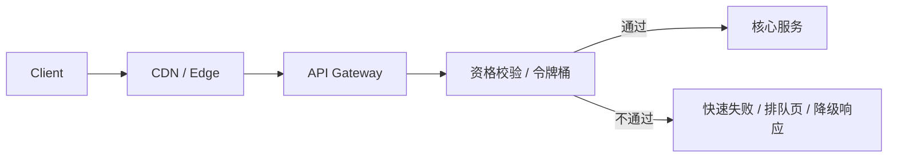

# 系统设计 - 第 2 课补充：瞬时洪峰压力模型与突发流量治理方法论

## 学习目标（本节结束后你能做到什么）

1. 理解“平均 QPS 不高但系统仍会被打挂”的原因。
2. 能把突发流量拆成到达速率、持续时间、可处理能力、队列水位、热点集中度和恢复时间。
3. 能根据峰均比选择限流、快速失败、排队削峰、热点隔离、预热、弹性扩容和降级。
4. 能在面试里说清“哪些请求应该放进系统，哪些应该挡在入口，哪些可以排队，哪些必须直接失败”。

## 目录索引

1. [为什么需要单独的洪峰模型](#一为什么需要单独的洪峰模型)
2. [先判断：这是长期增长还是瞬时洪峰](#二先判断这是长期增长还是瞬时洪峰)
3. [洪峰压力要算哪几个数字](#三洪峰压力要算哪几个数字)
4. [用数字判断洪峰到了什么阶段](#四用数字判断洪峰到了什么阶段)
5. [入口层：先决定谁能进系统](#五入口层先决定谁能进系统)
6. [队列层：把尖峰变成平峰](#六队列层把尖峰变成平峰)
7. [热点层：把局部爆点从整体系统里隔离出来](#七热点层把局部爆点从整体系统里隔离出来)
8. [弹性与预热：为什么临时加机器经常来不及](#八弹性与预热为什么临时加机器经常来不及)
9. [降级与快速失败：洪峰里最重要的是保护核心路径](#九降级与快速失败洪峰里最重要的是保护核心路径)
10. [不同阶段怎么做技术选型](#十不同阶段怎么做技术选型)
11. [常见风险与面试追问](#十一常见风险与面试追问)
12. [面试表达模板](#十二面试表达模板)

## 内容讲解（核心概念，用类比、例子、图示说清楚）

第 2 课里已经强调过：

```text
平均值告诉你体量
峰值决定你会不会在关键时刻挂掉
```

但这句话还不够。因为瞬时洪峰不是普通的“QPS 高一点”，而是流量曲线在很短时间里突然变尖：

```text
平时 1k/s
活动开始瞬间 100k/s
持续 30 秒
其中 80% 请求打到同一个对象或同一类接口
```

如果你只按平均 QPS 设计，系统会在最关键的几十秒里崩掉。  
如果你只说“加机器”，又会忽略扩容启动、缓存预热、连接建立、数据库热点和下游保护这些更真实的问题。

所以这篇的核心句是：

```text
瞬时洪峰压力模型的本质，不是把所有请求都处理完，而是控制进入系统的流量形状。
```

洪峰治理的目标通常不是“零失败”，而是：

```text
核心请求能成功
非核心请求快速失败或降级
后端不被压垮
队列不无限堆积
洪峰结束后系统能恢复
```

### 一、为什么需要单独的洪峰模型

普通高 QPS 关注的是持续吞吐：

```text
系统长期每秒要处理多少请求？
数据库和缓存能不能持续支撑？
水平扩展后能不能线性提升？
```

瞬时洪峰关注的是流量曲线：

```text
请求是不是集中在几秒或几分钟？
峰值是不是平均值的 10 倍、100 倍？
请求是否集中打到一个 key、一个接口、一个资源？
系统能吸收多少突发？
吸收不了的部分在哪里丢弃或排队？
```

两类问题的技术动作不一样。

持续高 QPS 可能优先考虑：

- 扩容
- 缓存
- 分片
- 读写分离
- 数据模型优化

瞬时洪峰则更优先考虑：

- 入口限流
- 资格校验
- 快速失败
- 排队削峰
- 热点隔离
- 预热
- 降级
- 防重试风暴

一个非常重要的判断是：

```text
长期增长靠扩容量。
瞬时洪峰靠控形状。
```

### 二、先判断：这是长期增长还是瞬时洪峰

面试里遇到“流量突然涨 10 倍”，不要立刻给方案。先问四个问题：

1. 是短时活动、热点事件、故障重试，还是业务自然增长？
2. 持续多久？秒级、分钟级、小时级，还是长期？
3. 流量是否集中到少数接口、少数 key、少数租户或少数地域？
4. 请求失败时能不能快速返回？用户是否能接受排队或“处理中”？

可以这样分类：

| 类型     | 典型特征              | 设计重点               |
| ------ | ----------------- | ------------------ |
| 长期增长   | 每天都更高，曲线整体上移      | 扩容、分片、缓存、长期架构演进    |
| 可预测洪峰  | 大促、开票、抢购、定时推送     | 预热、预约容量、令牌、排队、降级预案 |
| 不可预测洪峰 | 热点新闻、突发舆情、爬虫、外部攻击 | 动态限流、热点探测、快速失败、隔离  |
| 故障诱发洪峰 | 重试风暴、缓存雪崩、下游超时    | 熔断、退避、请求合并、回源保护    |

如果是长期增长，你要讲容量扩展。  
如果是瞬时洪峰，你要讲流量整形。

### 三、洪峰压力要算哪几个数字

洪峰模型里，平均 QPS 不是最关键的数。你至少要算这几个：

```text
avg_qps = total_requests / total_seconds
peak_qps = peak_window_requests / peak_window_seconds
peak_ratio = peak_qps / avg_qps
burst_duration = 洪峰持续时间
system_capacity = 系统稳定可处理 QPS
excess_qps = max(0, peak_qps - system_capacity)
queue_backlog = excess_qps * burst_duration
drain_time = queue_backlog / spare_processing_capacity
hot_key_qps = 单 key 或单对象峰值 QPS
```

例如：

```text
全天请求 = 1 亿
平均 QPS = 1e8 / 86400 ≈ 1157/s
活动前 1 分钟涌入 3000 万请求
峰值 QPS = 30,000,000 / 60 = 500k/s
峰均比 ≈ 432x
系统稳定处理能力 = 50k/s
```

这时多出来的压力是：

```text
excess_qps = 500k/s - 50k/s = 450k/s
queue_backlog = 450k/s * 60s = 27,000,000
```

如果洪峰结束后系统只能拿出额外 `20k/s` 的空闲能力慢慢消化：

```text
drain_time = 27,000,000 / 20k/s = 1350s ≈ 22.5 分钟
```

这个数字会直接影响技术选择：

- 如果业务不能接受 20 分钟排队，就不能只靠 MQ。
- 如果只有 10 万个名额，就没必要让 3000 万请求都进核心链路。
- 如果后端只能处理 50k/s，就要在入口把多余请求挡掉。

### 四、用数字判断洪峰到了什么阶段

可以沿用第 2 课里的经验线：

| 峰值 / 平均值 | 判断 | 设计重点 |
| --- | --- | --- |
| `< 3x` | 通常压力不大 | 正常容量冗余、自动扩缩容、基础限流 |
| `3x - 10x` | 开始影响架构 | 预热、限流、排队、热点缓存、降级预案 |
| `10x+` | 通常决定架构 | 入口准入、令牌/资格校验、削峰队列、热点隔离、快速失败 |

还要叠加两个更敏感的指标：

| 指标 | 危险信号 | 为什么重要 |
| --- | --- | --- |
| 洪峰持续时间 | 秒级到分钟级集中爆发 | 扩容可能来不及，只能限流和削峰 |
| 热点集中度 | Top 1% 对象贡献 50%+ 流量 | 总 QPS 不高也可能打爆单 key 或单行 |

所以面试里可以这样说：

```text
我不会只看平均 QPS。
我会重点看峰均比、洪峰持续时间、系统稳定处理能力和热点集中度。
如果峰均比超过 10x，洪峰治理会成为主设计对象。
```

### 五、入口层：先决定谁能进系统

> 限流、降级、熔断、幂等、重试这些**稳定性手段的通用原理和实现**（令牌桶/漏桶算法、熔断状态机、重试退避与 jitter、超时预算），是第 6 课的核心，见 [06 限流、降级、熔断、幂等与重试](./06_限流、降级、熔断、幂等与重试.md)。本篇不重复这些机制，只讲洪峰场景下**怎么组合用它们做流量整形**：谁能进、谁排队、谁快速失败。

洪峰里最重要的一句话是：

```text
不要让明显无法成功的请求进入核心系统。
```

入口层负责做准入控制。常见手段：

| 手段 | 作用 | 适用场景 |
| --- | --- | --- |
| 全局限流 | 限制系统总入口 QPS | 保护整体服务 |
| 分接口限流 | 不同接口不同额度 | 写接口比读接口更脆弱 |
| 分用户/租户限流 | 防止少数用户打爆系统 | 多租户、API 平台 |
| 分资源限流 | 按商品、活动、房源、帖子限流 | 热点对象 |
| 资格校验 | 没资格直接失败 | 秒杀、预约、抢票 |
| 令牌发放 | 先拿到令牌才进核心链路 | 名额有限、强竞争 |
| 等候室 | 让用户排在入口外 | 大促、票务、报名 |

一个常见入口结构是：



入口层的目标不是公平处理所有请求，而是保护后端。

面试里要强调：

```text
如果后端只能稳定处理 50k/s，而入口来了 500k/s，
我不会让 500k/s 都进服务层排队。
我会在网关、边缘或活动入口先做准入控制。
```

### 六、队列层：把尖峰变成平峰

队列削峰适合一种语义：

```text
用户不需要立即知道最终结果，只需要知道请求已受理。
```

例如：

- 发送通知
- 导出报表
- 异步下单确认
- 后台处理任务
- 非核心统计
- 可以延迟生效的写入

队列削峰的核心公式是：

```text
backlog = arrival_rate - consume_rate
drain_time = backlog / later_spare_capacity
```

如果：

```text
arrival_rate = 100k/s
consume_rate = 20k/s
burst_duration = 300s
```

积压是：

```text
(100k - 20k) * 300 = 24,000,000
```

这时你要继续回答：

- 24M 积压消息队列能不能承受？
- 用户能不能接受多久处理完？
- 消费者是否幂等？
- 超时任务是否还有意义？
- 积压期间新流量怎么办？

不要把 MQ 当成魔法。MQ 只是把瞬时压力挪到后面，最终仍然要处理或丢弃。

### 七、热点层：把局部爆点从整体系统里隔离出来

洪峰经常不是均匀流量，而是热点流量。

例如：

```text
全站 QPS = 50k/s
某一个商品详情 = 30k/s
某一个库存 key = 20k/s
某一个帖子评论区 = 10k/s
```

这时总量看起来不夸张，但单 key、单对象、单行、单分片可能已经被打爆。

热点治理常见手段：

| 压力点 | 手段 |
| --- | --- |
| 热点读 | 本地缓存、多级缓存、请求合并、CDN、短 TTL |
| 热点写 | 分片计数、聚合写、队列串行化、限流 |
| 热点库存 | 预扣令牌、库存分桶、单资源排队 |
| 热点评论/点赞 | 本地聚合、异步落库、最终对账 |
| 热点租户 | tenant 隔离、单租户限流、独立资源池 |

一个很实用的表达是：

```text
如果热点对象已经贡献超过 50% 流量，我会把它从普通路径里拿出来单独治理，
避免一个热点拖垮整个系统。
```

### 八、弹性与预热：为什么临时加机器经常来不及

很多候选人遇到洪峰会说“自动扩容”。这不是错，但要说清边界。

弹性扩容受这些因素限制：

- 新实例启动需要时间。
- 容器起来不等于缓存已热。
- 连接池、线程池、JIT、依赖初始化都需要预热。
- 数据库、Redis、MQ、下游服务未必一起扩容。
- 负载均衡把流量切进新实例也需要时间。
- 洪峰可能只持续几十秒，扩容完成时已经结束。

所以可预测洪峰通常要预热：

```text
提前扩容
缓存预热
连接池预建
热点数据预加载
限流阈值预配置
降级开关预演练
队列和消费者容量提前准备
```

不可预测洪峰则更依赖：

```text
动态限流
边缘拦截
热点探测
熔断降级
自动隔离
快速失败
```

面试里可以这样说：

```text
扩容适合应对可预测或持续增长的压力，但秒级洪峰不能只靠扩容。
我会把预热、入口限流和降级作为第一层保护。
```

### 九、降级与快速失败：洪峰里最重要的是保护核心路径

洪峰时，系统不能把所有功能都按平时标准服务。

你要先分清：

```text
核心路径
重要但可延迟路径
可降级路径
可直接关闭路径
```

例如：

| 路径 | 洪峰策略 |
| --- | --- |
| 支付、库存扣减、订单确认 | 保留容量，强限流，保护一致性 |
| 通知、推荐、统计 | 异步或延迟 |
| 个性化、复杂排序 | 降级为默认结果 |
| 评论、分享、点赞展示 | 可短暂弱一致 |
| 后台报表、导出 | 暂停或排队 |

快速失败不是坏事。洪峰里，快速失败比慢慢拖死更好。

```text
快速失败可以释放线程、连接、内存和队列容量，
让核心请求有机会成功。
```

要避免的是“假排队”：

```text
用户看起来在排队，但后端队列已经无法在有效时间内消化。
```

如果排队结果已经没有业务意义，就应该过期、取消或直接失败。

### 十、不同阶段怎么做技术选型

#### 1. 峰均比 `< 3x`：通常压力不大

这个阶段不需要复杂洪峰体系。

可以选：

- 基础容量冗余
- 服务级限流
- 连接池和线程池保护
- 简单自动扩缩容
- 基础缓存
- 超时和重试退避

面试表达：

```text
如果峰均比小于 3x，我会先用常规容量冗余和基础限流处理，
重点保证连接池、线程池、下游 timeout 和重试策略不要把小波动放大。
```

#### 2. 峰均比 `3x - 10x`：开始影响架构

这个阶段要开始设计洪峰预案。

可以选：

- 网关限流
- 按接口/用户/资源限流
- 热点 key 动态缓存
- 缓存预热
- 关键页面静态化或 CDN
- 非核心链路降级
- 写入队列削峰
- 消费者水平扩展
- 活动前容量预估和压测

面试表达：

```text
如果峰均比到 3x 到 10x，我会把它当成架构风险处理。
可预测流量提前扩容和预热；不可预测流量依赖动态限流、热点探测和降级。
```

#### 3. 峰均比 `10x+`：通常决定架构

这个阶段，洪峰治理就是主设计对象。

可以选：

- 边缘层或网关准入
- 等候室
- 令牌桶 / 漏桶
- 活动资格校验
- 库存令牌预发
- 单资源队列
- 热点对象隔离
- 只让可能成功的请求进入核心链路
- 非核心功能默认降级
- 重试风暴治理
- 队列水位和过期策略
- 按业务优先级保留容量

面试表达：

```text
如果峰均比超过 10x，我不会按平均 QPS 设计。
我会先算系统可处理能力和多余请求量，
然后在入口做准入控制，把明显不会成功或无法承载的请求快速失败，
对可延迟的请求排队削峰，对热点对象单独隔离。
```

### 十一、常见风险与面试追问

#### 风险 1：只加机器，不控入口

如果洪峰是秒级或分钟级，扩容可能来不及。  
即使应用扩容了，数据库、缓存、MQ、第三方服务也未必同步扩容。

应对：

- 可预测洪峰提前扩容和预热。
- 不可预测洪峰先限流、降级和隔离。
- 把数据库、缓存、下游容量一起纳入瓶颈判断。

#### 风险 2：排队后永远处理不完

MQ 能削峰，但不能消灭流量。

应对：

- 计算 backlog 和 drain_time。
- 给消息设置过期时间。
- 对无意义的过期请求直接丢弃或补偿。
- 按优先级拆队列，避免低优先级挤占核心任务。

#### 风险 3：重试风暴把故障放大

下游慢了以后，客户端、网关、服务端一起重试，流量可能被乘法放大。

应对：

- 指数退避和 jitter。
- 限制最大重试次数。
- 熔断下游。
- 对幂等写入用 idempotency key。
- 服务端返回明确的限流信号。

#### 风险 4：缓存雪崩变成洪峰

大量 key 同时过期，会把请求瞬间打到数据库。

应对：

- TTL 加随机抖动。
- 热点 key 后台刷新。
- 请求合并。
- stale-while-revalidate。
- 回源限流。

#### 风险 5：限流策略不公平或误伤核心用户

应对：

- 按用户、租户、接口、资源多维限流。
- 核心客户或核心路径保留容量。
- 限流结果可观测，能解释被限原因。
- 支持临时白名单和灰度调整。

### 十二、面试表达模板

你可以这样说：

```text
如果题目里出现瞬时洪峰，我不会只按日均或平均 QPS 设计。
我会先估 avg_qps、peak_qps、峰均比、洪峰持续时间、系统稳定处理能力和热点集中度。

如果峰均比小于 3x，通常用常规容量冗余、基础限流和自动扩缩容即可。
如果峰均比到 3x 到 10x，洪峰开始影响架构，需要提前预热、网关限流、热点缓存、非核心降级和必要的队列削峰。
如果峰均比超过 10x，洪峰治理会成为主设计对象：
我会在入口层做准入控制和快速失败，只让可能成功的请求进入核心链路；
对可延迟请求用队列削峰，并计算 backlog 和 drain_time；
对热点对象做隔离，避免单个 key 或单个资源拖垮整体系统；
同时用降级、熔断、退避重试和监控保护核心路径。

这里的 trade-off 是：限流和快速失败会牺牲一部分请求体验，
但它能保护系统不被打垮，让核心请求和核心用户得到稳定服务。
```

## 检查站

看到“瞬时洪峰”或“突然 10 倍流量”，你应该立刻问自己：

1. 这是长期增长，还是短时洪峰？
2. 洪峰持续多久？
3. 峰值 QPS 和平均 QPS 分别是多少？
4. 峰均比是多少？
5. 系统稳定处理能力是多少？
6. 多出来的请求是丢弃、排队，还是降级？
7. 如果排队，backlog 和 drain_time 是多少？
8. 流量是否集中到单个接口、单个 key、单个资源或单个租户？
9. 哪些请求必须同步成功，哪些可以“已受理”？
10. 哪些非核心功能可以关闭或降级？
11. 是否存在重试风暴、缓存雪崩或下游超时放大？
12. 洪峰结束后系统如何恢复，积压如何清理？
