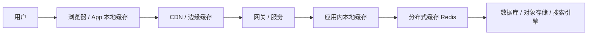
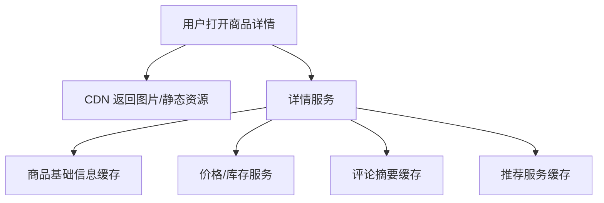

# 系统设计 - 第 3 课：缓存、CDN 与读写链路

## 学习目标（本节结束后你能做到什么）

1. 理解缓存和 CDN 不是“为了更快所以加一下”，而是围绕访问路径、热点分布和一致性要求做的工程取舍。
2. 能区分浏览器缓存、CDN、应用缓存、Redis、本地缓存各自承接哪类问题。
3. 能讲清缓存更新策略、缓存失效风险、热点治理、缓存雪崩/击穿/穿透这些高频追问点。
4. 能结合商品详情、短链跳转、Feed 首页等案例解释“缓存什么、为什么缓存、什么时候不该缓存”。

## 内容讲解（核心概念，用类比、例子、图示说清楚）

缓存可能是系统设计面试里最常被提到、也最常被讲浅的组件。很多回答只有一句话：“这里为了提升性能，可以加 Redis。”这句话的问题不是错，而是信息量太低。面试官真正想知道的是：为什么这里会慢？慢的是数据库、网络、CPU 还是跨地域访问？缓存的是结果、对象、列表还是页面片段？为什么这个数据适合缓存？不一致能容忍多久？失效以后会不会把底层打穿？

你可以先记住一句很重要的话：`缓存的本质，是用额外空间和一致性复杂度，换取更短访问路径和更少重复计算。`

这句话里藏着两层含义。

第一，缓存是一笔交易，不是白赚。  
你得到的是低延迟、高吞吐、少回源、更好的用户体验；你付出的代价是内存成本、失效管理、数据不一致、热点治理、回源放大和运维复杂度。

第二，缓存只有在“重复访问”足够多、回源成本足够高、且业务可容忍一定新鲜度损失时才真正划算。  
如果一个数据几乎不被重复访问，或者每次都必须读到绝对最新值，那缓存价值就会大幅下降，甚至可能带来反效果。

### 一、缓存到底在加速什么

很多人提缓存时，脑中只想到数据库前面放 Redis。其实缓存至少可以加速四类东西：

1. 远程访问  
   把离用户更近的内容提前放在边缘层，减少网络距离。这是 CDN 的主要价值。

2. 重复计算  
   比如首页聚合结果、复杂排序结果、权限计算结果、推荐候选集。

3. 慢存储读取  
   比如数据库热点行、对象存储元数据、搜索结果摘要。

4. 下游调用成本  
   比如第三方接口结果、风控标签、配置中心数据。

所以，“这里要不要缓存”的正确问法不是“这里能不能加 Redis”，而是“这个链路中，哪一段重复且昂贵，值得用更便宜的方式提前保存”。

### 二、缓存是分层的，不是只有 Redis 一层

这几层缓存解决的问题并不一样。

#### 1. 客户端或浏览器缓存

这层最适合静态资源、头像、配置、最近一次接口结果、分页列表的局部重用。它的优势是离用户最近，没有网络开销；劣势是可控性差、版本管理要小心。所以前端静态资源常常会用内容哈希命名来保证版本切换安全。

#### 2. CDN / 边缘缓存

CDN 更适合静态资源、图片、视频分片、文件下载，以及对实时性要求不极端的公共内容。它解决的不是数据库压力，而是地域延迟和源站带宽。对于全球用户产品来说，CDN 往往不是“优化项”，而是体验基线。

#### 3. 应用内本地缓存

本地缓存延迟低、吞吐高，适合热点极高、数据量相对可控、短 TTL 的场景，比如配置项、热点元数据、限流规则、极少量热点对象。它的难点在于多实例一致性和内存管理，所以通常只适合作为二级加速层，而不适合作为唯一缓存层。

#### 4. 分布式缓存

Redis 这类缓存系统的优势是共享、可扩展、支持较丰富的数据结构。它通常是服务端缓存的主力，但它不是万能中间层。缓存什么、过期多久、怎么回填、如何避免击穿，这些都要靠设计，而不是靠“用了 Redis”自动获得。

### 三、常见缓存策略，背后分别在交换什么

#### 1. Cache Aside

最常见策略。读取时先查缓存，未命中再查数据库并回填缓存；写入时先更新数据库，再删除缓存或更新缓存。

优点：

- 实现简单
- 业务层最容易控制
- 适合大多数读多写少场景

代价：

- 读写代码要小心设计
- 缓存和数据库之间存在短暂不一致窗口

这也是面试里最值得优先讲清楚的一种。

#### 2. Read Through / Write Through

由缓存层代理读写，业务不直接操作数据库。它的好处是业务更干净，但工程上往往要求缓存系统本身更强，很多团队实际用得没那么多。

#### 3. Write Back / Write Behind

先写缓存，再异步刷回数据库。这个策略写入性能高，但丢数据风险和一致性复杂度也更高，通常只适合日志、计数器、统计类场景，不适合订单、支付、库存这种权威状态。

从这里你可以看到，缓存策略的选择，其实就是在做一致性、复杂度和吞吐量之间的 trade-off。

### 四、缓存最难的从来不是“怎么查”，而是“怎么更新”

系统设计里有一句很有名的话：`缓存失效与命名，是计算机科学里最难的两个问题。`

为什么缓存更新这么难？因为一旦底层数据变了，你就得决定：

- 何时更新缓存
- 用删缓存还是更新缓存
- 多副本缓存是否一起刷新
- 缓存 miss 时是否允许大量并发回源

最常见也最实用的策略是：`写数据库，删缓存。`

为什么很多时候是删，而不是直接更新？

- 因为更新缓存往往需要知道完整对象最终形态
- 删除可以把复杂性交给下一次读取时的回填逻辑
- 读取路径通常比写路径更容易统一

但这也带来一个典型追问：如果“更新数据库成功，删缓存失败”怎么办？

常见思路有三种：

1. 重试删除缓存  
   适合短时间重试。

2. 使用消息或异步补偿  
   把缓存失效事件可靠投递出去。

3. 让缓存 TTL 不要过长  
   即使失效失败，也能靠自然过期兜底。

这里面没有绝对完美方案，关键是业务能容忍多久的不一致。

### 五、面试最爱追问的三个坑：穿透、击穿、雪崩

#### 1. 缓存穿透

请求查询的是数据库里根本不存在的数据，缓存也没有，每次都穿到数据库。恶意流量或异常请求会把底库拖垮。

常见解法：

- 布隆过滤器
- 对空结果做短 TTL 缓存
- 参数校验和访问控制

#### 2. 缓存击穿

某个超热点 key 刚好过期，大量并发同时回源，导致数据库瞬时被打爆。

常见解法：

- 对热点 key 永不过期，靠主动刷新
- singleflight / 请求合并
- 热点预热
- 多级缓存

#### 3. 缓存雪崩

大量 key 在同一时间集中失效，或者整个缓存集群抖动，导致后端大面积回源。

常见解法：

- TTL 随机抖动
- 限流和降级
- 热点隔离
- 多级缓存
- 对底库做保护和熔断

这三个概念很多人背过，但真正加分的是你能结合具体业务说出为什么会发生、影响链路在哪里、如何兜底。

### 六、什么时候不该缓存

系统设计里一个很重要的成熟信号，是你知道缓存不是处处都适合。

下面几类数据就要更谨慎：

1. 强一致且写多读少的数据  
   例如支付最终状态、账户余额、库存真相源。这类数据可以有派生缓存，但真相源通常不该建立在缓存之上。

2. 命中率极低的数据  
   每个请求查一次再也不查，缓存价值不高，反而浪费内存。

3. 超大对象  
   单个对象体积太大时，缓存很容易挤爆热点空间，还会带来网络传输成本。

4. 高度个性化且变化极快的数据  
   例如某些实时风控判定结果、极细粒度权限视图，缓存收益未必覆盖复杂度。

### 七、案例一：商品详情页为什么几乎是缓存教科书

商品详情页是非常适合讲缓存的案例，因为它具备典型特征：

- 读多写少
- 热点明显
- 用户对几十秒内的小延迟更新通常可容忍
- 图片、描述、评论摘要、价格、库存并不是同一种新鲜度要求

一个更真实的拆法，不是把整个详情页当成一个大对象缓存，而是按性质分层：

- 图片、静态描述走 CDN
- 商品基础信息和营销文案走 Redis 缓存
- 实时库存和价格谨慎缓存，TTL 更短，甚至强一致读直接查服务
- 评论摘要和推荐位允许异步刷新

这个案例里最容易拿分的点是：你能主动说“详情页不是一个一致性等级统一的对象”。  
商品标题和图片晚几秒更新问题不大，但库存和价格就更敏感。所以缓存设计不是一刀切，而是按字段和业务语义分层。

### 八、案例二：短链系统的读路径为什么天然适合缓存

短链系统的核心动作是 `short_code -> long_url` 的映射查找。这本质上是点查，非常适合缓存。

它的特点是：

- 读多写少
- 热点高度集中
- 主链路极短，用户对跳转延迟非常敏感
- 点击统计又允许异步

因此一个很自然的设计是：

- 热门短链映射放 Redis
- 更热点的放本地缓存
- 静态跳转页资源走 CDN
- 点击事件异步写 MQ/日志系统

这个案例很适合说明一个原则：`缓存优先服务主链路，统计和分析尽量从主链路剥离。`

### 九、案例三：Feed 首页缓存，缓存的不是“内容”，而是“候选结果”

Feed 首页很多时候不是简单的对象读取，而是一个组合结果：候选内容 + 排序 + 去重 + 已读过滤 + 社交关系过滤。  
这时缓存什么，变成了一个很有工程味的问题。

常见做法不是直接缓存整个最终页面太久，而是缓存：

- 候选内容 ID 列表
- 热门作者内容
- 用户社交图局部结果
- tweet/post 详情对象

然后在读取时做轻量拼装。这样做的原因是：

- 最终页面个性化太强
- 全页缓存失效率高
- 候选列表和对象详情复用度更高

这个案例能帮助你建立一个更成熟的认知：`缓存不一定缓存最终答案，也可以缓存中间结果。`

### 十、面试里怎么把缓存讲得有层次

你可以按这个顺序回答：

1. 先说明这个系统慢在哪里，瓶颈是数据库、网络、带宽还是计算。
2. 再说明缓存对象是什么，是单对象、列表结果、页面片段还是中间计算结果。
3. 解释它为什么适合缓存：读多写少、热点明显、可容忍短暂不一致、回源成本高。
4. 接着讲缓存策略：Cache Aside、TTL、回填方式、热点保护。
5. 最后补异常路径：击穿、雪崩、穿透、缓存删除失败、回源限流。

这样一来，“缓存”就不再只是一个关键词，而是一整段工程推理。

## 小结（3-5 条关键点）

1. 缓存的本质是用空间和一致性复杂度换更短访问路径、更少重复计算和更低延迟。
2. 缓存是分层的，浏览器缓存、CDN、本地缓存、分布式缓存解决的问题不同。
3. 面试里真正拉开差距的，不是会不会说 Redis，而是能不能讲清缓存更新、热点治理和异常保护。
4. 并不是所有数据都适合缓存，强一致真相源、低命中率数据和超大对象都要谨慎。
5. 商品详情、短链跳转、Feed 首页是三个很适合练习缓存思维的经典案例，但它们缓存的对象和策略明显不同。

---

## 检查站：请回答以下问题

1. 为什么说缓存是一笔“空间换时间、复杂度换吞吐”的交易？这笔交易的代价主要体现在哪？
2. 如果设计商品详情页，你会把哪些内容放 CDN，哪些内容放 Redis，哪些内容不适合长时间缓存？为什么？
3. 缓存穿透、击穿、雪崩分别是什么？你能分别给出一个更贴近真实业务的例子吗？
4. 为什么 Feed 首页很多时候缓存的是候选结果或对象详情，而不是整个最终页面？

请把你的答案直接告诉我，我会根据你的回答决定下一步。
