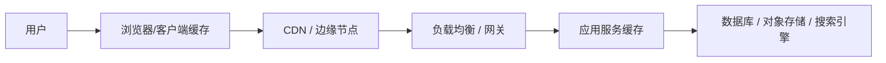

# 系统设计 - 第 3 课：缓存、CDN 与读写链路

## 学习目标（本节结束后你能做到什么）

1. 理解缓存和 CDN 在系统设计里的角色，不会把它们简单理解成“加了就更快”。
2. 能在面试里说明缓存应该加在哪一层、解决什么瓶颈、会带来什么代价。
3. 能区分典型的读写链路，并知道不同场景下缓存策略为什么不同。
4. 能结合真实高频题型，比如 Twitter、短链、秒杀系统，讲出缓存、CDN、异步链路和一致性之间的取舍。

## 内容讲解（核心概念，用类比、例子、图示说清楚）

系统设计面试里，缓存几乎是出场率最高的组件之一。很多候选人也确实会主动提到它，但问题在于，很多人一说缓存，回答就停留在“为了提升性能，所以加 Redis”。这句话当然没错，但它太浅了。面试官真正想听到的是：为什么这里会慢？慢在哪一层？这个瓶颈是数据库、网络、CPU、跨地域访问，还是磁盘 IO？为什么缓存适合解决这个问题？缓存放在哪一层最值？缓存失效以后会发生什么？如果数据不一致，业务能不能接受？只有把这些问题说清楚，缓存才算真正讲明白。

你可以先把缓存理解成“用额外的空间，去换取更短的访问路径和更少的重复计算”。这个定义很重要，因为它提醒你，缓存不是目的，而是一种交易。你付出的代价包括内存成本、失效管理、更新复杂度、一致性风险、热点问题和故障时的回源冲击；你得到的回报包括更低延迟、更高吞吐、更低后端压力和更好的用户体验。系统设计里真正成熟的表达，从来不是“这里可以加缓存”，而是“这里值得加缓存，因为这个链路重复读多、可容忍短暂不一致、回源成本高，而缓存命中能显著降低尾延迟”。

在实践中，缓存并不是只有一层。很多题目里至少有三层缓存思维。第一层是客户端或浏览器缓存，比如静态资源、图片、CSS、JS、接口短期结果。第二层是边缘缓存，也就是 CDN。第三层是服务端缓存，比如应用内缓存、Redis、数据库页缓存、搜索结果缓存、Feed 结果缓存。理解这三层的位置和作用，是面试里一个很重要的加分点。

先说 CDN。CDN 本质上是一种“把内容提前放到离用户更近的地方”的缓存系统。它最适合的场景是静态资源、图片、视频片段、文件下载，以及变化不那么频繁、对实时一致性要求不极端的内容。比如你设计一个 Twitter 首页，用户头像、图片、前端静态资源，就非常适合放到 CDN 上；你设计一个短链系统，被重定向的跳转页面中静态资源也可以走 CDN；你设计一个在线视频系统，切片文件和封面更是典型 CDN 场景。CDN 的核心收益不是减轻数据库压力，而是减少跨地域网络延迟、降低源站带宽开销、提升全球用户体验。

但 CDN 不是万能的。它并不适合所有动态内容。比如秒杀库存数字、银行余额、聊天未读数，这些信息变化快、实时性要求高，而且有用户隔离属性，通常不适合直接走长期边缘缓存。即使有些动态接口也能接入 CDN，通常也需要非常短的 TTL、按用户或参数维度细粒度控制缓存键，否则就会出现脏数据或缓存污染。所以你在面试里提 CDN 时，最好顺手补一句：它适合内容分发和静态读优化，不适合强一致、强个性化、强实时的动态状态。

再说服务端缓存。面试里最常见的就是 Redis。Redis 并不神奇，它只是因为内存访问快、结构灵活、支持过期、原子操作和多种数据结构，所以非常适合作为通用缓存层。关键不在于“要不要 Redis”，而在于缓存什么。你可以缓存对象详情，比如用户信息、商品信息、短链映射；可以缓存聚合结果，比如某个用户的首页 Feed ID 列表；可以缓存热点计数，比如点赞数、浏览量、热榜分数；也可以缓存分布式限流令牌、会话状态和幂等键。不同对象的访问模式不同，缓存策略也不同。

缓存设计里，第一个必须讲的概念，是缓存键。很多系统问题不是出在“要不要缓存”，而是出在“缓存的粒度是否合适”。比如用户详情适合按 `user_id` 缓存，商品详情适合按 `sku_id` 缓存，短链跳转适合按 `short_code` 缓存，而 News Feed 更可能按 `user_id + page_cursor` 缓存结果页。如果缓存键设计混乱，要么命中率低，要么失效成本高，要么产生错误复用。外企大厂面试经常会追问这一层，因为它能看出你是不是只会讲抽象概念。

第二个核心问题，是缓存一致性。缓存快，但它不是权威数据源。真正的权威通常还在数据库、对象存储或者某个核心服务里。所以你必须考虑：写入发生后，缓存怎么更新？常见模式有三种。第一种是 Cache Aside，也叫旁路缓存。读的时候先查缓存，未命中再查数据库并回填；写的时候先更新数据库，再删除或更新缓存。它是最常见、也最通用的模式。第二种是 Write Through，请求写入缓存，再由缓存同步写到底层存储。第三种是 Write Back，也叫 Write Behind，先写缓存，后续异步刷盘。这种方式写入快，但一致性和故障恢复更复杂，面试里只有在明确说明场景适合时才建议提。

对于大多数面试题，Cache Aside 是默认主力，因为它实现简单、适应范围广。但它也不是没有问题。比如写数据库成功后删除缓存失败，会导致脏缓存继续存在；再比如多个线程同时回源，会造成缓存击穿。所以成熟一点的回答应该继续往下说：我会优先使用旁路缓存模式，并配合过期时间、互斥回填、热点保护和异步重建机制，降低不一致和击穿风险。这样才像一个真正做过系统的人。

讲到缓存，就绕不开三个经典问题：缓存穿透、缓存击穿、缓存雪崩。它们是面试里的高频追问，但你不能只背定义，要知道为什么会发生、怎么处理。

缓存穿透，指的是请求的数据在缓存和数据库里都不存在，导致每次都打到底层。典型场景是恶意请求不存在的商品 ID、不存在的用户 ID。应对办法包括参数校验、布隆过滤器、对空结果做短期缓存。缓存击穿，指的是某个非常热点的 key 在失效瞬间，大量请求同时回源，把数据库打挂。典型场景是爆款商品详情或热门短链。应对方式包括热点永不过期、互斥锁、单飞机制、异步预热。缓存雪崩，指的是大量 key 同时失效或缓存集群整体故障，导致回源洪峰。处理方式包括给 TTL 加随机抖动、分批预热、多级缓存、限流降级、缓存集群高可用。

现在把它们放回到真实面试场景里。

先看短链系统。短链最典型的读路径是：用户访问短链接，接入层根据短码查缓存，命中则直接得到原始长链接并返回 302；未命中则查数据库，拿到结果后回填缓存。这个系统的关键特点是读多写少，而且某些热点链接可能有极高访问量。所以缓存是非常自然的设计点。你在面试里可以说，短链映射是一个典型高命中、低更新、价值很高的缓存对象，非常适合放在 Redis 中；同时为了全球访问延迟更低，可以让静态落地页资源走 CDN，但真正的短码到长链映射仍然由应用服务和 Redis 负责。这里面试官会看你是否区分了“内容分发”和“业务映射”。

再看 Twitter 或 News Feed。这里缓存更复杂，因为你缓存的不一定是最终内容本身，很多时候缓存的是“结果集合”或者“候选 ID 列表”。比如某个用户打开首页时，后端需要拿到一串 tweet ID，再批量拉 tweet 内容、作者信息、媒体资源、互动计数。这里你可以缓存首页的 tweet ID 列表，也可以缓存 tweet 详情、用户 profile 和热门互动数据。为什么不直接缓存整页 HTML？因为个性化强、变化频繁、拼装因素多。Twitter 这类题型的成熟回答不是“有 Redis”，而是你能指出不同层次的缓存对象，以及各自的失效和更新策略。

秒杀系统则是另一种完全不同的味道。这里缓存不仅是为了“快”，更是为了“挡洪峰”。比如活动开始前，可以把库存信息、商品详情、活动配置预热到 Redis；请求打进来时，先在缓存层做库存预扣、资格校验和限流，只有通过的少量请求才继续进入下单链路。这样做的目的，是避免所有请求都打到数据库形成热点行竞争。但这会引入新的问题：缓存中的预扣库存和最终订单库里的真实库存如何对齐？如果用户拿到了资格却支付失败，库存怎么回补？所以秒杀里缓存往往和消息队列、异步订单创建、超时释放一起出现。这里的关键 trade-off 是：你用复杂度换系统在峰值下的生存能力。

还要注意一个常见误区。很多候选人会说：“既然缓存这么好，那就把所有东西都缓存起来。”这在面试里通常不是加分，而是暴露出你没有成本意识。缓存最大的前提是访问模式要适合。写多读少、实时强一致、数据个性化很强、缓存成本高于回源收益的场景，就不一定值得缓存。比如用户余额、实时风控结果、支付状态中的最终确认值，就需要更谨慎。有些数据可以做只读副本，有些可以做本地短缓存，但不能轻率地把它们当成“普通详情信息”处理。

从读写链路角度看，你还要学会判断“缓存应该放在读路径还是写路径前面”。大多数题目里，缓存主要优化读路径，因为读频次高、重复访问多、回源成本高。但在某些高写入峰值场景下，写路径前面也会做缓存或内存态控制，例如秒杀库存预扣、计数器累加、热榜分数聚合。只是这时候它往往已经不是单纯的“缓存”，而是和状态机、异步落库、消息队列一起组成了一套写优化方案。面试里如果你能把这点分清楚，层次会比只会讲“查 Redis”高很多。

最后，把今天的内容收束成一个面试里的稳定套路。当你觉得某个地方要加缓存时，不要直接说“这里加 Redis”，而是按这个顺序讲：第一，这个链路为什么慢，瓶颈在哪。第二，这类数据为什么适合缓存，缓存粒度是什么。第三，缓存放在哪一层最值，是客户端、CDN、应用层还是数据库前。第四，缓存如何失效与更新，用什么一致性策略。第五，缓存失效或故障时如何保护后端，比如限流、降级、互斥回填、多级缓存。你一旦形成这种表达方式，缓存就不再是一个口号，而是一套完整的工程决策。

## 小结（3-5 条关键点）

1. 缓存的本质是用空间换时间、用复杂度换性能，面试里要讲收益，也要讲代价。
2. CDN 适合静态资源和弱实时内容分发，服务端缓存适合热点读、重复读和高回源成本的数据访问。
3. 缓存设计的关键不是“有没有 Redis”，而是缓存什么、缓存键怎么设计、放在哪一层、如何更新和失效。
4. 常见风险包括缓存穿透、击穿、雪崩，以及更新失败带来的数据不一致和回源洪峰。
5. Twitter、短链、秒杀等高频题都大量依赖缓存，但三者的目标不同：Twitter 主要优化读路径，短链主要优化热点映射，秒杀主要拦截洪峰和保护下游。

---

## 检查站：请回答以下问题

1. 为什么说“这里加一个 Redis”在系统设计面试里通常不算完整回答？你觉得还应该补哪些关键信息？
2. CDN 和服务端缓存分别更适合解决什么问题？请你各举一个场景。
3. 如果面试官让你设计一个短链系统或 Twitter Feed，你会优先缓存什么对象？为什么？
4. 秒杀系统里的缓存，和普通详情页缓存相比，最大的设计差异是什么？

请把你的答案直接告诉我，我会根据你的回答决定下一步。
