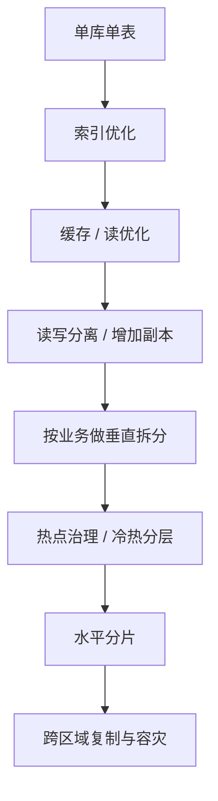

# 系统设计 - 第 4 课：数据库、索引、分片与复制

## 学习目标（本节结束后你能做到什么）

1. 理解数据库选型的核心不是站队，而是围绕访问模式、正确性边界和演进路径做判断。
2. 能讲清索引为什么快、为什么贵，以及哪些查询值得为它支付写入成本。
3. 能区分垂直拆分、读写分离、主从复制、水平分片、冷热分层分别在解决什么问题。
4. 能结合订单、聊天、Feed 等场景，把“从单库到分片”的演进讲得渐进、真实、可追问。

## 内容讲解（核心概念，用类比、例子、图示说清楚）

数据库这一段，是系统设计面试里特别容易出现“看起来说了很多，其实没落到点上”的地方。最常见的回答是：

- 订单用 MySQL
- 缓存用 Redis
- 搜索用 ES
- 流量大了以后分库分表

这类回答最大的问题，不是这些选择错，而是缺少判断链。你为什么用 MySQL？为什么不是 DynamoDB、Cassandra、Postgres、MongoDB？为什么一开始不分片？为什么先读写分离而不是先分库？哪些查询应该留在交易库，哪些查询应该转移到搜索或数仓？

系统设计里真正成熟的数据库回答，应该像这样推进：

1. 先定义数据对象和访问模式。
2. 再定义正确性要求和一致性边界。
3. 然后给出初始存储选择。
4. 最后再讨论随着规模增长如何演进。

也就是说，数据库设计不是“选一个库”，而是“设计一条存储演进路径”。

### 一、选数据库前先问三件事

#### 1. 这个数据最常被怎么查

是主键点查、范围扫描、时间序分页、复杂筛选、全文检索，还是图关系跳转？  
这个问题决定了你是在选择“存储引擎”，还是在选择“访问模式”。

例如：

- 订单详情：典型主键点查
- 我的订单列表：按 `user_id + created_at` 分页
- 聊天消息：按 `conversation_id + seq` 顺序拉取
- 搜索：关键词倒排检索
- 推荐：候选召回和特征排序

你会发现，这些访问方式完全不同，不可能期望一个通用数据库优雅解决所有问题。

#### 2. 这个数据的正确性要求是什么

有些数据是权威状态，例如订单状态、支付结果、账户余额、库存真相源；有些数据是派生视图，例如搜索索引、推荐特征、聚合报表、Feed 收件箱。  
权威状态通常更强调事务、唯一性、幂等和可审计；派生视图则更强调吞吐、查询效率、可异步重建。

这一步特别重要，因为很多系统设计的关键不是“哪个数据库快”，而是“哪些数据必须立刻正确，哪些数据允许晚一点到”。

#### 3. 数据增长是怎么发生的

是读多写少，还是写多读少？  
是流量整体大，还是某个热点特别集中？  
是总量慢慢增长，还是存在极强的时间局部性？

这些问题决定你后面更早遇到的是：

- 索引膨胀
- 单表过大
- 单热点写冲突
- 备份恢复过慢
- 复杂查询拖垮主库

### 二、关系型、KV、文档、搜索、列式，到底该怎么讲

很多人会把数据库类型讲成标签题，其实更好的讲法是“它们各自优化了哪种约束”。

#### 1. 关系型数据库

更擅长：

- 结构化数据
- 事务一致性
- 唯一约束
- 多条件查询
- 比较成熟的索引体系

所以订单、支付、账户、库存这类权威状态，很自然会优先考虑关系型数据库。

#### 2. Key-Value 存储

更擅长：

- 主键读写极高吞吐
- 简单对象访问
- 横向扩展

例如会话、短链映射、配置、热点状态。这类场景的关键在于访问模式足够简单。

#### 3. 文档存储

更适合：

- 结构相对灵活
- 对象整体读写
- 关联不重

但别把“结构灵活”理解成“随便乱存”。只要访问模式和索引体系不清楚，文档库一样会变成灾难。

#### 4. 搜索引擎

更适合：

- 全文检索
- 相关性排序
- 聚合分析
- 多字段过滤

它通常不是交易真相源，而是从主存储异步构建出来的查询加速层。

#### 5. 列式或 OLAP 存储

更适合：

- 报表
- 聚合分析
- 长时间窗口统计

所以你在面试里如果把“复杂报表查询”继续往交易主库上堆，多半会被追问为什么不做读写分离、ES、OLAP 或预计算。

### 三、索引到底为什么快，也为什么贵

“加索引”是数据库段落里最容易说得太轻飘的一句话。索引快，是因为它帮数据库缩小了搜索空间；索引贵，是因为每次写入都要维护这棵辅助结构。

你可以把索引理解成一本很厚的书后面的目录。  
没有目录时，你想找一个主题，只能从头翻；有目录时，可以直接跳到目标页。但目录本身要额外占纸张，而且每次正文修改，目录也要跟着改。

在系统设计层面，你不用把 B+ 树和 LSM 树的底层实现讲成数据库内核课，但至少要知道一个结论：

- 索引让读取更快
- 索引让写入更重
- 索引越多，写放大和存储成本越高

所以索引设计的关键不是“能不能建”，而是“哪些查询值得为它支付代价”。

例如订单系统里，值得优先保留的往往是：

- `order_id` 详情查询
- `user_id + created_at` 我的订单列表
- `status + created_at` 扫描待关闭订单

但如果你把各种后台分析维度都加到交易主库索引里，写入性能会被持续侵蚀。更成熟的做法通常是：

- 交易主库保留核心在线查询索引
- 复杂检索走 ES
- 大范围统计走 OLAP/数仓

这句话很像真实工程，也很容易得到面试官认可，因为它体现你知道交易库是宝贵资源。

### 四、从单库到分片，中间其实还有很多台阶

很多候选人一听到“数据量大”，立刻跳到“分库分表”。这往往显得太快。更真实的演进路径通常像这样：

这个顺序很重要，因为它体现“先解决最早出现的瓶颈，再为新瓶颈增加复杂度”。

#### 1. 单库单表

很多系统在早期完全可以从这里起步。只要表结构清楚、索引合理、访问模式明确，单库单表并不丢人。真正的问题不是“有没有分片”，而是“有没有证据证明现在必须上分片”。

#### 2. 读写分离

当读压力先变大，而写压力还没到极限时，读写分离往往比水平分片更自然。它特别适合：

- 内容详情页
- 用户资料读取
- 历史列表读取

但它会引入一个非常关键的问题：`复制延迟`。  
如果刚写完数据，立刻去从库读，可能还看不到最新值。所以涉及“读己之写”的场景，就要更谨慎。比如支付成功后的状态确认，往往不能直接依赖从库。

#### 3. 垂直拆分

垂直拆分的核心不是扩容，而是职责分离。  
比如把订单、商品、用户、库存拆成不同业务库；或者把大宽表里的不常访问大字段拆到扩展表。这一步通常能带来：

- 更清晰的边界
- 更小的单库压力
- 更独立的演进节奏

#### 4. 热点治理和冷热分层

不是所有系统都会先被“总量”打败，很多系统先被“热点”打败。爆款商品、热门用户、热点会话、当天最新数据都可能造成极不均匀负载。所以在真正分片前，往往还会先做：

- 缓存热点保护
- 大字段分离
- 近热数据单独存放
- 历史数据归档

#### 5. 水平分片

真正需要水平分片时，通常意味着你已经遇到了这些问题：

- 单表数据量过大
- 索引体积和维护成本过高
- 单机写入吞吐到顶
- 备份恢复窗口不可接受
- 单节点容量或 IO 成本太高

这时分片是合理的，但也意味着系统进入新的复杂度阶段。

### 五、分片最难的不是“拆”，而是“分片键选错以后怎么办”

分片的核心问题是：同一种数据按什么维度拆开。

理想的分片键通常要满足三点：

1. 请求分布尽量均匀
2. 高频查询尽量落单分片
3. 未来扩容和重平衡成本可接受

但现实里，这三点经常冲突。

#### 例子一：订单系统

按 `user_id` 分片的好处是“我的订单”查询天然落单分片；但商家维度、商品维度、全局分析就不适合直接查主库。

#### 例子二：聊天系统

按 `conversation_id` 分片便于顺序拉取消息，但超级大群可能把单分片打热。

#### 例子三：Feed

按作者分片便于写入 timeline，但首页 Feed 的聚合读取天然是跨分片问题。

所以，分片键从来不是“最优答案”，而是“最符合主访问模式的妥协”。

### 六、分片以后会新增哪些复杂度

这是面试里特别爱追问的一段，因为它最能区分“知道分片这个词”和“真知道分片代价”的候选人。

#### 1. 跨分片查询

以前一条 SQL 搞定的事情，现在可能要查多个分片再在应用层聚合。复杂排序、分页、去重都会变麻烦。

#### 2. 跨分片事务

分片提升了容量上限，但天然破坏了单机事务的简单性。所以成熟方案通常会主动避免跨分片强事务，把设计改成：

- 单分片内完成关键写入
- 其他系统异步同步
- 跨域一致性靠幂等、补偿、事件驱动

#### 3. 全局唯一 ID

分片以后，单库自增 ID 不再天然满足全局唯一。于是会引出：

- Snowflake 类全局 ID
- 号段服务
- 业务编码嵌入分片路由信息

#### 4. 扩容与重平衡

今天 8 个分片够，明天可能要 16 个。那老数据怎么迁？新请求怎么路由？双写窗口怎么控制？这些都是现实问题。所以很多团队会优先用逻辑分片而不是物理库数量直接暴露给业务。

### 七、复制不只是“多备份”，而是读扩展、高可用和容灾的组合

复制在系统设计里经常被一句话带过：“主从复制提高可用性。”这还不够。

复制通常服务三个目标：

1. 读扩展  
   把部分读流量从主库分担出去。

2. 高可用  
   主节点故障后，可以切到副本。

3. 容灾  
   跨机房甚至跨区域保留副本，降低单点地域故障影响。

但复制方式不同，代价也不同：

- 同步复制：一致性更强，但写延迟更高
- 异步复制：性能更好，但可能丢最近写入
- 跨区域复制：容灾更强，但延迟通常更明显

因此，复制从来不是“多一份就完了”，而是“我愿意为一致性、延迟和可用性分别付出多少代价”。

### 八、案例一：订单系统为什么通常从关系型数据库开始

订单系统里最核心的数据特点是：

- 需要事务
- 需要唯一约束
- 需要明确状态流转
- 需要幂等
- 需要审计

所以初始真相源通常会落在关系型数据库。这并不是因为“关系型是标准答案”，而是因为订单这种权威状态非常依赖事务和约束。

但成熟设计不会把所有查询都压在订单主库上。更合理的分工往往是：

- 交易主库：订单创建、状态流转、详情点查
- 缓存：热点详情和短列表
- 搜索/ES：复杂后台筛选
- 数仓/OLAP：报表和分析

如果你能把“交易库和分析库分工”讲出来，数据库这部分就很有层次。

### 九、案例二：聊天系统为什么更像“顺序写 + 顺序读”问题

聊天系统的数据访问模式和订单完全不同。它通常更像：

- 按会话追加写入
- 按会话顺序分页拉取
- 多端同步
- 局部顺序比全局强一致更重要

所以它不一定追求复杂事务，反而更关注：

- 写入吞吐
- 顺序键设计
- 历史消息冷热分层
- 大会话热点治理

如果你把聊天系统也套成“订单库 + 很多索引”的思路，就容易显得不贴场景。

### 十、案例三：Feed 为什么天然不是单一数据库问题

Feed 场景里常常会同时出现三类数据：

- 原始内容对象
- 社交关系
- 首页候选或收件箱

它们的访问模式差异很大：

- 原始内容适合按对象 ID 或作者 timeline 读取
- 关注关系适合按用户维度查询
- 首页 Feed 是聚合结果，常常来自缓存、预计算或专用存储

所以 Feed 题里如果你只说“用一个数据库存”，通常不够。更像真实工程的表达是：“不同数据对象根据访问模式各自选更适合的存储，再通过异步链路组成用户可见结果。”

### 十一、面试里怎么把数据库这一段讲得成熟

一个很稳的表达顺序是：

1. 先定义核心数据对象和高频访问模式。
2. 说明哪些是权威状态，哪些是派生视图。
3. 基于这两点给出初始存储选择。
4. 再讲索引设计，不是泛泛说“加索引”，而是说清楚具体查询模式。
5. 然后讲演进路径：先索引、缓存、读优化，再到拆分、分片、冷热分层。
6. 最后补 trade-off：复制延迟、跨分片事务、重平衡成本、复杂查询外移。

只要你能顺着这条线讲，数据库这一段就会非常有工程味。

## 小结（3-5 条关键点）

1. 数据库选型的核心不是记住哪种库适合什么标签，而是从访问模式、正确性要求和演进路径反推。
2. 索引是用写放大和存储成本换查询速度，所以只有高价值查询才值得为它支付代价。
3. 从单库到分片，中间通常会经历索引优化、缓存、读写分离、垂直拆分、冷热分层等多个阶段。
4. 分片提升容量上限，但会引入分片键选择、跨分片查询、事务复杂度和重平衡成本。
5. 复制既服务读扩展，也服务高可用和容灾，但不同复制策略会带来不同的一致性与延迟代价。

---

## 检查站：请回答以下问题

1. 为什么数据库选型不能简单理解成“事务用 MySQL，高并发用 NoSQL”？你觉得还必须看哪些维度？
2. 如果是订单系统、聊天系统、Feed 系统，这三类场景的核心访问模式分别是什么？为什么不能用完全同一套存储思路？
3. 读写分离和水平分片分别更适合解决什么问题？它们各自最典型的代价是什么？
4. 如果面试官问你“什么时候开始分片”，你会如何用渐进式演进思路回答？

请把你的答案直接告诉我，我会根据你的回答决定下一步。
