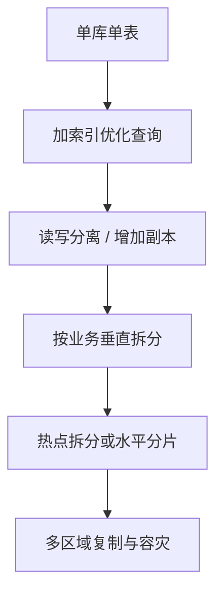

# 系统设计 - 第 4 课：数据库、索引、分片与复制

## 学习目标（本节结束后你能做到什么）

1. 理解系统设计面试里，数据库选型不是站队题，而是访问模式驱动的工程决策。
2. 能说明索引解决了什么问题、代价是什么，以及为什么“加索引”并不总是正确答案。
3. 能区分垂直拆分、水平分片、读写分离、主从复制、多副本这些概念，知道它们分别解决什么瓶颈。
4. 能结合 Twitter、聊天、订单、秒杀等场景，解释存储层如何随着流量增长逐步演进。

## 内容讲解（核心概念，用类比、例子、图示说清楚）

系统设计面试里，数据库几乎一定会被追问。很多候选人一开始回答得还不错，到了存储层就突然变成了“这个用 MySQL，那个用 MongoDB，消息用 Kafka，缓存用 Redis”。问题不在于这些组件不能用，而在于这种回答缺少判断依据。面试官真正想知道的是：你为什么做这个选择，这个选择对应的访问模式是什么，未来流量上来以后准备怎么扩，代价是什么。如果你能把这条逻辑链讲清楚，数据库这一块就会从“背技术名词”变成很强的得分项。

先从最根本的问题开始。系统设计里选数据库，不是先问“哪个数据库最流行”，而是先问“这个系统怎样读、怎样写、按什么维度查、能否接受弱一致、数据模型是否稳定”。数据库本质上是为访问模式服务的。你要是每天都通过主键查单条记录，需求和一个要做复杂筛选、排序、聚合、联表查询的后台报表系统完全不同；你要是主要写入日志和事件流，需求又和一个强事务的订单系统不同。很多面试表现不好，不是因为不会数据库，而是没有先把读写模式说清楚。

对于外企大厂的系统设计面试，最稳的回答方式通常是这样的：先说明核心实体和读写模式，再给出初始存储选择，然后再讨论随着规模增长会如何演进。也就是说，你不是一上来就上“终极架构”，而是先从能工作的简单版本开始，再根据瓶颈逐步加索引、加副本、拆表、分片、异步化。面试官通常会很喜欢这种回答，因为它更贴近真实工程演进。

先讲关系型数据库和 NoSQL。这个话题太容易被答成“关系型强一致，NoSQL 高性能”，但这样太粗糙。更准确的理解是，关系型数据库擅长结构化数据、事务约束、复杂查询、唯一性保证和成熟的索引能力；NoSQL 则更适合某些特定访问模式，例如简单 key-value 读写、文档模型、超大规模宽表、时间序列、图关系、海量事件日志等。真正的判断标准，不是“哪个公司流行用什么”，而是你的业务最核心的那个查询和写入路径到底长什么样。

比如订单系统。订单涉及金额、库存、状态流转、幂等、支付回调、退款等问题，通常正确性和事务性要求很高。此时关系型数据库往往是天然起点，因为你需要明确的主键、唯一约束、事务提交和稳定的索引能力。再比如聊天消息系统，如果你关心的是按会话顺序追加、按会话分页拉取、海量写入和长期存储，很多时候会考虑宽表或日志型存储，甚至冷热数据使用不同存储层。Twitter Feed 又是另一种模式：首页生成和 tweet 详情读取的访问模式差别很大，所以经常不是一个数据库打天下，而是不同数据对象各自选择更合适的存储。

接下来讲索引。索引的本质，是用额外的存储和写入成本，换取更快的查询路径。你可以把它想象成书后面的目录。没有目录时，找一段内容只能从头翻；有目录时，可以先定位章节再翻过去。数据库里也是一样。没有索引时，很多查询只能全表扫描；有了合适的索引，数据库可以更快定位到少量目标记录。

但“加索引”不是白赚。索引本身要占空间，写入时也要更新索引结构，索引过多会拖慢写入，并增加维护成本。所以在面试里，如果你只说“这里建索引优化查询”，通常不够。更成熟的表达应该是：这个接口最常见的查询条件是什么，结果集大概多大，是否需要排序，是否需要覆盖索引，索引是否会影响高频写入。如果你能主动讲到“读取收益”和“写入代价”的平衡，面试官会明显感觉到你是按工程视角在思考。

索引设计的关键不是知道多少术语，而是能结合查询模式。比如订单表里常见查询可能是“按 `user_id` 查最近订单”“按 `order_id` 查详情”“按 `status + created_at` 查超时未支付订单”。这些查询显然对应不同索引策略。聊天系统里常见的是“按 `conversation_id + message_id` 或 `conversation_id + created_at` 分页拉消息”。Twitter 里常见的是“按 tweet_id 查详情”“按 user_id 查用户发布历史”。当你把这些访问模式说出来，后面的索引选择才有依据。

然后进入扩展路径。很多系统不是一开始就需要分片。对大多数面试题，比较合理的叙述是：初期先单库单表，确保模型和索引设计正确；随着查询压力增加，先考虑缓存和读副本；随着数据量和写入压力上升，再考虑分库分表或其他存储模型。为什么这个顺序重要？因为它体现了你不会为了解决未来可能不会出现的问题，提前把系统复杂度推得太高。

读写分离通常是存储层演进中第一步比较自然的扩展手段。主库负责写入，从库负责一部分读取，这样能把读压力从主库分摊出去。这个方案对读多写少场景尤其常见，比如用户资料、内容详情、后台报表的部分读取场景。但它有个很重要的代价，就是复制延迟。如果你刚写完一条数据，马上去从库读，可能读不到最新值。这在用户资料页或内容详情里也许还能接受，但在支付状态、库存扣减、刚发布后必须立刻可见的场景里就需要更小心。所以面试里提读写分离时，最好顺便补一句：哪些读可以走从库，哪些强一致读仍需打主库或使用其他机制保证读己之写。

主从复制和多副本，不只是为了扩读，也是为了高可用。主库宕机时，系统可以切换到新的主节点继续服务。但这里又会带来一连串问题：故障切换耗时多长，切换期间会不会丢数据，复制是同步还是异步，跨机房复制延迟能否接受。如果你在面试里把复制仅仅讲成“多备份防止挂掉”，就还是太浅。真正成熟的回答是：复制同时服务于高可用、容灾和读扩展，但复制策略不同，带来的一致性和延迟表现也不同。

再说垂直拆分和水平分片。垂直拆分通常是按业务边界拆，比如用户库、订单库、商品库各自独立；或者把大表中访问模式差异明显的列拆开，比如把不常访问的大字段单独放一张扩展表。它解决的是业务耦合、模型膨胀、单库职责过重的问题。水平分片则是同一张表按某个维度拆到多个分片上，例如按 `user_id` 哈希，或按时间范围拆分。它主要解决单表数据量过大、单机写入和存储达到瓶颈的问题。

这两个概念在面试里非常容易混淆。一个好记的方式是：垂直拆分是“不同东西分开存”，水平分片是“同一种东西分多份存”。比如 Twitter 的用户表、tweet 表、关注关系表，本来就可能是不同的业务对象，天然适合垂直拆分；而 tweet 表本身如果数据量巨大，就可能再按用户或时间做水平分片。聊天系统里，消息表也很容易因为写入量和历史数据量过大而进入分片阶段。

分片并不是一劳永逸，它会带来不少新的复杂度。首先是分片键怎么选。选得好，请求分布比较均匀，查询路径也清晰；选得不好，就会造成热点分片、跨分片查询困难、重分片成本巨大。比如如果秒杀订单完全按商品 ID 分片，爆款商品会把单个分片打爆；如果按用户 ID 分片，查询单个用户订单会方便，但按商品聚合统计就会变难。没有完美分片键，只有更符合主要访问模式的分片键。

其次是跨分片查询和事务。单库时代你一个 SQL 就能解决的问题，分片以后可能要查多个节点再在应用层聚合。更麻烦的是跨分片事务，成本高、延迟高、实现复杂。外企大厂面试很喜欢在这里追问 trade-off，因为这恰好能看出你是否知道“扩展能力”是用什么换来的。成熟的回答一般会承认：分片提升了容量上限，但牺牲了事务简洁性和查询灵活性，所以我会尽量让主要请求命中单分片，把全局聚合转移到异步链路、搜索引擎、OLAP 或预计算系统中。

下面把这些概念放到几个高频案例里。

先看 Twitter。Tweet 详情通常可以按 `tweet_id` 直接获取，用户历史发文可以按 `user_id + created_at` 查询，首页 Feed 则往往不是直接从 tweet 主表扫出来，而是来自预计算结果、缓存或专门的 feed 存储。也就是说，Twitter 这种系统里，数据库设计要服务多种不同访问模式。你不能指望一张表和一个索引同时把所有问题都解决掉。这类题型很适合展示你对“主存储 + 缓存 + 异步物化结果”的组合思维。

再看聊天系统。消息写入通常是高频追加，读取则按会话分页拉取，顺序和幂等比较重要。这里一个常见设计是消息主存储按会话维度组织，索引重点服务“按会话顺序取消息”；较新的热数据放在更快的存储层，历史消息走冷存储。复制用于高可用和多地域同步，但复制延迟可能影响多端实时一致感，所以系统常常还要结合消息路由和 ACK 机制。面试里如果你能把“存储层的顺序”和“分发层的实时性”分开讲，会很加分。

再看订单和秒杀。订单系统通常首先落在关系型数据库，因为事务、状态流转、约束和幂等都很重要。但秒杀活动会把数据库暴露在热点写入前面，所以你不会让每个请求都直接打数据库做同步扣减。更合理的做法通常是前面用缓存、限流和队列挡流量，数据库只承接被筛选后的有效写入。即便如此，最终订单表、库存表的索引设计仍然很关键，比如按 `user_id` 查订单历史、按 `status` 扫超时订单、按 `order_id` 做幂等查询。你需要体现出：数据库不是单独存在的，而是整个链路里承接权威状态和最终落地的那一层。

最后，把今天内容收束成一套面试表达模板。当你谈数据库时，不要只回答“用 MySQL”或“用 NoSQL”，而是按这个顺序说：第一，核心数据对象是什么。第二，最重要的读写模式是什么。第三，基于这些模式，初始存储选型是什么。第四，哪些查询需要索引，索引收益和写入代价是什么。第五，当读压力、写压力、数据量继续增长时，会先加副本、再拆分、还是换存储模型。第六，这些扩展手段分别带来什么副作用，比如复制延迟、跨分片事务、热点问题和复杂查询困难。你能这样讲，数据库这一块基本就会比大多数候选人更扎实。

## 小结（3-5 条关键点）

1. 数据库选型的核心不是背组件，而是围绕核心数据对象和访问模式做判断。
2. 索引是用空间和写入成本换查询速度，只有结合具体查询条件、排序方式和结果规模才有意义。
3. 存储层的典型演进路径通常是：单库单表、索引优化、读写分离、垂直拆分、水平分片、多副本与容灾。
4. 复制能带来读扩展和高可用，但也会引入复制延迟、故障切换和一致性问题。
5. 分片提升了容量上限，却会增加分片键选择、跨分片查询、事务和重平衡等复杂度。

---

## 检查站：请回答以下问题

1. 为什么数据库选型不能简单理解成“关系型适合事务，NoSQL 适合高并发”？你觉得还应该看哪些因素？
2. 如果是 Twitter、聊天系统、订单系统，这三类场景最核心的访问模式分别是什么？它们为什么可能需要不同的存储设计？
3. 读写分离和水平分片分别主要解决什么问题？它们各自带来的代价是什么？
4. 如果面试官问你“什么时候该开始分片”，你会怎么回答？请尽量体现渐进式演进思路。

请把你的答案直接告诉我，我会根据你的回答决定下一步。
