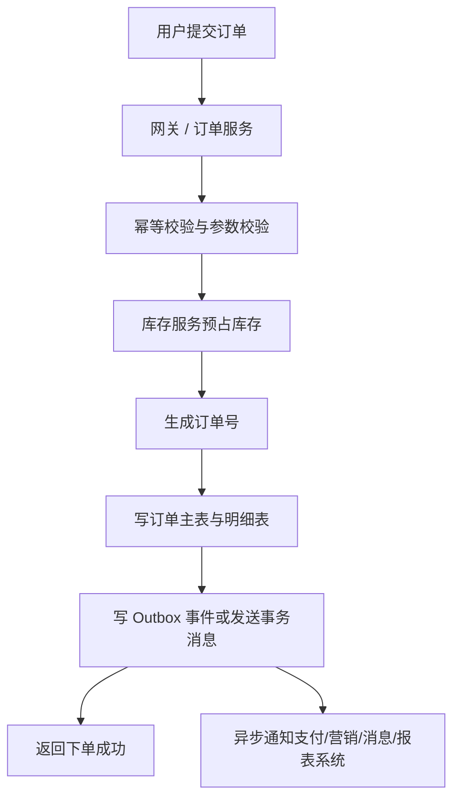

# 系统设计 - 第 4 课补充：日订单 4000 万的订单系统怎么设计

## 学习目标（本节结束后你能做到什么）

1. 能把“日订单 4000 万”从一个模糊规模词，拆成具体的 QPS、写入量、存储量和分片需求。
2. 能说清订单系统里哪些链路必须同步完成，哪些链路应该异步化。
3. 能给出一个足够像真实工程的存储设计，包括主表、明细表、索引、分片键、读写分离和冷热分层。
4. 能在面试里解释为什么这个量级通常不是一上来就上“超复杂架构”，而是按瓶颈逐步演进。

## 内容讲解（核心概念，用类比、例子、图示说清楚）

你提的这个问题非常好，因为“日订单 4000 万”正好是一个很适合练系统设计的规模。它足够大，已经不能用单机单库思维硬扛；但它又没有大到必须一上来就上极端复杂的超大规模架构。换句话说，这是一个很适合面试里展示“渐进式设计能力”的例子。

先说一个容易被忽略的点。日订单 4000 万，不能简单理解成“数据库每天插入 4000 万行就完了”。真实系统里，一笔订单通常会带出多种数据写入。比如：

- 订单主表 1 行
- 订单商品明细表若干行
- 订单快照表 1 行或多行
- 支付流水表 1 行或多行
- 库存预占或扣减记录 1 行或多行
- 订单状态变更事件若干条

也就是说，真正的写入量远大于“订单数”。如果平均每笔订单包含 3 个商品，且生命周期里会经历“创建、支付、发货、完成”这些状态更新，那么你面对的不是 4000 万次数据库写入，而可能是数亿次写操作和更多的索引更新。

我们先做一组明确假设，面试里你也应该这样做。

### 一、先设定一组合理假设

假设这是一个全国性电商平台的主订单系统，不是纯秒杀场景，但会有活动高峰。

- 日订单量：4000 万
- 平均每单商品数：3 件
- 每天订单明细行数：1.2 亿
- 平均每笔订单在一天内产生 2 次状态更新
- 高峰系数：平峰的 8 到 10 倍
- 热数据保留：近 90 天在线可快速查询
- 历史数据归档：90 天后进入冷存储或离线仓库

先把最基础的吞吐量算出来：

- 订单创建平均 QPS：40000000 / 86400，大约 463 单每秒
- 如果高峰按 10 倍算，订单创建峰值 QPS 约 4600 单每秒
- 明细写入峰值 QPS：4600 x 3，大约 13800 行每秒
- 状态更新峰值 QPS：如果一天平均 2 次更新，也可以粗略按 9000 到 10000 次每秒峰值去估

所以你要意识到，这个系统真正要扛的，已经不是“每秒 463 次插入”，而是高峰下几万级别的数据库写操作，以及更多的读请求、索引更新和异步消息。

如果再考虑“我的订单”查询、商家后台查询、订单详情、支付回调、物流更新、风控校验、营销核销这些链路，整个订单域的总请求量会比订单创建本身大得多。

### 二、订单系统里哪些必须同步，哪些必须异步

这是面试里一个特别关键的点。很多候选人会把所有动作都塞进一个大事务里，结果系统既慢又脆弱。更成熟的设计应该先划分“必须同步完成的最小闭环”。

对于普通订单系统，一次下单请求里，真正必须同步完成的通常只有这些：

1. 参数校验，确认用户、商品、价格、优惠是否合法
2. 生成全局唯一订单号
3. 写入订单主表和订单明细
4. 记录库存预占或库存扣减结果
5. 返回“下单成功，待支付”或明确失败

而下面这些动作通常不应该放进同步主链路：

- 发优惠券
- 发短信或推送通知
- 写埋点和行为日志
- 更新搜索索引
- 更新推荐画像
- 同步商家侧报表
- 触发积分、成长值、营销活动等附加逻辑

这些动作更适合通过消息队列异步处理。原因很简单：订单创建是核心交易链路，目标是快、稳、可重试；而通知、画像、报表这些都是“重要但不应该阻塞下单成功”的附属流程。

你在面试里如果能主动说“我会把同步主链路压缩到最小，只保留创建订单和冻结关键资源，其他全部异步化”，这是非常加分的。

### 三、一个足够真实的订单创建链路

先看一次正常下单时的主链路。

这里有几个工程细节你最好讲出来。

第一，幂等。用户可能重复点击提交，客户端也可能超时重试，所以订单服务要有幂等键，例如 `user_id + request_token`，避免生成重复订单。

第二，库存。普通电商订单一般不是到支付成功才第一次碰库存，而是下单时先做预占，支付超时再释放。否则并发场景下很容易超卖。

第三，事件投递。订单创建成功后，通常需要通知支付、营销、履约、消息中心等系统。这时不能简单“先写库，再直接发 MQ”就结束，因为会遇到“数据库成功、消息失败”或“消息成功、数据库回滚”的一致性问题。比较稳的方式是用 Outbox Pattern，先把待发送事件和订单一起落库，再由后台任务或 CDC 可靠投递到 MQ。

### 四、数据库应该怎么分表，先别急着一上来分 1024 张

很多人听到 4000 万单/天，第一反应是“必须海量分库分表”。这不完全对。你真正该问的是：

- 峰值写入是多少
- 单表增长多快
- 常见查询是什么
- 热数据保留多久
- 单库单表还能扛多久

先定义核心表：

1. `order_main`
   保存订单号、用户 ID、商家 ID、总金额、状态、创建时间、支付时间等核心字段。

2. `order_item`
   保存订单号、商品 ID、SKU、数量、成交价等明细。

3. `order_snapshot`
   保存下单时的商品快照、收货信息快照、营销信息快照，避免后续商品信息变化影响历史订单展示。

4. `payment_record`
   保存支付单号、支付渠道、支付状态、回调信息。

5. `order_event`
   保存状态流转事件，便于审计、排查、补偿。

如果你把这几类数据都塞进一张大宽表，后面索引、更新、冷热分离都会很痛苦。所以第一步通常不是“水平分片”，而是先按职责把模型拆清楚。

### 五、分片键怎么选，为什么订单系统经常按 `user_id`

订单系统里最常见的 C 端查询之一是“我的订单”，也就是按用户查最近订单列表；另一个高频查询是按订单号查详情。所以一个很常见的设计是：

- 主订单表按 `user_id` 做水平分片
- 订单号里编码分片信息，保证拿到订单号后可以直接路由到对应分片

为什么很多场景下按 `user_id` 比按 `order_id` 更自然？因为：

1. “我的订单列表”是高频请求，按 `user_id` 分片可以让这类查询落在单分片上
2. 单个用户订单量通常远小于全局订单量，天然分布较均匀
3. 用户维度的归档、风控、画像联动也更方便

但它也有代价。按 `user_id` 分片后，商家维度查询、全局报表、按商品聚合统计就不适合直接查主库，而应通过异步同步到 ES、数仓或 OLAP 系统。

这就是一个典型 trade-off：你用主链路查询友好，换取后台分析链路必须另建。

### 六、到底分多少库多少表，给你一个更像面试回答的版本

如果只从订单创建量看，日 4000 万其实没有大到必须上几百个分片。一个更工程化的回答会是：

第一阶段，先按业务拆表，但不分片。  
如果业务刚起步，单库单表配合正确索引和主从复制，可能还能支撑一段时间。

第二阶段，进入读写分离。  
订单详情、订单列表等读请求远大于写请求时，先上主从复制，把一部分非强一致读切到从库。

第三阶段，开始水平分片。  
当单表数据增长过快、写入 QPS 持续升高、索引膨胀、备份恢复时间不可接受时，再开始分片。

这里不能只凭感觉说“规模大了就主从、缓存、分片”。更像真实工程的判断依据应该是下面这几类指标。

| 演进动作 | 触发信号 | 为什么这个动作匹配 |
| --- | --- | --- |
| 主从复制 / 读写分离 | 读 QPS 明显高于写 QPS；订单详情、订单列表、客服查询把主库 CPU、连接数、Buffer Pool 压高；读延迟影响写入事务 | 读请求可以转移到从库，先保护主库写入能力 |
| 短 TTL 缓存 | 热点订单详情、刚下单后的订单页、支付结果页被频繁刷新；相同 key 短时间重复读取明显 | 缓存能减少重复读，但不适合替代订单真相源 |
| 水平分片 | 峰值写入接近单库舒适区；单表每天新增千万到数千万行；索引体积持续膨胀；DDL、备份、恢复、归档窗口变长；P95/P99 写延迟恶化 | 分片把写入、索引、存储、备份恢复压力摊到多个库 |
| 搜索 / 数仓外移 | 商家后台、运营报表、按商品/地区/时间聚合查询越来越多，且不要求交易级强一致 | 这些查询会扫大量数据和建很多索引，不应该压交易主库 |
| 冷热分层 / 归档 | 在线库 30 到 90 天数据已经达到 TB 到十 TB 级；历史订单访问比例很低；备份恢复和 DDL 成本被历史数据拖慢 | 热数据服务在线交易，冷数据服务低频查询和审计 |

以这道题的假设粗算，订单创建峰值约 `4600 QPS`，但每单会带来主表、明细、快照、支付记录、事件和状态更新，所以数据库操作峰值可能是几万级。只看订单主表每天就新增 `4000 万行`，90 天是 `36 亿行`；再加上 1.2 亿 / 天的明细、快照、支付、事件和索引，在线热数据很容易到十 TB 级。这个时候，“分片”和“冷热分层”不是因为架构洁癖，而是因为单库单表的写入、索引、备份恢复、DDL 和运维窗口都开始不可控。

所以面试里可以这样讲决策逻辑：

1. 如果瓶颈先出现在读多写少，就先用主从复制、读写分离和缓存保护主库。
2. 如果瓶颈出现在写入、单表行数、索引膨胀、备份恢复时间，就开始水平分片。
3. 如果瓶颈来自商家侧复杂筛选和报表聚合，就把查询链路同步到 ES / OLAP / 数仓。
4. 如果瓶颈来自历史数据拖累在线库，就做冷热分层和归档。

对这个例子，一个比较合理的面试级别答案可以是：

- `order_main` 做 8 到 16 个逻辑分片
- 每个逻辑分片后面是一套 MySQL 主从
- `order_item` 跟随订单主表同分片，避免跨分片事务

为什么 8 到 16 个逻辑分片是个合理起点？我们粗略算一下。

如果峰值订单创建 QPS 是 4600：

- 8 分片时，每片平均承担约 575 单每秒
- 若每单有 3 条明细，则明细写入每片约 1725 行每秒
- 再加状态更新、支付记录、事件写入，每片总写压力可能来到 2000 到 4000 次数据库操作每秒

从数据量看，8 分片时 `order_main` 每片每天新增约 500 万行，90 天约 4.5 亿行；16 分片时每片每天约 250 万行，90 天约 2.25 亿行。再考虑每片还有明细表、支付表、事件表和索引，8 到 16 个逻辑分片能把单片的 QPS、行数和存储增长压到比较可治理的范围。

这个量级对经过良好索引设计、表结构控制和批量写优化的 MySQL 分片来说，是现实可行的；如果你希望给活动留更多余量，可以直接设计成 16 分片，让单分片压力和单片数据增长再减半。

面试里不要装作自己能精确给出“必须 12 分片”，那是假的。更好的说法是：我会先按峰值写入、单表增长速度和每片可承受压力估一个初始分片数，比如 8 或 16，并预留平滑扩容能力。

### 七、索引怎么建，别一句“加索引”就过去

订单系统里几个典型查询是：

1. 按 `order_id` 查详情
2. 按 `user_id` 查用户最近订单列表
3. 按 `status + created_at` 查待关闭订单
4. 按 `merchant_id + created_at` 查商家订单
5. 按 `payment_id` 或外部支付单号做回调幂等

所以比较常见的索引设计可能是：

- 主键：`order_id`
- 普通索引：`user_id, created_at`
- 普通索引：`status, created_at`
- 唯一索引：`idempotency_key`
- 支付流水表唯一索引：`payment_txn_id`

但你一定要知道代价。索引越多，写入越慢，页分裂越多，存储也更大。所以订单主表不能把所有后台查询需求都通过加索引解决，否则写入性能会持续下降。更现实的做法是：

- 交易主库只保留核心在线查询索引
- 复杂筛选、报表、搜索类查询走 ES 或离线分析系统

这句话非常像真实工程，也非常像外企大厂面试官想听到的取舍意识。

### 八、存储量怎么估，为什么一定要冷热分层

只看订单主表，假设每行平均 1 KB：

- `order_main`：4000 万 / 天，大约 40 GB / 天

这个 `1 KB` 不是精确值，而是面试容量估算里的保守口径。真实值要看字段设计、字符集、是否有可变长字段、InnoDB 行格式、页填充率和索引数量。

可以粗略拆一下：

| 字段类型 | 例子 | 粗略大小 |
| --- | --- | --- |
| 核心 ID | `order_id`、`user_id`、`merchant_id`、`shop_id`、`address_id`、`payment_id` | 几十到一百多 B |
| 状态与类型 | `status`、`order_type`、`pay_status`、`source`、`channel` | 十几到几十 B |
| 金额字段 | 总金额、优惠金额、实付金额、运费、税费 | 几十 B |
| 时间字段 | 创建、支付、发货、完成、更新时间 | 几十 B |
| 幂等与外部引用 | `idempotency_key`、外部交易号、活动号、优惠券号 | 几十到几百 B |
| 可变长与预留字段 | 备注、扩展字段、风控标记、租户字段 | 视设计而定，可能几十到几百 B |
| InnoDB 行开销与页碎片 | 行头、事务 ID、回滚指针、NULL 位图、变长字段偏移、页内未完全填满 | 需要留冗余 |

如果 `order_main` 只保留非常干净的核心字段，一行可能只有 `300 到 600 B`。如果把一些外部单号、渠道字段、备注、扩展字段也放进去，很容易到 `800 B 到 1 KB+`。本文用 `1 KB` 是为了避免低估在线库规模；面试里也可以说成“按 `500 B 到 1 KB` 做区间估算，取 `1 KB` 保守计算”。

注意，这里还没有把二级索引算进去。InnoDB 的二级索引会保存索引列和主键值，所以订单表上每多一个核心索引，都会继续放大存储和写入成本。

假设 `order_item` 每行 300 B，1.2 亿行 / 天：

- `order_item`：约 36 GB / 天

再算上快照、支付记录、事件表、索引开销，保守一点，在线热数据原始规模一天很容易到 100 GB 以上。再考虑：

- 索引通常会额外占不少空间
- 主从副本会把总存储放大 2 到 3 倍

所以近 90 天在线热数据很可能就是十 TB 级别。这时你就不能只想着“多买点盘”。更合理的设计是：

- 近 30 到 90 天热数据放在线分片库，支持快速查询
- 更早历史订单归档到冷存储、HDFS、对象存储或数据仓库
- 用户端默认只查近几个月订单，查更久历史时走慢路径或归档查询

这就是为什么订单系统通常一定会讲冷热分层。不是为了显得高级，而是因为不分层，成本和运维复杂度都会失控。

### 九、读请求怎么处理，不是所有查询都打主库

订单系统除了写入，还有大量读取：

- 用户看订单列表
- 用户看订单详情
- 商家看待发货订单
- 客服查退款单
- 风控查异常订单

这里常见做法是：

1. 用户端“我的订单列表”可做短 TTL 缓存，或先查读副本
2. 订单详情可查缓存，未命中回源分片库
3. 商家后台复杂筛选不建议直接打交易主库，而是走搜索或分析系统
4. 支付成功后短时间内的强一致查询，必要时仍打主库

这里你要体现一个意识：交易主库是最宝贵的资源，不应该让所有读请求都直接压在它上面。

### 十、如果再遇到大促或秒杀怎么办

你提的是日订单 4000 万，这更像常规电商大盘规模；但外企大厂面试官常会追问一句：“如果双十一或者秒杀活动瞬时暴涨怎么办？”

这时你要说明：常规订单系统和秒杀链路通常会分开处理。

- 常规订单链路按前面说的交易主链路走
- 秒杀请求先经过资格校验、限流、令牌、库存预热、异步排队
- 只有抢到资格的少量请求才进入订单创建服务

也就是说，你不是让交易主库直接扛所有洪峰，而是在入口就把绝大部分无效流量挡掉。这个思想很重要，因为它说明你知道“高并发问题不能只靠数据库解决”。

### 十一、如果我是面试官，我想听到你怎么总结

如果你在面试里被问“日订单 4000 万怎么设计”，一个比较稳的回答节奏可以是：

1. 先算量：平均 463 单每秒，峰值按 10 倍看约 4600 单每秒，考虑明细和状态更新后是几万级数据库操作。
2. 先定同步边界：同步只做校验、幂等、订单落库、库存预占和返回结果；通知、营销、报表等全部异步。
3. 先按职责拆表：主表、明细表、快照表、支付表、事件表分开。
4. 存储以关系型数据库为核心，因为订单正确性、事务和约束最重要。
5. 如果读 QPS、订单详情和订单列表查询先把主库压高，就先上主从复制、读写分离和短 TTL 缓存；如果写入、单表行数、索引体积、备份恢复窗口开始不可控，再做 8 到 16 个逻辑分片。
6. 分片优先考虑 `user_id`，依据是“我的订单”是高频查询，能让用户订单列表落在单分片；商家侧聚合、运营报表和复杂筛选不满足这个访问模式，所以走搜索或数仓。
7. 近 30 到 90 天热数据在线，依据是 4000 万单 / 天会让 90 天主表达到 36 亿行，再叠加明细、快照、支付、事件和索引后是十 TB 级；历史数据低频访问，应归档到冷存储或数仓。
8. 如果遇到活动洪峰，靠限流、缓存、队列和异步化保护交易主链路，而不是让数据库硬扛。

这套回答已经足够具体，也足够像真实工程了。

## 小结（3-5 条关键点）

1. 日订单 4000 万不能只看“订单数”，要把订单明细、状态更新、支付流水、事件写入一起算进去。
2. 这个量级的订单系统，核心思路不是“一上来极限分片”，而是先压缩同步主链路，再根据读 QPS、写入峰值、单表行数、索引体积、备份恢复窗口逐步引入主从复制、缓存和分片。
3. 订单系统通常仍以关系型数据库为核心，因为正确性、事务、约束和幂等比单纯吞吐更重要。
4. 按 `user_id` 分片常见于 C 端订单系统，因为“我的订单”是高频查询；但后台聚合分析通常应走异步链路和专门查询系统。
5. 热数据在线、历史数据归档、复杂查询外移，本质是防止历史数据和低频分析查询拖垮交易主库。

---

## 检查站：请回答以下问题

1. 为什么日订单 4000 万不能直接等同于“订单创建平均 QPS 只有 463，所以单库就够了”？
2. 如果让你在面试里回答“这个系统同步做什么、异步做什么”，你会怎么划分？
3. 订单系统为什么经常把交易主库和报表/搜索查询链路分开？
4. 如果你要给这个案例选一个初始分片方案，你会怎么解释“为什么先做 8 到 16 个逻辑分片，而不是一上来做 128 个”？
5. 判断“该主从、该缓存、该分片、该归档”的指标分别是什么？

请把你的答案直接告诉我，我会根据你的回答决定下一步。
