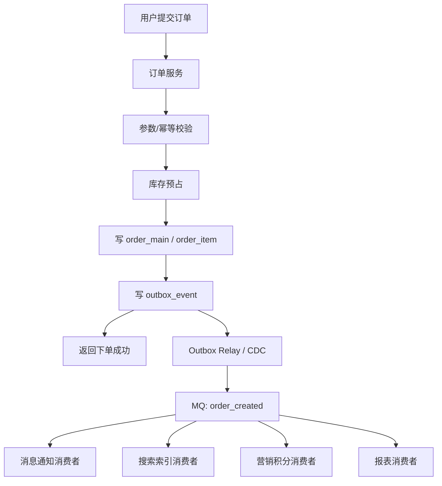
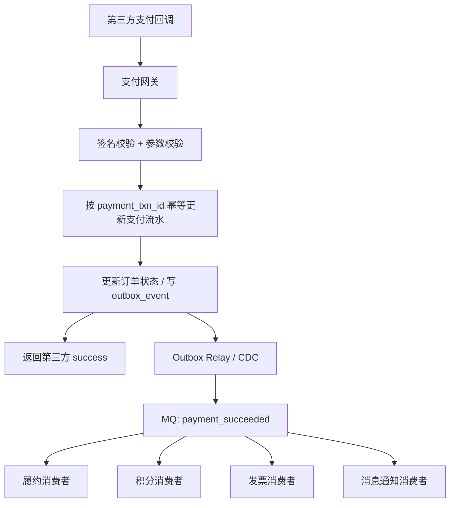

# 系统设计 - 第 5 课：消息队列、异步化与最终一致性

## 学习目标（本节结束后你能做到什么）

1. 理解消息队列真正解决的是哪一类系统问题，而不是把它当成“高并发系统自动加分项”。
2. 能划清同步边界，说明哪些动作必须在主链路内完成，哪些动作适合转成异步事件。
3. 能讲清消息可靠性、Outbox/CDC、消费幂等、局部顺序、积压、死信、补偿与对账。
4. 能结合订单创建、支付回调、库存释放等真实案例，把“异步化 + 最终一致性”讲成完整工程方案。

## 内容讲解（核心概念，用类比、例子、图示说清楚）

消息队列是系统设计里出场率非常高的组件，但也是最容易被答虚的组件。很多候选人会说：

- 用 MQ 解耦
- 用 MQ 削峰
- 用 MQ 异步化

这些话都不算错，但如果面试官继续问：

- 你具体异步的是哪一步？
- 为什么它可以异步？
- 如果消息丢了怎么办？
- 如果消费者重复消费怎么办？
- 如果消息积压半小时，业务还能接受吗？
- 如果下游一直失败，系统如何恢复一致？

很多回答就会立刻失去抓手。

所以，这一课我们不把 MQ 当成抽象中间件来学，而是把它放回一条真实业务链路里，去看它到底改变了什么。

你可以先记住一句总原则：`消息队列真正改变的，不只是技术架构，而是业务语义和一致性语义。`

为什么这么说？因为一旦你把同步调用改成异步事件，就等于承认：

- 上游先完成自己的局部责任
- 下游稍后再处理自己的责任
- 系统各部分不再同时完成
- 用户看到的状态可能阶段性不一致

这就是异步化真正的代价。

### 一、先区分三种常见动作：同步调用、命令消息、事实事件

很多人把“发 MQ”理解成一个笼统动作，其实工程里至少有三种不同语义。

#### 1. 同步调用

典型场景是：

- 查库存
- 校验权限
- 创建订单主记录
- 查询余额

特点是：上游现在就需要答案，下游不回结果，上游无法继续。

#### 2. 命令消息

语义是：“请你去做某件事。”

例如：

- 请发送短信
- 请异步转码
- 请异步生成报表

这种消息更像任务分发，关注的是“有没有被执行”。

#### 3. 事实事件

语义是：“一件已经发生的事实，请各方知晓并处理自己的后续逻辑。”

例如：

- `order_created`
- `payment_succeeded`
- `inventory_reserved`

事件不是请求别人“帮我完成主链路”，而是对外宣布“我的局部事务已经提交成功”。这一点非常重要，因为它决定了系统边界是否清晰。

如果你在面试里能主动区分“命令”和“事件”，通常会很加分。因为很多系统之所以越做越乱，就是把 MQ 既当 RPC 替身，又当事件总线，最后边界越来越模糊。

### 二、判断一个动作能不能异步，最稳的是问五个问题

系统设计里最容易犯的错，不是不会用 MQ，而是把本该同步完成的真相源写入也异步化，结果把主链路语义弄丢了。

判断一个动作能不能异步，建议你顺着下面五个问题思考。

#### 1. 用户现在是否必须拿到最终结果

如果用户现在就得知道“成功还是失败”，那通常应保留在同步链路里。  
例如：

- 登录是否成功
- 订单是否创建成功
- 支付是否确认成功
- 库存是否已预占

反过来，如果用户只需要知道“系统已接收，后面会继续处理”，那就很适合异步。  
例如：

- 发通知
- 更新搜索索引
- 更新推荐画像
- 生成报表

#### 2. 这一步是否会改变权威状态

如果一个动作在写真相源，例如订单主表、支付流水、库存冻结结果，那通常要放在同步主链路里。  
如果它只是派生数据、附属视图、外围系统同步，则更适合异步。

#### 3. 失败后是否容易补偿

有些动作失败了很容易重试，比如发短信、更新索引；有些动作失败了补偿非常困难，比如重复扣库存、重复创建订单。  
补偿成本越高，越不应该轻率异步。

#### 4. 是否允许最终一致窗口

不是所有系统都能接受“几秒后再一致”。  
订单状态同步到推荐画像晚几分钟通常没问题；支付成功后订单页面晚几十秒还显示“未支付”，用户就会非常困惑。

#### 5. 下游不可用时，上游是否还能优雅返回

如果把某一步异步化后，下游挂了，上游仍能返回合理结果，这通常说明异步边界划得不错。  
如果下游挂了，上游其实还是没法告诉用户发生了什么，那只是“看起来异步”，本质没解耦。

### 三、异步化真正的收益是什么

面试里常见说法是“解耦、削峰、异步”，但这三个词最好进一步展开。

#### 1. 缩短主链路

下单成功后要通知短信、推荐、搜索、报表、积分系统。  
如果全都同步调用，主链路会越来越长，任何一个下游抖动都会拖慢下单接口。  
异步化以后，上游只完成最小闭环，然后快速返回。

#### 2. 削平流量洪峰

秒杀场景里，入口流量在 10 秒内爆发，但数据库和订单服务只能稳定处理较低速率。  
队列把瞬时高峰变成可持续消费的平滑曲线，这是非常典型的工程价值。

#### 3. 扇出给多个下游

一个 `payment_succeeded` 事件可能要同时触发：

- 订单状态更新
- 履约系统建单
- 积分系统加积分
- 发票系统记录
- 消息中心通知

如果都用同步 RPC，支付服务会变成“大总管”。  
用事件总线后，上游只负责发布事实，下游各自订阅、各自扩缩。

#### 4. 让不同子系统按自己的节奏扩容

交易系统、搜索索引系统、报表系统的吞吐模型完全不同。  
异步化把它们从“同步耦合”改成“事件驱动”，扩容和故障域都更独立。

### 四、同步边界到底怎么划：用订单创建看最清楚

下面看一个非常高频的系统设计题：订单创建。

一次用户点击“提交订单”，更合理的主链路通常是：

1. 参数与权限校验
2. 幂等校验
3. 库存预占或资格确认
4. 订单主表和明细表落库
5. 写出本地事件记录
6. 返回“订单已创建，待支付”

而这些动作更适合异步：

- 发短信/Push
- 增加积分和成长值
- 更新搜索索引
- 同步推荐画像
- 更新报表
- 通知外围运营系统

可以画成下面这种更像真实工程的链路：

这条链路里最关键的思想是：`同步主链路只做对用户承诺最核心的那部分事实写入。`

你在面试里如果能主动说出“我会把同步边界压到最小闭环”，这会非常加分。

### 五、数据库成功但消息失败，这个缝隙是异步系统的第一道坎

很多人会说：“订单写库成功以后，再发一条 MQ。”  
这句话的问题在于，中间有一条缝：

- 数据库提交成功，但 MQ 没发出去
- MQ 发出去了，但数据库事务后来回滚

这就是经典的“双写一致性”问题。

#### 1. Outbox Pattern

最常见、也最稳的工程手段，是 Outbox。

做法是：

- 订单数据和待发送事件一起写进同一个本地事务
- 事务提交成功后，由后台投递器扫描 Outbox 表
- 投递成功后把该事件标记为已发送

这样至少能保证：只要订单事务提交成功，事件就一定“可被找到并投递”。

#### 2. CDC / Binlog Relay

另一种常见思路是基于数据库日志做 CDC。  
订单表或事件表一旦写入成功，CDC 程序从 Binlog 中捕获变更，再投到 MQ。

它的优点是对业务侵入小，缺点是链路更长、调试更复杂。

#### 3. 事务消息

有些消息中间件会提供事务消息能力，尝试把本地事务和消息投递绑定得更紧。  
面试里你不一定需要深入具体产品细节，但要知道：核心目标是一样的，都是尽量缩小“库和消息之间的缝”。

### 六、消费端为什么还要做 Inbox / 幂等记录

很多人学到 Outbox 就以为问题结束了，其实还没。

因为消息中间件在工程实践里通常更容易保证的是：`至少一次投递`，而不是“绝对只投递一次”。  
所以你必须默认：

- 生产者可能重试发送
- Broker 可能重投
- 消费者可能处理成功但 ACK 失败
- 消费者重启后可能再处理一遍

因此消费端要有自己的“去重与状态记录”。

常见做法有：

1. 消费前检查幂等表  
   如 `event_id` 是否已经处理过。

2. 使用业务唯一键去重  
   例如 `order_id + event_type`。

3. 把操作做成“设值型”而不是“累加型”  
   例如把订单状态设置成 `PAID`，而不是“支付次数加一”。

4. 使用 Inbox 表  
   消费者先把收到的事件记入本地 Inbox，再执行业务处理并标记完成。

你会发现，成熟的异步系统通常是 `Outbox + 消费端幂等/InBox` 一起用，才能把链路做扎实。

### 七、消息至少一次、顺序有限、exactly once 神话为什么要警惕

系统设计面试里，一个很成熟的信号是你会主动说：

`我不会假设 MQ 给我带来业务语义上的 exactly once，我会按 at-least-once + 消费幂等去设计。`

为什么？

因为“消息只到一次”是中间件世界的说法，而“业务只执行一次”是业务世界的说法。  
中间件即使能做到非常强的投递语义，也不代表你跨数据库、缓存、下游服务的整个业务动作就天然 exactly once。

所以更务实的工程目标通常是：

- 接受消息可能重复
- 对重复消费做好幂等
- 对乱序做局部顺序控制

### 八、顺序问题，通常追求的是“局部有序”，不是“全局有序”

面试里另一个很容易被追问的点是顺序。

订单状态如果乱序，下游系统可能先收到“已支付”，后收到“已创建”；聊天系统如果乱序，用户会看到对话上下颠倒；库存释放如果比支付成功更早被执行，状态就会错。

但全局顺序通常代价极高，所以现实里大多追求：

- 同一个 `order_id` 局部有序
- 同一个 `conversation_id` 局部有序
- 同一个 `user_id` 的某些事件局部有序

常见手段是：

- 按业务键选择分区键
- 让同一实体的事件进入同一分区
- 消费端再根据版本号或状态机做保护

例如订单系统里，你可以说：

- 我不追求所有订单状态全局有序
- 只要求同一个 `order_id` 的事件局部有序
- 所以会用 `order_id` 作为分区键

这就非常有工程感。

### 九、最终一致性不是一句口号，而是一个“收敛系统”

很多候选人喜欢说“异步系统最终一致就行”。  
但真正成熟的回答会继续补四件事：

#### 1. 收敛时间

正常情况下多久一致？

- 100ms 内
- 1 秒内
- 1 分钟内

不同系统答案完全不同。  
支付状态同步到订单详情，通常希望秒级；推荐画像更新，可以分钟级。

#### 2. 重试策略

失败后怎么重试：

- 立即重试
- 指数退避
- 延迟队列重试
- 限定最大重试次数

#### 3. 失败终态

重试多次还是失败怎么办？

- 进入死信队列
- 人工介入
- 发起补偿任务
- 进入待对账状态

#### 4. 可观测性

怎么知道系统还没一致？

- 消费延迟
- 积压深度
- 死信数量
- 事件成功率
- 对账差异量

如果没有这些，你的“最终一致”其实只是“希望有一天能一致”。

### 十、积压、毒性消息、回放，是异步系统的运维现实

异步系统一旦上线，面试官很喜欢追问运行态问题。你最好主动讲几个。

#### 1. 积压

如果生产速度持续大于消费速度，延迟会越来越高。  
这时你要考虑：

- 扩容消费者
- 降级非关键消费者
- 限制生产速率
- 增加批处理或批量写

#### 2. 毒性消息

有些消息天然有坏数据，消费者无论怎么重试都会失败。  
这种消息如果不隔离，会一直卡住分区或制造重试风暴。  
所以需要：

- 死信队列
- 人工查看
- 跳过策略
- 业务修复后回放

#### 3. 回放

搜索索引坏了、推荐画像逻辑升级了、报表需要重算，常常需要回放历史事件。  
因此事件 schema、保留周期、回放工具、幂等能力都很重要。

这一段很容易体现你理解的是“事件驱动系统”，而不只是“有个队列”。

### 十一、案例一：支付回调是异步、幂等、最终一致性的教科书

支付回调之所以特别适合面试，是因为它几乎天然包含所有经典问题：

- 第三方回调可能重复
- 回调顺序可能不稳定
- 你不能因为网络闪断就丢失支付结果
- 多个下游都要知道“这笔钱到账了”

一个更完整的链路可以是：

这里同步链路只做一件核心事：`确认钱真的到了，并把权威状态写稳。`

其他所有系统影响，都通过事件异步扩散出去。  
这个案例在面试里非常好，因为它自然覆盖：

- 幂等
- 双写一致性
- 异步扇出
- 最终一致性
- 补偿与对账

### 十二、案例二：库存释放为什么常常要配延迟消息

下单后未支付超时，需要释放库存。  
这类场景经常会出现延迟消息或定时扫描：

1. 订单创建后，发一条“30 分钟后检查是否支付”的延迟事件
2. 到时间后消费者检查订单是否仍未支付
3. 若未支付，则关闭订单并释放库存

这个案例特别适合说明：

- 异步不只用于“立刻处理”
- 还可以表达“将来某个时间点再触发”
- 关键是最终动作要幂等，例如重复释放库存不能多加

### 十三、消息队列不是免费午餐，它会引入新的系统复杂度

如果你只讲收益，不讲代价，会显得像在背标准答案。  
更成熟的说法是：

1. 链路更长了  
   调试和排障难度显著上升。

2. 数据不再即时一致  
   你必须重新设计状态展示和用户体验。

3. 需要治理 schema 与兼容性  
   事件字段变更、消费者版本兼容是现实问题。

4. 需要治理积压与重试  
   否则会形成重试风暴。

5. 需要对账和补偿体系  
   没有这些，最终一致只是口号。

### 十四、面试里怎么把这一课讲得像真实工程

如果面试官问“这里为什么要上 MQ”，一个很稳的回答顺序是：

1. 先说明主链路目标  
   例如下单接口要尽快返回，不能被外围动作拖慢。

2. 划清同步边界  
   哪些动作是权威状态，必须现在完成；哪些动作只是派生视图或附属能力，可以异步。

3. 说明事件语义  
   我发的是命令还是事实事件。

4. 说明生产侧可靠性  
   用 Outbox、CDC 或事务消息弥补库和消息之间的缝。

5. 说明消费侧可靠性  
   至少一次投递、消费幂等、局部顺序、失败重试、死信处理。

6. 说明最终一致收敛方案  
   包括重试、补偿、对账、监控和收敛时间。

一旦你这样回答，MQ 就不再是“架构图上的一个方块”，而是一整套异步系统设计。

## 小结（3-5 条关键点）

1. MQ 的核心价值不是“让系统更高级”，而是把同步耦合改造成事件驱动，但代价是用户语义和一致性语义都会改变。
2. 划分同步边界时，最重要的是区分权威状态和派生视图，保住最小闭环，再把附属动作异步化。
3. 数据库与 MQ 之间存在天然双写缝隙，通常需要 Outbox、CDC 或事务消息来补桥。
4. 工程里更务实的目标通常是“至少一次投递 + 消费幂等 + 局部顺序”，而不是盲信 exactly once。
5. 最终一致性必须有收敛时间、重试、死信、补偿、对账和监控，否则只是口号，不是方案。

---

## 检查站：请回答以下问题

1. 你会如何区分“命令消息”和“事实事件”？为什么这件事在系统设计里很重要？
2. 如果是订单创建链路，你会怎么划同步边界？哪些动作必须保留在主链路，哪些动作更适合事件化？
3. 为什么 Outbox 常被认为是异步系统里的基础模式？它解决的核心缝隙是什么？
4. 如果面试官追问“最终一致多久算最终”，你会怎么把这个问题回答得更工程化？

请把你的答案直接告诉我，我会根据你的回答决定下一步。
