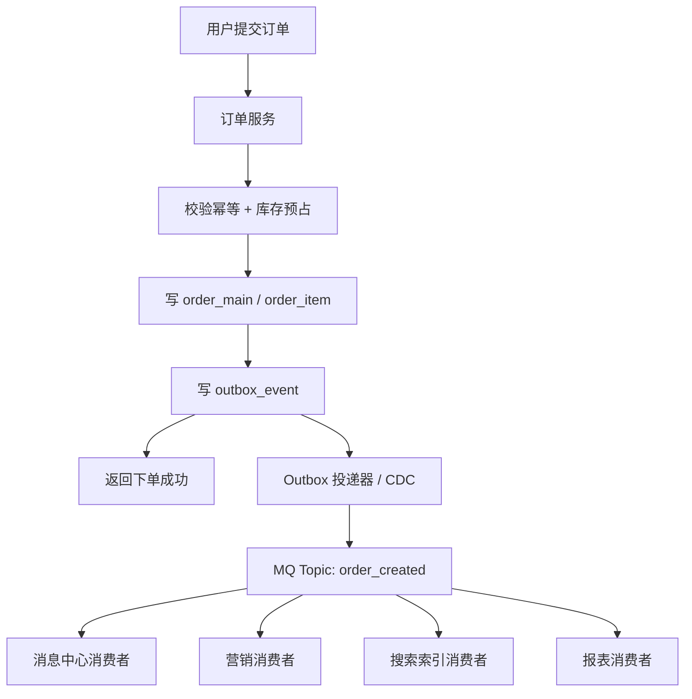

# 系统设计 - 第 5 课：消息队列、异步化与最终一致性

## 学习目标（本节结束后你能做到什么）

1. 理解消息队列在系统设计里到底解决什么问题，而不是把它当成“高并发系统必备组件”。
2. 能区分哪些动作应该同步完成，哪些动作适合异步化，并说明这样划分的依据。
3. 能讲清消息可靠性、重复消费、幂等、顺序性和最终一致性这些高频追问点。
4. 能结合订单系统、秒杀系统、支付回调等真实场景，说出一条足够工程化的异步链路。

## 内容讲解（核心概念，用类比、例子、图示说清楚）

很多候选人一谈到消息队列，就会顺口说出几个关键词：解耦、削峰、异步。问题是，如果面试官继续追问一句“那你到底准备把哪一步放进消息队列？为什么这一步可以异步？消息丢了怎么办？重复消费怎么办？消费者挂了怎么办？”，很多回答就会立刻变空。

所以这一课的重点不是背术语，而是把消息队列放回真实链路里，讲清楚它为什么存在、放在哪里合适、解决的瓶颈是什么、会引入什么代价。

先说一个总原则。消息队列不是“让系统更高级”的装饰品，它的本质是把原本强耦合、强同步的调用关系，变成“先记录事件，再由下游异步消费”。这样做换来的好处包括：缩短主链路耗时、削平瞬时流量、把一个请求拆成多个可独立扩展的处理单元、提升故障隔离能力。但代价也很明确：系统从此进入了异步世界，数据不再天然同时到达各个系统，重复消息、乱序消息、延迟消息、消费失败、积压和一致性问题都会出现。

你可以把同步调用和异步消息想象成两种协作方式。同步调用像是你开会时要求所有人都在线、都立刻给回复，优点是结果马上明确，缺点是任何一个人卡住，整个流程都慢；异步消息像是你把任务发到待办系统里，各团队按自己的节奏处理，优点是并发高、耦合低、抗波动，缺点是你不能要求所有事情“此刻立刻完成”。所以异步化从来不是没有代价，它只是把“实时性”换成了“吞吐、解耦和稳定性”。

### 一、什么时候该上消息队列

面试里比较稳的判断标准通常有四个。

第一，主链路里有一批“重要但不必阻塞主流程”的动作。  
比如订单创建成功后要发短信、写埋点、同步营销系统、更新搜索索引、通知履约系统。这些动作确实重要，但不应该拖慢“下单成功”这个核心结果。这时非常适合用消息队列。

第二，流量存在明显洪峰，下游处理能力又相对稳定。  
秒杀就是最典型场景。入口瞬间可能有几十万 QPS，但真正订单服务、库存服务、数据库不可能同步扛住这个峰值。消息队列在这里的价值，不只是异步，而是缓冲和削峰。

第三，一个上游事件需要扇出给多个下游系统。  
例如“订单已支付”这个事件，可能同时需要通知积分系统、发票系统、风控系统、履约系统、消息中心。若全靠同步调用，订单服务会越来越像一个“大总管”，每加一个系统都要改主链路。用消息队列则可以把“发布事件”和“订阅处理”分开。

第四，下游系统允许短暂延迟，能接受最终一致。  
如果某个动作必须在用户返回前立刻完成，比如库存预占、订单落库、支付幂等校验，这种一般不应该轻易异步化。反过来，如果下游晚几十毫秒到几秒处理都可以接受，那就更适合消息驱动。

### 二、订单系统里，哪些步骤同步，哪些步骤异步

我们继续沿用前一课“日订单 4000 万”的订单系统。

一次普通下单请求里，通常应该同步完成的动作有：

1. 参数校验
2. 幂等校验
3. 库存预占或资格确认
4. 订单主表和明细表落库
5. 返回下单成功或失败

而这些动作通常更适合异步：

- 发短信、App Push、站内信
- 同步用户画像和推荐特征
- 更新搜索索引
- 增加积分或成长值
- 生成营销统计报表
- 通知下游非关键系统

一个更像真实工程的链路长这样：

这里有一个非常重要的点：很多人会说“订单创建成功后发一条 MQ”。但这句话还不够，因为数据库写成功和消息发送成功之间是有缝隙的。

比如你先写数据库再发 MQ，如果数据库成功而 MQ 发送失败，下游永远收不到事件；如果你先发 MQ 再写数据库，消费者可能读到一个根本还没成功提交的订单。这个问题在面试里是高频追问。

比较稳的解决方式有两个常见方向：

1. Outbox Pattern  
   订单和待发送事件写在同一个数据库事务里。事务提交成功后，由单独的投递程序扫描 Outbox 表，把事件可靠发到 MQ。

2. 事务消息或基于日志的 CDC  
   利用中间件能力，把本地事务与消息投递做更紧密的绑定，或者从数据库 Binlog 中捕获变更再发消息。

你不一定非要背具体框架名，但一定要知道：数据库和 MQ 之间不是天然原子一致的，中间必须设计可靠桥梁。

### 三、削峰到底是怎么削的，不要只说“用 MQ 削峰”

“削峰”是系统设计面试里最容易被说空的话之一。更具体的表达应该是：入口瞬间请求量远大于后端可处理能力时，先让请求快速进入缓冲层，再按下游可承受速度消费。

用秒杀举个具体例子。

假设某个活动在 10 秒内涌入 100 万个下单请求，也就是平均 10 万 QPS。但真正的订单库、库存服务、支付链路，可能只能稳定处理几千到一两万 QPS。如果你让这 100 万请求全部同步落到交易库，数据库热点行、连接池、线程池都会很快打满，整个系统雪崩。

更合理的做法是：

1. 入口先做资格校验、限流、防刷
2. 库存先在 Redis 中做预扣或令牌控制
3. 抢到资格的请求进入 MQ 排队
4. 后端订单消费者按数据库可承受速率稳定消费

这里消息队列的作用不是“ magically 提升数据库性能”，而是把“10 秒内冲进来的流量”拉平成“未来几十秒或几分钟稳定处理”。用户体验上也会配合变化，比如返回“排队中”而不是“已创建成功”。这就是削峰的真实代价：系统更稳了，但用户得到的是异步结果。

### 四、消息至少会重复，别幻想 exactly once

面试里一个非常重要的成熟信号，是你要主动承认：在工程实践里，消息系统通常追求的是“至少一次投递”加“消费幂等”，而不是简单相信“绝对只消费一次”。

为什么消息会重复？

- 生产者发送成功了，但没收到确认，于是重试
- 消费者处理完了，但提交 offset 前挂了，重启后重复消费
- 消费端网络抖动，导致 ACK 丢失
- 中间件重试机制导致消息再次投递

这意味着，只要你用了 MQ，就必须默认“重复消费一定会发生”。所以消费者逻辑必须具备幂等性。

比如“订单支付成功”这个事件，如果积分系统收到两次，不能发两次积分；履约系统收到两次，不能创建两个发货单；库存回补收到两次，不能把库存加回两遍。

常见的幂等做法包括：

- 用业务唯一键去重，例如 `order_id + event_type`
- 消费前查幂等表或状态表
- 对同一条业务数据使用数据库唯一约束
- 把操作设计成天然幂等，例如“设置状态为已完成”而不是“状态加一”

外企大厂面试官很喜欢追这个点，因为这能快速区分“会画架构图”和“真正做过异步系统”的人。

### 五、顺序问题比很多人想得更难

另一个高频坑是消息顺序。不是所有消息都要求全局顺序，但很多业务至少要求“同一业务实体局部有序”。

例如订单系统里，理论上应该先出现“已创建”，再出现“已支付”，再出现“已发货”，最后“已完成”。如果消息乱序，下游可能先收到“已支付”再收到“已创建”，处理就会很别扭。

现实里完全全局有序的代价很高，吞吐也会受限。更常见的工程做法是：

- 不追求全局顺序
- 只保证同一个 `order_id`、`user_id` 或 `conversation_id` 落到同一分区
- 在分区内保持局部有序

这就是为什么很多 MQ 会强调分区键或消息键。你在面试里如果能讲出“我不需要全局顺序，只需要同一订单内状态变更有序，因此会按 `order_id` 选择分区键”，这个回答就很成熟。

### 六、最终一致性不是“随便晚一点一致”，而是要可观测、可补偿

很多人会说：“异步系统只要最终一致就行。”但如果面试官继续问“多久最终一致？失败了怎么办？怎么发现没一致？”，很多回答就断了。

最终一致性不是一句口号，它至少要回答四个问题：

1. 正常情况下，一致性收敛需要多久  
   是几十毫秒、几秒还是几分钟？

2. 失败时怎么重试  
   立即重试、指数退避，还是进入延迟队列？

3. 长时间失败怎么处理  
   是死信队列、人工补偿、定时任务重扫，还是告警升级？

4. 怎么知道系统没有一致  
   有没有监控积压、消费失败率、事件漏发率、对账任务？

以“订单支付成功后更新订单状态”为例。支付系统回调成功了，但订单状态更新消息消费者失败了，怎么办？真实工程里通常不会说“那就人工看看”。更成熟的方案是：

- 消费失败自动重试
- 多次失败进入死信队列
- 有定时对账任务扫支付流水和订单状态，发现不一致后补偿
- 关键指标进入监控和告警

这才叫最终一致性可落地。

### 七、支付回调是最适合讲异步和幂等的案例之一

如果你想在面试里讲一个很有说服力的真实案例，支付回调非常好用。

支付系统有几个典型特点：

- 第三方回调可能重复
- 回调顺序不一定稳定
- 我方系统不能因为一次网络波动就丢掉支付成功结果
- 下游多个系统都需要知道“这笔订单已支付”

所以一个更靠谱的链路可能是：

1. 支付网关收到第三方回调
2. 校验签名和支付状态
3. 以 `payment_txn_id` 做幂等更新
4. 更新支付流水和订单支付状态
5. 写支付成功事件到 Outbox
6. 异步通知积分、履约、发票、消息系统

这里的亮点是：同步链路只做“确认这笔钱真的到了，并把核心状态落地”；所有附属动作都转成消息事件。这个例子在面试里非常容易打动面试官，因为既贴近业务，又能自然引出幂等、重复回调、最终一致性和补偿机制。

### 八、消息队列不是免费午餐，它会带来哪些新问题

为了避免回答显得“只会推 MQ”，你最好主动讲副作用。

第一，链路更难排查。  
同步调用时请求路径很短；异步后，一个问题可能跨越生产者、Broker、消费者、重试队列、死信队列。

第二，数据一致性从即时一致变成最终一致。  
你需要重新设计用户体验、状态机和补偿流程。

第三，积压问题。  
如果消费速度赶不上生产速度，消息会堆积，延迟会越来越大。此时要么扩消费者，要么降级，要么限流。

第四，毒性消息。  
某条消息内容异常，消费者每次处理都会失败，重试只会无限卡住分区或堆积队列，所以需要死信队列和人工干预机制。

第五，消息风暴。  
一个事件扇出太多消费者，或者消费者失败后重试风暴，会反过来压垮下游。

你只要能主动承认这些代价，面试官就会知道你不是在背“标准答案”。

### 九、一个面试里的稳健表达模板

当面试官问你“这里为什么要用消息队列”，你可以按这个顺序回答：

1. 先说明主链路目标  
   例如下单请求要在 100 到 200 毫秒内返回，不应被通知、积分、索引更新拖慢。

2. 明确同步边界  
   哪些动作必须在返回前完成，哪些动作允许异步。

3. 说明 MQ 的具体作用  
   是解耦、削峰、扇出，还是重试缓冲。

4. 说明消息可靠性方案  
   怎样避免“数据库成功但消息丢失”。

5. 说明消费者幂等和顺序策略  
   如何处理重复消费、局部顺序和失败重试。

6. 说明最终一致性保障  
   包括重试、死信、补偿、对账、监控告警。

一旦你这样回答，消息队列就不再是一个模糊的“中间件选择”，而是一条完整的工程论证链。

## 小结（3-5 条关键点）

1. 消息队列最常见的价值是缩短主链路、削平流量洪峰、支持事件扇出和降低系统耦合。
2. 异步化的前提是业务能接受短暂延迟和最终一致，不能把所有关键动作都轻率地放进 MQ。
3. 数据库和 MQ 之间不是天然原子一致的，通常需要 Outbox、事务消息或 CDC 一类机制做桥接。
4. 实际工程中要默认消息会重复，所以核心策略通常是“至少一次投递 + 消费幂等”。
5. 最终一致性要能落地，必须有重试、死信、补偿、对账和监控，而不是只说一句“异步最终一致”。

---

## 检查站：请回答以下问题

1. 为什么消息队列不是“高并发系统的标准配置”，而是要看同步边界和业务容忍度来决定？
2. 如果是订单创建链路，你会把哪些步骤保留在同步主链路里，哪些步骤异步化？为什么？
3. 为什么不能简单地“订单写库成功后直接发一条 MQ”就认为问题解决了？你会怎么补上这中间的可靠性缺口？
4. 如果消费者可能重复消费“支付成功”事件，你会怎么做幂等设计？

请把你的答案直接告诉我，我会根据你的回答决定下一步。
