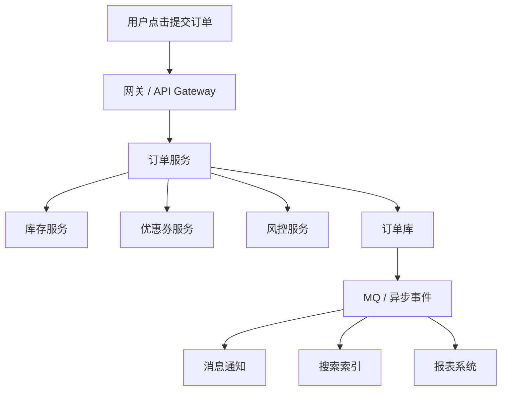

# 系统设计 - 第 6 课：限流、降级、熔断、幂等与重试

## 学习目标（本节结束后你能做到什么）

1. 理解限流、降级、熔断、幂等、重试这五个概念分别解决什么问题，不会把它们混着说。
2. 能在真实链路里判断：什么时候该挡请求，什么时候该关功能，什么时候该停止调用下游。
3. 理解为什么“重试”不是免费补救手段，如果没有幂等和退避策略，重试会把系统压垮。
4. 能结合秒杀、下单、支付回调、调用第三方服务等场景，把系统稳定性设计讲得具体可执行。

## 内容讲解（核心概念，用类比、例子、图示说清楚）

系统设计面试里，很多候选人很喜欢说“这里可以加限流、熔断、降级、重试”。但一旦面试官追问“为什么这里是限流，不是熔断？为什么是降级，不是重试？如果重试会不会重复扣库存？”，回答往往就会散掉。问题不是这些词不会，而是没有把它们放回一条真实链路里思考。

这五个词都属于“系统保护手段”，但保护的对象和时机完全不同。你可以先用一个非常粗的类比来记：

- `限流`：先挡住一部分流量，别让系统直接被冲垮
- `降级`：保核心功能，暂时牺牲次要功能
- `熔断`：发现下游已经不行了，先别继续打它
- `幂等`：同一个请求来多次，结果不能越做越错
- `重试`：遇到临时失败，再试几次，但要有节制

很多系统事故，不是因为没有这五种手段，而是因为用错了地方。比如下游服务已经超时了，你却疯狂重试；库存扣减不是幂等的，你却允许客户端无限重放；搜索服务已经挂了，你还坚持每个下单请求同步调用它；活动流量已经冲到主链路，你还不做入口限流。这些问题背后，本质上都是“没有把系统保护设计成一整套协同机制”。

### 一、先看一条真实交易链路

先假设你在设计一个典型电商下单链路，里面有这些步骤：

一条真实链路里可能出现的故障很多：

- 活动开始后，请求量突然暴涨
- 某个用户疯狂重复点击下单
- 优惠券服务响应变慢
- 风控服务偶发超时
- 订单库连接池被打满
- 下游 MQ 出现积压
- 支付回调重复到达

你会发现，不同问题需要不同处理方式。不能所有问题都答“加重试”，也不能所有问题都答“加 MQ”。这就是这一课的重点。

### 二、限流：在系统入口先做取舍，不让所有请求都进来

限流要解决的是：`请求量超过了系统当前能安全处理的能力。`

这时候系统最危险的做法，不是拒绝一部分请求，而是什么都不拒绝，硬让所有请求都冲进来。因为一旦线程池、连接池、数据库、下游依赖都被打满，最终结果往往是所有请求都变慢，最后所有请求都失败。

所以限流的本质不是“让用户不爽”，而是“牺牲一部分请求，保护整体系统活着”。

最典型的场景就是秒杀。假设活动开始后 1 秒内来了 20 万请求，但你的订单服务只稳定处理 5000 QPS，库存服务稳定处理 8000 QPS，数据库写入稳定处理 3000 到 5000 QPS。如果不做限流，后端根本没有机会从容处理，系统会直接进入雪崩状态。

这个时候入口限流就非常合理。常见的限流维度包括：

- 全局限流：整个接口每秒最多接多少请求
- 用户限流：单个用户单位时间最多提交多少次
- IP 限流：防止刷子或恶意流量
- 资源限流：某个商品、某个活动单独限流
- 下游保护限流：根据库存服务、支付服务当前状态动态调整

限流的常见算法包括令牌桶、漏桶、固定窗口、滑动窗口。面试里不一定非要展开算法细节，但你至少要知道一个工程判断：`令牌桶更适合允许一定突发流量，漏桶更强调平滑输出。`

更重要的是你要说明限流之后怎么处理请求。通常有三种方式：

1. 直接拒绝  
   返回“请求过多，请稍后再试”

2. 排队等待  
   适合业务允许排队的场景，比如秒杀资格排队

3. 降级处理  
   比如只允许核心接口继续，其余非核心流量先关闭

也就是说，限流只是第一步，它不是孤立存在的，通常会和降级、队列、熔断一起配合。

### 三、降级：系统资源不够时，先保核心路径

降级解决的问题不是“请求太多”本身，而是：`资源有限时，系统应该优先保住哪些功能。`

这点在面试里非常容易被答空。很多人会说“系统崩了就降级”，但没有说清到底降什么。

你可以把降级理解成“主动做减法”。例如电商首页在大促时，最核心的功能可能是：

- 登录
- 商品详情
- 下单
- 支付

而这些功能可能暂时没那么关键：

- 个性化推荐
- 实时评论
- 猜你喜欢
- 实时排行榜
- 某些统计看板

一旦系统资源紧张，你完全可以主动关闭后面这些次要能力，把更多 CPU、线程、数据库连接留给交易主链路。这就叫降级。

降级也可以更细。比如订单链路中，优惠券推荐服务如果超时，你可以选择：

- 严格模式：优惠券价格必须准，算不出来就不让用户下单
- 降级模式：先不展示复杂优惠推荐，只保留已经选中的优惠券核算

这就是一个非常真实的 trade-off。不是所有服务都值得“撑到最后一刻”；很多服务应该在压力上来时主动退出主链路。

### 四、熔断：下游已经不行时，停止继续伤害它，也保护自己

熔断针对的是：`某个下游服务已经持续失败或持续变慢，如果继续调用，只会把问题扩散。`

比如订单服务依赖优惠券服务。正常情况下，优惠券服务 50 毫秒能返回；但某一时刻它开始超时到 2 秒。如果订单服务还坚持每次都同步调用它，那么订单线程会大量阻塞，连接池被占满，最终订单服务自己也会被拖死。

这个时候熔断就有意义了。它的逻辑通常是：

1. 观察到短时间内失败率或超时率显著升高
2. 打开熔断器，暂时不再调用这个下游
3. 直接走快速失败或降级逻辑
4. 过一段时间后，用少量探测请求试试下游是否恢复
5. 恢复后再逐步关闭熔断器

这就是常说的 closed / open / half-open 三种状态，但面试里比背状态名更重要的是：你要知道为什么这样做。

熔断的真正价值有两个：

1. 保护自己，不让线程、连接、超时预算都浪费在一个已经坏掉的依赖上
2. 保护下游，避免在它已经很脆弱的时候继续加压

一个很典型的例子是调用第三方物流价格服务或风控服务。它们偶尔慢、偶尔抖、偶尔直接挂掉都很常见。你不应该把自己的核心交易链路完全绑死在这种外部依赖上。更成熟的方案是：

- 设置超时时间
- 连续失败后熔断
- 熔断期间返回缓存结果、默认值，或关闭相关功能

### 五、幂等：重复请求和重复回调一定会发生

很多系统 bug 并不是因为流量太大，而是因为“同一个请求执行了不止一次”。客户端超时重试、用户重复点击、消息重复投递、支付重复回调，这些在真实系统里都不是例外，而是常态。

幂等要解决的问题是：`同一业务动作执行多次，系统最终状态应该和执行一次一致。`

最常见的误区是把幂等理解成“接口不报错”。这不对。幂等的关键不是形式上的返回值，而是业务状态不能被重复推进。

例如：

- 创建订单，如果同一请求重放两次，不能生成两张订单
- 支付成功回调如果来两次，不能记两笔到账
- 库存回补消息重复消费两次，不能把库存加回两遍
- 发优惠券事件重放两次，不能发两张券

常见的幂等手段包括：

- 客户端传请求唯一 ID 或幂等键
- 数据库唯一索引，例如 `user_id + request_token`
- 状态机校验，只允许合法状态转换
- 消费消息时用 `order_id + event_type` 做去重
- 把操作设计成“设值型”而不是“累加型”

在面试里，幂等特别容易和重试连起来问。因为一旦没有幂等，你就不敢安全地重试；一旦有了幂等，很多临时失败才有机会被自动恢复。

### 六、重试：只对暂时性失败有意义，而且必须有边界

重试解决的是：`请求失败可能只是暂时的，再试一次也许能成功。`

比如网络抖动、瞬时超时、短暂主从切换、下游临时过载，这些都可能通过重试恢复。但这里最容易犯的错误，就是把所有失败都拿去重试。

你要知道，失败大致可以分三类：

1. 暂时性失败  
   例如网络抖动、瞬时超时、偶发 503，这类适合重试

2. 业务性失败  
   例如库存不足、余额不足、优惠券已过期，这类重试没有意义

3. 持续性失败  
   例如数据库挂了、下游持续超时、配置错误，这类盲目重试会雪上加霜

所以重试一定要讲边界：

- 设置最大重试次数
- 使用指数退避
- 加随机抖动，避免重试风暴
- 配合超时控制
- 只对可重试错误码重试
- 必须建立在幂等前提上

如果你不加这些约束，重试很容易把局部故障放大成全局雪崩。一个经典事故模式是：下游已经慢了，上游超时后开始重试，重试流量又进一步压垮下游，形成正反馈。

### 七、这五个手段在一起怎么配合

真正成熟的系统设计，不是把这五个词单独背下来，而是知道它们如何协同。

还是用秒杀或大促链路举例：

1. 网关先做限流  
   防止请求总量超出系统承载能力

2. 某些非核心功能提前降级  
   关闭推荐、评论、实时统计，只保交易

3. 对不稳定下游做熔断  
   例如营销推荐、外部风控、第三方查询服务

4. 对关键写操作做幂等  
   防止用户重复提交、消息重复消费造成重复订单

5. 对暂时性失败做有限重试  
   例如消息投递失败重试、偶发网络失败重试

你会发现，这五个不是并列摆件，而是一整套保护机制：`限流保护入口，降级保核心，熔断断开坏依赖，幂等兜住重复，重试修复短故障。`

### 八、几个高频场景怎么答

#### 场景 1：秒杀系统

面试里你可以这样说：

- 网关对活动接口做全局和单用户限流
- 用户请求先校验资格，抢不到资格直接失败
- 非核心功能比如推荐位、评论、实时热榜先降级关闭
- 库存服务或订单服务异常时熔断非关键依赖，避免拖死主链路
- 下单请求必须带幂等键，防止重复点击生成多笔订单
- MQ 消费失败可有限重试，但库存不足这类业务错误不能重试

#### 场景 2：支付回调

- 第三方回调可能重复，所以支付更新必须幂等
- 对第三方查询接口要设置超时和熔断，避免外部依赖把自己拖慢
- 回调处理失败可重试，但必须有去重逻辑
- 通知积分、发票、消息系统可以异步，必要时降级这些附属能力

#### 场景 3：调用外部风控或推荐服务

- 外部服务超时时间不能过长
- 短时间失败率过高就熔断
- 熔断后走默认策略，例如只保最基本校验或关闭个性化推荐
- 不要无限重试，否则会把自己的线程池耗尽

### 九、一个面试里的稳健表达模板

当面试官问你“系统怎么保证稳定性”，你可以按这个顺序讲：

1. 先识别哪些资源最脆弱  
   例如数据库写入、库存服务、第三方接口、线程池、连接池

2. 再说明入口怎么保护  
   用限流、验证码、资格校验、防刷等手段先挡掉无效流量

3. 再说明功能怎么分层  
   哪些是核心功能，哪些可以降级

4. 再说明下游故障怎么隔离  
   用超时、熔断、隔离舱避免故障扩散

5. 再说明重复和失败怎么处理  
   幂等保证不重复执行，重试只针对暂时性错误并设置边界

只要你这样讲，稳定性设计就不是一句“可以限流熔断”，而是一套完整的运行策略。

## 小结（3-5 条关键点）

1. 限流是挡流量，降级是保核心，熔断是断坏依赖，幂等是防重复，重试是修暂时性失败。
2. 这五个手段解决的问题不同，不能互相替代，也不能不加判断地同时乱用。
3. 没有幂等的重试非常危险，因为它可能把重复请求变成重复扣款、重复下单、重复发货。
4. 熔断和降级通常一起出现：先停止调用不稳定下游，再用默认值、缓存值或关闭功能保住主链路。
5. 真正成熟的稳定性设计，不是背名词，而是在具体场景里明确“先挡什么、保什么、放弃什么、修什么”。

---

## 检查站：请回答以下问题

1. 限流、降级、熔断三者看起来都像“保护系统”，但它们分别保护的是什么？请你用自己的话区分。
2. 如果秒杀活动开始后流量暴涨，但推荐服务响应变慢，你会怎么组合使用限流、降级和熔断？
3. 为什么说“没有幂等就不要轻易重试”？请你用订单或支付场景举例。
4. 如果面试官问你“为什么库存不足不应该重试，而网络超时可以重试”，你会怎么回答？

请把你的答案直接告诉我，我会根据你的回答决定下一步。
