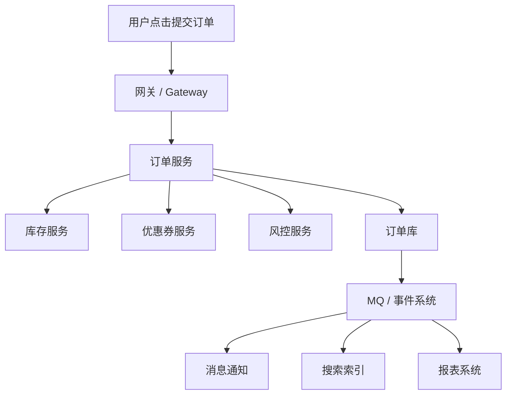

# 系统设计 - 第 6 课：限流、降级、熔断、幂等与重试

## 学习目标（本节结束后你能做到什么）

1. 理解限流、降级、熔断、幂等、重试分别在保护什么，以及它们为什么不能互相替代。
2. 能把这五个概念放回真实链路里思考，说明“先挡什么、保什么、断什么、兜什么、修什么”。
3. 能解释为什么没有幂等就不要轻易重试，为什么没有超时和熔断的重试很容易演变成重试风暴。
4. 能结合秒杀、下单、支付回调、第三方依赖等场景，讲出一套系统稳定性组合拳，而不是罗列名词。

## 内容讲解（核心概念，用类比、例子、图示说清楚）

系统设计面试里，稳定性相关的回答非常容易变成“堆术语”：

- 这里限流一下
- 这里降级一下
- 这里加个熔断
- 失败了重试
- 再做一下幂等

问题是，如果面试官继续追问：

- 为什么这里是限流，不是熔断？
- 为什么这里先降级，不是先扩容？
- 为什么这个错误能重试，那个错误不能？
- 重试会不会引入重复扣款？
- 熔断打开以后，用户到底看到什么？

很多回答就会散。

所以这一课的关键不是把五个词背熟，而是把它们放回同一张“故障演化图”里看。  
你可以先记住一句很有用的话：

`限流、降级、熔断、幂等、重试，不是五个并列摆件，而是一套围绕“过载、依赖故障、重复执行”设计的协同机制。`

### 一、先看系统到底会被哪三类问题打垮

很多线上事故，本质上都可以归到三大类。

#### 1. 过载

请求太多，系统资源不够。  
表现为：

- CPU 打满
- 线程池耗尽
- 连接池耗尽
- 数据库被打爆
- 响应时间雪崩

对应的主武器通常是：`限流 + 降级`。

#### 2. 依赖故障

下游服务变慢、超时、失败，拖垮上游。  
表现为：

- 某个依赖 RT 飙升
- 上游线程大量阻塞
- 超时层层传导
- 最后整个调用链都变慢

对应的主武器通常是：`超时 + 熔断 + 降级`。

#### 3. 重复执行与失败重放

客户端重试、消息重复投递、支付回调重复、用户重复点击。  
表现为：

- 重复下单
- 重复扣款
- 重复发券
- 库存重复回补

对应的主武器通常是：`幂等 + 有边界的重试`。

一旦你先把问题分类，再讲策略，稳定性设计就会清楚很多。

### 二、五个概念分别在保护什么

先给一个非常稳的直觉版定义。

- `限流`：保护入口，不让系统吃进超过承载能力的流量
- `降级`：保护核心业务，在资源不够时主动放弃次要能力
- `熔断`：保护上游和下游，在依赖已经坏掉时快速切断调用
- `幂等`：保护业务状态，不让同一动作重复执行造成重复副作用
- `重试`：保护成功率，对暂时性失败做有限自愈

你会发现，它们保护的对象并不相同：

- 限流保护的是系统总承载
- 降级保护的是优先级
- 熔断保护的是依赖边界
- 幂等保护的是业务正确性
- 重试保护的是暂时性可恢复故障

这也是为什么它们不能互相替代。

### 三、先看一条真实链路：下单系统里的故障传播

假设一个典型电商下单链路如下：

这条链路可能遇到的故障有：

- 活动开始后流量突然暴涨
- 用户不断重复点击提交
- 优惠券服务持续超时
- 风控服务偶发 503
- 订单库连接池快耗尽
- MQ 消费积压
- 支付回调重复到达

真正成熟的稳定性设计，不会用一个工具去打所有问题，而是按故障类型分层处理。

### 四、限流：先保护入口，不让系统无上限吃流量

限流解决的是：`系统当前承载能力有限，不能让所有请求都进来。`

很多人会觉得限流是在“拒绝用户”，所以有心理阻力。  
但真实系统里，最糟糕的不是拒绝一部分请求，而是所有请求都放进来，最后全部变慢、全部失败。

你可以把限流理解成“主动做有序损失”，用一部分可预期失败，换整体可用。

#### 1. 限流常见放置位置

这点在面试里很值得主动讲，因为不同层级限流意义不同。

- 客户端：按钮防抖、重复提交拦截
- CDN / Edge：基础防刷、防攻击
- API Gateway：全局限流、租户限流、用户限流
- 服务内部：线程池、并发数、水位保护
- 下游依赖前：针对数据库、库存服务、第三方接口的保护限流

这说明限流不是只有“网关限流”一种。

#### 2. 常见限流维度

- 全局限流：整个接口每秒最多接多少请求
- 用户限流：同一用户单位时间最多操作几次
- IP 限流：防脚本和恶意流量
- 资源限流：某个商品、某个房间、某个热点对象单独限流
- 下游状态感知限流：根据库存/支付/数据库负载动态调整阈值

#### 3. 限流之后怎么办

这一步很多人会漏。

限流本身只是“挡住”，挡住以后通常要选择一种语义：

1. 直接拒绝  
   返回 `429` 或“请求过多，请稍后再试”

2. 进入排队  
   适合秒杀、抢票这类业务本身支持排队的场景

3. 触发降级  
   比如只保留核心接口，非核心流量暂时关闭

#### 4. fail-open 还是 fail-closed

这是比较深的一层。  
有些限流失败时应该默认放行，有些应该默认拒绝。

- 登录风控限流配置拉取失败，可能倾向 fail-open，避免把所有正常用户都挡住
- 支付风控限流异常，可能更倾向 fail-closed，宁可保守一点也不能放过高风险请求

你在面试里如果能主动提到“不同业务对 fail-open / fail-closed 的选择不同”，会很成熟。

### 五、降级：资源紧张时，主动保核心功能

降级解决的不是“流量太大”本身，而是：`资源不够时，系统应该优先保证什么。`

这一步特别能体现你的业务理解。

比如一个电商大促，下面这些功能的优先级明显不同：

核心：

- 登录
- 商品详情
- 下单
- 支付

可牺牲：

- 个性化推荐
- 实时评论
- 热门榜单
- 某些埋点
- 非关键画像更新

降级不是“系统崩了以后被动少做一点”，而是“在资源紧张之前就准备好有意识地做减法”。

#### 1. 降级可以发生在哪些层

- 页面级：首页去掉推荐卡片、评论区、实时榜单
- 接口级：某些辅助接口直接返回默认值
- 数据级：返回缓存值、旧值、近似值
- 流程级：跳过非关键步骤

#### 2. 一个真实例子

订单服务调用优惠券推荐服务，如果优惠券推荐超时：

- 你可以选择“严格模式”：优惠券信息不全就不允许下单
- 也可以选择“降级模式”：不再计算复杂优惠推荐，只保留已选中的券核销能力

这个案例很有价值，因为它说明降级不是“系统坏了以后随便返回个空”，而是围绕业务优先级设计的。

### 六、熔断：依赖已经坏了，就不要继续打它

熔断针对的是：`某个依赖已经持续异常，如果继续调用，只会把问题扩散。`

假设订单服务依赖优惠券服务。  
正常情况下它 50ms 返回；但某一刻它开始 2 秒超时。  
如果订单服务仍坚持每次都调用它，那么订单线程会大量阻塞，连接池被耗尽，订单服务自己也会被拖慢。

熔断的核心思想是：

1. 观察依赖失败率、超时率或慢调用比例
2. 超过阈值后，短时间停止继续调用
3. 直接走默认值、缓存值、快速失败或降级逻辑
4. 过一段时间后用少量探测流量试探恢复

#### 1. 熔断为什么要和超时一起讲

没有超时，就很难及时认定依赖“坏掉了”。  
没有熔断，超时就只能一遍遍让线程傻等。

所以更像真实工程的表达是：

- 先设合理超时预算
- 再根据失败率 / 慢调用比例触发熔断

#### 2. 熔断不是“看到一次错误就停”

熔断要防止的是“持续性错误”和“持续性过慢”，而不是偶发抖动。  
否则系统会非常敏感，动不动就切断正常依赖。

#### 3. 熔断后用户看到什么

这一步很关键。  
熔断如果只是“停掉调用”，但没有 fallback，用户体验仍然很差。

常见 fallback 包括：

- 返回缓存值
- 返回默认策略
- 直接隐藏相关功能
- 快速失败并提示稍后重试

### 七、幂等：重复请求和重复消息是常态，不是例外

很多系统 bug 并不是因为流量太大，而是因为“同一个动作执行了两遍”。  
重复点击、客户端超时重试、支付回调重复、MQ 重复消费，都非常常见。

幂等的目标是：

`同一业务动作执行多次，最终结果应该和执行一次一致。`

注意，幂等不是“多次请求都返回 200”这么简单，而是业务状态不能被重复推进。

#### 1. 幂等常见出现在哪三层

##### API 层

例如下单接口。  
用户连点两次，不能创建两张订单。

##### 回调层

例如支付回调。  
第三方通知两次，不能记两次到账。

##### 消费层

例如 `payment_succeeded` 事件重复消费。  
不能发两次积分、建两个发货单。

#### 2. 常见幂等手段

- 请求幂等键，如 `request_id`
- 数据库唯一索引
- 状态机校验，只允许合法状态跃迁
- 消费去重表，如 `event_id`
- 把操作设计成设值而不是累加

#### 3. 幂等窗口

这也是比较深的一层。  
有些幂等只需要保护几分钟，有些需要长期保护。

- 支付回调幂等，可能要保留很久
- 普通按钮防抖幂等，可能只需要几十秒

所以幂等记录的保留时间，也要按业务语义设计。

### 八、重试：只能修“暂时性失败”，不能修“错误决策”

重试的本质，是对“可能只是暂时失败”的操作做有限自愈。  
比如：

- 网络闪断
- 瞬时超时
- 主从切换
- 临时 503

但重试绝不是免费药方。

#### 1. 哪些错误适合重试

- 连接超时
- 临时网络错误
- 短暂不可用
- 可判断为临时性失败的 5xx

#### 2. 哪些错误不该重试

- 库存不足
- 优惠券已过期
- 参数错误
- 权限不足
- 风控拒绝

这些都是业务性失败，重试不会让结果变好，只会徒增压力。

#### 3. 重试一定要有边界

成熟重试至少包括：

- 最大次数
- 指数退避
- 随机抖动
- 总超时预算
- 只对可重试错误码生效

没有这些，重试就会变成重试风暴。

#### 4. 重试为什么必须建立在幂等之上

因为只要重试可能发生，就等于“同一个动作可能执行多次”。  
如果没有幂等：

- 订单可能创建多次
- 支付可能重复入账
- 库存可能重复扣减或重复回补

所以一句很稳的话是：

`没有幂等，就不要轻易自动重试会产生副作用的操作。`

### 九、别漏掉一个非常关键的基础设施：超时预算

虽然这节标题里没有单独写“超时”，但稳定性设计里它几乎是熔断和重试的前提。

为什么？

- 没有超时，线程会一直卡住
- 没有超时，很难判断依赖是不是慢了
- 没有超时，重试会失去边界

在调用链里，超时预算还应该逐层拆分。  
例如整个下单接口预算 300ms：

- 风控最多 80ms
- 优惠券最多 50ms
- 库存最多 80ms
- 数据库写入最多 50ms

这种思维非常像真实工程，也会让你的稳定性设计更完整。

### 十、把五个手段串起来，才是成熟系统

真正好的系统，不是“每个地方都堆一点限流熔断重试”，而是有一条故障处理顺序。

可以把它理解成一条保护链：

这条链的意义是：

- `限流` 先减少压力
- `降级` 再腾出资源保核心
- `熔断` 切断坏依赖
- `幂等` 防止重复副作用
- `重试` 在安全边界内修复短时故障

一旦你用这条逻辑讲，稳定性章节就很有层次。

### 十一、案例一：秒杀系统里这五个概念怎么配合

秒杀是最适合练稳定性组合拳的场景。

#### 1. 限流

- 网关做全局限流
- 用户维度限流
- 活动商品维度限流

#### 2. 降级

- 关闭推荐、评论、排行榜
- 页面只保留核心购买入口

#### 3. 熔断

- 营销推荐服务慢了就熔断，不要拖主链路
- 第三方风控服务异常时切换到更保守的本地规则

#### 4. 幂等

- 下单请求带幂等键
- 防止重复点击生成多笔订单

#### 5. 重试

- MQ 投递失败可重试
- 库存不足绝不能因为“重试一下”就继续打库存系统

这个案例特别好，因为它能让你顺着一条真实主链路把五个概念都串起来。

### 十二、案例二：支付回调为什么最能体现“幂等 + 重试 + 对账”

支付系统里，第三方回调可能重复、乱序、延迟。  
更成熟的处理通常是：

1. 回调签名校验
2. 以 `payment_txn_id` 做幂等更新
3. 更新支付流水和订单状态
4. 成功后返回第三方确认
5. 通过事件异步通知履约、积分、发票等系统

如果更新失败：

- 可以有限重试
- 多次失败后进入人工/自动对账流程

这个场景很适合回答：

- 为什么没有幂等就不能乱重试
- 为什么回调链路要和下游通知链路解耦
- 为什么最终一致必须配对账

### 十三、案例三：调用外部依赖时，最容易犯什么错

假设订单服务依赖外部风控或外部物流价格服务。  
常见错误是：

- 不设超时
- 无限重试
- 没有熔断
- 失败时没有降级

于是结果是：

- 外部服务慢
- 你的线程全被卡住
- 超时后开始重试
- 重试流量再把外部和自己一起压垮

正确姿势通常是：

- 设短超时
- 只对临时性错误有限重试
- 连续失败后熔断
- 熔断期间走默认值、缓存值或关闭相关功能

### 十四、面试里怎么把稳定性讲成“组合拳”

如果面试官问“你的系统怎么保证稳定”，一个很稳的回答顺序是：

1. 先识别最脆弱的资源  
   例如数据库、库存、第三方依赖、线程池、连接池。

2. 说明入口保护  
   限流、防刷、资格校验，避免无效流量冲进来。

3. 说明优先级保护  
   降级非核心功能，保住主交易链路。

4. 说明依赖隔离  
   超时、熔断、fallback，避免坏依赖扩散。

5. 说明重复与失败恢复  
   幂等保护正确性，重试修复短时失败。

只要你能按这个顺序讲，稳定性设计就不再是术语清单，而是工程决策。

## 小结（3-5 条关键点）

1. 限流保护入口承载，降级保护核心优先级，熔断保护依赖边界，幂等保护业务正确性，重试保护暂时性可恢复失败。
2. 这五个概念之所以不能混着说，是因为它们处理的是不同故障类型：过载、依赖异常和重复执行。
3. 没有幂等就不要轻易自动重试带副作用的操作，否则很容易把临时故障放大成业务错误。
4. 熔断通常要和超时、fallback 一起讲；否则只是“停止调用”，并没有形成完整稳定性方案。
5. 真正成熟的稳定性设计不是背五个名词，而是围绕主链路说明“先挡什么、保什么、断什么、兜什么、修什么”。

---

## 检查站：请回答以下问题

1. 你会如何用“过载、依赖故障、重复执行”这三类问题，来重新组织限流、降级、熔断、幂等和重试？
2. 如果秒杀活动开始后流量暴涨，同时推荐服务响应变慢，你会怎么组合使用限流、降级和熔断？
3. 为什么说“没有幂等就不要轻易重试”？请你用订单、支付或消息消费场景举例。
4. 如果面试官问你“库存不足为什么不该重试，而网络超时为什么可以重试”，你会怎么回答？

请把你的答案直接告诉我，我会根据你的回答决定下一步。
