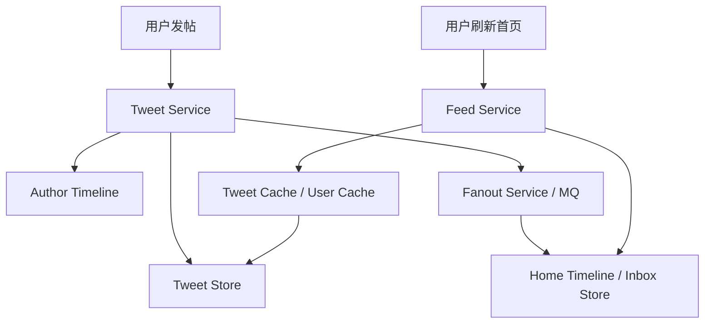
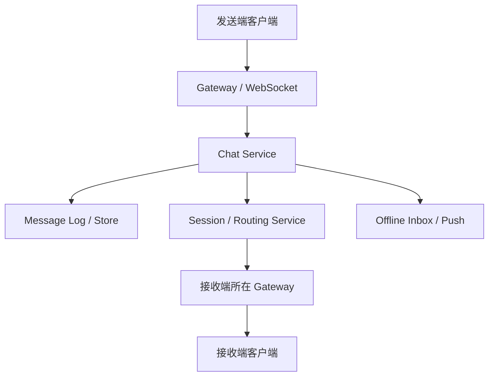

# 系统设计 - 第 7 课：社交类题型：Feed、Timeline、聊天

## 学习目标（本节结束后你能做到什么）

1. 理解 `Feed`、`Timeline`、`聊天系统` 为什么经常一起出现，以及它们背后的系统矛盾为什么完全不同。
2. 能识别首页聚合、写扩散、社交图、在线连接、消息顺序、多端同步、离线补拉这些高频深水区。
3. 能围绕 `Twitter / News Feed` 和 `聊天系统` 两类经典题型，讲出一版更像真实工程的架构与 trade-off。
4. 能把缓存、存储、队列、分区、顺序、未读、热点治理放回具体对象和链路，而不是停在组件名词层面。

## 内容讲解（核心概念，用类比、例子、图示说清楚）

社交类题型之所以是系统设计面试里的高频题，不是因为它们用了什么特别冷门的技术，而是因为它们很擅长把“读多写少、写扩散、热点、低延迟、连接管理、局部顺序、多端同步、最终一致”这些经典矛盾揉在一起。

也是因为这个原因，很多人第一次答这类题会觉得很乱：

- Twitter 和聊天不是都要用 Redis、数据库、MQ 吗？
- Timeline 和 Feed 看起来不都是列表吗？
- 聊天和通知系统是不是差不多？

如果你也有这种感觉，说明你现在缺的不是组件知识，而是“问题分型能力”。  
这节课的核心就是把社交题拆开，让你看到它们各自最难的地方到底在哪。

### 一、先把四个对象分清：内容、关系、收件箱、会话

社交类题型里，一个非常常见的失误是把所有数据都当成“帖子表 + 用户表”。  
但真实系统里，至少有四类对象需要区分：

1. 内容对象  
   tweet、帖子、消息、图片、评论

2. 关系对象  
   follow graph、好友关系、群成员关系

3. 聚合结果  
   Home Feed、收件箱、推荐候选

4. 会话对象  
   单聊会话、群聊会话、未读状态、在线状态

这四类对象访问模式不同，所以不应该用同一套思路处理。

### 二、Feed、Timeline、聊天到底各自在考什么

#### 1. Feed

Feed 更像“用户打开首页时看到的一串候选内容流”。  
它的典型问题是：

- 首页结果怎么来
- 写时推送还是读时合并
- 如何平衡读延迟和写扩散
- 如何缓存候选结果
- 如何处理超级大 V 热点

也就是说，Feed 真正难的是“首页生成”。

#### 2. Timeline

Timeline 更像“某个作者或某个对象自己的内容历史”。  
例如：

- 用户主页发帖历史
- 某个作者最近发过什么

它的访问模式相对更单纯：

- 按 `user_id`
- 按时间倒序
- 做游标分页

所以 Timeline 的重点通常在：

- 存储组织
- 索引设计
- 分页稳定性
- 缓存对象拆分

#### 3. 聊天系统

聊天系统的重点完全不在“内容聚合”，而在：

- 长连接
- 消息路由
- 会话内顺序
- 离线消息
- 多端同步
- 已读未读

你可以把它理解成：Feed 更像“内容分发 + 读优化问题”，而聊天更像“实时传递 + 状态同步问题”。

### 三、Twitter / News Feed：真正难的是 Home Timeline，而不是发帖

设计一个 Twitter，很多候选人第一反应是“发一条 tweet 怎么存”。  
但真实系统里，发帖通常不是最难的；难的是数十万 QPS 级别的首页读取。

更准确地说，Twitter 题的核心矛盾通常是：

`写入相对少，但首页读取极其频繁，而且结果高度个性化。`

我们先看一张简化的对象图：

这个图里最关键的对象不是 tweet 本身，而是：

- `Author Timeline`：作者自己的内容序列
- `Home Timeline`：用户首页候选序列

这是很多回答里会被混掉的地方。

### 四、Home Feed 最难的就是 fanout：写时推，还是读时拉

这也是外企大厂特别爱问的点。

#### 1. Fanout on write

当作者发一条内容时，系统主动把它推到所有粉丝的 Home Timeline 里。  
这样读首页时就很快，因为结果大体已经准备好了。

优点：

- 读延迟低
- 首页构建快
- 读多写少场景更友好

代价：

- 发一条内容要写很多份
- 大 V 发帖时写扩散极其严重
- 缓存和收件箱更新成本高

#### 2. Fanout on read

发帖时只把内容写到作者自己的 Timeline。  
用户读首页时，再按关注关系去拉取多个作者最近内容并合并排序。

优点：

- 写入轻
- 大 V 发帖不会引发巨量扩散

代价：

- 首页读取成本高
- 读放大严重
- 排序和去重更重

#### 3. 为什么真实系统常用混合策略

因为“小号发帖”和“大 V 发帖”根本不是同一个问题。

更常见的工程做法是：

- 普通用户：fanout on write
- 超级大 V：fanout on read
- 对热点作者或热点内容再叠加缓存与异步预热

这句话特别有面试价值，因为它不是在背术语，而是在体现“按对象分治”的工程思维。

### 五、Feed 不只是把内容列出来，还要考虑排序、去重和新鲜度

很多简化版回答会把首页 Feed 当成“把最近内容拼起来”。  
但真实产品至少还要考虑：

- 时间排序还是相关性排序
- 是否混入推荐内容
- 已读去重
- 广告或商业插入
- 屏蔽关系
- 隐私权限

因此，Home Feed 往往不是“主表直接查出最终结果”，而是：

1. 先拿候选内容 ID 列表
2. 再批量加载 tweet/post 详情
3. 结合用户关系、屏蔽和排序规则做最终拼装

这就是为什么 Feed 很适合缓存“候选列表”和“对象详情”，而不总是缓存完整最终页面。

### 六、Timeline：更像顺序读问题，很适合讲游标分页

Timeline 通常是：

- 给定 `user_id`
- 按时间倒序
- 一页页往下翻

它比首页 Feed 简单，因为它不需要跨很多作者聚合。  
但它非常适合考下面这些点：

#### 1. 存储组织

通常会按：

- `user_id + created_at`
- 或 `user_id + content_id`

组织查询路径。

#### 2. 游标分页

Timeline 特别适合主动讲 cursor-based pagination，而不是 offset pagination。

为什么？

- offset 越往后越慢
- 新数据插入后容易重复或漏读
- 时间流列表天然更适合用 `last_seen_id` 或 `last_seen_timestamp`

#### 3. 详情对象拆分

Timeline 返回的不只是 ID 列表，还要拼接：

- 作者信息
- 内容正文
- 图片/视频元数据
- 点赞/评论计数

所以你通常会：

- 缓存列表 ID
- 缓存内容详情
- 缓存用户资料

这样对象拆分比“一个大对象全缓存”更灵活。

### 七、聊天系统：重点不是聚合，而是“实时到正确的人手里”

聊天系统和 Feed 最大的不同，是它首先是一个实时传递问题。

更准确地说，聊天系统的核心矛盾通常是：

- 大量在线连接
- 低延迟消息送达
- 会话内顺序
- 离线补发
- 多设备同步

一个简化版主链路可以这样看：

这条链路里最重要的不是“怎么聚合内容”，而是：

- 连接现在在哪
- 消息是否已持久化
- 该往哪个设备推
- 推完以后如何 ACK
- 收不到时如何离线补发

### 八、聊天系统里最关键的五层对象

如果你想把聊天系统答得更像真实工程，可以主动把对象拆成五层：

1. 连接层  
   谁在线，连在哪台 Gateway

2. 会话层  
   单聊会话、群聊会话、成员关系

3. 消息日志层  
   消息正文、消息序号、消息元数据

4. 状态层  
   未读、已读、已送达、已接收、撤回、编辑

5. 推送层  
   在线投递、离线推送、移动端通知

这样一拆，聊天题就不容易被你答成“WebSocket + Redis + MySQL”。

### 九、连接与路由：聊天题里真正的第一瓶颈

如果系统有几百万在线用户，最先扛压的往往不是数据库，而是连接网关。

> 连接网关/接入层的**通用方法论**——连接数分档、连接网关职责、连接路由表、心跳与超时、背压与降级、重连风暴治理，见 [02f 连接数高系统的连接网关与接入层](./02f_连接数高系统的连接网关与接入层方法论.md)。这里只讲它在聊天场景里怎么落地。

#### 1. Gateway 集群

通常会有一层专门维护长连接的 Gateway：

- 负责鉴权
- 维护心跳
- 接收和下发消息
- 管理连接生命周期

#### 2. 路由服务

消息到了服务端后，你要知道：

- 接收用户现在在线吗
- 在线的话在哪台 Gateway 上
- 这个用户是否有多个设备在线

所以常常需要一个 `user_id -> gateway_id/device_id` 的路由状态层。

#### 3. 在线状态是派生状态，不一定是绝对真相

在线状态特别适合讲“弱一致”。  
因为连接断开、心跳丢失、网络抖动很常见，所以在线状态常常是秒级收敛的派生状态，而不是强一致真相源。

### 十、顺序：聊天里通常追求的是“会话内局部有序”

聊天系统最容易被追问的点之一就是顺序。

你通常不需要全局顺序，那样代价太高；  
真正重要的是：

- 同一个单聊会话内顺序正确
- 同一个群聊会话内尽量按序

常见做法包括：

- 为每个会话分配递增 `sequence`
- 按 `conversation_id` 路由到同一分区或同一有序执行单元
- 客户端根据 `sequence` 排序展示

但你也要知道：  
“服务端写入顺序正确”不等于“所有设备展示顺序绝对一致”。  
网络重传、多设备 ACK、离线补拉都可能让展示层需要再做顺序修正。

### 十一、多端同步：聊天系统里比“送达”更难的一层

一个用户可能同时在：

- 手机
- Web
- 平板

三个端在线。

这会带来几个很现实的问题：

1. 发送者自己发出去的消息，要不要同步到自己其他设备
2. 接收者多端都在线时，是推一端还是多端都推
3. 已读状态由哪个端推进，如何回写其他端

所以聊天系统很多时候不是“两个用户之间传消息”，而是“多个设备之间同步会话状态”。

如果你在面试里能主动提这一点，会比单纯讲“实时送达”更显成熟。

### 十二、未读设计：为什么通常不会给每条消息、每个用户都存一条已读记录

这是聊天题经典追问。

一种很直观但很重的设计是：

- 每条消息
- 对每个接收者
- 都存一条已读/未读状态

这个设计在群聊里会迅速爆炸。  
假设 1000 人大群里 1 条消息，就可能写 1000 条状态记录；如果一天千万消息，写放大会非常夸张。

所以更常见的做法是：

- 每个会话维护递增 `last_seq`
- 每个用户维护 `last_read_seq`
- 未读数 = `last_seq - last_read_seq`

这种设计的 trade-off 是：

- 放弃逐条已读映射
- 换来更低写放大和更现实的存储成本

你如果能把这段 trade-off 讲清楚，聊天系统的层次就会一下拉高。

### 十三、离线消息与补拉：不要假设所有消息都能实时推到

真实聊天系统里，接收者不一定始终在线。  
所以你通常要准备两条路：

1. 在线投递  
   通过 Gateway 实时推送给在线设备

2. 离线补拉  
   用户重新上线后，按 `last_acked_seq` 或 `last_read_seq` 去补拉缺失消息

这说明聊天系统的可靠性，不能建立在“实时推送一定成功”之上，而应该建立在“消息日志 + 补拉机制”之上。

这个认知很重要，因为它能把你从“聊天是一个推送系统”提升到“聊天是一个实时分发 + 持久日志系统”。

### 十四、群聊为什么比单聊更难

很多候选人说“聊天系统”时，默认想的是单聊。  
但群聊一旦加进来，复杂度会明显上升：

- 一个会话对应很多接收者
- 未读写放大更严重
- 群成员变更会影响读写权限
- 超大群会出现热点分区

这时你可以主动区分：

- 小群：仍可按会话维度做比较直接的推送
- 超大群：可能需要按用户在线状态、频道分区、消息广播策略做特殊优化

面试里不一定需要把超大群讲到底，但你能主动提到“超大群和普通群不是同一个规模问题”，会非常加分。

### 十五、Feed 和聊天都会用缓存，但缓存对象和目的完全不同

这是一句非常值得在面试里主动说的话。

#### Feed 常见缓存对象

- Home Timeline 候选内容 ID
- Tweet/Post 详情
- 用户 Profile
- 热门计数

目的：

- 压缩首页读取延迟
- 降低排序和拼装成本

#### 聊天常见缓存对象

- 路由信息 `user_id -> gateway`
- 会话列表摘要
- 最近消息窗口
- 未读数

目的：

- 加速路由
- 加速会话列表读取
- 减少热点会话的读压力

同样是 Redis，背后承接的对象和目标完全不同。

### 十六、案例一：真实面试里怎么讲 Twitter

一个比较稳的节奏可以是：

1. 先收边界  
   只做发帖、关注、Home Feed、Author Timeline，不做推荐广告和搜索。

2. 做估算  
   日活、首页读 QPS、发帖 QPS、媒体资源规模。

3. 拆对象  
   tweet 内容、关注关系、作者 timeline、首页 timeline。

4. 讲核心矛盾  
   首页读远大于写，但超级大 V 带来写扩散极端不均衡。

5. 给出混合 fanout  
   普通用户写推送，大 V 读时合并。

6. 讲缓存与热点保护  
   缓存首页候选、tweet 详情、用户信息；热点作者特殊处理。

7. 补异常路径  
   缓存失效、写扩散过大、读路径放大、排序延迟。

这样的回答会比“网关 + 服务 + Redis + MySQL + Kafka”强很多，因为它真正抓住了首页为什么难。

### 十七、案例二：真实面试里怎么讲聊天系统

一个比较稳的节奏可以是：

1. 先澄清范围  
   单聊还是群聊，是否需要离线消息、已读、多端同步、消息搜索。

2. 先估在线连接  
   在线用户、长连接数、消息发送峰值。

3. 讲连接层  
   Gateway 集群维护 WebSocket，路由服务维护在线连接映射。

4. 讲消息主链路  
   发送 -> 持久化 -> 分配 sequence -> 路由到接收端 -> ACK。

5. 讲顺序与补拉  
   会话内局部有序，离线靠日志补拉。

6. 讲多端同步和未读  
   `last_read_seq`、多设备状态回写。

7. 补充故障与扩展  
   Gateway 挂了如何恢复路由，消息重复投递如何幂等，大群如何做热点治理。

这样一套讲法已经非常接近真实 IM 架构讨论了。

### 十八、这一课真正想让你建立的能力

这一课最重要的，不是把 Twitter 和聊天所有细节都背下来，而是让你在看到题目时，先自动问自己：

- 这是首页聚合问题，还是实时传递问题？
- 压力主要在读路径、写扩散，还是在线连接？
- 需不需要会话内局部顺序？
- 是否需要离线补拉？
- 缓存的到底是候选列表、对象详情，还是路由状态？
- 哪些数据是权威日志，哪些是派生视图？

一旦这些问题会自动弹出来，社交题型就不再是一团雾，而是几类非常明确的系统矛盾。

## 小结（3-5 条关键点）

1. Feed、Timeline、聊天虽然都属于社交题型，但主矛盾完全不同：Feed 更偏首页聚合与读优化，Timeline 更偏顺序读与分页，聊天更偏连接、路由、顺序和多端同步。
2. Twitter / News Feed 的核心深水区是 Home Timeline 的混合 fanout，以及“候选列表”和“对象详情”的分层缓存。
3. 聊天系统的核心深水区是长连接 Gateway、路由状态、会话内局部有序、离线补拉和多端同步，而不是内容聚合。
4. 未读设计是聊天题的高频追问，真实系统通常会用 `last_read_seq` 这类聚合状态，而不是给每条消息写每个用户的已读记录。
5. 社交题的关键不是多说几个组件，而是先识别：这是读问题、写扩散问题，还是实时分发问题。

---

## 检查站：请回答以下问题

1. 为什么说 Twitter 的 Home Feed 和 Author Timeline 不是一回事？它们各自最难的点分别是什么？
2. 如果一个普通用户和一个超级大 V 都发了一条新内容，为什么系统通常不会对两者使用完全相同的 fanout 策略？
3. 聊天系统为什么通常更关心连接、路由、局部顺序和离线补拉，而不是像 Feed 那样先讨论内容聚合？
4. 如果面试官问你“未读数怎么设计”，你会怎么解释为什么不适合给每条消息、每个用户都写一条已读记录？

请把你的答案直接告诉我，我会根据你的回答决定下一步。
