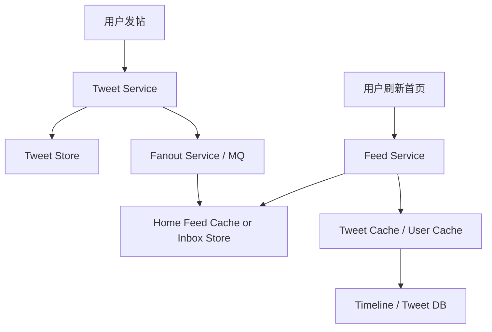
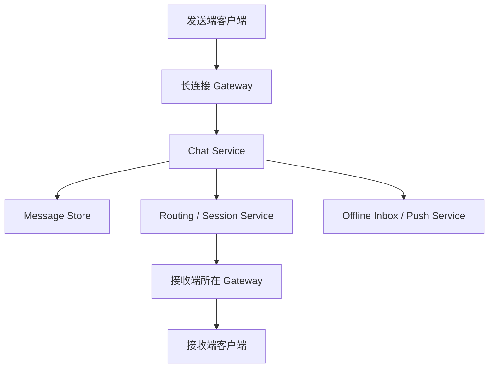

# 系统设计 - 第 7 课：社交类题型：Feed、Timeline、聊天

## 学习目标（本节结束后你能做到什么）

1. 理解 `Feed`、`Timeline`、`聊天系统` 这三类高频题为什么经常一起出现，以及它们分别考什么。
2. 能区分读多写少、写扩散、在线连接、消息顺序、多端同步这些核心矛盾，不会把三类题答成同一套模板。
3. 能用前面学过的缓存、存储、消息队列、分片、限流、一致性知识，搭出一套更像真实工程的社交系统方案。
4. 能在面试里围绕 `Twitter/News Feed` 和 `聊天系统` 两个经典题型，主动展开关键 trade-off，而不是只停在大图。

## 内容讲解（核心概念，用类比、例子、图示说清楚）

到了系统设计面试的中段，外企大厂非常喜欢开始问“场景题”。这类题的特点是：单个组件本身并不新鲜，但它们会以一种更贴近真实产品的方式组合出现。社交类题型就是最典型的一组，常见问法包括：

- 设计一个 Twitter 或 News Feed
- 设计用户 Timeline
- 设计私聊系统或群聊系统
- 设计在线状态或未读消息系统

很多候选人听起来像是遇到了很多不同题目，其实这几道题背后考的是几个固定矛盾：

1. 读路径重还是写路径重
2. 是否存在写扩散
3. 是否需要大量在线连接
4. 是否要求强实时
5. 是否要求顺序、多端同步、未读状态
6. 是否允许最终一致

你如果能把这些矛盾先识别出来，后面的设计会稳很多。相反，如果你只会说“前面一个网关，后面 Redis、MySQL、Kafka”，面试官很难判断你是否真的理解了系统行为。

先把三个概念拆开。

### 一、Feed、Timeline、聊天分别在考什么

`Feed` 更像“给你推荐或聚合的一页内容流”。  
例如 Twitter 首页、朋友圈首页、Instagram 首页。核心问题通常是：用户打开首页时，到底怎么快速拿到一串内容；内容是实时拼接，还是提前推送到用户收件箱；读多写少还是写带来大规模 fanout。

`Timeline` 更像“某个用户自己发过什么，或者某个对象自己的内容历史”。  
例如用户主页上的发帖历史。它通常比首页 Feed 更简单，因为查询维度往往固定为 `user_id`，而不是“我关注了很多人，现在把他们最近发的内容混在一起展示给我”。Timeline 更多考察存储设计、索引设计、分页和缓存，而不是复杂 fanout。

`聊天系统` 则是另一类问题。它的重点通常不是“怎么聚合内容”，而是：

- 怎么维护长连接
- 怎么把消息路由到正确的接收方
- 怎么保证同一个会话内消息顺序
- 离线消息怎么存
- 多端同步怎么做
- 已读未读怎么跟踪

所以，这三类题虽然都和“社交产品”有关，但主矛盾完全不同。一个最容易被面试官追问的地方，就是你有没有把这三者混为一谈。

### 二、先看 Twitter / News Feed：真正难的是首页，不是发帖

我们先看最经典的题：设计一个 Twitter。

很多候选人一上来就把注意力放在“发 tweet”。但真实系统里，发一条 tweet 往往不是最难的，难的是几十万甚至更高 QPS 的首页读取。也就是说，Twitter 这类题的主矛盾通常是：`写入相对少，但读取极其频繁，而且个性化很强。`

一个简化版组件图可以这样理解：

这里第一个核心问题是：`首页 Feed 到底是读时计算，还是写时预计算？`

这就是外企大厂非常喜欢问的 `fanout on write` 和 `fanout on read`。

#### 方案 1：Fanout on write

当某个用户发一条新 tweet 时，系统把它主动推送到关注者的收件箱或首页缓存里。这样用户刷新首页时，读取非常快，因为结果已经基本准备好了。

优点：

- 读延迟低
- 首页生成快
- 高读流量场景更友好

缺点：

- 发一条内容时可能要写很多份
- 大 V 发帖时写扩散极其严重
- 如果一个明星有 5000 万粉丝，你不可能同步推送到 5000 万个收件箱

#### 方案 2：Fanout on read

发帖时只把 tweet 写进自己的内容存储。用户打开首页时，再从自己关注的作者集合里实时拉取最近内容并合并排序。

优点：

- 写入轻
- 大 V 发帖不会引发巨大写扩散

缺点：

- 首页读取计算成本高
- 关注关系多时，读放大明显
- 首页延迟更难压低

所以，真实工程里很少纯用一种极端方案。更常见的做法是：

- 普通用户采用 `fanout on write`
- 大 V 或超大热点账号采用 `fanout on read`
- 首页结果和 tweet 详情再叠加多层缓存

这就是社交题里最典型的 trade-off。你要讲清楚的不是“我知道这两个词”，而是“为什么会混用”。原因很简单：系统不可能同时对“小号发帖”和“超级大号发帖”用完全相同的策略。

### 三、Timeline 比首页简单，但很适合讲存储和分页

Timeline 这个词在不同公司语境里有时会有差异，但面试里通常你可以把它理解成“某个用户自己的内容时间线”。比如：

- 查看某个用户过去发过的 tweet
- 查看某个作者发过的帖子列表

这个场景的好处是查询维度更清晰。你通常是：

- 按 `user_id` 查内容
- 按时间倒序分页

这类系统的典型设计思路是：

1. 发帖先写内容主表
2. 建立按 `user_id + created_at` 或 `user_id + tweet_id` 的索引
3. Timeline 读取时先查缓存中的 tweet ID 列表，未命中再查 DB
4. 再批量回源拿 tweet 详情、用户资料、媒体信息

也就是说，Timeline 本身更像是一个按作者维度组织的“顺序读”问题。它的难点比首页 Feed 小一些，但很适合你在面试里展示：

- 为什么要用游标分页，而不是 offset 分页
- 为什么按时间排序时要考虑去重和稳定顺序
- 为什么 tweet 详情和用户 profile 要拆开缓存

这里顺手讲一下分页。外企大厂面试里如果问社交流，很多时候会期待你主动说出：`时间线类列表更适合 cursor-based pagination，而不是 page=1000 这种 offset 分页。`

因为 offset 分页在数据不断插入时会有两个问题：

- 越往后翻性能越差
- 新数据插入后容易出现重复或漏读

所以更稳的做法是带着 `last_seen_id` 或 `last_seen_timestamp` 往后翻。

### 四、聊天系统：重点不是 Feed，而是连接、路由、顺序、多端同步

聊天系统是另一种完全不同的题型。这里最核心的矛盾通常是：

- 大量在线连接
- 消息低延迟送达
- 同一会话内顺序
- 离线消息补发
- 多设备同步

一个简化版链路可以这么看：

聊天系统为什么不能简单套 Twitter 那套思路？因为 Twitter 首页主要是读优化问题，而聊天系统首先是一个“实时分发问题”。消息要尽快送到正确连接上，而不是先想着怎么做复杂聚合。

聊天系统里几个关键点非常高频：

#### 1. 长连接网关

如果有几百万在线用户，每个人都保持 WebSocket 或长连接，最前面承压最大的是连接层，而不是数据库。这里你通常会有一层专门的 gateway 集群负责维护连接。

#### 2. 路由

消息来了以后，你要知道接收方现在连在哪台 gateway 上。于是通常需要一个会话路由或在线状态服务，维护 `user_id -> gateway_id` 的映射。

#### 3. 持久化

消息不能只靠内存转发。即便要实时送达，通常也要先可靠落库，再回 ACK，或者至少在可靠消息流水中记录，避免服务重启后消息丢失。

#### 4. 顺序

全局顺序一般没有必要，代价也很高。更常见的要求是：`单个 conversation 内局部有序`。这意味着你可能会按 `conversation_id` 路由到同一分区、同一队列，或让服务端对单会话消息做有序处理。

#### 5. 多端同步

同一个用户可能同时登录手机、平板、Web。消息不仅要送给接收者，还可能要同步回发送者的其他设备，还要处理不同设备的 ACK 和已读状态。

你在面试里如果能自然讲到这五点，聊天题就已经比大多数回答更扎实了。

### 五、聊天系统里的存储和未读怎么设计

聊天系统里另一个非常爱追问的点，是消息存储和未读状态。

常见思路是：

1. 消息主存储按 `conversation_id + sequence` 或 `conversation_id + created_at` 组织
2. 每个会话分配单调递增的消息序号，方便分页拉取和未读计算
3. 未读状态不一定给每条消息都打已读标记，而是记录“这个用户在该会话里最后读到的 sequence”

为什么这种设计更常见？因为如果你给每条消息、每个用户都存一条已读记录，群聊场景会迅速爆炸。反过来，如果只记录：

- `conversation_id`
- `user_id`
- `last_read_seq`

那么未读数就可以通过“最新 sequence - last_read_seq”推导出来，成本会低很多。

这就是一个很典型的系统设计 trade-off：你放弃了对每条消息逐条已读关系的最细粒度建模，换取更低的写放大和更现实的存储成本。

### 六、Feed 和聊天为什么都爱用缓存，但缓存对象完全不同

很多人学到这里会觉得：“这不都还是 Redis、数据库、MQ 吗？”是的，组件会重复出现，但缓存对象和服务目标完全不同。

在 Feed 里，缓存的典型对象是：

- 首页 feed 的候选 tweet ID 列表
- tweet 详情
- 用户 profile
- 热门计数

目的是：降低首页读延迟和后端拼装成本。

在聊天系统里，缓存更常见的对象是：

- 在线路由信息 `user_id -> gateway`
- 最近会话列表
- 未读数
- 热消息或短期消息窗口

目的是：降低连接路由成本、加速会话列表读取、减少热点读。

你在面试里如果只是说“这里可以加 Redis”，面试官会继续问“缓存什么”。你必须落到对象层面，回答才算完整。

### 七、真实面试里可以怎么讲 Twitter

如果面试官让你设计 Twitter，你可以按这个节奏：

1. 先澄清范围  
   只做发帖、关注、首页 Feed、用户 Timeline，先不做搜索、推荐广告、复杂排序。

2. 估算规模  
   例如日活、发帖 QPS、首页读取 QPS、图片和媒体资源大小。

3. 切分对象  
   tweet 内容、关注关系、首页 feed 收件箱、用户 timeline。

4. 讲核心 trade-off  
   首页 feed 采用混合 fanout。普通用户写扩散，大 V 读时合并。

5. 再讲缓存  
   缓存首页候选列表、tweet 详情、用户信息。

6. 最后讲扩展和风险  
   热点用户、大 V 发帖、首页缓存失效、读扩散、排序延迟。

这套讲法很像真实工程，也很符合外企大厂的预期，因为它围绕“首页为什么难”展开，而不是堆组件。

### 八、真实面试里可以怎么讲聊天系统

如果面试官让你设计聊天系统，一个比较稳的节奏是：

1. 先澄清范围  
   单聊还是群聊，是否需要离线消息、已读回执、多端同步、消息搜索。

2. 先估算在线连接  
   在线用户数、长连接数量、消息发送峰值。

3. 讲连接层  
   用 gateway 集群维护长连接。

4. 讲消息主链路  
   发送消息 -> 服务端校验 -> 持久化 -> 路由到接收端连接 -> ACK。

5. 讲会话内顺序和离线消息  
   会话序号、离线收件箱、补拉历史。

6. 讲多端同步和未读  
   用 `last_read_seq` 维护未读状态。

7. 最后讲故障和扩展  
   gateway 挂掉怎么办，路由状态如何恢复，消息重复投递如何幂等。

这比“前面用 WebSocket，后面 Redis，再后面 MySQL”要强很多，因为它真正回答了系统的行为。

### 九、这一课真正想让你建立的能力

这一课最重要的，不是把 Twitter 和聊天的所有细节都背下来，而是看见题目时先问自己：

- 这是读问题还是写问题？
- 是读扩散更严重，还是写扩散更严重？
- 是否需要在线连接？
- 是否需要实时送达？
- 是否要求局部有序？
- 缓存的对象到底是什么？
- 一致性要到什么程度？

一旦这几个问题能自动弹出来，你面对社交题型就不会慌。因为你会知道，自己不是在“从零开始设计一个巨系统”，而是在识别这个场景的主矛盾，然后把前面学过的组件和模式套到正确的位置上。

## 小结（3-5 条关键点）

1. Feed、Timeline、聊天虽然都属于社交题型，但主矛盾不同：Feed 主要是首页聚合与读优化，Timeline 更偏顺序读取与分页，聊天更偏连接、路由、顺序和多端同步。
2. Twitter / News Feed 的核心 trade-off 是 `fanout on write` 与 `fanout on read`，真实系统往往采用混合策略。
3. Timeline 类列表通常更适合基于游标的分页，而不是 offset 分页。
4. 聊天系统的重点通常在长连接网关、用户路由、会话内局部有序、离线消息和未读状态设计。
5. 同样是缓存，在 Feed 和聊天里的缓存对象不同；面试里不能只说“加 Redis”，必须说清缓存什么、为什么缓存。

---

## 检查站：请回答以下问题

1. 为什么说 Twitter 首页 Feed 和用户 Timeline 不是一回事？它们的核心难点分别是什么？
2. 如果一个普通用户和一个超级大 V 都发了一条新 tweet，为什么系统可能不会对这两种情况使用完全相同的 fanout 策略？
3. 聊天系统为什么通常更关心在线连接、消息路由和会话内顺序，而不是像 Feed 那样先讨论内容聚合？
4. 如果面试官让你设计聊天系统的未读数，你为什么不太可能选择“给每条消息、每个用户都单独存一条已读记录”？

请把你的答案直接告诉我，我会根据你的回答决定下一步。
