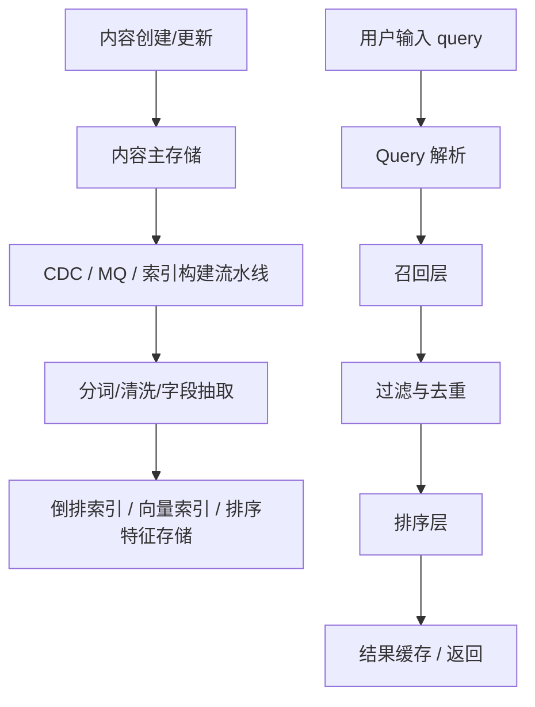
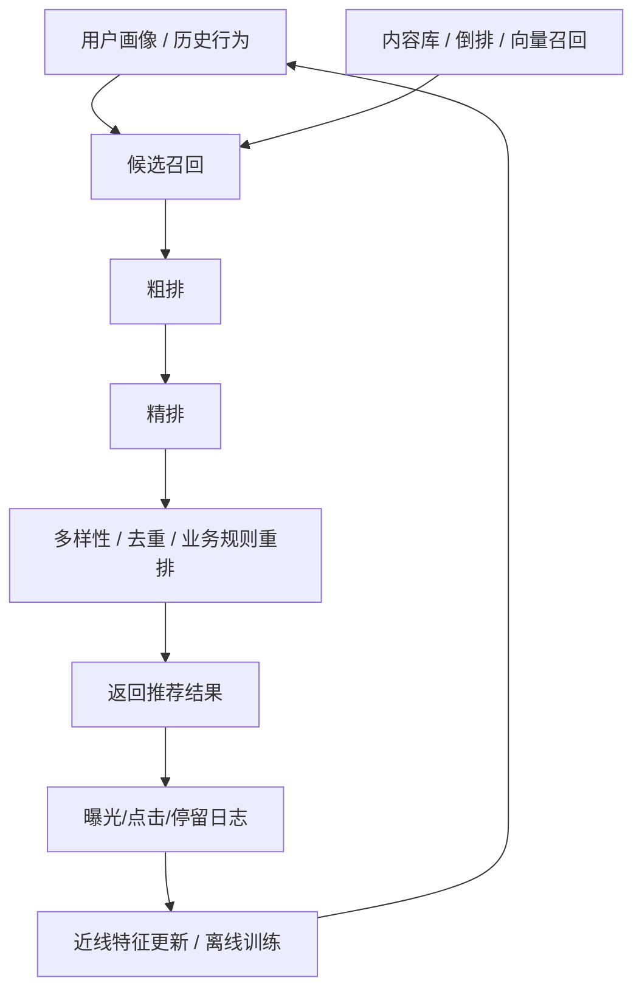

# 系统设计 - 第 8 课：搜索、推荐与自动补全

## 学习目标（本节结束后你能做到什么）

1. 理解搜索、推荐、自动补全虽然都属于“内容发现系统”，但输入信号、排序目标和系统结构并不相同。
2. 能讲清搜索系统里的索引构建、召回、排序、过滤、新鲜度和查询延迟之间的 trade-off。
3. 能解释推荐系统的候选召回、特征计算、排序服务、反馈回流和在线/离线协同。
4. 能用一个电商或内容平台案例，把搜索、推荐、自动补全三条链路整合成一套更像真实产品的发现架构。

## 内容讲解（核心概念，用类比、例子、图示说清楚）

很多系统设计候选人一听到“设计搜索”就直接想到 Elasticsearch，一听到“设计推荐”就想到向量召回或机器学习排序，一听到“设计自动补全”就想到 Trie。这样记组件并不完全错，但它容易掩盖一个更重要的问题：这三类系统虽然都在帮助用户“找到内容”，可它们回答的是三种完全不同的问题。

- 搜索在回答：`用户已经有明确意图，我如何快速、准确地找出来？`
- 推荐在回答：`用户没有明确输入，我如何猜测什么值得看？`
- 自动补全在回答：`用户输入还没完成，我如何提前帮他缩短决策路径？`

如果你把这三者混成一个“检索系统”，后面的架构就会越来越乱。成熟一点的理解是：它们共享部分基础设施，比如内容元数据、特征、索引、缓存、日志回流，但在线服务目标并不一样。

### 一、先把三种系统的目标拆开

#### 1. 搜索

搜索的输入是显式 query。  
用户说了“iPhone 15 手机壳”，系统就要围绕这个意图做：

- query 解析
- 倒排召回
- 过滤
- 排序
- 分页返回

搜索更强调相关性和可解释性。用户一般能接受少量个性化，但不能接受“你明明搜了 A，我给你一堆完全不相关的 B”。

#### 2. 推荐

推荐很多时候没有显式 query，更多依赖：

- 用户画像
- 历史行为
- 实时上下文
- 内容特征
- 热度与新鲜度

推荐的重点不是严格匹配，而是点击率、转化率、停留时长、满意度、多样性这些目标的平衡。

#### 3. 自动补全

自动补全是一个非常容易被低估的小系统。它看起来只是“用户敲字时给几个建议”，但实际上直接影响：

- 用户是否更快表达意图
- 搜索流量是否被引导到高质量 query
- 热门词和个性化意图能否被提前命中

它的延迟要求通常比搜索还严，因为它发生在键盘输入过程中，用户对卡顿极其敏感。

### 二、搜索系统到底在做什么

搜索系统并不是“一个大索引 + 一个查询接口”这么简单。更像真实工程的拆法，通常是两条链路：

1. 写链路：内容如何进入索引
2. 读链路：用户 query 如何命中结果

#### 1. 索引构建

写链路里真正重要的不是“把数据塞进 ES”，而是：

- 哪些字段需要索引
- 分词规则是什么
- 是否支持同义词、拼写纠错、权重字段
- 数据更新多久能在搜索里可见

例如电商商品：

- 标题、品牌、类目、属性通常要索引
- 库存、价格、上下架状态需要过滤
- 销量、评分、点击率可能用于排序特征

这里会立刻出现一个典型 trade-off：`索引新鲜度 vs 系统复杂度。`

如果要求商品改价后 1 秒内搜索结果就更新，写链路就得更实时，成本更高；如果允许分钟级延迟，索引构建就可以更批量、更稳。

#### 2. Query 解析

用户输入不是数据库语句，所以搜索系统要先理解 query。  
例如“耐克 黑色 跑鞋 42”里，可能包含：

- 品牌：耐克
- 颜色：黑色
- 品类：跑鞋
- 尺码：42

如果你在面试里能主动提到“query 解析和结构化过滤”，会非常加分，因为这说明你知道搜索不是纯文本匹配，还涉及意图理解和字段路由。

#### 3. 召回、过滤、排序

这三个动作经常被说混。

- 召回：先把可能相关的一小批结果找出来
- 过滤：剔除下架、无库存、权限不符合、重复内容
- 排序：把最值得展示的结果排在前面

为什么要分层？因为全量数据太大，不可能对所有文档做复杂排序。所以搜索和推荐一样，本质上都在做“先粗后细”的计算。

### 三、推荐系统的关键不是“模型多高级”，而是链路是否闭环

推荐题最常见的误区，是一上来就说“我会用深度学习模型排序”。在系统设计面试里，这通常不是重点。更重要的是：数据怎么来、候选怎么召回、特征怎么计算、排序怎么服务、反馈怎么回流。

一个更成熟的推荐架构通常包含：

1. 候选召回层
2. 特征服务
3. 排序服务
4. 结果重排
5. 日志回流和模型更新

#### 1. 候选召回

推荐系统不可能从全库直接精排，所以通常先从多个来源取候选：

- 协同过滤候选
- 相似内容候选
- 热门内容候选
- 关注关系候选
- 向量相似候选

这一步更强调“广覆盖”和“低成本”，不像最终排序那样追求最精准。

#### 2. 特征服务

排序模型通常需要很多特征：

- 用户特征
- 内容特征
- 用户与内容交叉特征
- 实时上下文特征

系统设计里要讲的不是某个模型名字，而是这些特征来自哪里、是否足够实时、如何避免每次请求都去扫一堆下游系统。

所以很多推荐系统会有专门的 Feature Store 或在线特征缓存。这和数据库/搜索系统结合非常紧密。

#### 3. 重排与业务规则

推荐不是只看点击率。有时还要考虑：

- 新鲜度
- 多样性
- 去重
- 探索与利用
- 商业规则

所以推荐链路里经常会有一个“最终重排”步骤。这一点在面试里很值得主动说，因为它体现你知道线上推荐不是纯模型问题，而是产品目标和算法目标的平衡。

### 四、自动补全为什么看似小，实则要求很苛刻

自动补全通常出现在用户输入的每一个字符之后，所以它的典型特征是：

- 延迟要求极低
- query 分布高度热点化
- 结果数量很少，但质量要求高

它的候选来源通常包括：

- 热门 query
- 历史搜索词
- 类目/品牌/商品词典
- 个性化历史

技术实现不一定只有 Trie。工程上也可能是：

- 前缀词典 + 热度分数
- 搜索引擎的 search-as-you-type
- N-gram 索引
- Redis zset 或内存结构缓存热点补全

如果你在面试里只说“自动补全用 Trie”，有时会显得太算法化、太轻系统。更好的说法是：

- 热点前缀结果预计算并缓存
- 长尾 query 走在线补全服务
- 结果里融合热门词和个性化历史
- 对敏感词、垃圾词、作弊词做过滤

这就更像真实产品系统。

### 五、一个整合案例：设计电商平台的搜索、推荐与搜索建议

下面我们用电商场景把三条链路串起来。假设你在设计一个大型电商 App 的“发现系统”，用户会：

- 在首页看到推荐商品
- 在搜索框输入关键词
- 输入过程中看到自动补全建议
- 进入搜索结果页再筛选、排序

#### 1. 写链路怎么走

商品主数据先进入商品中心：

- 标题
- 类目
- 品牌
- 价格
- 库存
- 属性
- 商家状态

然后通过 CDC 或 MQ 分发到多个下游：

- 搜索索引构建
- 推荐特征更新
- 自动补全词典更新
- 报表和分析系统

这里很重要的一点是：`搜索索引、推荐特征、补全词典通常都不是主真相源，而是由商品主数据派生出来的加速结构。`

#### 2. 搜索链路怎么走

用户输入 `苹果 手机 256g` 后：

1. Query 解析服务识别品牌、品类、容量属性。
2. 检索服务从倒排索引召回候选文档。
3. 过滤掉无库存、下架、无权限商品。
4. 结合销量、转化率、文本相关性、价格等特征排序。
5. 返回分页结果。

这个链路里最容易被追问的是：

- 改价或下架后多久生效
- 搜索结果缓存怎么做
- 排序特征是离线的还是实时的

一个成熟回答通常会承认：  
价格、库存、上下架状态这类强新鲜度字段，可能要通过轻量实时过滤或实时字段更新来保证；而销量、CTR 这类排序特征允许秒级到分钟级延迟。

#### 3. 推荐链路怎么走

用户打开首页时，推荐系统可能会：

1. 根据用户历史行为和实时上下文做多路候选召回。
2. 取几百到几千个候选做粗排。
3. 对前几百个候选做精排。
4. 在最终结果里做去重、多样性控制和商业规则重排。

这里的关键 trade-off 是：

- 特征越实时，效果可能越好，但链路越重
- 候选越多，潜在效果越好，但排序越慢
- 排序越复杂，延迟越高

所以推荐系统本质上是一台“效果、成本、延迟”的三角平衡器。

#### 4. 自动补全链路怎么走

用户每输入一个字符，前端就请求一次补全服务。  
补全服务通常会优先：

- 查热点前缀缓存
- 融合用户最近历史
- 过滤敏感词和低质量 query
- 返回 5 到 10 个建议词

这个链路的重点通常不是复杂模型，而是：

- 足够快
- 足够稳定
- 候选干净

### 六、三个系统共享什么，不共享什么

共享的通常有：

- 内容主数据
- 行为日志
- 用户画像
- 特征计算基础设施
- 缓存和监控体系

不共享的通常有：

- 在线排序目标
- 延迟预算
- 新鲜度要求
- 排序解释方式

例如搜索结果通常更强调 query 相关性和可解释过滤；推荐结果更强调个性化与效果指标；自动补全更强调极低延迟和输入友好。

### 七、面试里最容易被追问的深水区

#### 1. 搜索结果为什么不总是强实时

因为索引更新、分片刷新、排序特征同步都需要时间。  
如果你追求秒级甚至毫秒级可见性，写链路成本会显著上升。成熟回答不是“绝对实时”，而是把字段按新鲜度要求拆开。

#### 2. 推荐系统为什么不能只靠离线模型

因为用户兴趣会变，内容热度会变，上下文会变。  
完全离线的推荐很快会显得“迟钝”。所以推荐通常是离线画像 + 近线特征 + 在线重排的组合。

#### 3. 自动补全为什么需要治理

因为补全会直接引导流量。如果热门词被刷、垃圾词进入候选、敏感词未过滤，产品体验会立刻恶化。所以补全不仅是检索问题，也是治理问题。

### 八、一个很稳的回答模板

如果面试官问你“设计搜索/推荐系统”，你可以这样组织：

1. 先明确是搜索、推荐还是自动补全，不同问题目标不同。
2. 再把系统拆成写链路和读链路。
3. 写链路讲数据如何进入索引/特征/词典。
4. 读链路讲召回、过滤、排序、缓存、返回。
5. 最后讲关键 trade-off：新鲜度、延迟、效果、成本、治理。

这样一来，你的回答就不再是“堆一个 ES 或一个模型服务”，而是完整的发现系统设计。

## 小结（3-5 条关键点）

1. 搜索、推荐、自动补全都属于发现系统，但目标不同：搜索偏显式意图匹配，推荐偏兴趣猜测，自动补全偏输入加速。
2. 搜索系统的关键是索引构建、query 解析、召回、过滤、排序以及新鲜度控制。
3. 推荐系统的关键是候选召回、特征服务、分层排序、重排和反馈闭环，而不只是“选一个模型”。
4. 自动补全虽然看起来小，但因为发生在输入过程中，所以延迟要求极高，且非常依赖热点缓存和质量治理。
5. 在真实产品里，这三类系统常常共享数据和基础设施，但不会共享完全一样的在线目标和排序逻辑。

---

## 检查站：请回答以下问题

1. 为什么说搜索、推荐、自动补全虽然都在“帮用户找内容”，但本质上是三种不同系统？
2. 如果设计电商搜索，你觉得哪些字段必须尽量快地更新进索引，哪些字段允许稍慢一点？为什么？
3. 推荐系统为什么通常要做“召回 -> 粗排 -> 精排 -> 重排”这种分层结构，而不是一上来对全库精排？
4. 自动补全为什么不能只回答“用 Trie 实现就行”？站在系统设计角度，你还会补哪些考虑？

请把你的答案直接告诉我，我会根据你的回答决定下一步。
