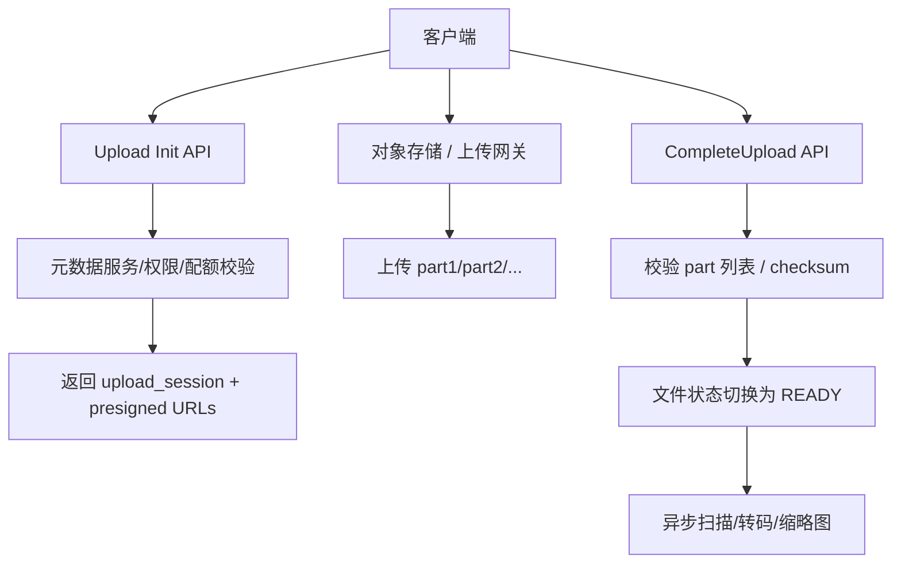

# 系统设计 - 第 9 课：文件存储、对象存储与大文件传输

## 学习目标（本节结束后你能做到什么）

1. 理解文件系统、对象存储、元数据服务为什么要分开设计，而不是把“上传文件”理解成一个简单接口。
2. 能讲清大文件上传、分块、断点续传、秒传、下载加速、权限控制、删除回收这些核心问题。
3. 能区分“元数据真相源”和“文件内容真相源”，并解释为什么它们的一致性语义不同。
4. 能结合网盘、图片服务、视频平台等案例，说出一套更像真实工程的文件系统设计。

## 内容讲解（核心概念，用类比、例子、图示说清楚）

文件存储题看起来不像订单、库存、聊天那样“刺激”，但它在系统设计面试里非常好用，因为它会同时考你：

- 元数据与内容分离
- 大对象传输
- 带宽与成本
- 权限与分享
- CDN 与缓存
- 多阶段异步处理
- 一致性和垃圾回收

很多人一听到“设计网盘”或“设计图片上传系统”，第一反应是：

- 文件放对象存储
- 元数据放数据库
- 前面加 CDN

这些方向都没错，但如果面试官继续问：

- 用户上传 20GB 大文件时，为什么不能直接经过你的 API 服务中转？
- 分块上传完成前，元数据应该怎么表示？
- 用户断网后如何断点续传？
- 秒传为什么不能只靠一个 MD5？
- 删除一个文件时，什么时候删元数据，什么时候删物理内容？
- 分享链接和内部权限为什么不能共用同一种校验逻辑？

如果这些问题讲不出来，说明你真正缺的不是“知道对象存储”，而是“没有把文件系统看成两套真相源 + 一条上传状态机”。

### 一、先把“文件系统”拆成三个子问题

文件系统题最容易被答乱的原因，是大家把“一个文件”当成一个对象。  
但在真实系统里，至少要区分三件事：

1. 逻辑文件  
   用户眼中的“文件”，包括文件名、目录、拥有者、分享关系、标签、是否删除。

2. 物理内容  
   真正的字节流，可能是一整个对象，也可能是一组分块。

3. 传输会话  
   这次上传或下载的过程状态，例如 upload session、已完成的 part、校验结果、过期时间。

这三个对象不是一回事。

- 逻辑文件更像元数据系统问题
- 物理内容更像存储系统问题
- 传输会话更像状态机和网络协议问题

一旦你这么拆，后面的设计会清楚很多。

### 二、为什么元数据和内容通常要分开

你可以把文件系统理解成“目录服务 + 内容服务”的组合。

#### 1. 元数据更适合放数据库

元数据通常包括：

- 文件 ID
- 用户 ID / 组织 ID
- 文件名
- 目录关系
- MIME 类型
- 大小
- 状态
- 访问控制
- 分享信息
- 版本信息

这些数据最常见的操作是：

- 按目录列文件
- 按用户列文件
- 查权限
- 改名字
- 移动目录
- 标记删除

它们非常像普通业务数据，适合关系型数据库或元数据服务。

#### 2. 内容更适合放对象存储

真正的文件内容往往很大、写后少改、读多写少、并且需要便宜可靠地存很多份。  
这正是对象存储最擅长的场景。

对象存储的典型特点是：

- 用对象 ID 寻址
- 适合大对象和海量对象
- 适合写一次、多次读
- 不强调 POSIX 式随机修改

所以很多文件系统设计题里，最重要的一句话不是“我用 S3/Ceph”，而是：

`元数据和内容数据访问模式完全不同，所以我会把它们拆成两套系统。`

### 三、对象存储、文件系统、块存储，系统设计里怎么讲

很多人知道这些词，但不一定知道它们在面试里该怎么说。

#### 1. 块存储

更像给虚拟机或数据库挂一块“原始硬盘”。  
特点是：

- 延迟低
- 随机读写强
- 由上层文件系统解释

一般不会直接让前端应用拿块存储当网盘内容层。

#### 2. 文件系统

更强调目录结构、文件名、权限、POSIX 语义。  
如果面试题是“企业共享盘”或“NAS 类系统”，你可能会更关注文件语义。

#### 3. 对象存储

更像“通过 key 访问字节对象 + 元数据标签”。  
它通常不擅长原地随机修改，但非常适合：

- 图片
- 音视频
- 归档文档
- 下载包
- 大文件上传下载

系统设计面试里，绝大多数互联网文件题最终都会落到“对象存储 + 元数据数据库 + 传输网关”这个组合上。

### 四、上传链路：不要让大文件穿过你的核心 API 服务

这是文件系统题最容易体现工程感的地方。

很多新手设计会画成：

- 客户端 -> API 服务 -> API 服务写文件到对象存储

这个设计对小文件 demo 也许能跑，但在大文件场景里问题很大：

- API 服务被带宽打满
- CPU 被 TLS 和拷贝消耗
- 内存和连接占用高
- 重试成本高
- 扩容很贵

更成熟的做法通常是：

1. 客户端先向元数据/API 服务发起“创建上传会话”
2. 服务端做权限、配额、目录合法性校验
3. 服务端返回 upload session、part 列表或 presigned URL
4. 客户端直接把分块上传到对象存储或专用上传网关
5. 上传完成后客户端调用 `CompleteUpload`
6. 服务端校验分块齐全、校验和正确，再把逻辑文件状态切到 `READY`

这条链路特别关键，因为它体现了一个成熟认识：

`核心 API 服务应该控制“上传是否合法”，而不是亲自搬运所有字节。`

### 五、为什么要分块上传

大文件题里，分块几乎是必答项，但你要说清楚“为什么”。

#### 1. 断点续传

如果 20GB 文件上传到 95% 时断网，不可能让用户从头再来。  
分块后，只需要重传失败的 part。

#### 2. 并行上传

多个分块可以并发上传，能更充分利用带宽，也更容易限速和调度。

#### 3. 错误隔离

某个 part 校验失败，不必否定整个文件。

#### 4. 更适合对象存储

很多对象存储本身就提供 multipart upload 语义，大文件分块后更容易处理。

### 六、上传状态机：文件不是“有”或“没有”那么简单

这是很多回答会漏掉的一层。

对于文件元数据来说，通常至少会有这些状态：

- `INIT`
- `UPLOADING`
- `PENDING_COMMIT`
- `READY`
- `SCAN_FAILED`
- `DELETED`

为什么这很重要？

因为如果你在文件还没上传完的时候就把逻辑文件暴露给用户，可能会出现：

- 文件列表里看得到，但下载不了
- 图片元数据有了，但内容还没同步完
- 分享链接已发出，但对象并不存在

所以更像真实工程的做法是：

- 在 `READY` 之前，只允许上传方自己看到“处理中”
- 对外下载、分享、预览都要求对象处于可用状态

### 七、下载链路：真正消耗钱的是带宽，不是数据库

很多文件系统题，上传只是一部分，真正的长期成本在下载和分发。

一个成熟下载链路通常会考虑：

1. 元数据服务校验权限
2. 返回短期有效的 signed URL
3. 客户端直接从 CDN 或对象存储下载
4. 大文件支持 range request
5. 热点资源提前放 CDN

这里有几个很重要的追问点。

#### 1. 为什么要 signed URL

因为对象存储不应该直接裸暴露。  
你需要：

- 控制访问有效期
- 控制访问路径
- 避免源站账户泄露

#### 2. 为什么要支持 Range

因为大文件下载、视频拖动、断点续传都需要按字节范围读取。  
没有 Range，大文件体验会很差。

#### 3. CDN 的作用

CDN 在文件题里往往不是“优化项”，而是带宽与体验基线。  
特别是：

- 图片站
- 下载站
- 音视频播放
- 全球分发

### 八、秒传/去重：逻辑文件和物理内容为什么不能绑死

秒传是文件题非常喜欢问的点，因为它天然会引出“逻辑文件”和“物理文件”的分离。

你可以把它理解成：

- 用户 A 上传了一个物理内容
- 用户 B 上传一个完全相同的内容
- 系统不希望物理上存两份

于是更合理的建模是：

- `logical_file`：用户看到的文件
- `physical_object`：真实物理内容

两者是多对一关系。

这样你就可以支持：

- 秒传
- 多用户共享同一物理对象
- 引用计数删除

#### 1. 秒传为什么不能只看一个 MD5

因为哈希碰撞、恶意利用和误判都是真实风险。  
更成熟的工程做法通常是组合判断：

- size
- 强 hash（如 SHA-256）
- 分块 hash
- 必要时抽样字节校验

你在面试里如果只说“比一下 MD5 就秒传”，会显得偏轻。

#### 2. 删除为什么不能直接删对象

如果多个 logical file 指向同一个 physical object，  
某个用户删了逻辑文件，不代表物理内容就能删。

更成熟的方式是：

- 先删 logical_file 或做 tombstone
- physical_object 引用计数减一
- 只有引用归零且超过保留期，才真正 GC

### 九、权限、分享和签名下载，为什么要分开讲

文件题的权限设计非常容易被忽略，但面试官很喜欢追问。

至少要区分三种访问：

1. 文件所有者自己访问
2. 组织/团队内授权访问
3. 通过分享链接访问

这三者的校验逻辑通常不同。

#### 1. 内部权限

更像 ACL / 角色权限问题。  
例如：

- owner
- editor
- viewer

#### 2. 外部分享

更像“带时效和能力边界的临时凭证”。  
常见限制包括：

- 过期时间
- 密码
- 下载次数
- 只读不下载

#### 3. 临时下载授权

即使用户有访问权限，也常常不会直接暴露永久地址，而是签一个短期可用 URL。  
这点在对象存储设计里非常常见。

### 十、安全与治理：文件系统不是只有传输，没有内容风险

很多真实文件系统都要考虑：

- 恶意脚本
- 病毒/木马
- 色情/违规图片
- 泄密文件

因此上传完成后常见会有异步治理链路：

- 杀毒扫描
- 内容审核
- 缩略图提取
- 转码
- OCR / 索引抽取

这时文件状态机就更重要了。  
比如某些企业系统会在 `READY` 和 `PUBLISHED` 之间再加一层：

- `READY`：内容物理可读
- `APPROVED`：审核通过后才能对外

### 十一、冷热分层和成本控制：文件系统很多时候是成本题

文件系统和交易系统的一个大不同，是它很容易变成成本主导型系统。

主要成本包括：

- 对象存储容量
- CDN 出口带宽
- 跨区域流量
- 小文件元数据放大
- 冗余副本

因此成熟设计通常会考虑：

#### 1. 存储分层

- 热数据：高频下载，放热存储/CDN
- 温数据：普通对象存储
- 冷数据：低频访问归档层

#### 2. 生命周期策略

例如：

- 上传 30 天后转低频存储
- 180 天后归档
- 删除后保留 7 天再清理

#### 3. 小文件问题

海量小文件会导致：

- 元数据膨胀
- 请求放大
- 存储效率差

某些场景下会做：

- 小文件打包
- 缩略图合并
- 图片样式预生成

### 十二、案例一：企业网盘怎么讲

企业网盘是文件系统题最标准的案例。

如果面试官问“设计一个企业网盘”，一个比较稳的节奏可以是：

1. 先澄清范围  
   上传、下载、目录管理、分享、权限、断点续传，先不做协同编辑。

2. 拆对象  
   用户/组织、目录树、logical file、physical object、upload session。

3. 讲上传链路  
   InitUpload -> 分块直传 -> CompleteUpload -> 状态切换。

4. 讲下载链路  
   权限校验 -> signed URL -> CDN/对象存储下载。

5. 讲秒传和删除  
   logical 与 physical 分离，引用计数与 GC。

6. 讲治理  
   杀毒、内容审核、配额、分享链接过期。

这个讲法非常像真实工程，也能自然引出大文件、权限和成本问题。

### 十三、案例二：图片/视频平台和网盘有什么不同

同样是文件存储，图片和视频平台的设计重点会不同。

#### 图片平台更关注

- 小对象很多
- 样式变换
- 缩略图
- 热门图片 CDN 命中

#### 视频平台更关注

- 超大对象
- 转码
- 切片
- Range 读取
- 多码率

所以文件题里一个特别加分的点是：

`同样是对象存储，不同业务的“对象粒度”和“异步处理链路”完全不同。`

### 十四、面试里怎么把这一题讲得有层次

如果面试官问“设计文件上传系统/网盘”，一个很稳的回答顺序是：

1. 先拆逻辑文件、物理内容、传输会话三类对象
2. 再说明元数据和对象存储为什么分离
3. 讲上传状态机和分块直传链路
4. 讲下载鉴权、signed URL、CDN 和 Range
5. 补秒传、去重、删除 GC
6. 最后讲安全治理、冷热分层和成本

只要你能按这个顺序讲，文件系统题就不会再变成“把文件存到 S3”这么薄的一句话。

## 小结（3-5 条关键点）

1. 文件存储题的核心不是“用哪个存储”，而是拆清逻辑文件、物理内容和传输会话三类对象。
2. 元数据和内容数据访问模式完全不同，所以成熟系统通常会用数据库管元数据、用对象存储管内容。
3. 大文件上传的主线通常是：初始化上传会话、分块直传、校验并提交、状态切换、异步治理。
4. 秒传、分享、删除回收这些能力都依赖“logical file 与 physical object 分离”的建模。
5. 文件系统很多时候不仅是存储题，还是权限题、带宽题、安全题和成本题。

---

## 检查站：请回答以下问题

1. 为什么文件系统里通常要把“逻辑文件”“物理内容”“上传会话”拆开建模？
2. 设计大文件上传时，为什么更推荐让客户端直传对象存储，而不是经过业务 API 服务中转？
3. 秒传为什么不能只靠一个 MD5？如果多个用户共享同一物理对象，删除时为什么不能直接删内容？
4. 如果面试官问你“企业网盘和视频平台的文件系统设计差异在哪”，你会怎么回答？

请把你的答案直接告诉我，我会根据你的回答决定下一步。
