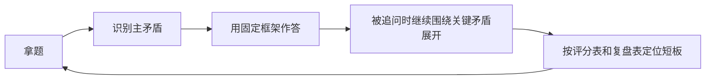

# 系统设计 - 第 12 课：高频真题模拟与复盘

## 学习目标（本节结束后你能做到什么）

1. 把前面 1 到 11 课的知识压缩成一套可在 35 到 45 分钟内稳定输出的系统设计面试节奏。
2. 知道面试官到底在听什么，哪些是隐藏评分点，哪些是高频失分点。
3. 能围绕三类高频真题做模拟答题：文件系统题、高一致性交易题、多区域与全球化题。
4. 能用一套复盘模板定位自己的薄弱点，而不是只感觉“刚才答得不太顺”。

## 内容讲解（核心概念，用类比、例子、图示说清楚）

做到这里，这套系统设计专题其实已经差不多把常见知识点补全了：

- 答题框架
- 容量估算
- 缓存与 CDN
- 数据库与分片
- 消息队列与最终一致性
- 稳定性保护
- 社交题
- 搜索推荐
- 文件系统
- 高一致性交易
- 多区域容灾

但很多人学到这一步，依然会有一个很真实的问题：

`我知道这些点，可一到面试里还是不知道先说什么、后说什么、哪些该深入、哪些该收住。`

这就是为什么系统设计的最后一课，不应该再补一个新组件，而应该进入“模拟与复盘”。

系统设计面试真正拉开差距的地方，往往不是多知道一个技术名词，而是下面三件事：

1. 你能不能在有限时间内先抓住主矛盾
2. 你能不能在互动追问中保持结构
3. 你能不能在答完以后自己知道刚才哪里薄了

所以这一课的核心，不是教你一个新的系统，而是教你如何把前面学到的东西真正转化成可输出的面试能力。

### 一、系统设计面试真正的时间结构是什么

很多候选人答系统设计会出现两个极端：

- 前 10 分钟问太多，迟迟不进入设计
- 一开口就开始讲架构图，后面才发现题目理解偏了

更稳的节奏通常是这样的：

这个时间结构和第 1 课的七步骨架本质一致，但更贴近真实面试节奏。

你可以把它理解成四个阶段：

#### 1. 定义问题

先确定你们在解同一道题。  
这一步的目标不是问很多，而是快速收边界。

#### 2. 建立尺度

通过非功能目标和估算，确定系统到底是：

- 读问题
- 写问题
- 连接问题
- 正确性问题
- 全球分布问题

#### 3. 搭主链路

把核心对象和关键链路讲清楚。  
这里不是讲所有细节，而是让面试官知道：

- 一个请求怎么流过系统
- 真相源在哪
- 哪些边界是同步，哪些是异步

#### 4. 深挖矛盾

真正拉开差距的是这一步。  
你要主动选 1 到 2 个最关键点深挖，而不是每个点都浅尝辄止。

### 二、面试官到底在看什么

如果把系统设计面试的评分视角浓缩一下，通常就是这六条：

1. 需求澄清是否有效
2. 容量估算是否有量级感
3. 主链路是否清晰
4. 对关键 trade-off 是否有判断
5. 对失败路径和异常情况是否有意识
6. 表达是否结构化、能否自然回应追问

这里有一个很重要的认知：

`系统设计面试不只是在看你的答案，更是在看你的思考顺序。`

也就是说，哪怕你的终局架构并不完美，只要你能体现：

- 有边界感
- 有优先级感
- 有 trade-off 感
- 有故障意识

通常都会比“上来就堆完所有组件”的回答得分更高。

### 三、面试官最容易抓哪些地方追问

你可以把常见追问分成六类。

#### 1. 范围追问

- 为什么先不做搜索/推荐/多租户？
- 如果要支持群聊/国际化/大文件怎么办？

这类追问在看你有没有边界感。

#### 2. 规模追问

- 为什么需要分片？
- 为什么一定要多区域？
- 为什么缓存命中率能高？

这类追问在看你有没有量级感。

#### 3. 正确性追问

- 消息重复怎么办？
- 超卖怎么防？
- 支付回调乱序怎么办？

这类追问在看你有没有状态机和幂等意识。

#### 4. 失败追问

- 缓存挂了怎么办？
- 某个区域挂了怎么办？
- MQ 积压怎么办？

这类追问在看你有没有运行态思维。

#### 5. 对象追问

- 你缓存的到底是什么？
- 你分片键为什么这么选？
- 你未读状态存在哪里？

这类追问在看你是不是只会说组件，不会说对象。

#### 6. trade-off 追问

- 为什么这里用单写多读，不做双写多活？
- 为什么这里选条件更新，不选全局锁？
- 为什么这里异步而不是同步？

这类追问在看你是不是知道每个设计决定背后的代价。

### 四、一个实用评分表：模拟时该怎么给自己打分

你可以给每次模拟答题按下面六项打分，每项 0 到 3 分，总分 18 分。

| 维度 | 0 分 | 1 分 | 2 分 | 3 分 |
| --- | --- | --- | --- | --- |
| 需求澄清 | 几乎不澄清 | 澄清很散 | 能收边界 | 澄清少而准，迅速定题 |
| 估算 | 没有估算 | 有数字但不影响设计 | 估算基本合理 | 数字能直接驱动架构选择 |
| 主链路 | 组件堆砌 | 有图无主线 | 主链路基本清楚 | 真相源、同步边界、异步边界都清晰 |
| 深挖 | 没深挖 | 深挖点选错或太浅 | 能讲 1 个关键点 | 能把 1-2 个关键矛盾讲透 |
| 故障意识 | 基本没有 | 只会说“限流熔断” | 能覆盖几类失败路径 | 能把失败处理讲成体系 |
| 表达结构 | 很散 | 有框架但不稳定 | 大体结构化 | 稳定、自然、追问下不乱 |

这个表最大的价值，不是让你追求高分，而是让你知道自己到底差在哪一类能力上。

### 五、先给你一个通用模拟模板

以后你拿到任何一道题，都可以先按下面这个模板起手：

#### 第一步：一句话定义题目

例如：

- 这是一个“读多写少、全球分发”的内容系统题
- 这是一个“正确性优先”的库存与预约题
- 这是一个“带宽和元数据分离”的文件系统题

这一步很重要，它能让你快速抓住主矛盾。

#### 第二步：四个固定动作

1. 澄清范围
2. 明确非功能目标
3. 做一轮估算
4. 定义核心对象与主链路

#### 第三步：只深挖两件事

不要贪。  
大多数题能把 1 到 2 个关键难点讲透，已经比面面俱到但都很浅要强。

#### 第四步：最后一定收束

用一句话总结：

- 核心矛盾是什么
- 你的方案如何解决
- 代价是什么

这样面试官会更容易留下“你有结构”的印象。

### 六、模拟题一：设计企业网盘 / 图片服务

这类题非常适合练：

- 文件元数据与内容分离
- 上传状态机
- 分块与断点续传
- CDN 和下载带宽
- 秒传与引用计数删除

#### 1. 题目

设计一个企业网盘，支持上传、下载、目录管理、分享链接和断点续传。

#### 2. 先澄清什么

- 单文件最大多大
- 是否支持秒传
- 是否需要企业内权限模型
- 分享链接是否允许外部访问
- 是否要做预览和在线编辑

#### 3. 一句话定义主矛盾

这是一个 `元数据与内容分离 + 大文件传输 + 权限控制 + 带宽成本` 的系统设计题。

#### 4. 一个稳的开场版本

我会先把系统拆成三类对象：逻辑文件、物理内容和上传会话。元数据放数据库，对象内容放对象存储。上传链路用分块直传和状态机来支持断点续传，下载链路用权限校验加 signed URL，再结合 CDN 分发。然后我会重点展开秒传/删除 GC 和上传状态一致性这两个难点。

#### 5. 典型深挖点

##### 深挖点 A：分块上传为什么不能经过 API 中转

这里要讲：

- 带宽和连接会把 API 服务打满
- 业务 API 应该管合法性，不应该亲自搬运大字节
- 客户端直传对象存储更符合成本和伸缩性

##### 深挖点 B：秒传和删除为什么依赖 logical/physical 分离

这里要讲：

- 多个逻辑文件可能指向同一物理对象
- 秒传不能只看单一 MD5
- 删除不能直接删物理内容，要靠引用计数和 GC

#### 6. 面试官高频追问

- 文件还没上传完，能不能出现在列表里？
- 分享链接如何失效？
- 如果上传完成但杀毒失败怎么办？
- 小文件特别多怎么办？
- 如果某个 region 没同步完对象内容，下载怎么办？

#### 7. 常见失分点

- 只说“文件放 S3”
- 没讲上传状态机
- 没区分元数据和物理内容
- 没讲删除与 GC
- 没讲权限和 signed URL

#### 8. 模拟后复盘重点

- 你有没有先拆对象，而不是直接讲组件？
- 你有没有解释为什么上传不走业务中转？
- 你有没有讲清 `READY` 状态之前用户能看到什么？

### 七、模拟题二：设计秒杀 / 预约 / 抢票系统

这类题非常适合练：

- 不变量
- 状态机
- 并发控制
- 锁定与超时释放
- 热点资源保护

#### 1. 题目

设计一个秒杀系统，支持大促时的库存预占、下单和超时释放。  
或者：设计一个会议室预约系统，支持时间段冲突控制和支付确认。

#### 2. 先澄清什么

- 是普通库存还是唯一资源
- 是否有时间片概念
- 下单后是否必须支付确认
- 是否允许排队
- 是否支持取消和释放

#### 3. 一句话定义主矛盾

这是一个 `正确性优先 + 热点竞争 + 状态机驱动` 的系统设计题。

#### 4. 一个稳的开场版本

我会先定义系统不变量，比如可售不能被卖成负数、同一资源同一时间段不能被双重占用。然后我会区分这是可数资源、唯一资源还是时间段资源，再基于这个选择条件更新、唯一约束还是时间片建模。同步主链路只保留保护不变量的最小闭环，外围能力都异步化。最后我会重点讲热点资源控制、超时释放和对账补偿。

#### 5. 典型深挖点

##### 深挖点 A：为什么先定义不变量

这里要讲：

- 正确性题最怕一开始就谈组件
- 先定义“不允许错的事实”，才能决定同步边界和并发控制

##### 深挖点 B：Redis 预扣和数据库真相源如何配合

这里要讲：

- Redis 更适合前层流量筛选
- 数据库或账务表才是最终真相源
- 需要幂等、补偿和对账兜底

##### 深挖点 C：预约类为什么更像唯一约束问题

这里要讲：

- 时间段资源不是简单库存减一
- 更像“资源 + 时间片”的唯一占用记录

#### 6. 面试官高频追问

- 为什么不用分布式锁一把梭？
- 为什么库存状态要拆成 `available / reserved / sold`？
- 如果释放库存消息重复消费怎么办？
- 如果 Redis 和数据库不一致怎么办？
- 挂号和秒杀为什么不是完全同一种题？

#### 7. 常见失分点

- 一上来就说 Redis 扣库存
- 没定义不变量
- 没讲 hold / reserved 这种中间状态
- 没讲超时释放
- 没讲补偿和对账

#### 8. 模拟后复盘重点

- 你有没有先讲“不变量”，还是直接讲技术？
- 你有没有区分可数资源和时间段资源？
- 你有没有解释为什么缓存层不是最终真相？

### 八、模拟题三：设计全球内容站 / 全球电商

这类题非常适合练：

- RTO / RPO
- 单写多读
- 多区域路由
- 切流与回切
- 可观测性与演练

#### 1. 题目

设计一个全球内容平台，要求多区域低延迟访问。  
或者：设计一个全球电商系统，支持跨区域商品浏览和本地下单。

#### 2. 先澄清什么

- 用户是否全球分布
- 写流量大不大
- RTO 和 RPO 目标是多少
- 数据是否有合规和驻留要求
- 哪些数据需要跨区域共享

#### 3. 一句话定义主矛盾

这是一个 `延迟、可用性、一致性和复杂度之间做权衡` 的系统设计题。

#### 4. 一个稳的开场版本

我不会一上来直接说双活，而会先明确业务为什么需要多区域，以及目标 RTO/RPO。对于读多写少的内容数据，我会优先考虑单写多读；对于交易数据，我会避免同一数据全球双向多主写，而更倾向单写或按数据所有权分区多写。然后我会说明路由、复制、切换、回切和可观测性。

#### 5. 典型深挖点

##### 深挖点 A：为什么很多系统不该一上来双写多活

这里要讲：

- 写冲突
- 脑裂
- 复制延迟
- 运维复杂度

##### 深挖点 B：RTO 和 RPO 如何驱动架构

这里要讲：

- 没有目标，方案没有锚点
- 主备、单写多读、分区多写都是目标约束下的选择

##### 深挖点 C：容灾为什么离不开演练

这里要讲：

- 切换不是 PPT 动作
- 需要验证复制、切流、回切、告警和 runbook

#### 6. 面试官高频追问

- 为什么不做全球双写？
- 用户写入后立刻读到旧数据怎么办？
- DNS 切流为什么不一定够快？
- 某个区域恢复后怎么回切？
- 你怎么知道复制已经追平？

#### 7. 常见失分点

- 一开口就说多活
- 没先讲业务目标和 RTO/RPO
- 没区分内容系统和交易系统的数据语义
- 没讲切换与回切
- 没讲可观测性和演练

#### 8. 模拟后复盘重点

- 你有没有先讲“为什么需要多区域”？
- 你有没有把不同数据分开讲？
- 你有没有讲“怎么证明容灾真的可用”？

### 九、模拟题四：设计 Twitter 首页 / 聊天系统

这类题很值得放进综合模拟，因为它能测试你会不会区分“首页聚合”和“实时分发”。

#### 1. 题目

- 设计 Twitter / News Feed
- 设计单聊或群聊系统

#### 2. 主矛盾提示

- Feed：`首页聚合 + fanout + 读优化`
- 聊天：`连接 + 路由 + 顺序 + 多端同步`

#### 3. 典型追问

- 普通用户和大 V 为什么 fanout 策略不同？
- 聊天未读为什么不能逐条逐人存？
- Gateway 路由状态为什么不是绝对真相源？
- Home Timeline 和 Author Timeline 为什么不是一回事？

这类题特别适合检验你有没有把第 7 课真正内化。

### 十、真实模拟时，怎样把答题控制在可用长度

很多人练系统设计时有个问题：  
知道太多以后，反而容易讲太多。

更稳的做法是每次先限制自己：

#### 1. 1 分钟版本

只回答：

- 题目主矛盾
- 核心对象
- 主链路
- 1 个关键 trade-off

#### 2. 5 分钟版本

补上：

- 澄清范围
- 估算
- 高层设计
- 2 个关键点

#### 3. 15 分钟版本

再补：

- 失败路径
- 扩展性
- trade-off
- 运维与治理

这三档练法非常有用，因为系统设计面试经常不是你讲完所有内容，而是你在不同时间预算下都能稳定输出。

### 十一、每次模拟后，应该怎么复盘

复盘不能只写一句“今天答得不太顺”。  
更稳的是用下面五个问题复盘：

1. 我有没有先定义题目主矛盾？
2. 我有没有先讲对象和主链路，而不是只讲组件？
3. 我最关键的两个深挖点，选得对不对？
4. 我有没有讲失败路径和 trade-off？
5. 面试官如果继续追问，我最容易卡在哪？

你还可以进一步按“知识问题”和“表达问题”分开：

#### 知识问题

- 我确实不知道多区域回切怎么讲
- 我确实没想清楚 upload session 的状态机

#### 表达问题

- 我知道 Home Feed 和 Timeline 区别，但没讲出来
- 我知道库存要对账，但忘了在回答里补一句

这两类问题的改进方法完全不同。  
知识问题要补内容；表达问题要练模板。

### 十二、一个非常实用的复盘表

你可以在每次模拟后记下面六项：

| 项目 | 复盘问题 |
| --- | --- |
| 主矛盾 | 我有没有第一句话说清题目本质？ |
| 对象建模 | 我有没有明确真相源和关键对象？ |
| 主链路 | 我有没有把请求怎么流过去讲清楚？ |
| 深挖点 | 我有没有主动挑 1-2 个最关键点？ |
| 失败路径 | 我有没有讲缓存/MQ/依赖/区域故障等失败场景？ |
| trade-off | 我有没有明确“这样做的收益和代价”？ |

只要坚持用这个表，你的提升会非常快，因为你会开始看到自己模式化的短板。

### 十三、你现在最值得怎么练

走到这一步，最推荐的练法不是继续读更多资料，而是开始固定三组轮换模拟：

#### 第一组：文件系统题

- 企业网盘
- 图片服务
- 视频上传转码平台

重点练：

- 对象建模
- 传输状态机
- 权限和下载链路

#### 第二组：高一致性题

- 秒杀系统
- 库存系统
- 预约挂号
- 抢票/选座

重点练：

- 不变量
- 状态机
- 并发控制
- 补偿与对账

#### 第三组：全球化题

- 全球内容站
- 全球电商
- 全球 IM / 内容平台

重点练：

- RTO/RPO
- 数据放置
- 路由与切换
- 可观测性与演练

如果你把这三组练顺，系统设计面试的覆盖面已经非常扎实。

### 十四、这一课真正想帮你建立的能力

这一课最重要的不是多做一道题，而是建立下面这个闭环：

一旦这个闭环建立起来，系统设计就不再是“每次都像第一次答”，而会变成一种可反复训练、可量化提升的技能。

## 小结（3-5 条关键点）

1. 系统设计的最后一公里，不是继续补知识点，而是把已有知识压缩成稳定的面试输出和复盘闭环。
2. 模拟时最重要的不是“讲更多”，而是先抓主矛盾、搭主链路、深挖关键点，再收束 trade-off。
3. 高频模拟题最值得优先练三类：文件系统题、高一致性交易题、全球化与多区域题。
4. 真正高质量的复盘，应该区分知识问题和表达问题，并用固定评分表定位短板。
5. 当你能在 1 分钟、5 分钟、15 分钟三个时间尺度下都稳定输出时，系统设计面试能力才算真正成型。

---

## 检查站：请回答以下问题

1. 为什么系统设计学习的最后阶段，重点应该从“继续补知识”转向“模拟与复盘”？
2. 如果你拿到一道新题，你觉得自己最先应该做的四个动作是什么？
3. 在“文件系统题、高一致性交易题、全球化题”这三类模拟里，你觉得自己目前最薄弱的是哪一类？为什么？
4. 你会怎么区分“我不会这题”和“其实我会，但没讲出来”这两种不同问题？

请把你的答案直接告诉我，我会根据你的回答决定下一步。
