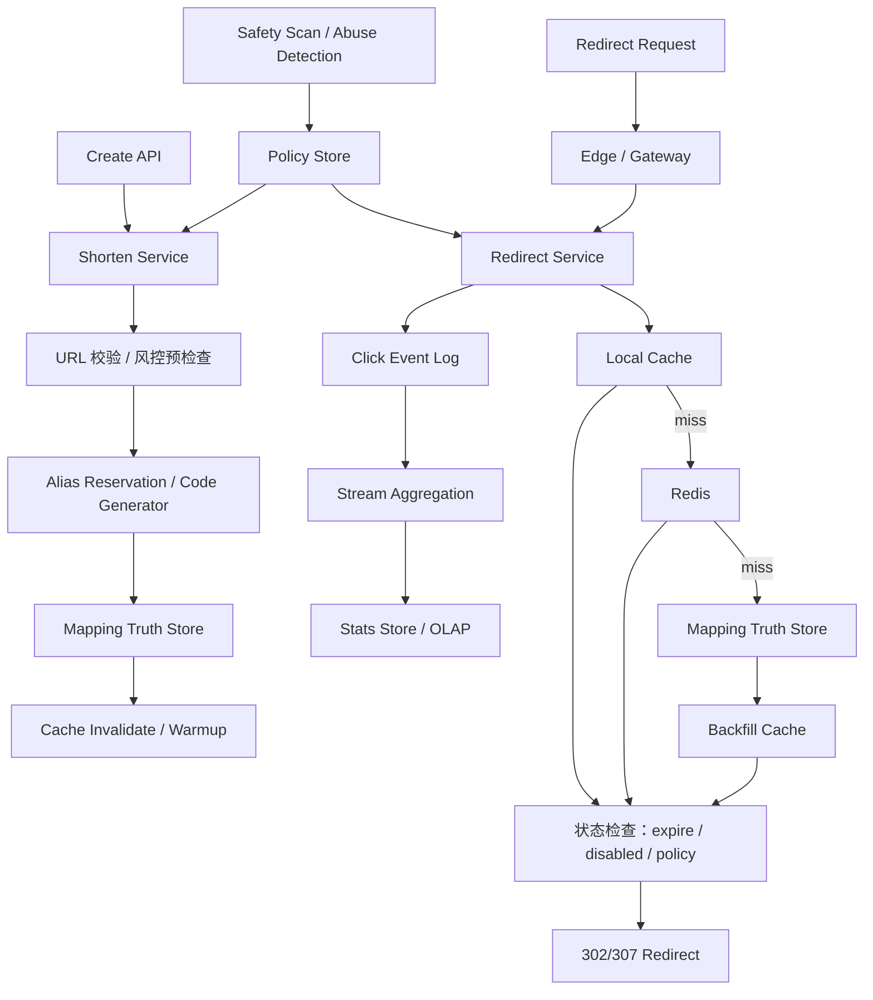

# 系统设计 - 案例 13：短链系统真题模拟

## 题目

设计一个类似 Bitly 的短链系统，支持：

- 长链接转短链接
- 通过短链跳转原始长链
- 基础点击统计
- 链接过期
- 可选自定义别名

先不做：

- 复杂运营后台
- 高级风控画像
- 多租户权限系统

## 为什么这题值得深讲

短链系统看起来像一道入门题，但它其实非常适合检验一个候选人是不是在“设计系统”，而不只是“背组件”。

原因是这题会同时考到：

- 一个 `读远大于写` 的系统，主矛盾该怎么抓
- 一个超热点小 key 系统，缓存到底怎么放
- 一个看似简单的 `key -> value` 映射，为什么仍然有大量产品语义要先定义
- 为什么创建、跳转、统计、风控必须拆链路
- 为什么看起来最简单的题，也有很多真实的 trade-off

很多回答会停在：

- `MySQL + Redis + Base62`

这不算错，但也不够好。  
真正成熟的回答应该能讲清楚：

- 题目里哪些语义必须先收敛
- 哪些字段和链路是系统真相源
- 为什么某些一致性必须强，某些则只能最终一致
- 方案是怎么一步一步推出来的，而不是像模板拼图

## 面试官真正想看什么

这题通常在看下面几件事：

1. 你会不会先识别主矛盾是 `跳转链路`，不是 `创建链路`
2. 你能不能把 `创建`、`跳转`、`统计`、`风控/治理` 几条链路拆开
3. 你会不会先定义产品语义，而不是一上来选技术
4. 你能不能比较短码生成方案，而不是只报一个结论
5. 你会不会处理热点 key、枚举攻击、缓存击穿、全局部署这些真实问题

## 一开始先别急着设计，先收敛题目语义

真实系统设计里，很多坑不是技术坑，而是语义坑。  
短链题尤其如此。

我会先主动澄清下面这些问题：

1. 是否支持用户自定义别名？
2. 是否支持过期时间？过期后返回什么，`404`、`410` 还是落到默认页？
3. 相同长链重复创建时，是否必须返回同一个短链？
4. 是否允许修改短链指向的目标 URL？
5. 点击统计是否要求实时？
6. 是否要考虑恶意链接、钓鱼链接和枚举攻击？
7. 用户是否全球分布，是否要做全球低延迟跳转？

如果面试官不继续补充，我会主动把题目收敛成下面这个版本：

- 支持普通自动生成短链
- 支持可选自定义别名
- 支持过期时间
- 支持基础点击统计，但统计允许秒级到分钟级延迟
- 相同长链默认不强制返回同一个短链
- 默认不允许修改已创建短链的目标 URL
- 需要预留风控能力
- 主写路径按单区域设计，全球用户访问时优化读路径

这里面有两个非常关键的产品选择：

### 选择 1：相同长链不强制去重

为什么？

- 业务上经常需要为同一长链生成多个不同短链
- 不同渠道、不同活动、不同时间创建的短链，可能都要单独统计
- 如果默认去重，会把产品语义绑死成“一个长链只有一个短链”

也就是说：

- “相同长链是否同码”不是技术问题，是产品问题

### 选择 2：默认不允许修改目标 URL

为什么？

- 短链天然有传播属性
- 一旦短链被发出去，再改目标地址，风险和审计问题都很大
- 如果允许修改，就要额外处理缓存失效、审计记录、回滚、恶意跳转等问题

所以如果题目没要求，我会主动把语义收紧成：

- 创建后不可修改

这会让系统边界清晰很多。

## 第一步：先判断这是一个什么类型的系统

我会先明确：

- 这是一个 `读远大于写` 的系统
- 而且是一个非常容易出现 `热点 key` 的系统
- 同时它的主路径极短，用户对延迟非常敏感

这意味着：

1. 我们真正要优化的是 `GET /{short_code}`
2. 创建接口不是性能核心
3. 统计绝不能阻塞跳转
4. 缓存不是锦上添花，而是主角

很多人会把这题答成“如何生成短码”，但其实：

- 生成短码只是创建链路的一个步骤
- 跳转路径和热点治理才是系统设计的主战场

## 第二步：先做一轮容量估算，不然 trade-off 没锚点

我会主动给一组面试中合理的假设：

- 日新增短链 `1000 万`
- 日跳转 `10 亿`
- 读写比大约 `100:1`
- 峰值创建 QPS `1000 - 3000`
- 峰值跳转 QPS `10 万 - 20 万`
- 个别热门短链可能在几分钟内打到单 key `10 万 QPS`

再往下推几步：

### 映射数据规模

如果一年新增短链：

- `1000 万 / 天 * 365 = 36.5 亿`

假设一条映射记录原始数据加索引开销大约 `200 - 300 B`，那一年级别的数据大概是：

- `730 GB - 1 TB+`

这说明：

- 映射表不是“永远放单机 MySQL”这么简单
- 至少要考虑分库、分片或者更 KV 化的存储演进

### 点击事件规模

如果日跳转 `10 亿`，哪怕每条点击事件只记 `150 B`：

- `150 GB / 天`

如果还要带上更多维度，如：

- IP
- UA
- referer
- region
- request_id

那真实数据量只会更大。

这马上说明一件事：

- 点击原始事件不能和短链映射真相源放在同一套同步主路径里

### 延迟目标

我会给出一个比较合理的目标：

- 跳转接口 `P99 < 30 ms`
- 创建接口 `P99 < 200 ms`
- 点击统计允许秒级到分钟级延迟

这个目标一旦定下来，后面很多方案就自然出来了：

- 统计必须异步
- 热点跳转必须缓存
- 创建接口可以略慢，但要稳定

## 第三步：先定义不变量，而不是先选技术

这是这题最容易被忽略、但最能拉开差距的一步。

我会先定义下面几个不变量：

1. 任意时刻，一个 `short_code` 最多映射到一个有效目标 URL
2. 自定义别名必须全局唯一，且受保留词与风控策略约束
3. 过期或封禁的短链不能继续正常跳转
4. 点击统计可以延迟，但跳转正确性不能延迟
5. 系统可以容忍点击统计重复或延后收敛，但不能把用户跳到错误地址

这几条不变量背后的意思是：

- 映射正确性比统计实时性重要得多
- 风控和过期是“跳转语义”的一部分，不是后台管理细节

很多候选人会把“点击数是不是实时”说得很重，但在短链系统里，那通常不是第一优先级。

## 第四步：不要直接给最终方案，先走一遍真实设计推演

这一步是这次我要重点加强的地方。  
我不会直接把最终架构甩出来，而是像真的在设计系统一样，一步步推。

## 第一轮思考：最朴素的方案是什么

最直观的方案是：

- 创建短链时，把 `short_code -> long_url` 存到 MySQL
- 跳转时先查 MySQL，再 302 跳转
- 点击时同步写一条统计记录

这个方案有什么好处？

- 简单
- 功能闭环完整
- 小规模场景下完全可用

但如果规模一上去，问题会马上暴露：

1. 跳转链路每次都查库，读压大
2. 热门短链会把数据库打成热点
3. 点击统计同步写入会拖慢 302
4. 单库会成为扩展瓶颈

所以第一轮方案可以作为“最小可用系统”，但绝不是面试里应该停下来的位置。

## 第二轮思考：先解决跳转读路径

既然主矛盾是读，我会优先对跳转路径动手：

- 增加 Redis 缓存
- 跳转时先查缓存，未命中再查真相源

这样带来的变化是：

- 大多数普通跳转不会打到数据库
- 热点短链也有机会被 Redis 吸住

但这还不够，因为又会出现两个新问题：

1. 热点 key 会不会把 Redis 单分片打爆？
2. 如果 Redis 整体抖动，底库能不能兜住？

所以这时候我会进一步想：

- 是否要增加本地缓存
- 是否要做热点 key 预热
- 是否要做 singleflight 防止缓存击穿

也就是说，真正的缓存设计并不是“加一个 Redis”就结束了。

## 第三轮思考：把统计从主链路拆出去

只要容量估算做过，你就会发现：

- 跳转高峰 QPS 很高
- 统计写放大非常明显

所以点击统计不应该同步写数据库，而应该：

1. 跳转时只做轻量事件投递
2. 原始事件进入日志或 MQ
3. 由后续聚合任务更新报表表

这样做的本质是：

- 302 跳转链路只负责“查映射并返回”
- 统计链路负责“异步记录和聚合”

这个拆分是短链题里非常关键的主次边界。

## 第四轮思考：创建链路要不要为“难猜”付出更大代价

接下来要讨论的是：

- 短码到底怎么生成

这一步很多人会直接说：

- `Base62`

但 `Base62` 只是编码方式，不是生成策略。

真正要比较的是下面几类方案。

## 短码生成方案比较

### 方案 A：数据库自增 ID + Base62

做法：

- 先拿一个自增整数
- 再编码成 Base62 短码

优点：

- 最简单
- 天然无碰撞
- 编码长度可控

缺点：

- 可预测
- 依赖中心化发号
- 如果直接暴露趋势，容易被枚举

适合什么时候：

- 早期系统
- 内部系统
- 对不可预测性要求不高

### 方案 B：分布式唯一 ID + Base62

做法：

- 用 snowflake 类分布式 ID
- 再转成 Base62

优点：

- 不需要单点发号器
- 更适合多机扩展
- 仍然保持无碰撞和长度可控

缺点：

- 仍有一定可预测性
- 需要处理时钟回拨、worker id 分配等问题

适合什么时候：

- 常规互联网系统
- 创建量不是极端高，但需要稳定扩展

### 方案 C：随机字符串 + 查重

做法：

- 每次随机生成若干位字符
- 冲突则重试

优点：

- 更难预测
- 不暴露增长趋势

缺点：

- 需要冲突检测
- 写路径多一次甚至多次重试
- 随着规模增长，碰撞概率和查重成本都要关注

适合什么时候：

- 非常强调不可预测性
- 可接受更复杂写路径

### 方案 D：预生成码池

做法：

- 后台提前生成一批可用短码
- 创建时从池里领一个

优点：

- 可以做更复杂的码空间设计
- 创建链路更平滑

缺点：

- 多了一套码池生命周期管理
- 要处理耗尽、回收、分配失败等问题

适合什么时候：

- 码规则复杂
- 想把生成逻辑从创建链路中拆掉

### 我在这个题里的选择

如果题目只是一个常规短链系统，我会优先选：

- `分布式唯一 ID + Base62`

原因是：

1. 比数据库自增更适合扩展
2. 比随机串更稳定
3. 写路径简单，失败面更小

如果面试官追问：

- “但这样可预测啊”

我会补充：

- 可以在编码前对 ID 做打散或混淆
- 也可以额外加入校验位或扰动位
- 不必一上来就把写路径换成随机串 + 重试

这里的核心观点是：

- “更难猜”是一个目标
- 但不应该为了它，把整个创建链路复杂度翻倍

## 顺手做个容量 sanity check：码空间够不够

如果用 `62` 进制：

- `62^6 ≈ 568 亿`
- `62^7 ≈ 3.5 万亿`

在日新增 `1000 万` 的前提下：

- `62^7` 其实已经够很多年了

所以工程上通常完全没必要为了“怕不够用”一开始就上很长的码。

## 第五步：真相源存储怎么选

这里我不会直接说“上某个数据库”，而是先看访问模式。

映射真相源的典型访问模式是：

- 按 `short_code` 点查
- 少量按创建者、时间做后台查询
- 少量更新状态，如封禁、过期、删除

这说明它本质上是一个：

- 点查为主的 key-value 问题

但它又带有：

- 别名唯一性
- 状态管理
- 审计字段

所以我们要比较两类方案。

## 主存储方案比较

### 方案 A：关系型数据库做真相源

优点：

- 唯一约束清晰
- 状态字段和后台治理自然
- 审计和管理方便

缺点：

- 单主扩展有限
- 非常热点的读不能靠它硬扛

### 方案 B：高可用 KV 做真相源

优点：

- 非常贴近访问模式
- 点查性能和水平扩展更好

缺点：

- 别名唯一性和后台查询能力较弱
- 治理能力通常不如关系型方案自然

### 我在这个题里的回答方式

如果这是一个面试题，我会给一个更现实、更分阶段的回答：

- `V1`：用关系型数据库做真相源，配合 Redis 和本地缓存承接读流量
- `V2`：当规模继续上升，且访问模式长期稳定为点查时，把自动生成短码映射迁移到更 KV 化的存储

这样回答比“直接上某某 NoSQL”更稳，因为你是在按业务演进讲，而不是按流行词讲。

## 自定义别名为什么是个隐藏难点

自动生成短码和自定义别名，看起来只是“两个来源的 code”，但工程上不完全一样。

原因是：

- 自动生成短码可以天然分片
- 自定义别名要求全局唯一，而且写量相对很低

这会带来一个真实的设计选择：

### 选择 A：所有 code 一视同仁，统一进同一个存储体系

优点：

- 模型简单

缺点：

- 全局唯一别名的约束更难做

### 选择 B：自动码和 alias 的预留/校验单独处理

优点：

- alias 写量低，可以用更强一致的方式保证唯一
- 自动码仍可按高吞吐模式生成和分片

缺点：

- 系统多了一层 alias reservation 逻辑

如果我想把答案讲得更像真实系统，我会明确说：

- 自动生成短码和自定义 alias 可以共用同一个最终 key 空间
- 但 alias 的唯一性校验可以通过单独的 reservation 表或服务来完成

因为：

- alias 写入量很低
- 值得用更强、更简单的唯一性保证来处理

## 第六步：把最终高层架构定下来

在前面几轮推演之后，一个比较成熟的架构会长这样：

## 第七步：把 API 设计说清楚

如果我要讲得更工程化，我会把 API 也顺手定义一下。

### 创建短链

`POST /v1/links`

请求字段：

- `long_url`
- `custom_alias` 可选
- `expire_at` 可选
- `idempotency_key` 可选但推荐

返回字段：

- `short_code`
- `short_url`
- `expire_at`
- `created_at`

### 跳转短链

`GET /{short_code}`

返回：

- `302` 或 `307` 跳转
- 如果不存在或已失效，返回 `404/410`

### 查询统计

`GET /v1/links/{code}/stats`

返回：

- `click_count`
- `uv`
- 时间分桶统计

### 管理动作

`POST /v1/links/{code}/disable`

这个 API 很重要，因为它意味着：

- 封禁和治理是系统设计的一部分，不是“后台以后再说”

## 第八步：把核心数据模型说深一点

### 映射表

`short_link_mapping`

关键字段：

- `short_code` 主键
- `long_url`
- `creator_id`
- `expire_at`
- `status`
- `created_at`
- `updated_at`
- `policy_flags`

关键索引：

- `PRIMARY KEY(short_code)`
- `INDEX(creator_id, created_at)`
- `INDEX(expire_at)` 用于后台清理或运营查询

### alias 预留表

`alias_reservation`

关键字段：

- `alias`
- `owner_id`
- `status`
- `reserved_at`

关键索引：

- `UNIQUE(alias)`

### 原始点击事件

`click_event`

字段：

- `request_id`
- `short_code`
- `ts`
- `ip_hash`
- `ua`
- `referer`
- `region`

这里我会顺手强调两个点：

1. `request_id` 很重要，因为可以支持去重和补算
2. `ip` 最好不要总是原文永久保留，要考虑隐私和治理

## 第九步：真正把跳转主链路拆开来讲

短链题如果想讲深，必须把跳转链路拆细。

## 跳转链路的理想延迟预算

我会给一个大致预算：

- Edge / Gateway：`1 - 3 ms`
- 本地缓存：`< 1 ms`
- Redis：`1 - 3 ms`
- 底库兜底：`5 - 20 ms`
- 返回 302：非常轻

这能说明：

- 如果缓存命中率足够高，跳转体验会非常好
- 如果缓存雪崩或 Redis 故障，底库压力会立刻上来

## 跳转流程

1. 请求先到接入层
2. 服务先查进程内本地缓存
3. 未命中再查 Redis
4. 仍未命中才查真相源
5. 命中后立即校验状态：
   - 是否存在
   - 是否过期
   - 是否被禁用
   - 是否命中风控策略
6. 通过后返回重定向
7. 同时异步写点击事件

这里我会强调：

- 风控和过期判断必须在跳转同步链路里做
- 统计不应该在同步链路里做

## 301 还是 302

这是一个很适合体现深度的小点。

### 301

优点：

- 浏览器和中间层更容易缓存

缺点：

- 客户端缓存更强
- 如果后续失效、封禁、目标变更，撤回更难

### 302 / 307

优点：

- 更灵活
- 失效和治理更容易控制

缺点：

- 某些场景缓存收益没那么高

如果题目没有特殊要求，我会偏向：

- 默认 `302` 或 `307`

因为短链系统通常更看重：

- 可治理性
- 可回收性

而不是把客户端缓存做到最激进。

## 第十步：把缓存设计讲成真正的设计，而不是一句“上 Redis”

## 缓存到底缓存什么

不是所有东西都要缓存。  
短链系统里最值得缓存的是：

- `short_code -> redirect target + status + expire_at`

也就是说：

- 要缓存足够完成一次跳转所需的最小数据

这样命中缓存后，服务就不需要再查库。

## 为什么要本地缓存 + Redis

### 只有 Redis

优点：

- 一致性更容易管理

缺点：

- 每次跳转至少一次网络 RTT
- 极热点 key 依然会压到 Redis

### 本地缓存 + Redis

优点：

- 热 key 更容易被本地吸收
- 减少 Redis 压力
- Redis 抖动时多一层缓冲

缺点：

- 多实例缓存不完全一致
- 失效和容量控制更复杂

对短链这种“非常热点、非常短路径”的系统，我会认为：

- 双层缓存是值得的

## 缓存失效怎么做

因为我们默认：

- 短链创建后一般不修改目标地址

所以缓存失效比一般 KV 系统简单很多。  
主要需要处理的是：

- 新创建的短链何时预热
- 封禁、过期、删除时如何失效

常见做法：

- 创建成功后可选择写穿或异步预热 Redis
- 管理操作时主动删缓存
- TTL 加随机抖动，避免大量 key 同时过期

## 要不要做 negative cache

这也是一个很实战的点。

对于不存在的 `short_code`，如果被恶意扫号：

- 每次都打到底库很浪费

可以考虑：

- 对不存在的 key 做短 TTL negative cache

好处：

- 减少枚举攻击对底库的冲击

风险：

- 如果某个 code 刚刚创建，而 negative cache 还没过期，可能短时间内读不到

所以更稳的做法是：

- negative cache TTL 非常短
- 创建成功时主动清理潜在的 negative cache

## 第十一步：把统计系统讲成单独系统

我会明确说：

- 统计是短链系统的重要功能
- 但不是跳转主链路的一部分

## 统计链路怎么拆

### 原始事件层

跳转时只记录：

- `request_id`
- `short_code`
- `ts`
- 基础环境维度

写入 MQ 或日志管道。

### 聚合层

由流式计算或定时聚合做：

- 每分钟点击数
- 每小时点击数
- UV
- 地域分布

### 查询层

面向业务面板，查询已经聚合好的结果。

这三层分开之后的好处是：

1. 原始日志可回放
2. 聚合规则可重算
3. 查询不需要扫海量明细日志

## 统计系统的真实 trade-off

### 能不能做到精确实时？

理论上可以更实时，但代价是：

- 跳转链路更重
- 聚合成本更高
- 故障影响主路径

现实里通常更合理的是：

- 跳转路径极轻
- 报表近实时

这也是我会主动向面试官解释的地方：

- “点击统计可以最终一致，但跳转一定要稳定”

## UV 怎么做

这里不一定非要给唯一答案，但要体现你懂取舍。

### 精确 UV

优点：

- 语义准确

缺点：

- 状态存储和去重成本高

### 近似 UV

优点：

- 成本低

缺点：

- 有误差

所以我会说：

- 如果只是基础面板，近似 UV 往往够用
- 如果涉及结算或计费，才要更严谨定义和更贵的去重

## 第十二步：把风控和安全讲进去，不然答案还是不够真实

短链系统天然容易被滥用：

- 钓鱼链接
- 垃圾短信跳转
- 恶意枚举短链
- 批量刷点击

所以我会主动补下面几类保护。

## 创建侧风控

- URL 协议白名单，如只允许 `http/https`
- 黑名单域名
- 敏感词 alias 拦截
- 创建频控
- 可疑账号审核

## 跳转侧保护

- 热点异常访问检测
- 某些风险链接的二次确认页
- 封禁策略实时生效

## 枚举攻击防护

如果短码完全可预测，攻击者就可以：

- 顺序扫号
- 爬取热门短链

所以我会从两层防护：

1. 短码不要过度可预测
2. 跳转请求做频控与异常检测

这里不应该把全部压力都放到“随机串”上解决。

## 第十三步：如果题目升级到全球访问，我怎么讲

如果面试官说：

- “用户在全球，能不能就近访问？”

我不会一上来就说“多主写”。

更现实的做法是：

### 写路径

- 仍然集中在单主区域

理由：

- 创建量远小于跳转量
- 单主写更简单，唯一性、治理、风控都更清楚

### 读路径

- 尽量就近访问
- 热门短链在边缘缓存
- 可通过 CDN、Anycast 或区域化接入优化跳转延迟

### 统计

- 可按区域收集原始事件
- 后台异步汇总

这体现的是一个很重要的思想：

- 不要为一个写量并不高的系统，引入过重的多主写复杂度

## 第十四步：如果继续演进，这个系统会怎么长大

一个真实系统不会从 Day 1 就是“完全体”。  
所以我会主动给出一个演进路径。

### 阶段 1：单库 + Redis

适合：

- 早期产品
- 流量不大

### 阶段 2：双层缓存 + 统计异步化

适合：

- 读流量上来
- 热点明显

### 阶段 3：映射真相源分片 / 更 KV 化

适合：

- 映射数据规模很大
- 点查模式高度稳定

### 阶段 4：边缘加速 + 全球只读优化

适合：

- 全球访问明显
- 热短链跨区域分布广

这种“按阶段演进”的回答，比一上来堆满所有组件更像真实工程。

## 面试里我会怎么讲最终方案

如果让我设计一个短链系统，我会先把语义收敛清楚：支持自动生成短链、可选自定义别名、支持过期和基础点击统计，默认不强制同长链去重，也默认不允许后续修改目标 URL。  
这样设计后，系统的真相源就很明确了：核心是 `short_code -> target_url + status + expire_at` 这条映射，而点击统计只是围绕跳转行为产生的派生数据。

从流量模型看，这是一个典型的 `读远大于写` 系统，主矛盾在跳转链路而不是创建链路。  
所以架构上我会优先优化 `GET /{short_code}`：  
跳转请求先查本地缓存，再查 Redis，最后兜底到映射真相源；命中后立即检查过期、封禁和策略状态，然后返回 `302/307`。  
点击统计不会同步写库，而是异步进入事件日志和聚合链路，因为统计允许秒级延迟，而跳转不允许被拖慢。

创建链路里，我会把短码生成和 alias 唯一校验单独考虑。  
自动短码我更倾向于用 `分布式唯一 ID + Base62`，因为它比中心化自增更易扩展，又比随机串更稳定；  
自定义 alias 因为写量低但要求强唯一，我会用单独的 reservation 表或服务做保留和冲突校验。  
如果后面继续深挖，我会重点讲缓存设计、统计异步化、枚举攻击防护，以及为什么全球场景下我依然会优先选择单主写加边缘读优化。

## 面试官如果继续追问，我会怎么答

### 追问 1：为什么不直接用长链 hash 当短码

回答重点：

- hash 通常太长
- 需要处理碰撞
- 更重要的是它强绑定了“同长链同短码”的产品语义

### 追问 2：为什么不强制同一长链返回同一个短链

回答重点：

- 不同渠道和活动需要不同短链做独立统计
- 这不是技术优化问题，而是业务语义问题

### 追问 3：为什么统计不能同步写数据库

回答重点：

- 跳转路径延迟敏感
- 统计写放大会拖慢 302
- 统计适合异步和最终一致

### 追问 4：Redis 挂了怎么办

回答重点：

- 真相源仍然能兜底
- 本地缓存可吸收一部分热点
- 必要时对跳转接口限流保护底库

### 追问 5：怎么防止恶意枚举短链

回答重点：

- 短码打散，别太可预测
- negative cache
- 频控、异常检测、黑名单

### 追问 6：要不要把 302 响应缓存到 CDN

回答重点：

- 可以对热点且稳定的短链做边缘缓存
- 但要权衡封禁、过期和回收时的 purge 成本
- 所以默认更适合短 TTL 或对稳定短链启用

## 常见失分点

1. 一上来直接报 `MySQL + Redis + Base62`，没有需求收敛。
2. 不讲“相同长链是否同码”“是否允许修改目标地址”这类语义问题。
3. 把点击统计做成同步写库。
4. 缓存只说一句“加 Redis”，不讲本地缓存、热点 key、negative cache、TTL 抖动。
5. 完全不提风控、封禁、枚举攻击和别名唯一性。
6. 全球访问一上来就答多主写，没有先看写流量是否值得。

## 总结

短链系统真正考的，不是“怎么把一个 ID 编成短字符串”，而是：

`如何围绕一个极热、极短、极敏感的跳转主路径，把映射真相源、缓存、异步统计、别名唯一性和风控边界设计清楚。`

一个更成熟的回答，通常应该按这个顺序展开：

1. 先收敛产品语义
2. 再判断它是读远大于写的热点系统
3. 再走一遍朴素方案到最终方案的推演
4. 最后讲短码生成、缓存、统计和全球部署 trade-off

## 自测问题

1. 如果产品要求“同一长链默认复用已有短链”，你的数据模型和索引要怎么改？
2. 如果某个短链 1 分钟内打到 `50 万 QPS`，你最担心哪一层先出问题？
3. 如果安全团队要求“短链必须不可枚举”，你会先改短码生成、跳转风控，还是两者都改？
4. 如果开始支持“修改目标 URL”，缓存失效和审计需要怎么补？
