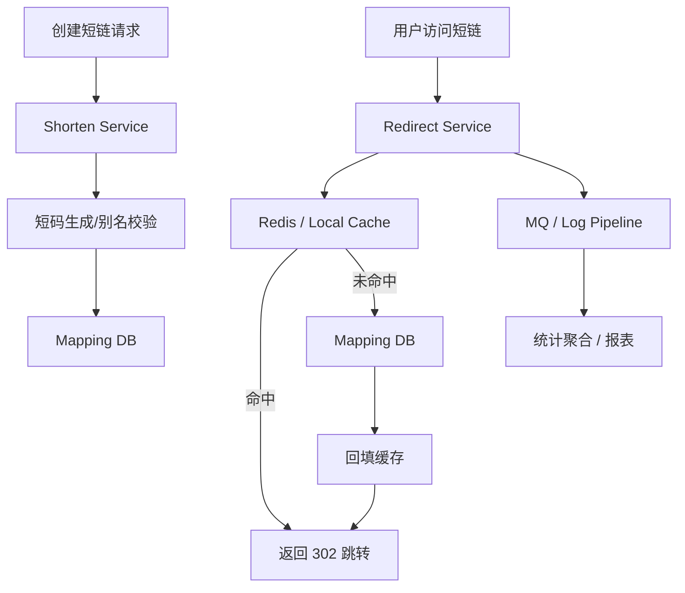

# 系统设计 - 案例 13：短链系统真题模拟

## 题目

设计一个类似 Bitly 的短链系统，支持：

- 长链接转短链接
- 通过短链跳转原始长链
- 基础点击统计
- 链接过期
- 可选自定义别名

先不做：

- 复杂运营后台
- 高级风控画像
- 多租户权限系统

## 这题为什么常考

短链系统是系统设计面试里的经典入门题，但它一点也不“低级”。  
它几乎天然覆盖了下面这些核心能力：

- 读多写少系统怎么设计
- 热点 key 怎么处理
- 缓存放在哪、缓存什么
- Key 生成方案怎么选
- 跳转主链路和统计链路怎么拆
- 全局唯一、自定义别名、过期和风控怎么处理

也就是说，这道题虽然不复杂，但非常适合看一个候选人是否真的会“先抓主矛盾，再搭主链路”。

## 面试官视角：这题真正想考什么

这道题表面在问“怎么把长链映射成短链”，本质上在考四件事：

1. 你能不能识别这是一个 `读远大于写` 的系统
2. 你能不能把 `跳转链路` 和 `统计链路` 分开
3. 你能不能解释 `短码生成`、`热点缓存` 和 `全局扩展`
4. 你会不会在简单题里也讲 trade-off，而不是把它答成 CRUD

## 结构化思考过程（可在面试里直接说出来的版本）

注意，这里的“思考过程”指的是你在面试中可以显式表达出来的结构化推理，不是隐藏在脑子里的碎念。

### 第一步：先澄清范围

我会先问五个问题：

1. 是否支持用户自定义短链别名？
2. 是否支持链接过期时间？
3. 是否需要点击统计？
4. 是否需要防恶意链接和垃圾链接？
5. 用户是否全球分布，是否要考虑全球低延迟访问？

如果面试官不继续补充，我会主动收敛一个版本：

- 支持普通短链和自定义别名
- 支持过期时间
- 支持基础点击统计
- 先不做复杂后台，但预留风控异步链路
- 默认先设计成多区域读优化友好，但主写路径先按单区域考虑

### 第二步：给一轮非功能目标和粗估算

我会假设：

- 日新增短链 `1000 万`
- 日跳转量 `10 亿`
- 读写比大约 `100:1`
- 热门短链会形成明显热点

粗略换算：

- 平均创建 QPS 约 `100~200`
- 峰值创建 QPS 可按 `1000+` 量级准备
- 平均跳转 QPS 约 `1 万+`
- 峰值跳转 QPS 可按 `10 万` 量级准备

这组数字一出来，架构重点就很明确了：

- 主矛盾是跳转读路径，不是创建写路径
- 缓存收益会非常高
- 统计必须异步，否则会拖慢 302 跳转主链路

### 第三步：定义核心对象和 API

核心对象其实很少：

1. `short_url_mapping`
   - `short_code`
   - `long_url`
   - `creator_id`
   - `expire_at`
   - `status`
   - `created_at`

2. `click_event`
   - `short_code`
   - `ts`
   - `ip`
   - `ua`
   - `referer`
   - `region`

核心 API：

- `POST /api/short-links`
- `GET /{short_code}`
- `GET /api/short-links/{code}/stats`

### 第四步：画高层架构

### 第五步：明确主链路

#### 创建链路

1. 校验长链接是否合法
2. 如果是自定义别名，先查冲突
3. 生成短码
4. 写 `short_url_mapping`
5. 返回短链

#### 跳转链路

1. 根据 `short_code` 先查缓存
2. 缓存命中则直接返回 302
3. 未命中查底库并回填缓存
4. 同时异步记录点击事件

### 第六步：主动深挖两个关键点

#### 深挖点 A：短码怎么生成

常见方案有两个：

##### 方案 1：自增 ID + Base62

优点：

- 简单
- 短码长度可控
- 无碰撞

缺点：

- 可预测
- 如果暴露自增趋势，安全性和风控上稍弱

##### 方案 2：随机串 + 去重校验

优点：

- 更难预测
- 更灵活

缺点：

- 要处理碰撞
- 写放大更高

更成熟的回答通常是：

- 默认采用“分布式唯一 ID + Base62”
- 如果需要更强不可预测性，可以在编码前再混淆或打散

#### 深挖点 B：热点短链怎么抗

短链天然会有热点。  
一个热门活动链接、明星微博里的短链、App 推送里的统一链接，都可能瞬间打成超热点 key。

更成熟的做法通常是：

- 本地缓存 + Redis 双层缓存
- 热点 key 预热
- TTL 加随机抖动
- 单飞 / 请求合并，避免缓存击穿
- 统计异步化，绝不阻塞跳转

这一步特别适合体现缓存章节的理解，不要只说“加 Redis”。

## 参考答案（面试里可直接说的一版）

如果让我设计一个短链系统，我会先把范围收敛到四个核心功能：创建短链、短链跳转、基础统计和过期控制，并支持可选自定义别名。  
这道题的主矛盾是读远大于写，所以我会优先优化跳转读路径，而不是先把创建链路做得特别复杂。

容量上我会先假设日新增短链在千万级、日跳转在十亿级，读写比大约 100:1，这意味着跳转接口的峰值 QPS 很可能是创建接口的几十到上百倍。所以架构上我会把系统拆成两个核心链路：一个是创建链路，一个是跳转链路；同时把点击统计从跳转主链路中拆出去做异步。

数据模型上，核心是一个 `short_url_mapping`，主键是 `short_code`，保存原始长链、过期时间和状态；统计则单独进入点击事件流水，不和主映射表放在同一个同步事务里。  
创建链路里，如果是自定义别名，我会先查唯一冲突；否则用分布式唯一 ID 加 Base62 编码生成短码，再写入映射表。  
跳转链路里，我会先查本地缓存和 Redis，命中后直接返回 302；未命中则查底库并回填缓存。点击事件通过 MQ 或日志管道异步进入统计系统。

如果继续深挖，我会重点讲两个点。  
第一，短码生成方案的 trade-off：自增 ID + Base62 简单可靠但更可预测，随机串更难猜但碰撞和写放大更高。  
第二，热点短链治理：热门短链会形成极热 key，所以我会用双层缓存、热点预热、TTL 抖动和请求合并来保护底库，同时把统计彻底异步化，确保跳转主链路只做映射查询和 302 返回。

如果再往后扩展，我会补过期清理、自定义别名风控、恶意链接扫描，以及全球用户访问时的边缘缓存和多区域就近读优化。

## 面试官可能继续追问什么

### 追问 1：自定义别名冲突怎么办

回答重点：

- 自定义别名需要唯一约束
- 冲突时直接返回占用
- 对别名长度和字符集做限制
- 可做保留词/敏感词过滤

### 追问 2：为什么点击统计不能同步写数据库

回答重点：

- 跳转链路延迟敏感
- 统计允许秒级到分钟级延迟
- 同步写统计会放大读路径成本
- 统计适合异步流水和聚合

### 追问 3：如果 Redis 挂了怎么办

回答重点：

- 底库仍是最终真相源
- 做本地缓存和限流保护
- 热点 key 可预热
- 必要时短时间降级统计能力，但跳转要尽量保住

### 追问 4：短链过期如何处理

回答重点：

- 读路径实时校验 `expire_at`
- 过期后可返回 404/410
- 后台定时清理缓存和冷数据

### 追问 5：为什么这题通常不需要一上来分片一大堆

回答重点：

- 跳转是点查，缓存价值极高
- 写入量本身不算极端高
- 先把主键设计和缓存做好，系统能撑很久
- 只有在数据规模、索引体积或多区域复制压力上来以后再演进分片

## 常见失分点

1. 一上来就堆 Nginx、Redis、MySQL，但没有说清主链路。
2. 没先识别这是典型 `读多写少` 系统。
3. 把点击统计同步写进跳转链路。
4. 只会说“加缓存”，却说不出缓存什么、热点怎么扛。
5. 不知道短码生成方案的 trade-off，只会机械背 Base62。

## 总结

短链系统是一个非常经典的面试题，因为它小而美，特别适合检验系统设计的基本功。  
你真正要讲清楚的不是“能把长链存下来”，而是：

- 为什么主矛盾在读路径
- 为什么统计必须异步
- 为什么短码生成要讲 trade-off
- 为什么热点治理比数据库名字更重要

如果这四件事你能讲顺，这道题就已经不是“简单题”了，而是一道非常好的得分题。

## 自测问题

1. 如果用户是全球分布的，这个短链系统在多区域上最先应该优化什么？
2. 如果要支持“修改原始长链”，缓存失效应该怎么做？
3. 如果某个热门短链在 1 分钟内被点了 1 亿次，你最担心系统哪一层先扛不住？
4. 如果面试官追问“为什么不用纯随机 6 位短码”，你会怎么回答？
