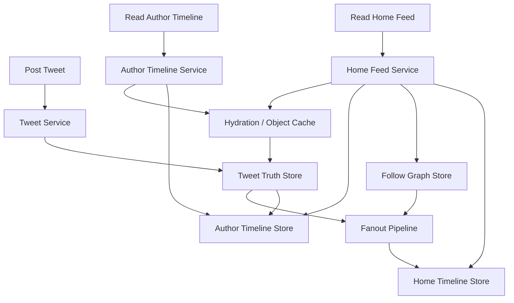

# 系统设计 - 案例 14：Twitter / Feed 系统真题模拟

## 题目

设计一个类似 Twitter 的 Feed 系统，支持：

- 发帖
- 关注/取关
- 查看作者个人时间线
- 查看首页时间线
- 下拉分页

先不做：

- 复杂广告系统
- 长视频处理
- 复杂推荐排序模型

## 为什么这题值得深讲

Feed 系统是系统设计面试里最容易“看起来谁都会答”的题型之一。  
很多人会很快说出：

- 发帖落库
- Redis 缓存
- 用 MQ 推给粉丝

这些词不算错，但远远不够。  
真正的难点不是“怎么存一条帖子”，而是：

- 首页时间线和作者时间线到底是不是同一个系统
- 新内容应该在写时分发，还是在读时聚合
- 为什么明星用户会把 `fanout-on-write` 打爆
- 为什么单纯 `fanout-on-read` 在高关注用户面前又会变得很重
- 分页时如何避免重复、漏读、乱序
- 删除、取关、补偿、重建这些“脏活”应该怎么处理

这道题真正考的是：

- 一个分发系统如何围绕极不均匀的关注图做 trade-off

## 面试官真正想看什么

这题通常在看下面几件事：

1. 你会不会先把 `Author Timeline` 和 `Home Feed` 分开
2. 你能不能从需求语义出发，推导出 `push / pull / hybrid`
3. 你会不会识别明星用户、大 V、热点账号对分发策略的影响
4. 你能不能讲清时间线存储对象到底是“正文”还是“引用”
5. 你会不会处理删除、取关、分页一致性和补偿重建
6. 你能不能把最终一致、排序语义和缓存对象说清楚

## 一开始先别急着选 fanout，先收敛语义

Feed 题最容易犯的错，就是一上来谈：

- fanout-on-write
- fanout-on-read

但其实在那之前，应该先问：

- 我到底要构建什么样的 feed 语义？

我会先主动澄清这些问题：

1. 首页时间线是严格按发布时间倒序，还是允许轻量排序和运营插槽？
2. 作者个人时间线是否必须完整可回溯？是否支持深分页？
3. 首页是否主要关注最近内容，而不是历史全量？
4. 删除帖子、屏蔽用户、取关关系要多快生效？
5. 是否存在大 V 和极端不均匀的关注图？
6. 是否支持转发、置顶、回复、可见性控制？

如果面试官不继续补充，我会主动收敛成下面这个版本：

- 作者时间线按时间倒序，要求完整、稳定、支持深分页
- 首页时间线先按时间为主，暂不引入复杂推荐模型
- 首页主要看最近内容，不强调深分页到底
- 删除帖子要尽量快生效
- 取关允许短暂延迟收敛
- 存在大量明星用户，关注图高度长尾

这里其实已经埋下了这题最关键的两个边界：

### 边界 1：作者时间线和首页时间线不是一个问题

作者时间线更接近：

- “我发过什么”

首页时间线更接近：

- “我应该看到什么”

这两者虽然都叫 timeline，但本质不同。

### 边界 2：首页主要是“最近窗口”，不是“深历史档案”

这直接影响：

- 首页是否值得物化
- 分页游标怎么做
- 是否要为极深分页付出很高成本

## 第一步：先判断这是一个什么类型的系统

我会先明确：

- 这是一个社交分发系统
- 本质矛盾不是“存储单条 tweet”，而是“分发给谁、何时分发、在哪里聚合”
- 流量会极不均匀，热点作者和普通作者完全不是一个量级

这意味着：

1. 我们不能只看平均值
2. 关注图分布比 tweet 本身更影响架构
3. 任何“所有用户统一一套 fanout 策略”的方案，都要非常小心

## 第二步：先做容量估算，不然分发 trade-off 没锚点

我会先给出一组合理假设：

- 注册用户 `5 亿`
- DAU `1 亿`
- 日发帖量 `5 亿`
- 峰值发帖 `5 千 - 1 万 QPS`
- 首页读取峰值 `20 万 - 50 万 QPS`
- 平均每个用户关注 `200` 个账号
- 但明星用户可能有 `1000 万+` 粉丝

这组数字里最值得强调的不是 QPS，而是两个结构性事实。

### 事实 1：关注图非常大

如果平均关注数是 `200`，理论 follow edge 规模大约是：

- `5 亿 * 200 = 1000 亿`

这告诉我们：

- follow graph 本身就是一个大系统
- 首页聚合时不可能每次都天真地对全图做复杂操作

### 事实 2：分布极不均匀

如果普通用户发一条帖，也许 fanout 给几十或几百人。  
但如果明星用户发一条帖，可能要面对：

- 数百万到上千万粉丝

这意味着：

- 平均 fanout 成本没有意义
- 单条内容的极端写扩散，才是设计关键

### 一句非常重要的结论

这组容量推完之后，我会明确说：

- `Author Timeline` 可以设计得相对简单
- `Home Feed` 才是真正困难的系统

因为作者时间线本质上是：

- 以作者为分区的 append-only log

而首页时间线是：

- 一种面向读者视角的派生视图

## 第三步：先定义不变量和语义边界

这是这题很容易被忽略的一步，但它非常重要。

我会先定义下面几个不变量：

1. 作者时间线必须完整、顺序稳定，是最接近内容真相源的视图
2. 首页时间线允许最终一致，但不能长期丢帖或大量重复
3. 删除后的内容不应继续出现在新的首页结果中
4. 取关后，旧内容可以短时间残留，但新请求应逐步收敛到最新关注关系
5. 顺序通常只需要在“一个 feed 结果页的稳定游标语义”上保证，不需要全局绝对顺序

这里我会特意讲一句：

- 首页 feed 是派生视图，不是真相源

因为这句话会决定后面：

- 删除怎么做
- 补偿怎么做
- 是否需要强同步清理所有物化副本

## 第四步：不要直接给最终架构，先走真实推演

这题要讲深，必须像真的在设计，而不是直接说“混合 fanout”。

## 第一轮思考：最朴素的方案是什么

最直观的方案是：

- 所有 tweet 只存一份
- 用户刷首页时，实时取出他关注的所有作者最近发的内容
- 在读路径上做 merge sort

这其实就是：

- `fanout-on-read`

### 这个方案的优点

- 发帖非常轻
- 不需要提前物化每个人的首页 feed
- 删除和取关更容易反映，因为读时用的是最新数据

### 这个方案的问题

如果一个用户关注了很多人，比如：

- `1000` 个账号

那首页请求就需要：

- 拉很多作者的最近内容
- 做大量 merge
- 再分页和去重

这会带来三个明显问题：

1. 首页读路径过重
2. 高峰时延迟不稳定
3. 首页缓存很难命中，因为每个人的组合不同

所以纯 pull 方案虽然简单，但读性能会很难看。

## 第二轮思考：那就全量写时 fanout 行不行

另一种极端是：

- 作者每发一条内容，就异步写入所有粉丝的首页时间线

这就是：

- `fanout-on-write`

### 这个方案的优点

- 首页非常快
- 读路径简单
- 用户打开 feed 基本就是读自己的物化列表

### 这个方案的问题

如果一个明星用户发帖，fanout 成本会瞬间爆炸。

假设：

- 某个明星有 `1000 万` 粉丝

那发一条内容意味着：

- 生成 `1000 万` 条首页 timeline entry

这还没算：

- 删除补偿
- 取关纠偏
- 重试幂等
- 存储放大

所以纯 push 方案在明星用户场景下会非常危险。

## 第三轮思考：为什么最终会逼出混合方案

当你把上面两种极端方案都推一遍之后，混合方案几乎是自然结论：

- 对普通作者，用 `fanout-on-write`
- 对明星作者，用 `fanout-on-read`

这样做的本质是：

- 用写扩散换长尾用户首页读取性能
- 用读时聚合避免明星用户把写链路打爆

这才是混合方案真正的来历。  
它不是模板答案，而是容量和关注图分布逼出来的。

## 第五步：先把系统拆成两个 timeline

这个拆分是整个答案的主心骨。

## Author Timeline

作者时间线回答的是：

- “这个作者发过哪些内容”

它的特点是：

- 写多读少于首页，但模型简单
- 天然按作者分区
- 是 append-only 结构
- 适合深分页

### 我会怎么存

我会把作者时间线设计成：

- 按 `author_id` 分区的轻量引用列表

timeline entry 里不一定放全文，而更像：

- `tweet_id`
- `created_at`
- 可选少量冗余展示字段

原因是：

- timeline 是高频结构
- 如果直接把全文复制进去，删除、编辑、计数变更都更重

## Home Feed

首页时间线回答的是：

- “这个用户此刻应该看到哪些内容”

它的特点是：

- 读多
- 依赖关注图
- 依赖分发策略
- 更像缓存化、物化后的派生视图

这也是为什么我会反复强调：

- `Author Timeline` 更像真相内容流
- `Home Feed` 更像派生视图

## 第六步：把核心对象建模清楚

### 内容对象

`tweet`

字段示意：

- `tweet_id`
- `author_id`
- `content`
- `created_at`
- `visibility`
- `status`

### 关注关系

`follow_edge`

字段示意：

- `follower_id`
- `followee_id`
- `created_at`
- `status`

### 作者时间线条目

`author_timeline_entry`

字段示意：

- `author_id`
- `tweet_id`
- `created_at`

### 首页时间线条目

`home_timeline_entry`

字段示意：

- `viewer_id`
- `tweet_id`
- `source_author_id`
- `created_at`
- `delivery_mode`

我会特意补一个 `delivery_mode`，因为它有助于做：

- push/pull 混合策略排查
- 统计物化来源

## 第七步：先把存储对象的选择说清楚

Feed 题如果想讲深，不能只说“timeline 存 Redis”。

要先回答：

- timeline 到底是短期缓存，还是长期可恢复存储？

## tweet 正文存储

tweet 正文是真相内容数据，应该放在内容主存储里。  
无论你最后选择关系型、文档型还是日志型存储，原则都一样：

- 正文和 timeline entry 最好分开

原因是：

- timeline 需要高频追加和读取
- 正文需要状态管理、删除标记、审计和内容服务能力

## timeline entry 存储

这里我更倾向：

- timeline 里存轻量引用

而不是：

- timeline 里直接复制完整 tweet

### 轻量引用的优点

- 存储放大小
- 删除传播更轻
- 点赞/评论计数变化不需要全量改副本

### 轻量引用的缺点

- 读路径需要 hydration

这会引出一个非常真实的设计问题：

- 是不是每次读首页都要再查 tweet 正文？

答案通常是：

- 需要，但可以通过对象缓存和少量冗余字段做折中

## 第八步：把高层架构定下来

## 第九步：把发帖链路讲细，而不是一句“发帖后 fanout”

真实发帖链路我会拆成下面几步：

1. 客户端发帖
2. 写入 tweet 真相源
3. 追加到作者时间线
4. 异步进入 fanout pipeline
5. 对普通作者执行 push
6. 对明星作者只记录作者时间线，不立即写所有首页副本

### 为什么发帖成功不能等于“所有粉丝首页都更新完”

因为如果这么定义：

- 明星用户发帖延迟会失控
- fanout 故障会直接影响发帖成功语义

所以我会主动收敛语义：

- 发帖成功 = tweet 已落真相源，作者时间线可见
- 首页时间线随后异步收敛

这句话非常重要，因为它定义了同步边界。

## 第十步：把 Home Feed 的混合读写策略讲透

这里是整道题的核心。

## 对普通作者：push

普通作者发帖后：

- 进入 fanout pipeline
- 写入粉丝的 `home_timeline`

好处：

- 大部分用户首页读取极快
- 首页主要变成“读自己的 feed list”

## 对明星作者：pull

明星作者发帖后：

- 只写 tweet 真相源和作者时间线
- 不做全量粉丝 push

当用户读取首页时：

- 临时拉取这些明星作者最近若干条内容
- 与本地物化的 home timeline 合并

这其实是一个“增量 merge”的思路，而不是每次全量扫所有 followee。

## 为什么不直接所有人都 hybrid merge

因为如果所有 followee 都在读时 merge：

- 首页就退化回纯 pull

如果所有人都 push：

- 明星用户又会写爆

所以混合方案真正关键的是：

- 只把最贵的那部分 fanout 留给读时处理

## 第十一步：明星用户怎么定义，不要给死数字

很多人会说：

- “粉丝超过 100 万就算明星”

这太僵了。

更成熟的说法应该是：

- 是否按 pull 处理，是一个可配置的分层策略
- 可以综合看粉丝数、发帖频率、历史互动量、活动属性

为什么不能写死？

- 因为热点账号类型会变
- 某些活动号可能短期爆发，但不是长期明星

所以这里更像一个：

- policy system

而不是硬编码常量。

## 第十二步：分页语义要讲深，不然 Feed 题还是浅

Feed 题很容易有人只说：

- `offset + limit`

这通常不够好。  
因为首页内容在不断新增，如果使用 offset：

- 用户翻页时更容易重复或漏读

## 为什么 cursor 更适合

我会用：

- `(created_at, tweet_id)` 这样的复合游标

或者：

- 单调递增的雪花 ID

这样做的好处是：

- 读取某一页之后，下一页可以基于明确边界继续向后取
- 在新内容不断插入时，稳定性更好

## 首页分页和作者时间线分页不完全一样

### 作者时间线

- 更适合深分页
- 可以更接近完整历史流

### 首页时间线

- 更关注最近窗口
- 深分页价值低
- 允许更激进的缓存和裁剪

这又一次说明：

- `Author Timeline` 和 `Home Feed` 不该被当成一个系统来答

## 第十三步：hydration 到底怎么做

如果首页 timeline 只存 `tweet_id`，那么读首页时还要拿正文。

常见做法是：

1. 先读 timeline entry list
2. 拿到一批 `tweet_id`
3. 批量查对象缓存
4. 未命中再回源到 tweet 真相源

### 为什么这样做是合理的

因为 timeline entry 和 tweet 正文本来就是两种不同生命周期的数据：

- timeline 关心顺序和引用
- tweet 对象关心内容和状态

### 有没有必要冗余少量字段

有时是有必要的，比如：

- 作者名快照
- 小图摘要
- 少量展示信息

原因是：

- 可以降低 hydration 成本

但我会明确强调：

- 冗余的是少量展示字段，不是把整个 tweet 全文复制到每个 home entry

## 第十四步：删除和取关为什么都不能只说“删缓存”

这是 Feed 题里经常暴露深度不足的地方。

## 删除帖子怎么办

如果一条 tweet 被删除，它可能存在于：

- tweet 真相源
- 作者时间线
- 已物化的首页时间线
- 对象缓存
- 读时临时 merge 结果

更现实的处理方式是：

1. 先把 tweet 状态标记为 deleted
2. 新请求在 hydration 时过滤 deleted 内容
3. 作者时间线和 home timeline 中的陈旧 entry 后台异步清理

为什么我不建议强同步全删？

- 成本太高
- 粉丝很多时很难立刻清完
- 而读时过滤已经能保证新请求不继续露出

## 取关怎么办

取关和删除不一样，它影响的是：

- “这个用户应不应该再看到某个作者的内容”

如果 feed 已物化，之前 fanout 过去的旧内容怎么处理？

我会给一个现实回答：

1. follow graph 先更新成最新状态
2. 新请求读取首页时优先按最新关注关系过滤
3. 已物化脏数据后台异步清理

这本质上是：

- `读时纠偏 + 后台收敛`

而不是：

- “取关瞬间强同步删光所有副本”

## 第十五步：真正谈谈缓存，不然答案还是不够真实

Feed 题里的缓存不是一句“Redis 缓存首页”。

至少要分三层：

### 1. 首页 timeline list 缓存

缓存的是：

- 用户最近若干条 feed entry 列表

### 2. tweet 对象缓存

缓存的是：

- tweet 正文和状态

### 3. follow graph 热缓存

缓存的是：

- 用户关注列表或热点作者的粉丝信息

这里最关键的点是：

- 缓存对象要和访问对象对齐

如果你说“缓存整个首页响应”，虽然有时也可做，但对个性化 feed 来说通常命中率并不理想。  
更稳的回答是：

- 先缓存 timeline list 和对象层

## 第十六步：如果用户长时间不上线，再回来怎么办

这是一个非常真实的追问点。

如果某个用户一个月没打开首页，再打开时：

- 是不是要把一个月所有关注者内容都补齐到他的物化 feed？

现实里通常不会这样做。  
因为首页产品语义往往是：

- 以最近窗口为主

所以我会这样设计：

- 对活跃用户，持续维护最近窗口的物化 feed
- 对长时间不活跃用户，重新登录时可以按最近内容做一次拉取补齐，而不是恢复完整历史

这说明：

- 物化 feed 不是档案库
- 它更像“最近可消费窗口”

## 第十七步：如果以后加入轻量推荐，架构怎么接

虽然题目先不做复杂推荐，但我会主动留一句演进空间：

- 先把 timeline 分发系统做好
- 后续如果加入推荐，可以在首页结果层做轻量重排

为什么不直接污染 timeline 存储？

- timeline 存储负责候选内容组织
- 推荐排序更适合放在结果组装层

这句话也很适合回答面试官后续追问。

## 面试里我会怎么讲最终方案

如果让我设计一个 Twitter 风格的 Feed 系统，我不会先谈 Redis 或 MQ，而会先把问题拆成两个系统：  
一个是 `Author Timeline`，回答“作者发过什么”；另一个是 `Home Feed`，回答“读者应该看到什么”。  
作者时间线更接近真相内容流，适合按作者维度做 append-only 存储并支持深分页；首页时间线则更像面向读者的派生视图，它的设计核心是内容分发策略。

从容量看，真正困难的不是发帖 QPS，而是极不均匀的关注图。  
如果所有内容都在读时聚合，首页会变得很重；如果所有内容都在写时 fanout，明星用户会把写扩散打爆。  
所以我会采用混合方案：对普通作者使用 `fanout-on-write`，异步把 tweet 引用写入粉丝的 home timeline；对明星作者使用 `fanout-on-read`，读首页时再把这些明星作者最近内容与本地 feed 合并。  
这不是模板答案，而是由关注图分布和读写代价共同推出来的。

在数据模型上，我会把 tweet 真相源、follow graph、author timeline 和 home timeline 分开。  
timeline 里主要存轻量引用，如 `tweet_id + created_at`，正文通过 hydration 层批量补齐；  
首页分页采用 cursor，而不是 offset；  
删除和取关不会强同步回收所有物化副本，而是通过“状态标记 + 读时过滤 + 后台收敛”的方式保证功能正确。  
如果继续深挖，我会重点讲 fanout pipeline 的幂等、明星账号分层策略、以及活跃用户和不活跃用户的 feed 维护方式。

## 面试官如果继续追问，我会怎么答

### 追问 1：为什么不全部都用 fanout-on-write

回答重点：

- 明星用户会导致极端写扩散
- 删除、补偿、存储放大都很重
- 发帖成功语义会被 fanout 绑定得过重

### 追问 2：为什么不全部都用 fanout-on-read

回答重点：

- 首页读取路径会很重
- 关注很多人时 merge 成本高
- 高峰读延迟更难稳定

### 追问 3：为什么首页 timeline 不直接存全文

回答重点：

- 存储放大明显
- 删除和编辑传播成本高
- 更适合存引用，再做 hydration

### 追问 4：取关为什么不能立刻强同步删除所有旧内容

回答重点：

- fanout 过的副本可能很多
- 强同步清理代价高
- 更现实的是读时过滤加后台收敛

### 追问 5：如果用户关注了 5000 个账号怎么办

回答重点：

- 首页只看最近窗口
- 混合方案下只对一部分账号做读时 merge
- 候选集合可以裁剪，不必全量拉历史

### 追问 6：如果一个明星用户连续发 100 条内容，哪里最容易先出问题

回答重点：

- 如果设计不当，fanout pipeline 和物化 feed 写入最先爆
- 所以明星账号必须尽量走 pull 路径

## 常见失分点

1. 不区分作者时间线和首页时间线。
2. 一上来直接背 `fanout-on-write / fanout-on-read`，没有推导过程。
3. 不讲关注图极不均匀这个核心事实。
4. 分页只会说 `offset + limit`。
5. 删除、取关只说一句“删缓存”。
6. timeline 里直接复制全文，却不讨论存储和传播成本。

## 总结

Feed 系统真正考的，不是“怎么存帖子”，而是：

`面对一个极不均匀、强热点、强分页语义的分发问题，如何在写扩散、读扩散、缓存、物化视图和最终一致之间做平衡。`

一个更成熟的回答，通常应该按这个顺序展开：

1. 先收敛首页和作者时间线的语义
2. 再看容量和关注图分布
3. 再从纯 pull、纯 push 推到 hybrid
4. 最后讲分页、删除、取关、hydration 和缓存对象

## 自测问题

1. 如果首页后来引入轻量推荐，你会把排序放在哪一层？
2. 如果产品要求“取关后立刻完全消失”，你会提醒什么成本？
3. 如果一个用户很久不上线，再回来时你会优先返回什么，而不是恢复全量历史？
4. 如果题目改成 Instagram Feed，你觉得哪几个设计点会发生变化？
