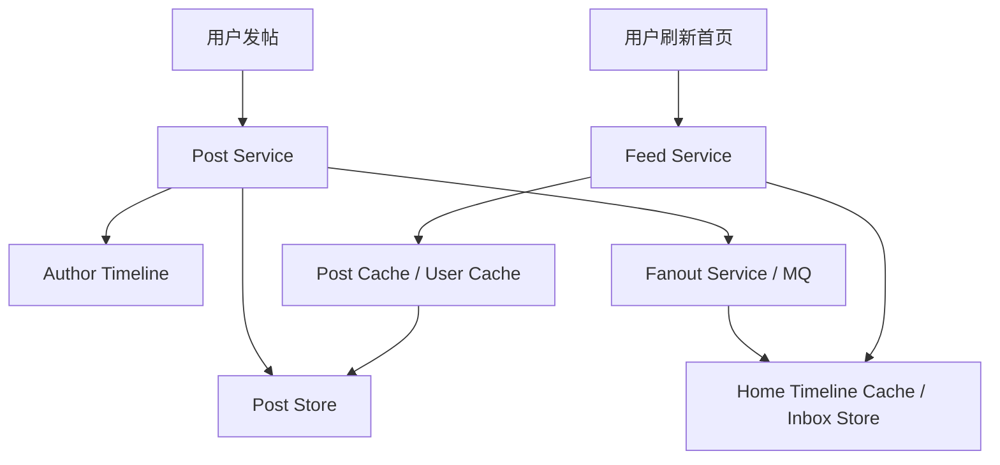

# 系统设计 - 案例 14：Twitter / News Feed 系统真题模拟

## 题目

设计一个类似 Twitter 或朋友圈首页的 Feed 系统，支持：

- 用户发内容
- 关注关系
- 首页 Feed
- 用户自己的 Timeline
- 点赞、评论计数

先不做：

- 复杂推荐广告
- 全文搜索
- 多媒体转码细节

## 这题为什么常考

Feed 是最能区分“会画图”和“真懂系统行为”的题之一。  
因为它会把很多系统设计核心矛盾揉在一起：

- 读多写少
- 写扩散 vs 读扩散
- 热点用户
- 缓存对象设计
- 分页与排序
- 社交图和内容对象解耦

这题如果答得好，说明你不仅知道组件，还能围绕访问模式做设计判断。

## 面试官视角：这题真正想考什么

这题通常在考：

1. 你能不能分清 `Home Feed` 和 `Author Timeline`
2. 你知不知道 `fanout on write` 和 `fanout on read`
3. 你会不会在“大 V 和普通用户”上做不同策略
4. 你能不能把缓存对象说到 ID 列表和详情对象这一层

## 结构化思考过程（可在面试里直接说出来的版本）

### 第一步：先澄清范围

我通常会先问：

1. 是只做关注流，还是要做推荐混排？
2. 首页按时间排序，还是要做复杂个性化排序？
3. 是否支持图片和视频？
4. 是否需要删除、屏蔽和隐私控制？
5. 是否支持超级大 V，还是用户粉丝量比较平均？

如果面试官不继续补充，我会主动收敛成：

- 先做关注流
- 首页以时间为主，少量可插入推荐位但不深挖
- 支持图文内容
- 支持删除和基础隐私过滤
- 明确考虑普通用户与大 V 的差异

### 第二步：给一轮粗估算

我会假设：

- DAU `1 亿`
- 日发帖量 `2000 万`
- 首页刷新请求日量 `20~50 亿`
- 读写比至少 `100:1`

这说明主矛盾通常不是“发帖太难”，而是“首页读取太贵”。

### 第三步：定义核心对象

核心对象至少有四类：

1. `post/tweet`
2. `follow_edge`
3. `author_timeline`
4. `home_timeline`

这里一定要主动说：  
`作者自己的 Timeline` 和 `用户首页 Feed` 不是同一个对象。

### 第四步：搭高层架构

### 第五步：明确主链路

#### 发帖链路

1. 写 post 主存储
2. 写作者自己的 Timeline
3. 根据 fanout 策略更新部分粉丝的 Home Timeline

#### 读首页链路

1. 先拿 Home Timeline 候选 ID 列表
2. 批量拉取 post 详情和作者信息
3. 做屏蔽、权限、去重和简单排序
4. 返回给客户端

### 第六步：主动深挖两个关键点

#### 深挖点 A：fanout on write vs fanout on read

##### 写时 fanout

优点：

- 首页读取快
- 读路径稳定

代价：

- 发帖时写扩散严重
- 大 V 发帖可能写爆

##### 读时 fanout

优点：

- 发帖便宜
- 大 V 成本可控

代价：

- 首页读放大严重
- 聚合与排序更贵

成熟系统通常会混合：

- 普通用户走写 fanout
- 大 V 走读 fanout

#### 深挖点 B：缓存什么

这题特别忌讳只说“加 Redis”。  
更成熟的回答是：

- 缓存 Home Timeline 候选内容 ID 列表
- 缓存 post 详情
- 缓存 user profile
- 热点计数单独缓存

原因是：

- 最终页面个性化太强，不适合长时间整体缓存
- ID 列表和对象详情复用度更高

## 参考答案（面试里可直接说的一版）

如果让我设计一个 Twitter/News Feed 系统，我会先把题目拆成四个核心对象：内容对象、关注关系、作者自己的 Timeline，以及用户首页 Home Feed。  
这里最关键的一点是：Author Timeline 和 Home Feed 不是一回事。前者是按作者维度顺序读取，后者是按“我关注的人集合”做聚合结果。

容量上我会先假设 DAU 在亿级，首页读取远大于发帖写入，所以我会把主矛盾定义为：首页读路径优化，而不是发帖本身。  
高层架构上，发帖时先写内容主存储和作者 Timeline，再通过 fanout 服务决定是否把内容推到粉丝的 Home Timeline。首页读取时，Feed Service 先拿候选内容 ID 列表，再批量拼装内容详情和作者信息。

真正要深挖的第一个点是 fanout 策略。  
如果对所有作者都用 fanout on write，那么大 V 发一条内容会导致极端写扩散；如果对所有作者都用 fanout on read，那么首页读取代价又太高。所以更现实的方案通常是混合策略：普通用户走写 fanout，大 V 走读 fanout。

第二个值得深挖的点是缓存对象。  
我不会优先缓存整个首页页面，而会缓存 Home Timeline 的候选 ID 列表、内容详情和作者 profile，因为这些对象复用度更高，也更容易在个性化场景里组合。  
再往后扩展，我会继续补游标分页、屏蔽关系、隐私过滤、热点用户治理和删除失效传播。

## 面试官可能继续追问什么

### 追问 1：为什么普通用户和大 V 不同策略

回答重点：

- 粉丝规模分布极不均匀
- 大 V 的写扩散成本可能指数级更高
- 对象分层比“一刀切”更现实

### 追问 2：Timeline 为什么更适合 cursor 分页

回答重点：

- offset 越往后越慢
- 新内容插入会造成重复/漏读
- 时间流列表天然更适合 `last_seen_id`

### 追问 3：删除内容怎么办

回答重点：

- 主存储删或打 tombstone
- Home Timeline 候选列表延迟清理
- 返回时再做二次过滤

### 追问 4：如果首页缓存 miss 了会怎样

回答重点：

- 可能回源 inbox store 或临时读聚合
- 做请求合并和热点保护
- 对极端热点用户采用预热

### 追问 5：如果要混入推荐怎么办

回答重点：

- Feed 结果不要只理解为纯关注流
- 可以在候选集合后加一层 merge/rerank
- 但主存储和候选构造仍要分层

## 常见失分点

1. 把 Home Feed 和 Timeline 混为一谈。
2. 只会背 `fanout on write/read`，但不会解释为什么要混合。
3. 只说“加缓存”，却说不清缓存 ID 列表还是详情对象。
4. 不提大 V 热点，以为所有用户分布都均匀。
5. 首页讲成“实时查所有关注者内容”，没有任何分层思维。

## 总结

Twitter / News Feed 这题最重要的，不是把组件说全，而是先抓住一句话：

`真正难的是首页，不是发帖。`

只要你围绕这句话去展开：

- Home Feed 和 Timeline 区分清楚
- fanout trade-off 讲清楚
- 缓存对象落到 ID 列表和详情层

这题就会非常有层次。

## 自测问题

1. 如果面试官把题目改成“朋友圈”，你的隐私过滤会比 Twitter 多哪些考虑？
2. 如果内容支持视频，你的首页卡片和详情对象缓存会怎么变化？
3. 如果某个大 V 突然爆红，系统哪几层最容易先成为热点？
4. 如果首页结果还要加广告和推荐位，你会把它插在哪个阶段？
