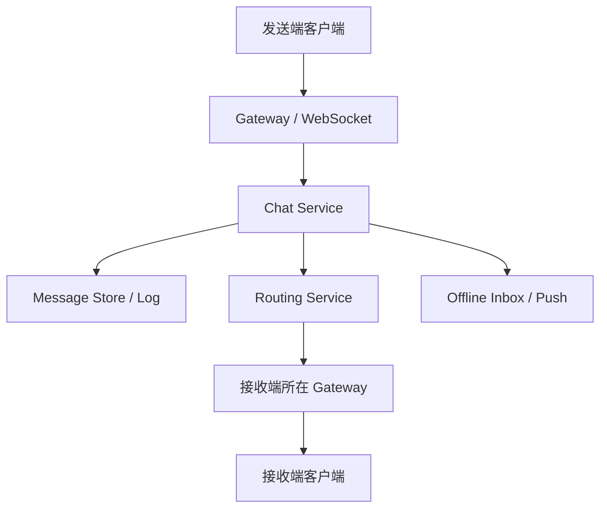

# 系统设计 - 案例 15：聊天系统真题模拟

## 题目

设计一个聊天系统，支持：

- 单聊
- 小群聊
- 离线消息
- 多端同步
- 未读数
- 已读回执

先不做：

- 端到端加密
- 消息搜索
- 超大群直播式广播

## 这题为什么常考

聊天系统是系统设计面试最容易“看起来会，细问就空”的题之一。  
因为它天然会考：

- 长连接
- 在线状态
- 消息路由
- 会话内顺序
- 多端同步
- 离线补拉
- 未读与已读

这题如果答顺了，说明你不仅会讲缓存和数据库，还知道“实时系统”和“内容系统”完全不是一回事。

## 面试官视角：这题真正想考什么

聊天题真正想考的通常是：

1. 你会不会先估在线连接，而不是只算消息 QPS
2. 你知不知道 Gateway 和路由状态层的重要性
3. 你会不会区分“消息日志”“会话状态”“未读状态”
4. 你能不能把顺序、多端同步和离线补拉讲清楚

## 结构化思考过程（可在面试里直接说出来的版本）

### 第一步：先澄清范围

我会先问：

1. 只做单聊，还是也要做群聊？
2. 是否需要离线消息？
3. 是否需要多端同步？
4. 是否需要已读回执？
5. 是否需要消息撤回和搜索？

如果面试官不继续补充，我会主动收敛：

- 先做单聊和小群聊
- 支持离线消息
- 支持多端同步
- 支持已读回执
- 先不做复杂搜索和端到端加密

### 第二步：给一轮粗估算

假设：

- DAU `3000 万`
- 高峰在线 `300 万`
- 平均每用户 `2` 个终端在线
- 长连接总数约 `600 万`
- 高峰消息发送 `10 万条/秒`

这组数字能帮助我先抓主矛盾：

- 第一瓶颈通常是连接层，不是数据库
- 第二瓶颈是消息路由和持久化

### 第三步：定义核心对象

我会至少拆成五个对象：

1. `conversation`
2. `message_log`
3. `membership`
4. `routing_session`
5. `last_read_seq`

这一步非常关键，因为聊天题如果只说“消息表”，后面未读、顺序、多端同步都会变得很难讲。

### 第四步：搭高层架构

### 第五步：明确主链路

#### 发送链路

1. 客户端通过长连接发消息
2. Gateway 完成鉴权与接入
3. Chat Service 为消息分配会话序号
4. 消息写入消息日志
5. 根据路由信息找到接收端在线设备
6. 在线则实时推送，离线则进入离线收件箱或推送服务
7. 返回 ACK 给发送端

#### 拉取链路

1. 用户上线后带着 `last_acked_seq`
2. 服务端按会话从消息日志中补拉缺失消息
3. 同步最近会话列表与未读状态

### 第六步：主动深挖两个关键点

#### 深挖点 A：顺序怎么保证

聊天系统通常不追求全局顺序，而追求：

- 单个会话内局部有序

常见做法是：

- 每个会话分配递增 `sequence`
- 按 `conversation_id` 路由到同一分区或同一顺序执行单元
- 客户端按 `sequence` 展示

这比一上来谈“全局顺序”更现实，也更像真实工程。

#### 深挖点 B：未读数怎么设计

最笨但最贵的做法是：

- 每条消息
- 对每个用户
- 都存一条已读/未读记录

这在群聊里写放大会爆炸。  
更成熟的做法通常是：

- 会话有 `last_seq`
- 用户在该会话里有 `last_read_seq`
- 未读数 = `last_seq - last_read_seq`

这就是典型的“用聚合状态替代逐条状态”的设计 trade-off。

## 参考答案（面试里可直接说的一版）

如果让我设计一个聊天系统，我会先明确这不是一个内容聚合题，而是一个实时分发题。  
容量上我会先估在线连接数，因为如果高峰在线有几百万用户，每个用户两个终端在线，那么长连接总数就会到几百万量级，连接层往往会先成为瓶颈。

我会把系统拆成五类核心对象：会话、消息日志、会话成员关系、在线路由状态，以及按会话维护的已读进度。  
高层架构上，前面会有一层 Gateway 集群维护 WebSocket 或长连接；消息进入 Chat Service 后，先写消息日志，再根据路由状态把消息推给接收方所在 Gateway；如果接收方离线，则进入离线收件箱或移动推送系统。

真正要深挖的第一个点是顺序。  
聊天系统一般不追求全局顺序，而是追求单个会话内局部有序，所以我会给每个会话分配递增 sequence，并按 `conversation_id` 做路由或分区，保证同一会话里的消息顺序可控。

第二个关键点是未读状态。  
我不会为每条消息、每个用户都维护一条已读记录，因为那在群聊里写放大会非常严重。  
更现实的做法是：会话维护最新 `last_seq`，每个用户维护自己在该会话中的 `last_read_seq`，未读数通过两者差值推导出来。

如果继续扩展，我还会补多端同步、离线补拉、ACK 语义、路由状态失效以及小群和超大群的差异化策略。

## 面试官可能继续追问什么

### 追问 1：为什么先写消息日志，再推送

回答重点：

- 推送不可靠，日志才是最终可补拉真相
- 系统不能假设实时推送必成功
- 离线消息与多端同步都依赖消息日志

### 追问 2：路由状态放哪里

回答重点：

- 通常是内存 + Redis/状态服务
- 它是派生状态，不一定是绝对真相源
- 心跳和重连会不断刷新

### 追问 3：为什么不直接用数据库表来维护在线状态

回答重点：

- 在线状态变化频繁
- 更适合内存态和轻量状态服务
- 数据库不适合承接高频心跳更新

### 追问 4：多端同步怎么做

回答重点：

- 一个用户可能多个设备在线
- 发送者自己的其他设备也要同步会话状态
- 已读和已送达状态要能回写其他设备

### 追问 5：群聊和单聊最大的差别

回答重点：

- 群聊带来广播、未读写放大、成员关系和热点问题
- 超大群往往要特殊处理，不能用普通小群方案一把梭

## 常见失分点

1. 没先估在线连接，只盯着消息 QPS。
2. 把聊天系统答成“WebSocket + Redis + MySQL”三件套。
3. 没讲 Gateway 和路由层。
4. 一上来就说全局顺序，没有意识到局部顺序才是重点。
5. 未读设计停留在“存个标记”，没有讲写放大和 `last_read_seq`。

## 总结

聊天系统最重要的一句话是：

`它首先是连接和路由系统，其次才是消息展示系统。`

只要你能围绕这句话去展开：

- 先讲连接层
- 再讲消息日志和路由
- 然后讲顺序、多端同步和未读

这题就会比大多数“组件罗列型”回答强很多。

## 自测问题

1. 如果用户刚切换网络，路由状态短时间不准，会对哪条链路影响最大？
2. 如果要支持消息撤回，你会把它做成“真删除”还是“状态事件”？
3. 如果是 10 万人大群，你觉得哪一层最先要特殊优化？
4. 如果面试官说“客户端自己排序不就行了”，你会如何解释为什么服务端仍然要分配 sequence？
