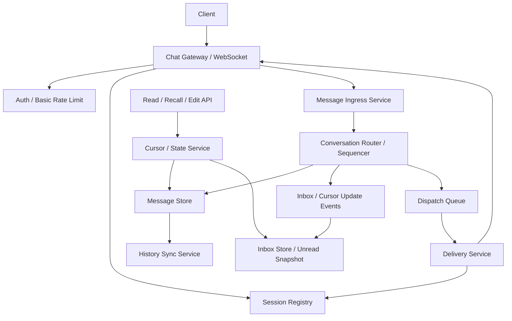

# 系统设计 - 案例 15：聊天系统真题模拟

## 题目

设计一个类似 WhatsApp / Slack 的聊天系统，支持：

- 单聊
- 群聊
- 多端登录
- 历史消息同步
- 已读未读
- 离线消息

先不做：

- 音视频通话
- 复杂社群推荐
- 全量端到端加密细节
- 复杂搜索和长期归档策略

## 为什么这题值得深讲

聊天题是系统设计面试里最容易让人“说得很热闹，但其实没说到点上”的题。

很多人一上来会说：

- `WebSocket`
- `Redis`
- `MQ`
- `MySQL`

这些词当然不是错的。  
但如果回答只停在这一层，基本等于没有真正设计系统。

因为聊天系统真正难的，不是：

- 怎么把一条消息塞进数据库

而是：

- 长连接怎么接入和扩容
- 消息顺序到底在哪个粒度保证
- “发送成功”“送达”“已读”分别是什么意思
- 多端登录时状态到底怎么收敛
- 群聊为什么不能简单按单聊线性放大
- 为什么在线投递和离线同步必须拆开
- 为什么几乎不可能做到严格 `exactly-once`

这题非常适合区分两类候选人：

- 会背组件的人
- 真正能围绕消息语义、状态边界和故障恢复做设计的人

## 面试官真正想看什么

这题通常在看下面几件事：

1. 你会不会先定义消息语义，而不是先报技术栈
2. 你能不能把接入、写入、投递、补拉、已读拆成不同链路
3. 你知不知道顺序通常只能保证在 `conversation` 维度
4. 你能不能区分“消息真相源”和“在线投递加速层”
5. 你会不会处理客户端重试、幂等去重、重连补拉
6. 你能不能把群聊按规模分层，而不是统一一套 fanout 策略
7. 你会不会主动谈故障窗口、退化语义和恢复路径

## 一开始先别急着设计，先收敛题目语义

聊天题的坑，很多不在技术，而在语义。

如果语义不收敛，后面几乎所有设计都会飘。

我会先主动澄清这些问题：

1. 这是偏移动 IM，还是偏企业协作工具？
2. 群聊最大规模是多少，`200`、`5000` 还是 `10 万`？
3. 多端登录时，是否要求所有在线设备都收到同一条消息？
4. 顺序要求是全局顺序，还是会话内顺序？
5. “发送成功”是指写入成功，还是指对方设备收到？
6. 已读是单聊需要，还是群聊也要精确到每个人读到哪一条？
7. 是否支持撤回、编辑、删除？
8. 消息是否包括大文件、图片、语音等媒体内容？

如果面试官不继续补充，我会主动把题目收敛成下面这个版本：

- 支持单聊和群聊
- 主要是文字消息，媒体内容只存引用，不展开媒体传输系统
- 支持多端同时在线
- 顺序目标是 `会话内顺序`
- 服务端确认语义默认是“消息已持久化”
- 投递语义默认是 `at-least-once`
- 离线消息靠重连后按游标补拉
- 单聊支持已读
- 群聊默认只做会话级未读和按规模分层的已读能力
- 支持短时间窗口内撤回，但不做真正物理删除

这里面有四个非常关键的产品选择。

### 选择 1：只保证会话内顺序，不保证全局顺序

为什么？

- 用户真正关心的是一段对话里先后关系对不对
- 不同会话之间做全局顺序，业务价值很低
- 但技术成本会极高，还会把整个系统拖进中心化发号瓶颈

所以这里必须先讲清楚：

- 顺序是 `conversation` 维度，不是全局维度

### 选择 2：先把“发送成功”“送达”“已读”拆开

这一步非常重要。

如果不先拆这三个语义，面试里后面所有话都会混在一起。

我会这样定义：

- `发送成功`：消息已经被服务端持久化
- `送达`：目标设备收到了消息帧，并返回 delivery ACK
- `已读`：用户在某个会话中把读游标推进到了某个 `server_seq`

这三个语义不是一回事。

尤其在多端和离线场景里：

- 写入成功不等于任一设备已收到
- 送达到某台设备不等于用户已读

### 选择 3：群聊已读要按规模分层

为什么？

- 小群逐人已读还比较可控
- 大群如果做“每个人读了每一条”，状态量会爆炸
- 很多产品在大群里根本不需要精确到这个粒度

所以我会主动把边界讲清楚：

- 小群可以做更细的已读游标
- 大群优先做会话级未读、已读人数、最近已读成员摘要

### 选择 4：消息正文和媒体内容要分离

聊天系统里经常会有图片、视频、文件、语音。

但消息真相源里最适合保存的是：

- 消息信封
- 消息元数据
- 对象存储引用

而不是直接把大二进制正文塞进消息存储主路径。

否则会带来：

- 写入链路变重
- 存储成本变差
- 历史同步变慢

## 第一步：先判断这是一个什么类型的系统

我会先明确：

- 这不是一个“普通 CRUD 系统”
- 这也不是一个“只有数据库就够”的系统
- 它本质上同时是四类系统叠在一起

第一类：

- 一个 `长连接接入系统`

第二类：

- 一个 `append-only message log 系统`

第三类：

- 一个 `在线路由与投递系统`

第四类：

- 一个 `断线恢复和状态收敛系统`

这意味着几个非常关键的结论：

1. 接入层首先面对的是连接数，不是请求数
2. 消息写入和在线投递必须拆开，否则互相拖累
3. 在线推送只是加速层，离线补拉才是最终兜底
4. 顺序一旦要得很严格，就一定会在最小顺序单元上引入串行化
5. Presence 在线状态是提示信息，不应该成为消息正确性的真相源

很多候选人会把聊天题答成：

- `WebSocket + MQ + DB`

但真正成熟的回答应该先说清楚：

- 主矛盾到底是什么

在聊天系统里，主矛盾通常不是：

- “怎么存一条消息”

而是：

- “怎么在顺序、时延、连接规模、多端同步和故障恢复之间找到平衡”

## 第二步：先做一轮容量估算，不然 trade-off 没锚点

我会先给一组面试里比较合理的假设：

- DAU `5000 万`
- 峰值在线用户 `1000 万`
- 平均每个在线用户 `1.5 - 2` 个在线设备
- 峰值长连接数 `1500 万 - 2000 万`
- 日消息量 `20 亿`
- 峰值发消息 `20 万 QPS`
- 群聊消息占比约 `20%`
- 单条消息信封加索引开销按 `0.8 - 1 KB` 估算

这组数字一出来，很多设计选择就有锚点了。

### 连接规模

如果峰值长连接是：

- `1500 万 - 2000 万`

假设单台 Gateway 稳定承载：

- `5 万 - 8 万` 个长连接

那接入层大致需要：

- `250 - 400` 台量级的 Gateway

而且这还没算：

- 预留冗余
- 灰度发布
- 区域隔离
- 心跳波动

这马上说明一件事：

- Gateway 层必须足够轻，不能承担重数据库事务和复杂业务逻辑

### 消息存储规模

如果日消息量是：

- `20 亿`

每条消息按 `1 KB` 落盘后估算：

- 约 `2 TB / 天`

如果热数据保留 `30 天`：

- 热存储就是 `60 TB+`

这说明：

- 消息真相源不能只按“小表存一下”思路来想
- 它更接近一个高吞吐 append log 存储问题

### 投递放大规模

逻辑消息量，不等于设备投递量。

比如一条单聊消息：

- 可能要推给接收方的 `1 - 3` 个在线设备
- 还要推给发送方自己的其他在线设备

如果是一条 `200` 人群消息：

- 假设在线率 `30%`
- 每个在线用户平均 `1.2` 台在线设备

那一条逻辑消息可能对应：

- `200 * 30% * 1.2 ≈ 72` 次在线设备推送

如果碰到更大的热点群：

- 在线 fanout 会瞬间放大很多倍

这说明：

- “逻辑消息写入” 和 “设备投递” 必须分开估算

### 延迟目标

我会顺手给出一个比较像真实产品的目标：

- 发送消息服务端确认 `P99 < 200 ms`
- 在线接收端可见 `P99 < 500 ms`
- 首屏最近消息同步 `P99 < 1 s`
- 重连后补拉延迟允许更高，但不能长时间阻塞

一旦这个目标定下来，后面的设计就自然出来了：

- 发送确认不能等待所有接收端 ACK
- 在线投递必须异步
- 历史同步和深分页不能压在发送主链路上
- 热门会话必须特殊处理

## 第三步：先定义不变量，而不是先选技术

这是聊天题最容易被忽略、但最能拉开差距的一步。

我会先定义下面这些不变量：

1. 消息在返回“发送成功”之前，必须先持久化到真相源
2. 顺序只在 `conversation_id` 维度保证
3. 每条消息是否可见，取决于会话成员关系和消息状态，而不是是否在线
4. 投递可以重复或延迟，但成功持久化的消息不能永久丢失
5. `read_cursor` 和 `delivery_cursor` 只能单调前进，不能回退
6. 客户端重试必须能通过 `client_msg_id` 做幂等去重
7. 在线状态只用于优化投递，不作为消息正确性的真相源
8. 撤回、编辑、删除本质上是状态变化，不能简单理解成“把一条记录删掉”

这几个不变量背后的意思，其实非常重要。

第一：

- 持久化先于投递

这句话是聊天系统的主心骨。  
只有它成立，重连补拉、离线消息、多端同步才有共同基础。

第二：

- 会话级顺序先于全局顺序

这决定了：

- 发号粒度
- 存储分区方式
- 未读计算方式

第三：

- 在线只是提示，不是真相

因为用户可能：

- 断线
- 弱网
- 多端同时在线
- ACK 丢失

所以你不能把“某设备在线”当成消息正确性的基础。

## 第四步：不要直接给最终方案，先走一遍真实设计推演

这一步是我想按第 13 章方式重点展开的地方。  
我不会直接把最终架构甩出来，而是像真的在设计系统一样，一步一步推。

## 第一轮思考：最朴素的方案是什么

最直观的聊天方案通常是：

1. 客户端通过 WebSocket 连到服务端
2. 收到消息后直接写 MySQL
3. 写成功后发一条 MQ
4. MQ 再把消息广播给接收方

这个方案有什么好处？

- 非常直观
- 功能看起来完整
- 小规模 demo 完全能跑

但只要规模一上去，问题会立刻暴露：

1. Gateway 既管连接又管重业务，容易成为大状态节点
2. MySQL 既扛消息写入又扛历史查询，写读互相影响
3. MQ 的分区顺序不等于业务会话顺序
4. 离线消息、多端同步、已读状态没有统一模型
5. 群聊一 fanout 就容易写放大

所以第一轮方案，只能算最小可用系统。

真正成熟的面试回答，不能停在这里。

## 第二轮思考：接入层和消息写入层必须拆开

既然连接数很大，Gateway 的职责就必须收紧。

我会把 Gateway 定位成：

- 鉴权
- 连接维护
- 心跳保活
- 基础协议解析
- 轻量级限流
- 转发到后端写入服务

而真正的业务动作，比如：

- 会话成员校验
- 分配消息序号
- 写入真相源
- 生成投递事件

应该放到独立的消息写入层。

为什么要这么拆？

因为：

- 长连接接入层和消息写入层面对的资源模型完全不同

Gateway 更像：

- 高连接数
- 低 CPU
- 高网络 IO

写入层更像：

- 低连接数
- 更重的业务校验
- 更重的存储交互

如果不拆，两个系统会互相拖累。

## 第三轮思考：顺序不能交给 MQ“天然解决”

很多回答会说：

- “把消息发到 MQ，MQ 天然有序”

这句话通常是不够严谨的。

因为 MQ 的有序，通常只是：

- 某个分区里的消息有序

但聊天题真正需要的是：

- 同一个 `conversation_id` 内的消息顺序稳定

这两者不天然等价。

如果没有明确保证：

- 同一会话总是被路由到同一顺序单元

那你就没法真正保证会话顺序。

所以更稳的做法是：

1. 先按 `conversation_id` 做路由
2. 让同一会话进入同一个顺序分区或同一个 sequencer
3. 在这个顺序单元里分配 `server_seq`
4. 再写入消息真相源

也就是说：

- 顺序不是 MQ 白送的
- 顺序是你通过“路由 + 分区 + 写入策略”设计出来的

## 第四轮思考：在线投递和离线同步不是同一个问题

这也是聊天题很容易被答混的地方。

很多人会把“消息发出去”和“接收方最终能看到消息”看成一件事。

其实不是。

更现实的拆法应该是：

- 写入成功后，立刻返回发送确认
- 在线设备尽快收到推送
- 没收到的设备，通过重连补拉恢复

如果你试图为：

- 每条消息
- 每个接收用户
- 每台设备

都记录一套完整投递状态

那状态量会非常重。

所以我更倾向的建模是：

- 在线投递是加速层
- 补拉是兜底层
- 设备只维护“自己已经收到到哪个 `seq`”的游标

这比“逐条消息逐设备状态表”更可控。

## 第五轮思考：群聊不能按单聊线性放大

单聊里一条消息通常只涉及：

- 一个发送方
- 一个接收方
- 少量在线设备

群聊不一样。

群聊天然面临：

- 成员规模差异极大
- 在线率差异大
- 热点会话突发流量明显

如果你把群聊简单设计成：

- “把单聊逻辑复制 N 份”

那你很快就会遇到问题：

1. 在线 fanout 很重
2. 离线副本写放大更重
3. 已读状态会爆炸
4. 热点群会把单个顺序分区打热

这说明：

- 群聊一定要按规模分层设计

## 传输协议怎么选

把系统主线推出来之后，再谈协议选型会更稳。

### 长轮询

优点：

- 实现简单
- 兼容性好
- 对某些受限网络环境更容易兜底

缺点：

- 实时性差
- 链接和请求切换开销大
- 服务端推送不够自然

更适合：

- 兼容性兜底
- 非主方案

### WebSocket

优点：

- 真正双向长连接
- 适合高频消息和服务端推送
- 协议生态成熟

缺点：

- Gateway 层连接管理更复杂
- 心跳、断线重连、水平扩展都要自己处理

更适合：

- 绝大多数互联网聊天系统主方案

### MQTT / 自定义长连协议

优点：

- 在移动端弱网、省电、包体效率上可能更优
- 某些 IoT 或超弱网场景表现更好

缺点：

- 客户端和服务端基础设施复杂度更高
- 面试里如果没有明确业务背景，容易把答案带偏

更适合：

- 有明确移动弱网优化诉求
- 团队愿意维护更复杂协议栈

### 我在这个题里的选择

如果这是一个常规聊天系统面试题，我会优先选：

- `WebSocket` 作为主协议

然后补一句：

- 极端场景可以退回长轮询
- 但主设计不应该围绕轮询展开

这样回答通常最稳。

## 第五步：消息真相源怎么选

这里我不会一上来就说：

- “上 MySQL”
- “上 Kafka”
- “上某某 NoSQL”

而是先看访问模式。

消息真相源的典型访问模式是：

- 按会话追加写
- 按会话和 `seq` 范围读
- 读最近窗口消息远多于深历史
- 还会有少量状态变更，如撤回、编辑、删除标记

这说明它本质上更像：

- 以会话为逻辑单位的 append log 存储

而不是一个普通关系型 CRUD 表。

## 主存储方案比较

### 方案 A：关系型数据库统一承载

优点：

- 模型直观
- 事务能力强
- 早期实现成本低

缺点：

- 高吞吐追加写不一定最优
- 深分页、冷热分层、海量消息成本会越来越重
- 会话维度顺序和扩展性设计起来不够自然

适合什么时候：

- 早期产品
- 流量不大
- 目标是先做出稳定闭环

### 方案 B：消息日志存储 + 元数据分离

做法：

- 消息正文与序号进入 append-friendly 的消息存储
- 会话元数据、成员关系、游标、会话列表进入关系型或 KV 存储

优点：

- 更贴近真实访问模式
- 更适合高吞吐追加写
- 更容易做冷热分层和历史归档

缺点：

- 系统会更复杂
- 需要处理多类存储之间的一致性边界

适合什么时候：

- 中大规模消息系统
- 会话和消息量已经明显上来

### 方案 C：直接把 MQ 当消息真相源

这个方案表面上很诱人，因为：

- MQ 吞吐高
- 也有分区顺序

但问题也很明显：

- 历史查询能力通常不够自然
- retention 和业务归档策略不完全一致
- 多维查询和分页能力差
- 成员权限变化、消息状态更新也不适合直接靠 MQ 表达

所以我一般会明确说：

- MQ 更适合做传输和异步分发
- 不适合直接承担完整消息历史真相源

### 我在这个题里的回答方式

如果这是面试题，我会给一个更稳的分阶段回答：

- `V1`：关系型或宽表存储承接消息真相源，先跑通闭环
- `V2`：随着消息量上升，演进成“消息日志存储 + 元数据分离”

并且我会明确区分：

- `message store` 是消息真相源
- `dispatch queue` 是投递加速链路

这两个角色不能混为一谈。

## 第六步：顺序号到底怎么分配

聊天题如果想讲深，必须把两个 ID 分开：

- `message_id`
- `server_seq`

### 为什么要同时有 `message_id` 和 `server_seq`

`message_id` 更像：

- 一条消息的全局唯一身份标识

用途通常包括：

- 去重
- 审计
- 撤回 / 编辑时引用目标消息

而 `server_seq` 更像：

- 某个会话里的顺序号

用途通常包括：

- 历史拉取
- 未读计算
- 已读推进
- 会话内排序

所以这两个字段解决的不是同一类问题。

### 方案 A：全局递增序号

做法：

- 所有消息共用一个全局发号器

优点：

- 看起来简单
- 全局上天然可排序

缺点：

- 没必要
- 业务价值低
- 中心化瓶颈明显
- 跨会话竞争严重

所以聊天题里，一般不应该选这个。

### 方案 B：按分区序号

做法：

- 先把消息按某种 hash 分区
- 每个分区内部递增编号

优点：

- 比全局发号更可扩展

缺点：

- 分区内顺序不等于会话顺序
- 如果同一会话落到多个分区，顺序语义就会出问题

### 方案 C：会话级 `server_seq`

做法：

- 同一个 `conversation_id` 总是被路由到同一个顺序单元
- 在该顺序单元里为会话分配递增 `server_seq`

优点：

- 和业务语义最贴合
- 最适合做已读、补拉、会话分页

缺点：

- 热门会话会形成局部热点
- 会话级顺序天然意味着一定程度串行化

### 我在这个题里的选择

我会选：

- 全局唯一 `message_id`
- 会话级单调递增 `server_seq`

并且会补一句：

- 真正需要强保证的是会话内顺序
- 不应该为全局顺序付出中心化成本

## 热门会话为什么是聊天题的隐藏难点

这个点很容易被忽略，但很能体现设计成熟度。

如果你坚持：

- 某个会话里严格按一个 `server_seq` 序列线性化

那你就必须接受一个事实：

- 同一会话的写入，不可能无限水平扩展

这不是技术菜不菜的问题。

而是因为：

- 只要顺序要得足够强，那个顺序单元就天然存在串行化边界

### 选择 A：坚持严格线性化，接受单热点瓶颈

优点：

- 语义清晰
- 客户端简单
- 未读、已读、补拉都很好做

缺点：

- 热门群会打热单个顺序单元

### 选择 B：放宽顺序，换更高吞吐

做法可能包括：

- 按线程分子会话
- 按消息类型分轨
- 只保证局部有序

优点：

- 更容易扩展

缺点：

- 产品语义会变复杂
- 客户端排序和状态收敛更难

### 我在这个题里的选择

如果面试题没有明确要求超大直播群或频道，我会选择：

- 保持会话级线性顺序

然后针对极热点会话做工程手段：

- 群规模上限
- 发言频控
- 批量投递
- 在线广播优化
- 必要时把超大群设计成不同产品形态，而不是硬套普通群聊模型

这比空口说“无限扩展同时严格有序”更真实。

## 第七步：把最终高层架构定下来

在前面几轮推演之后，一个更成熟的架构会长这样：

这个图里我最想强调的不是组件名字，而是边界：

- Gateway 负责连接，不负责重存储逻辑
- Sequencer 负责顺序和持久化
- Dispatch 负责在线投递
- History Sync 负责补拉
- Inbox / Cursor 是派生状态，不是消息真相源

## 第八步：把 API 和协议动作说清楚

如果我想把答案讲得更工程化，我会把动作接口也顺手定义一下。

### 建连与鉴权

客户端通过：

- `WebSocket /connect`

或等价握手方式建连。

关键字段通常包括：

- `user_id` 对应的鉴权 token
- `device_id`
- `client_version`
- 最近一次已知同步点

服务端返回：

- `conn_id`
- 心跳配置
- 是否需要立即补拉

### 发送消息

客户端 frame 或 API 可以抽象成：

- `send_message`

关键字段：

- `conversation_id`
- `client_msg_id`
- `payload_type`
- `payload`
- `attachment_ref` 可选
- `client_ts`

### 服务端确认

服务端返回：

- `message_id`
- `conversation_id`
- `server_seq`
- `persisted_at`
- `status=accepted`

这里我会明确：

- 返回 `accepted`，表示消息已持久化
- 不表示所有接收设备都已收到

### 历史同步

我会给出两个典型动作：

`GET /v1/inbox`

用于拉取：

- 最近会话列表
- 最新摘要
- 未读快照

`GET /v1/conversations/{id}/messages?after_seq=&limit=`

用于：

- 重连补拉
- 打开会话窗口时拉最近消息
- 深分页历史查询

### 标记已读

`POST /v1/conversations/{id}/read`

关键字段：

- `last_read_seq`
- `device_id`

这里要说明：

- 最终的用户已读，通常是用户维度而不是设备维度
- 设备维度可以先上报，再在服务端做收敛

### 撤回 / 编辑

`POST /v1/messages/{message_id}/recall`

`POST /v1/messages/{message_id}/edit`

这类动作不应该理解成：

- “把一条旧消息直接改没”

而应该理解成：

- 写入状态变更
- 推动客户端状态收敛

## 第九步：把核心数据模型说深一点

### 会话元数据表

`conversation`

关键字段：

- `conversation_id`
- `type` 单聊 / 群聊
- `owner_id`
- `max_seq`
- `member_count`
- `created_at`
- `last_message_at`
- `status`

关键作用：

- 会话身份
- 当前最大序号
- 基础统计和状态

### 会话成员表

`conversation_member`

关键字段：

- `conversation_id`
- `user_id`
- `role`
- `join_seq`
- `leave_seq`
- `mute_state`
- `notify_policy`
- `updated_at`

这里 `join_seq` 很重要。

因为它决定：

- 用户从哪一条消息开始可见
- 未读应该从哪里开始算

### 消息日志表

`message`

关键字段：

- `message_id`
- `conversation_id`
- `server_seq`
- `sender_id`
- `client_msg_id`
- `payload_type`
- `payload`
- `attachment_ref`
- `created_at`
- `status`
- `edited_at`
- `recalled_at`

关键索引或组织方式：

- `(conversation_id, server_seq)` 作为主读路径
- `(conversation_id, sender_id, client_msg_id)` 用于幂等去重

### 会话列表派生表

`inbox_entry`

关键字段：

- `user_id`
- `conversation_id`
- `last_visible_seq`
- `last_message_digest`
- `last_message_at`
- `unread_count_snapshot`
- `pin_state`
- `mute_state`
- `updated_at`

这个表不是消息真相源。  
它更像一个：

- 用户视角的派生 inbox 视图

### 连接绑定表

`session_binding`

关键字段：

- `user_id`
- `device_id`
- `gateway_id`
- `conn_id`
- `region`
- `last_heartbeat_at`

这个表的作用是：

- 让投递服务知道某个用户的设备目前连在哪个 Gateway

### 投递游标表

`delivery_cursor`

关键字段：

- `user_id`
- `device_id`
- `conversation_id`
- `last_delivered_seq`
- `updated_at`

它表示的是：

- 这个设备已经确认收到该会话的哪个序号

### 已读游标表

`read_cursor`

关键字段：

- `user_id`
- `conversation_id`
- `last_read_seq`
- `updated_at`

它表示的是：

- 这个用户在该会话里已经读到哪里

这里我会顺手强调：

- `delivery_cursor` 是设备维度
- `read_cursor` 通常是用户维度

这两个维度通常不一样。

## 第十步：真正把发送主链路拆开来讲

聊天题如果想讲深，发送链路一定要拆细。

## 发送链路的理想延迟预算

我会给一个大致预算：

- Gateway 鉴权与协议解析：`1 - 5 ms`
- 路由到 sequencer：`1 - 3 ms`
- 会话成员校验：`1 - 5 ms`
- 分配 `server_seq` 并持久化：`5 - 20 ms`
- 返回发送确认：整体 `10 - 50+ ms`

这个预算说明一件事：

- 真正决定发送确认延迟的，是持久化和顺序分配
- 不是在线投递本身

## 发送流程

一个更现实的发送链路应该是：

1. 客户端通过 WebSocket 发送消息，同时携带 `conversation_id` 和 `client_msg_id`
2. Gateway 做鉴权、协议解析、基础频控和消息体大小校验
3. 请求被路由到负责该会话的 `ingress / sequencer`
4. Sequencer 校验发送者是否仍在该会话中，以及是否有发言权限
5. Sequencer 为该会话分配下一个 `server_seq`
6. 消息被写入消息真相源
7. 写入成功后，生成：
   - 在线投递事件
   - 会话列表更新事件
   - 未读快照更新事件
8. 服务端立即返回发送确认给发送方设备
9. Dispatch 异步把消息推送给：
   - 接收方在线设备
   - 发送方自己的其他在线设备

这里一定要主动讲一句：

- 发送成功的确认，应该以“写入真相源成功”为边界

而不是：

- 以“所有设备都收到了”为边界

否则发送接口会被接收端在线状态、网络质量和 ACK 状态绑死。

## `client_msg_id` 应该怎么用

这个点很小，但非常实战。

客户端在弱网环境里非常容易重试。

比如：

- 消息写入成功了
- 但 ACK 在返回途中丢了
- 客户端以为失败，重新发送

如果没有 `client_msg_id`：

- 服务端就可能插入两条相同消息

更稳的做法是：

- 以 `(conversation_id, sender_id, client_msg_id)` 作为幂等键

如果检测到重复：

- 返回同一条消息的既有结果
- 而不是新建一条消息

这个机制，是聊天系统“看起来简单，但必须讲”的典型工程细节。

## 第十一步：把在线投递讲成加速层，而不是唯一链路

很多人会说：

- “消息写完后推给对方就好了”

但真正设计时，你需要把投递层讲成一个独立系统。

## 在线投递怎么拆

### Session Registry 做什么

它维护的是：

- `user / device -> gateway / conn`

映射关系。

这样当一条消息需要投递给某个用户时，投递服务可以知道：

- 这个用户当前哪些设备在线
- 这些设备分别挂在哪个 Gateway 上

### Dispatch Service 做什么

它负责：

- 消费消息写入后的投递事件
- 查 Session Registry
- 过滤静音、退订、已下线设备
- 把消息发送到对应 Gateway

### Gateway 做什么

Gateway 只负责：

- 把消息帧推给具体连接
- 接收客户端 ACK
- 把 ACK 汇报给后端

也就是说：

- 在线投递是“消息已经存在之后”的一层加速分发

## ACK 怎么设计

聊天系统里，ACK 最好拆成三种。

### 发送 ACK

由服务端返回给发送方。

语义是：

- 消息已经持久化

这决定了：

- 客户端可以把本地消息状态从“发送中”切到“已发送”

### 送达 ACK

由接收设备返回给服务端。

语义是：

- 这台设备确实收到了消息帧

它通常用于：

- 推进 `delivery_cursor`
- 进行重投控制

### 已读 ACK

由用户主动上报。

语义是：

- 这个用户已经读到某个 `server_seq`

它用于：

- 推进 `read_cursor`
- 计算未读
- 触发单聊已读状态展示

把这三种 ACK 拆开之后，整个系统语义会清楚很多。

## 为什么不能记录“每条消息对每台设备的完整状态表”

表面上看，这个设计很直观：

- 一条消息
- 每台设备
- 一条状态记录

但规模一上去就会很可怕。

尤其群聊里，一条消息可能关联：

- 很多用户
- 很多设备

如果每条都要落全量状态：

- 写放大会非常明显
- 存储和更新成本都会失控

所以更现实的方案通常是：

- 在线设备走 push + ACK
- 离线设备走 pull
- 设备维度只保留游标，不维护每条状态矩阵

## 第十二步：历史同步和离线补拉怎么做

这一步如果讲不好，聊天答案通常会显得很空。

## 补拉为什么应该基于 `server_seq`

因为：

- `server_seq` 是会话内的稳定顺序坐标

一旦客户端断线重连，只要它带上：

- 自己最后收到的 `last_delivered_seq`

服务端就能回答：

- “从这个点之后，你还缺哪些消息”

这比基于时间戳补拉更稳。

因为时间戳会遇到：

- 客户端时钟不准
- 同毫秒多条消息
- 排序歧义

### 重连补拉

典型流程是：

1. 客户端重连后上报自己各会话的已知游标
2. 服务端读取 `delivery_cursor`
3. 对每个会话按 `after_seq` 拉取缺失消息
4. 客户端收到后本地去重并按序落地

### 首次打开会话

对于首次打开某个会话窗口：

- 先查 `inbox_entry`
- 再拉最近一页消息

通常不需要一上来补全所有历史。

### 深分页与冷热分层

最近窗口消息访问最频繁。

所以我会考虑：

- 最近消息放热层
- 更老历史放冷层或低成本存储

客户端深翻页时，再去访问冷历史。

## 离线很久怎么办

如果用户几天甚至几周没上线，再次登录时不应该：

- 把所有历史一次性全推给客户端

更稳的做法是：

- 先同步会话列表和未读快照
- 用户进入具体会话后，再按需拉该会话消息

这样可以避免：

- 首次登录时巨大的补拉风暴

## 为什么“离线消息表”通常不是最终形态

有些简单系统会做一张：

- `offline_message`

看起来很合理。

但规模一上去，这种表通常会遇到问题：

- 多端登录语义变复杂
- 删除时机难定义
- 会话级补拉不自然
- 群聊写放大严重

所以更成熟的模型通常是：

- 消息只有一份真相源
- 离线只是“你还没拉到哪”

这就是游标模型比离线副本模型更稳的原因。

## 第十三步：未读设计要怎么讲才像真的做过

## 未读为什么不是扫消息正文

最差的设计通常是：

- 每次打开会话时扫一遍消息表，看哪些没读

这在大规模场景下非常不现实。

更合理的做法是：

- 会话维护 `max_seq`
- 用户维护 `last_read_seq`

未读大致可以表示成：

- `max_seq - last_read_seq`

这样读路径就轻很多。

## 单聊未读

单聊里，已读语义通常更强。

典型做法是：

- 接收方把 `last_read_seq` 上报
- 发送方侧收到一个“对方已读到哪里”的状态更新

这样客户端就能展示：

- 已送达
- 已读

## 群聊未读

群聊里更现实的做法是分层。

### 小群可做逐人 `last_read_seq`

优点：

- 语义清晰
- 可以展示“谁已经读到哪”

缺点：

- 状态量随人数增长

### 大群只做计数或已读人数摘要

优点：

- 成本更可控

缺点：

- 语义没那么细

但大群里通常也不需要：

- 准确知道每个人读了每一条消息

## `max_seq - last_read_seq` 有哪些前提

这个公式很常见，但不是无条件成立。

它至少依赖几个前提：

1. 会话内 `server_seq` 单调且可连续用于用户可见消息窗口
2. 用户加入会话前的消息不应计入自己的未读
3. 某些系统消息如果不算未读，需要单独处理

所以更严谨的表达应该是：

- 未读基于 `visibility window + read cursor` 计算

在简单场景下可以落成：

- `max_seq - max(last_read_seq, join_seq - 1)`

如果消息类型很多、过滤规则复杂：

- 就把未读快照物化到 `inbox_entry`

## 第十四步：多端同步到底怎么定义

多端同步不是一句：

- “都能收到消息”

就讲完了。

它至少包含三个问题。

### 发送方其他设备要不要收到自己的消息

大多数成熟聊天产品里，这个答案是：

- 要

因为用户可能：

- 手机上发消息
- 电脑端会话窗口也需要立刻看到

所以服务端在写入成功后，除了给接收方设备投递，还要给：

- 发送方自己的其他在线设备

同步同一条消息。

### 状态事件要不要多端同步

除了正文消息，多端还需要同步很多状态：

- 已读推进
- 撤回
- 编辑
- 置顶
- 免打扰

否则同一个用户在不同端看到的会话状态会很容易不一致。

### 设备去重怎么做

多端同步里要注意两个重复来源：

1. 服务端重投
2. 客户端补拉后又收到在线推送

所以客户端必须支持基于：

- `message_id`
- `conversation_id + server_seq`

进行幂等落地。

这也是为什么我前面强调：

- 在线推送是加速层
- 补拉是兜底层

因为两条链路最后会在客户端汇合。

## 第十五步：群聊必须按规模分层设计

群聊是这道题真正容易被追爆的地方。

### 小群：在线定向推送为主

如果群规模是：

- 几十到几百人

那比较自然的方案是：

- 消息落会话日志
- 在线成员做定向推送
- 离线成员靠补拉

这个模型简单、好理解，也足够实用。

### 中群：推送 + 补拉混合

如果群规模继续变大，比如：

- 几百到几千

这时我会更谨慎地处理：

- 推送粒度
- 已读粒度
- 会话列表更新策略

常见做法是：

- 在线用户仍然尽量推
- 但不再为离线用户写大量专属副本
- 未读更多依赖会话级游标和 inbox 快照

### 大群 / 频道：会话日志 + 在线广播提示 + 客户端拉取

如果群聊进一步演进成：

- 超大群
- 社区频道
- 类直播讨论区

那更适合的设计往往是：

- 消息统一落会话日志
- 在线用户收到“有新消息”的广播提示或轻量消息流
- 客户端再按游标主动拉取

因为这时候如果还坚持：

- 每条消息对每个成员都做完整 fanout

成本会非常重。

## 为什么不能给每个成员都写一份离线副本

这个想法在群聊里特别危险。

因为一条群消息如果成员很多：

- 写放大会直接按成员数线性增长

这会导致：

- 存储成本高
- 删除和撤回更复杂
- 多端语义更复杂

所以群聊里更成熟的思路通常是：

- “一份会话日志 + 多个游标”

而不是：

- “一条消息复制成 N 份成员副本”

## 提醒、@mention、免打扰怎么放进去

这也是一个很像真实系统的小点。

不是所有消息都值得同等强度地推送。

所以我会把推送策略设计成分层：

- 普通消息：按会话通知策略推送
- `@mention`：高优先级提醒
- 免打扰会话：只更新未读，不主动强提醒

这样说明你意识到：

- “消息投递” 和 “通知提醒” 不是同一个系统动作

## 第十六步：撤回、编辑、删除这些动作怎么做

这部分很适合体现你是不是把聊天系统当成状态机来看。

### 方案 A：原地更新消息状态

做法：

- 直接把目标消息的状态改成 recalled / edited

优点：

- 实现直观

缺点：

- 多端如何及时感知变化，需要额外机制
- 仅靠最终状态，不容易表达变化顺序

### 方案 B：写一条状态变更事件

做法：

- 对撤回、编辑等动作也写一条控制事件
- 控制事件带新的 `server_seq`

优点：

- 所有设备都按同一顺序看到状态变化
- 更适合多端同步和重连恢复

缺点：

- 客户端处理逻辑更复杂
- 需要额外维护目标消息当前快照

### 我在这个题里的选择

更现实的做法通常是：

- 消息主记录保留当前状态快照
- 同时写状态变更事件推动客户端收敛

也就是说：

- “存当前状态” 和 “记录变化轨迹” 可以同时存在

这样既利于：

- 当前查询

又利于：

- 多端恢复
- 审计
- 事件顺序一致

## 为什么不建议硬删除正文

如果你直接物理删掉消息：

- 多端补拉会很难解释
- 已读和未读窗口可能变得不稳定
- 审计和回溯能力也会变差

所以更常见的产品做法是：

- 逻辑删除
- 状态标记
- 客户端展示“消息已撤回”

而不是：

- 真把整条消息从真相源里抹掉

## 第十七步：异常路径与工程细节

如果没有这部分，聊天答案通常还不够像真的做过。

### 为什么几乎不可能严格 `exactly-once`

典型故障窗口是：

1. 消息已经落库
2. 发送 ACK 返回途中断网
3. 客户端以为失败，再次重试

这时系统最现实的语义通常是：

- 服务端至少一次持久化
- 客户端通过 `client_msg_id` 幂等去重

也就是：

- `at-least-once + idempotency`

如果有人在面试里直接说：

- “我们保证 exactly-once”

面试官通常会继续追问到你露出破绽。

### Gateway 挂了怎么办

聊天系统里 Gateway 挂掉，首先受影响的是：

- 连接断开

但只要：

- 消息真相源还在
- 游标还在

客户端就可以：

- 重连到新的 Gateway
- 再按游标补拉缺失消息

所以 Gateway 故障通常不是数据丢失问题，更多是：

- 在线体验中断问题

### Sequencer / Router 挂了怎么办

这个组件如果负责：

- 会话路由
- 分配 `server_seq`

那它故障时要特别关注：

- 同一会话不能同时出现两个写主

所以我会强调：

- 顺序单元要么通过租约 / leader 选举保证单写
- 要么背后挂可靠存储做提交边界

重点不是把高可用讲得多花哨。

重点是让面试官知道你意识到：

- 顺序和高可用之间存在明确耦合

### Dispatch 积压怎么办

如果投递队列积压了，会发生什么？

- 在线消息到达变慢
- 但消息历史不应该丢

所以我会做两个退化动作：

1. 在线推送允许变慢
2. 客户端重连或前台打开会话时，优先触发主动补拉

这再次体现：

- 真相源和投递层必须拆开

### 客户端重复发送怎么办

这里回答重点就是：

- `client_msg_id`
- 幂等表或唯一索引
- 重试返回既有结果

### 热点会话打爆单分区怎么办

这个问题没有魔法答案。

更诚实也更成熟的说法是：

- 如果要严格保证一个会话内顺序，那这个会话的写入就天然存在单热点边界

系统层面可以做的是：

- 群规模控制
- 发言限流
- 机器人消息限速
- 批量推送优化
- 把超大房间升级成不同产品模型

但不应该假装：

- “在完全不改产品语义的前提下，可以无限扩容又完全严格有序”

### 如何做限流和退化

聊天系统里我会至少做三层保护：

- Gateway 连接级限流
- 发送接口用户级 / 会话级限流
- 热门会话专项保护

当系统压力大时，退化优先级通常是：

1. 先降低在线推送实时性
2. 再降低部分低优先级状态事件实时性
3. 最后才影响消息写入主链路

因为：

- 持久化和补拉能力是系统底线

## 第十八步：把安全和治理讲进去，不然答案还不够真实

聊天系统天然会遇到很多治理问题。

### 接入安全

- 登录态鉴权
- 设备绑定与踢下线
- 心跳频控
- 恶意建连防刷

### 内容治理

- 敏感内容审核
- 反垃圾消息
- 频繁发送检测
- 举报和封禁

### 关系治理

- 黑名单
- 单聊拒收
- 群禁言
- 退群后的可见性边界

### 隐私与合规

- 消息存储保留周期
- IP / 设备标识脱敏
- 审计权限控制

### 如果引入 E2EE，会牺牲什么

这个题目里我们没展开端到端加密。  
但如果面试官追问，我会补一句：

- 一旦走到强 E2EE，服务端对正文的可见性会下降
- 搜索、审核、跨端恢复、服务端渲染能力都会受到影响

这可以体现你知道：

- 安全能力和服务端能力之间存在 trade-off

## 第十九步：如果题目升级到全球访问，我怎么讲

如果面试官问：

- “用户在全球，怎么做低延迟聊天？”

我不会一上来就说：

- “全球多主”

因为聊天题里最难的恰恰是：

- 顺序和多写冲突

### 接入层

我会先做：

- 多区域 Gateway 就近接入

这样用户建连和心跳延迟会明显更好。

### 写路径

真正写消息时，我更倾向：

- 每个会话有一个 `home region`

同一会话的消息仍然在一个主区域线性化并分配 `server_seq`。

这样做的好处是：

- 顺序语义清晰
- 不需要全球多主冲突解决

代价是：

- 跨区域会话发送时，需要转发到 home region

但相比全局多主顺序写，这通常更现实。

### 读路径

历史同步可以做：

- 热窗口跨区域复制
- 或区域缓存加速

但真相源的写入仍以会话 home region 为准。

### 在线状态与会话列表

Session Registry 可以：

- 分区域维护
- 再做全局汇聚或异步复制

这里也不需要追求强一致。

因为在线状态本来就只是：

- 投递优化信息

### 为什么我不选“全球多主顺序写”

因为那意味着你要同时解决：

- 跨区域写冲突
- 顺序合并
- 时钟和网络抖动
- 多地 leader 漂移

而对于大多数聊天产品来说：

- 会话级单主写 + 全球就近接入

是更现实的平衡点。

## 第二十步：如果继续演进，这个系统会怎么长大

一个真实系统不会从 Day 1 就是完全体。

所以我会主动给出演进路径。

### 阶段 1：单区域 Gateway + 单套消息存储

适合：

- 早期产品
- 规模不大

关键目标：

- 跑通建连、发送、补拉、未读闭环

### 阶段 2：接入层和写入层拆分

适合：

- 连接数和消息量明显上升

关键动作：

- 独立 Gateway
- 独立 Sequencer / Ingress
- 引入 Session Registry
- 引入 Dispatch Queue

### 阶段 3：消息真相源和元数据分离

适合：

- 消息历史规模和热点会话明显增加

关键动作：

- 会话消息进入更 append-friendly 的存储
- inbox / cursor 进入派生存储
- 最近窗口和冷历史分层

### 阶段 4：群聊按规模分层

适合：

- 群聊场景复杂
- 大群和小群差异变大

关键动作：

- 小群强推送
- 大群偏日志 + 拉取
- 已读能力按规模退化

### 阶段 5：多区域接入 + 会话 home region

适合：

- 全球用户访问明显

关键动作：

- 多区域 Gateway
- 会话级 home region
- 热窗口跨区域加速

这种“按阶段演进”的回答，比一上来堆满所有组件，更像真实工程。

## 面试里我会怎么讲最终方案

如果让我设计一个聊天系统，我会先把语义收敛清楚：  
顺序只保证在 `conversation` 维度；服务端发送成功的边界是消息已经持久化；在线投递采用 `at-least-once`，离线消息通过重连后的游标补拉恢复；多端同时在线时，发送方自己的其他设备也需要同步消息和状态事件。  
这样收敛后，系统的不变量就很明确了：消息真相源必须先落盘，在线状态不是正确性的真相源，已读和送达要分开建模。

架构上我会拆成接入层、消息写入层、在线投递层、历史同步层和游标 / inbox 派生层。  
客户端通过 WebSocket 连接 Gateway，Gateway 负责鉴权、心跳和轻量限流；消息按 `conversation_id` 路由到 sequencer，在该顺序单元里分配 `server_seq` 并写入消息真相源；写入成功后立即给发送方返回 ACK，同时异步生成投递事件和 inbox 更新事件。  
接收方在线设备由 Dispatch Service 根据 Session Registry 做定向投递；没收到的设备，不靠“离线副本”兜底，而是靠 `last_delivered_seq` 在重连后补拉。

数据模型上，我会把消息日志、会话成员、设备连接绑定、投递游标、已读游标和会话列表拆开。  
未读优先基于 `max_seq` 和 `last_read_seq` 计算，必要时把快照物化到 `inbox_entry`。  
群聊不会和单聊共用完全相同的分发策略，而是按规模分层：小群更偏推送，大群更偏“会话日志 + 在线广播提示 + 客户端拉取”。  
如果继续深挖，我会重点讲顺序分配、`client_msg_id` 幂等、ACK 语义拆分、热点会话退化，以及为什么全球场景下我仍然倾向会话级单主写而不是全球多主顺序写。

## 面试官如果继续追问，我会怎么答

### 追问 1：为什么不能保证全局顺序

回答重点：

- 业务价值低
- 成本极高
- 会把发号和写入变成中心瓶颈
- 用户真正关心的是会话内顺序

### 追问 2：消息写入成功但推送失败怎么办

回答重点：

- 真相源已经在
- 在线推送只是加速层
- 失败设备靠重投或重连补拉恢复

### 追问 3：为什么不能只靠 MQ 做消息存储

回答重点：

- MQ 更适合传输和异步分发
- 历史查询、深分页、状态更新、保留策略都不够自然
- 消息真相源和分发队列职责不同

### 追问 4：大群为什么不能精确记录谁读了哪条

回答重点：

- 状态量爆炸
- 写放大太高
- 产品上往往不值得
- 更合理的是按群规模做能力退化

### 追问 5：一个会话特别热怎么办

回答重点：

- 会话级严格顺序天然意味着单热点边界
- 工程上做限流、批量投递、群规模控制
- 必要时调整产品模型，而不是假装无限扩展

### 追问 6：客户端重试导致重复发送怎么办

回答重点：

- `client_msg_id`
- `(conversation_id, sender_id, client_msg_id)` 幂等键
- 重复请求返回既有消息结果

### 追问 7：如果用户在多端同时读消息，已读怎么收敛

回答重点：

- 设备可以分别上报读取位置
- 服务端汇总成用户级 `last_read_seq`
- 再把已读状态同步到用户其他设备

## 常见失分点

1. 一上来就说 `WebSocket + Redis + MQ + MySQL`，但讲不清消息真相源。
2. 不先定义“发送成功”“送达”“已读”的边界。
3. 上来就说保证消息全局有序。
4. 不讲 `client_msg_id`、ACK、重连补拉和幂等去重。
5. 把群聊简单按单聊 fanout 放大。
6. 未读设计成扫描消息正文，或把离线消息做成大量成员副本。
7. 完全不提热点会话、故障退化和多端同步。
8. 全球化场景下一上来就答全球多主写，没有先讲顺序边界。

## 总结

聊天系统真正考的，不是“怎么把一条消息发出去”，而是：

`如何围绕会话级顺序、消息真相源、在线投递、多端同步和离线补拉，设计一套可恢复、可扩展、可退化的消息系统。`

一个更成熟的回答，通常应该按这个顺序展开：

1. 先收敛产品语义
2. 再明确顺序、ACK 和已读边界
3. 再走一遍从朴素方案到成熟方案的推演
4. 最后把群聊分层、异常路径、全球部署和演进路径讲清楚

## 自测问题

1. 如果面试官把群规模改成 `10 万`，你第一反应会改哪条链路，为什么？
2. 如果要求“消息写入成功后 200ms 内必须在接收端设备可见”，你会优先优化哪几个环节？
3. 如果一个用户两周没上线，再次登录时，你会怎么控制补拉风暴？
4. 如果产品要求“撤回必须所有设备都马上生效”，你会如何设计状态变更传播？
5. 如果面试官追问“为什么不用全局序号”，你能不能用一句话把业务价值和系统代价同时讲清楚？
